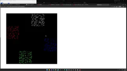

# myungdal tech-demo project

안명달 기술-데모 프로젝트 (R&D / 테스트베드 / 포트폴리오 소개 용도)

**SLG 워게임** 또는 **MMORPG** 신작 개발에 사용 제안 목적으로 구현을 시작했습니다.
최근에는 AI 협업 테스트도 진행하며 문서와 기능을 보강하고 있습니다.

### 주요 특징

- 서버-클라 C++ 코드 최대한 자동 생성, AI 협업 친화적 구조
- 클라-서버에 최대한의 동일 코드를 사용하고 동기화를 자동화 하는 구조로 생산성과 동기화 퀄리티 향상
- 최소 용량의 입장/퇴장/액션 서버-클라 동기화 패킷 설계
- 최적화된 스탯 계산, 안정적인 인벤토리 아이템 처리, 재접속 및 오프라인 서버 자동 플레이 기능 포함
- 소속 서버 가상화로 서버 이동 및 서버간 대전에 자유로운 구조
- 멀티플레이 테스트 중 전체 상태 덤프 → 시간 되돌리기 → 설정 수정 → DB/서버/클라 실시간 배포로 효율적 밸런싱

---

## 소개

- [경력 요약](ai_manager_team/career_tech_demo/career/career.md)
- [기술 노트](ai_manager_team/career_tech_demo/tech/tech.md)
- [데모 동영상 소개](ai_manager_team/career_tech_demo/demo/demo.md)

## 데모 동영상 바로가기

| # | 데모 | 스크린샷 |
|:---:|------|:---:|
| 1 | **코드와 DB 개발 자동화 시연 - 빌드** [(동영상)](https://youtu.be/sU5VjCxxNsA)  스키마 기반 클라-서버 자동 코드 생성 시연 |  |
| 2 | **코드와 DB 개발 자동화 시연 - 결과** [(동영상)](https://youtu.be/D7JazSpD35w)  자동 생성 코드 적용 결과 시연 |  |
| 3 | **클라이언트 실시간 설정 편집** [(동영상)](https://youtu.be/cL3hyBse7jY)  런타임 설정 핫 리로드 |  |
| 4 | **클라이언트 실시간 디버그 기능** [(동영상)](https://youtu.be/5budpBfAb5U)  게임 내 디버그 도구와 비주얼스튜디오 중단점 활용 시연 |  |
| 5 | **실시간 서버-클라 덤프** [(동영상)](https://youtu.be/d52GuT105tM)  덤프를 통한 게임 내 모든 상태 덤프 검증 시연 |  |
| 6 | **MCP를 이용한 자연어 기반 서버 관리** [(동영상)](https://youtu.be/QFn4fMghwiU)  자연어 명령을 받은 AI가 모든 서버의 메모리 사용량을 취합, 시각적 리포팅 |  |
| **7** | **실시간 MMO플레이 반복 밸런싱** [(동영상)](https://youtu.be/3APxTUZnRcI)  멀티플레이 테스트 중 시간을 되돌리고, 밸런스를 DB→서버→클라로 즉시 반영하는 반복 조정 워크플로우 |  |

---

## 주요 코드 폴더 
(참고사항: tech-demo 브랜치에는 빌드에 필요한 일부 파일이 생략되어 있습니다)

| 폴더 | 설명 | 스크린샷 |
|------|------|:---:|
| [`server/`](server/) | 서버엔진, 게임서버, 테스트, 봇 등 10여종의 서버 관련 R&D 프로젝트 (C++20) | - |
| [`client/`](client/) | MmoSync 동기화 라이브러리와 언리얼 엔진 기반 게임 클라이언트 R&D 프로젝트 (UE 5.6) | - |
| [`prototype/`](https://myungdal.github.io/tech_demo/) | 군집 알고리즘/게임성 검증용 JavaScript 프로토타이핑 [(동영상)](https://youtu.be/T4tbkkQITEo) |  |

---

### 주요 자동화 도구와 리소스 폴더

| 폴더 | 설명 |
|------|------|
| [`setup/`](setup/) | 코드 자동 생성 시스템 (TypeScript) |
| [`bat/`](bat/) | 배치 스크립트 모음 (자동 생성 실행) |
| [`power_shell/`](power_shell/) | PowerShell 스크립트 모음 (AI 토큰 사용량을 줄이기 위한 컨벤션 유틸) |
| [`resource/`](resource/) | 리소스 파일 (자동화 원천 - 기획 데이터 입력툴 / 설정, 패킷, Enum, DB 스키마 정의) |

---

### AI 협업 폴더 (실험적, 기획/PM/테크/아트 담당 ai agent들에게 작업 지시를 관리하는 폴더)

| 폴더 | 설명 |
|------|------|
| [`ai_design_team/`](ai_design_team/) | AI Agent와의 게임 기획 문서 제작 협업 관리 |
| [`ai_tech_team/`](ai_tech_team/) | AI Agent와의 코딩 협업 관리 |
| [`ai_art_team/`](ai_art_team/) | AI Agent와의 아트 리소스 제작 협업 관리 |
| [`ai_manager_team/`](ai_manager_team/) | 프로젝트 관리, 소개 문서 |

---
