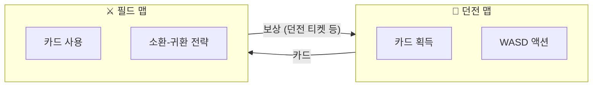

# 1. 게임 개요

## 1.1 장르 정의
- **2D 탑뷰 대규모 멀티 전장 게임**
- 실시간 자동 전투 + 제한적 개입
- **핵심 키워드**:
  - 소환
  - 귀환
  - 투자(ROI)
  - 공성전

---

## 1.2 듀얼 맵 구조

게임은 **두 가지 맵 모드**로 구성된다.

> “던전은 성장(카드)”, “필드는 경쟁(공성/약탈)”을 담당하고,
> 두 맵이 서로 자원을 주고받으며 루프를 만든다.

### 1.2.1 던전 맵 (Dungeon Map)
| 항목 | 내용 |
|------|------|
| **조작 방식** | WASD 직접 조작 (액션) |
| **게임 모드** | 싱글플레이 (코옵은 추후 별도 맵으로 분리) |
| **목적** | 카드 획득/생성, 자원 수집 |
| **플레이어 표현** | 1캐릭터 직접 조작 |

- 던전 클리어 시 **유닛 카드**, **개입 카드** 등을 보상으로 획득
- 획득한 카드는 필드 맵에서 사용

### 1.2.2 필드 맵 (Field Map)
| 항목 | 내용 |
|------|------|
| **조작 방식** | 소환-귀환 간접 조작 |
| **게임 모드** | MMO 영지 전쟁 |
| **목적** | 영토 확장, 약탈, 공성전 |
| **플레이어 표현** | 유닛 그룹 (카드 기반) |

- 던전에서 획득한 카드로 **유닛 그룹 소환**
- 자동 전투 + 개입 카드로 제한적 조작
- 성 점령, PvP, 보상 귀환

### 1.2.3 두 맵의 연결 (양방향 성장 루프)

### 1.2.4 성장 루프 상세

| 방향 | 획득 | 효과 |
|------|------|------|
| **던전 → 필드** | 강력한 카드 획득 | 필드에서 더 큰 보상 획득 확률 ↑ |
| **필드 → 던전** | 던전 티켓/열쇠 획득 | 고레벨 던전 입장 기회 ↑ |

**핵심 구조**:
- 필드 보상 → 고레벨 던전 접근권 → 더 강한 카드 획득
- 강한 카드 → 필드 전투력 상승 → 더 큰 보상 획득
- **양방향 피드백 루프**: 어느 쪽에서 플레이해도 다른 쪽에 이득

---

## 1.3 플레이어 정체성
- **플레이어는 왕국 소속 클랜**
- **클랜 간**:
  - 기본적으로 **적대 관계** (동맹만 아군)
  - 필드에서 조우 시 자동 PvP
  - 카드는 개인 소유
- **성(Castle)**은 공용 인프라이자 권력 거점 (플레이어 점령 가능)

> 상세 규칙:
> - 필드 PvP/외교: `10_멀티플레이_필드맵/08_클랜_PvP_규칙/08_PvP.md`
> - 귀환/약탈: `10_멀티플레이_필드맵/04_귀환_및_보상/04_귀환_보상.md`
> - 캐슬 점령: `10_멀티플레이_필드맵/06_공성전_시스템/06_공성전.md`
> - 캐슬 버프(거점 효과)로 캐슬 보유의 가치 제공 (세금 시스템은 폐기)
