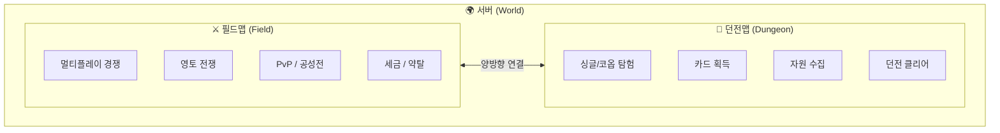
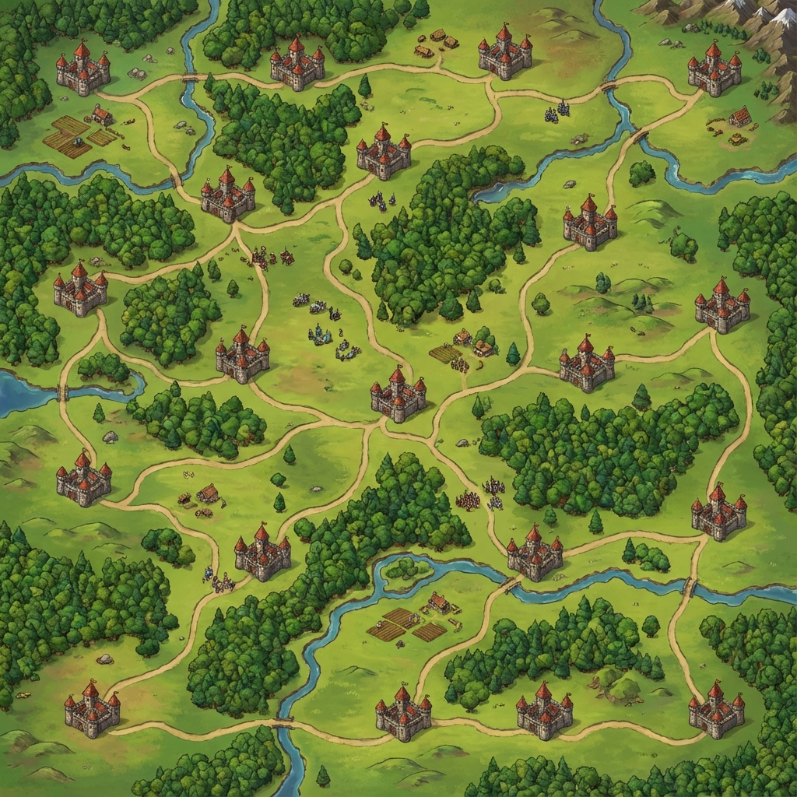
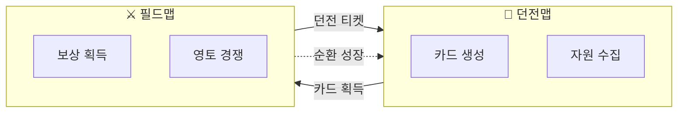

# 2. 월드 구성

## 2.1 서버와 월드

### 2.1.1 서버 선택
- **신규 유저 플로우**:
  1. 계정 생성
  2. **서버 선택** (각 서버는 독립된 월드)
  3. 선택한 서버의 필드맵에서 게임 시작
- **서버 특성**:
  - 각 서버는 독립된 **필드맵**과 **던전 풀**을 가짐
  - 서버 간 캐릭터/자원 이동 불가 (폐쇄 경제)
  - 서버별 랭킹, 시즌, 이벤트 독립 운영

> [WHY] 서버 간 이동을 막는 이유: 경제/밸런스/랭킹 경쟁을 서버 단위로 안정화하고,
> 운영(시즌/이벤트)도 서버별로 독립적으로 튜닝하기 위함.

### 2.1.2 월드 구성 요소

---

## 2.2 필드맵 (Field Map) - 멀티플레이 경쟁

### 2.2.1 개요
| 항목 | 내용 |
|------|------|
| **게임 모드** | MMO 영지 전쟁 (실시간 멀티플레이) |
| **조작 방식** | 소환-귀환 간접 조작 |
| **목적** | 영토 확장, 세금 수취, 약탈, 공성전 |
| **플레이어 표현** | 유닛 그룹 (카드 기반) |

### 2.2.2 성 (Castle)
- **분포 및 밀도**:
  - 맵 전역에 다수 분포 (예: 512x512 필드 기준 약 20개 내외)
  - 성과 성 사이는 유닛 이동 동선이 겹칠 수 있는 거리감 유지
- **특징**:
  - **단일 유닛(구조물)** 형태로 존재 (내부/외부 구분 없음)
- **기능**:
  - 귀환 지점 (보상 확정)
  - 캐슬 점령 대상 (점령 가능)
  - 캐슬 보유 효과: 캐슬 버프 (세금 시스템 폐기)
- **시작 성**:
  - 모든 플레이어에게 1개 영구 지급
  - 빼앗길 수 없음 (안전 거점)

> 수치(맵 크기/성 개수/거리감)는 “튜닝 파라미터”이며,
> 세금/공성/귀환 규칙과 함께 밸런스로 조정한다.
>
> 상세 문서:
> - 귀환/보상/약탈: `10_멀티플레이_필드맵/04_귀환_및_보상/04_귀환_보상.md`
> - 캐슬 점령: `10_멀티플레이_필드맵/06_공성전_시스템/06_공성전.md`
> - 캐슬 버프(거점 효과)로 캐슬 보유의 가치 제공 (세금 시스템은 폐기)

### 2.2.3 몬스터 / 기지
- 성 주변 및 필드에 로밍 몬스터 존재
- 기지(캠프) 단위 전투 발생
- 주요 수익원 (골드, 아이템, 카드 조각)

### 2.2.4 성장 루프
- 던전에서 획득한 **카드**로 유닛 그룹 소환
- 필드에서 전투 → 보상 획득 → 귀환
- 보상으로 **던전 티켓** 획득 → 더 높은 던전 도전

---

## 2.3 던전맵 (Dungeon Map) - 싱글플레이 탐험

### 2.3.1 개요
| 항목 | 내용 |
|------|------|
| **게임 모드** | 싱글 / 코옵 던전 탐험 |
| **조작 방식** | WASD 직접 조작 (액션) |
| **목적** | 카드 획득/생성, 자원 수집 |
| **플레이어 표현** | 1캐릭터 직접 조작 |

### 2.3.2 던전 입장
- 필드에서 획득한 **던전 티켓/열쇠**로 입장
- 티켓 등급에 따라 입장 가능 던전 제한
- 고레벨 던전일수록 희귀 카드 드랍률 상승

### 2.3.3 던전 보상
- **유닛 카드**: 필드에서 유닛 소환에 사용
- **개입 카드**: 필드 전투 중 사용하는 스킬/버프
- **자원**: 카드 강화, 합성 재료

### 2.3.4 성장 루프
- 던전 클리어 → 카드 획득
- 카드로 필드 전투력 상승
- 필드 보상 증가 → 더 높은 던전 도전 가능

---

## 2.4 양방향 성장 구조

| 방향 | 획득 | 효과 |
|------|------|------|
| **던전 → 필드** | 강력한 카드 | 필드 전투력 상승, 더 큰 보상 획득 |
| **필드 → 던전** | 던전 티켓/열쇠 | 고레벨 던전 입장, 희귀 카드 획득 기회 |

**핵심**: 어느 쪽에서 플레이해도 다른 쪽에 이득이 되는 **양방향 피드백 루프**

