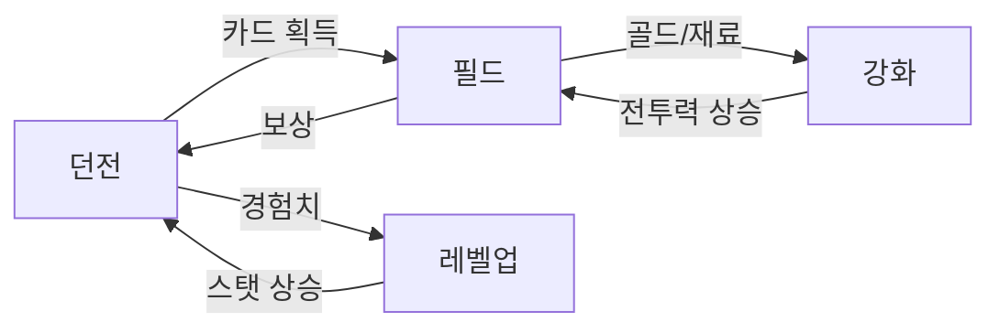

# 30. 성장 시스템

캐릭터/유닛의 성장 및 강화 관련 기획 문서.

---

## 📂 하위 문서 (예정)

| 문서 | 설명 |
|------|------|
| `01_레벨_시스템.md` | 캐릭터/계정 레벨업, 경험치 테이블 |
| `02_스킬_시스템.md` | 스킬 습득, 강화, 스킬 트리 |
| `03_장비_시스템.md` | 장비 장착, 강화, 세트 효과 |
| `04_카드_강화.md` | 유닛 카드 강화, 합성, 진화 |
| `05_재화_시스템.md` | 골드, 보석, 재료 등 재화 종류 |
| `06_업적_시스템.md` | 업적, 칭호, 보상 |

---

## 💪 성장 구조

```
┌─────────────────────────────────────────────────┐
│                   캐릭터 전투력                  │
├───────────┬───────────┬───────────┬─────────────┤
│   레벨    │   스킬    │   장비    │    카드     │
│   (EXP)   │  (스킬북) │  (강화석) │  (카드 조각) │
└───────────┴───────────┴───────────┴─────────────┘
      ↑           ↑           ↑           ↑
   전투 경험    던전 보상    필드 보상    던전 드랍
```

---

## 🔑 핵심 설계 원칙

| 원칙 | 설명 |
|------|------|
| **양방향 성장** | 던전(카드 획득) ↔ 필드(카드 사용/보상) |
| **점진적 강화** | 급격한 파워 인플레 방지, 완만한 성장 곡선 |
| **다양한 경로** | 레벨, 장비, 스킬, 카드 등 복합 성장 |
| **P2W 방지** | 시간 투자로도 최상위 도달 가능 |

---

## 📈 성장 루프



---

## 🔗 연관 문서

- 카드 시스템: `90_공통/05_카드_시스템/`
- 던전 보상: `20_싱글플레이_던전맵/`
- 필드 보상: `10_멀티플레이_필드맵/04_귀환_및_보상/`
- 밸런스 보호: `90_공통/06_밸런스_보호/`
