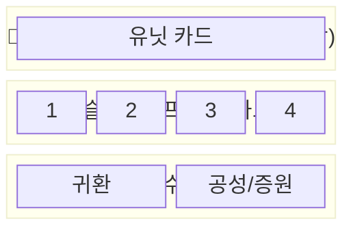

# 15. 카드 시스템 상세

> 카드는 게임의 핵심 자산이며, “유닛 소환”과 “전투 개입”을 모두 담당한다.
> 필드 상태(State) 기준은 `10_멀티플레이_필드맵/01_유닛_소환_시스템/01_소환_프로세스.md`를 참고.

---

## 15.1 카드 개요

카드는 게임의 핵심 자산으로, 유닛 소환과 전투 개입에 사용된다.

### 15.1.1 카드 소유
- 카드는 **개인 소유 자산**
- 거래 가능 (추후 거래소 시스템 확장)
- 카드 인벤토리에 보관

---

## 15.2 카드 종류

### 15.2.1 유닛 카드
| 속성 | 설명 |
|------|------|
| 용도 | 소환할 유닛 타입 결정 |
| 슬롯 | 덱 외부, 별도 유닛 슬롯 |
| 사용 시점 | Planning 모드에서 선택 |
| 예시 | 전사 카드, 궁수 카드, 드래곤 카드 |

### 15.2.2 개입 카드
| 속성 | 설명 |
|------|------|
| 용도 | 전투 중 버프/디버프/스킬 발동 |
| 슬롯 | 덱 4장 |
| 사용 시점 | Active/Return 모드에서 사용 |
| 예시 | 치유, 보호막, 가속, 저주 |

### 15.2.3 전술 카드
| 속성 | 설명 |
|------|------|
| 용도 | 귀환, 공성 등 특수 행동 |
| 슬롯 | 별도 전술 슬롯 (2장) |
| 사용 시점 | 특정 조건 충족 시 |
| 예시 | 귀환 카드, 공성 카드, 증원 카드 |

#### 확인 필요(질문)
- 전술 카드의 “증원 카드”가 실제로 존재한다면, `02_그룹_시스템.md`의 “다중 그룹/증원” 정책(Q11, Q14)과 함께 확정이 필요하다.

---

## 15.3 덱 구성

### 15.3.1 덱 슬롯 구조

### 15.3.2 덱 제한
- 같은 카드 중복 장착: **불가**
- 덱 교체: **Planning 모드에서만** 가능
- 전투 중 덱 변경: **불가**

#### WHY
- [WHY] 전투 중 덱 교체를 막아 “카드 카운터 스왑”을 줄이고, 전투는 실력/판단(타이밍) 중심으로 만든다.

---

## 15.4 개입 카드 상세

### 15.4.1 사용 시점별 특성
| 사용 시점 | 효과 배율 | 비용 | 설명 |
|----------|---------|------|------|
| 소환 직후 | 100% | 보통 | 표준 효과 |
| 교전 중 | 100% | 보통 | 표준 효과 |
| 귀환 중 | *(가안: 150%)* | *(가안: 높음)* | 긴급 개입(가안) |

> “귀환 중 강화(150%)”는 현재 **가안(미컨펌)**이다. (Q28)

### 15.4.2 개입 포인트 (IP)
- 유닛 그룹당 **개입 포인트** 제한
- 기본 IP: 10포인트
- 카드별 IP 소모량 상이
- IP 회복: 시간당 1포인트 (전투 외)

### 15.4.3 중첩 규칙
- 같은 효과 카드 **중첩 불가**
- 예: 치유 → 치유 (X), 치유 → 보호막 (O)
- 효과 지속 중 재사용 불가

---

## 15.5 카드 획득

### 15.5.1 주요 획득 경로
- **던전 클리어 보상**: 카드 획득의 **핵심 경로**
- 던전 난이도/등급에 따라 드랍 카드 등급 결정
- 보스 처치 시 완성 카드 직접 드랍 확률 상승

### 15.5.2 카드 등급
| 등급 | 색상 | 드랍률 | 효과 배율 |
|------|------|--------|----------|
| 일반 | ⚪ 흰색 | 60% | 100% |
| 고급 | 🟢 녹색 | 25% | 120% |
| 희귀 | 🔵 파란색 | 10% | 150% |
| 영웅 | 🟣 보라색 | 4% | 200% |
| 전설 | 🟡 금색 | 1% | 300% |

---

## 15.6 카드 성장

### 15.6.1 카드 강화
- 같은 카드를 재료로 강화 가능
- 강화 단계: +1 ~ +10
- 강화 실패: 없음 (재료 소모만)
