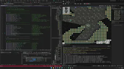
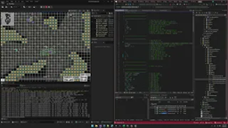
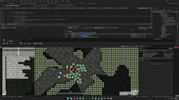
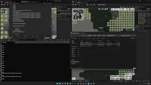
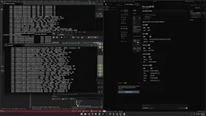
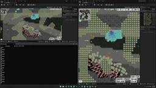

# Nearest3 기술 데모 영상

**Nearest3 MMO 게임 서버 개발 기술 시연**

AI 기반 자동화, 실시간 디버깅, MCP 통합 등 핵심 기술을 영상으로 확인하세요.

---

## 목차

| # | 제목 | 설명 |
|---|------|------|
| 1 | [코드와 DB 개발 자동화 시연 - 빌드](#1-코드와-db-개발-자동화-시연---빌드) | 스키마 기반 자동 코드 생성 |
| 2 | [코드와 DB 개발 자동화 시연 - 결과](#2-코드와-db-개발-자동화-시연---결과) | 자동 생성 코드 활용 |
| 3 | [클라이언트 실시간 설정 편집](#3-클라이언트-실시간-설정-편집) | 런타임 설정 핫 리로드 |
| 4 | [클라이언트 실시간 디버그 기능](#4-클라이언트-실시간-디버그-기능) | 게임 내 디버그 도구 |
| 5 | [실시간 서버-클라 덤프](#5-실시간-서버-클라-덤프) | 월드 상태 동기화 검증 |
| 6 | [MCP를 이용한 자연어 기반 서버 리포팅](#6-mcp를-이용한-자연어-기반-서버-리포팅) | AI 어시스턴트 서버 통합 |
| **7** | **[실시간 MMO플레이 반복 밸런싱](#7-실시간-mmo플레이-반복-밸런싱)** | **멀티플레이 게임 개발 퀄리티를 획기적으로 올릴 수 있는 가장 중요한 데모** |

---

## 1. 코드와 DB 개발 자동화 시연 - 빌드

### 설명

Excel/SQL 스키마를 기반으로 서버/클라이언트 코드를 자동 생성하는 과정을 시연합니다.

### 핵심 기술

- **스키마 기반 코드 생성**: `resource/*.xlsx`, `resource/db/*.sql`에서 패킷, ENUM, DB 접근 코드 자동 생성
- **일관성 보장**: 서버와 클라이언트 간 패킷/데이터 구조 동기화
- **빌드 자동화**: `bat/generate_*.bat` 스크립트로 원클릭 생성

---

## 2. 코드와 DB 개발 자동화 시연 - 결과

### 설명

자동 생성된 코드를 실제 서버/클라이언트에서 활용하는 모습을 확인합니다.

### 핵심 기술

- **타입 안전성**: 컴파일 타임에 패킷 필드 검증
- **생산성 향상**: 보일러플레이트 코드 제거
- **유지보수성**: 스키마 수정만으로 전체 코드베이스 업데이트

---

## 3. 클라이언트 실시간 설정 편집

### 설명

게임 실행 중 설정 파일을 편집하면 즉시 반영되는 핫 리로드 기능을 시연합니다.

### 핵심 기술

- **런타임 리로드**: 게임 재시작 없이 설정 변경
- **즉각적 피드백**: 밸런스 조정 즉시 확인
- **개발 속도 향상**: 반복 테스트 시간 단축

---

## 4. 클라이언트 실시간 디버그 기능

### 설명

게임 내에서 사용할 수 있는 다양한 디버그 도구를 소개합니다.

### 핵심 기술

- **실시간 상태 모니터링**: 엔티티, 컴포넌트, 시스템 상태 표시
- **시각적 디버깅**: 충돌 박스, 경로, 탐지 범위 시각화
- **성능 프로파일링**: 프레임별 처리 시간 분석

---

## 5. 실시간 서버-클라 덤프

### 설명

서버와 클라이언트의 월드 상태를 실시간으로 덤프하여 동기화 상태를 검증합니다.

### 핵심 기술

- **상태 덤프**: ASCII 맵으로 월드 상태 시각화
- **동기화 검증**: 서버-클라이언트 간 상태 불일치 탐지
- **디버깅 지원**: 동기화 문제 원인 분석

---

## 6. MCP를 이용한 자연어 기반 서버 리포팅

### 설명

MCP(Model Context Protocol)를 통해 AI 어시스턴트가 서버와 직접 통신하여 리포트를 생성합니다.

### 핵심 기술

- **MCP 통합**: AI 어시스턴트와 게임 서버 직접 연결
- **자연어 명령**: 자연어로 서버 상태 조회 및 제어
- **시각적 리포트**: 수집된 데이터를 구조화된 형태로 출력

---

## 7. 실시간 MMO플레이 반복 밸런싱

### 설명

실시간으로 진행 중인 MMO 플레이를 관찰하며 밸런스를 반복 조정하는 워크플로우를 시연합니다.

### 핵심 기술

- **라이브 밸런싱**: 게임 중단 없이 밸런스 조정
- **즉각적 반영**: 변경사항 실시간 적용
- **반복 테스트**: 빠른 밸런스 이터레이션

---

## 관련 문서

- [기술 상세 문서](../tech/tech.md)
- [경력 소개](../career/career.md)
