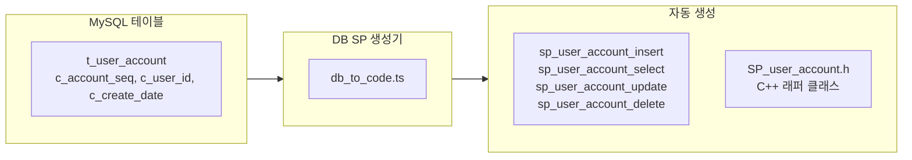
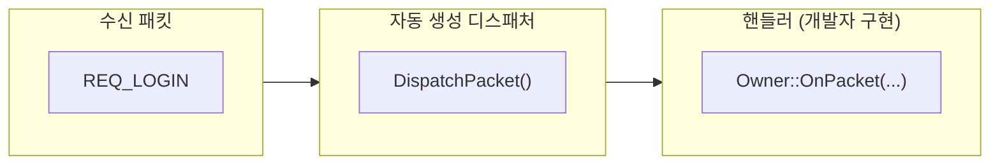
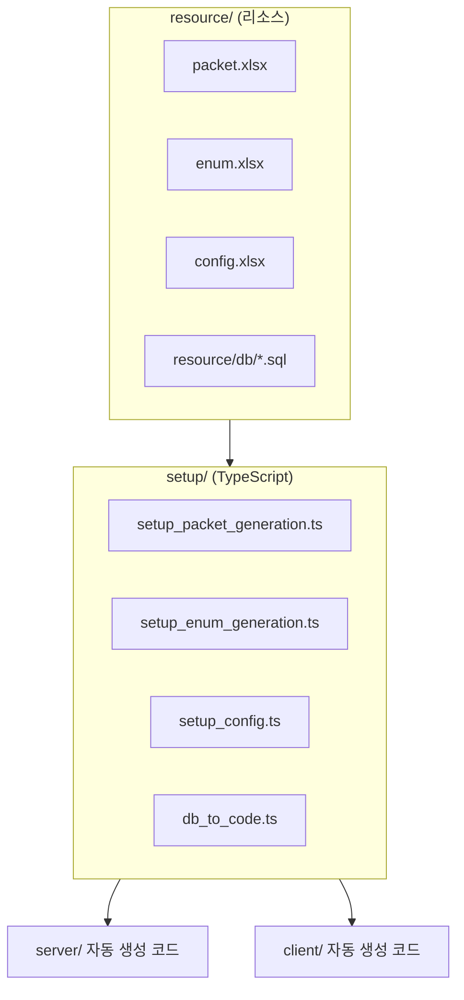

# 1. 서버-클라 필수 코드 자동생성 시스템

작성자: 안명달 (mooondal@gmail.com)

**Unreal Build Tool 처럼 자동 생성되는 코드를 최대한 확대해야 겠다고 생각했다. 코드 생산에 용이한 TypeScript 언어를 활용하여 구축한 서버-클라 C++ 코드 자동 생성 시스템**이다. Packet, ENUM, Config, DB SP, 이벤트 핸들러 등의 기본 코드를 최대한 생성하여 개발자가 핵심 로직에만 집중할 수 있도록 한다

| 생성기 | 입력 | 출력 |
|--------|------|------|
| **패킷 생성기** | packet.xlsx | Reader/Writer 클래스, Forward Declaration, .ixx 모듈 |
| **ENUM 생성기** | enum.xlsx | 서버/클라이언트 동기화된 열거형 코드 |
| **Config 생성기** | config.xlsx | 설정값 상수 클래스 |
| **DB SP 생성기** | MySQL 스키마 | Stored Procedure + C++ 래퍼 코드 |
| **이벤트 연동** | 패킷 정의 | 핸들러 자동 바인딩, 디스패치 코드 |

---

## 패킷 생성기 (Packet Generator)

Excel에 정의한 패킷 스펙으로 **서버/클라이언트 양쪽의 패킷 코드를 동시 생성**한다.

**packet.xlsx 입력:**
```
PacketName       | ParamType  | ParamName  | Description
---------------------------------------------------------
REQ_LOGIN        | STRING     | userId     | 유저 ID
                 | STRING     | password   | 비밀번호
ACK_LOGIN        | int32_t    | result     | 결과 코드
                 | ACCOUNT    | account    | 계정 정보
```

**자동 생성 C++ 코드:**
```cpp
// Reader (수신 측)
class REQ_LOGIN : public NetworkPacket {
public:
    using Writer = REQ_LOGIN_WRITER;
    const wchar_t* Get_userId() const;
    const wchar_t* Get_password() const;
    bool Validate(IN OUT size_t& size, int32_t depth = 0) const;
};

// Writer (송신 측)
class REQ_LOGIN_WRITER : public NetworkPacketWriter {
public:
    static constexpr PacketType PACKET_TYPE = PacketTypes::REQ_LOGIN;
    void SetValues(const wchar_t* userId, const wchar_t* password);
};
```

**생성 결과물:**

| 서버 (C++) | 클라이언트 (UE5) |
|------------|------------------|
| `ServerEnginePacketAutoGenerated.ixx` | `BasePacketAutoGenerated/` |
| `PACKET_*.h` | `NetworkPacketAutoGenerated/` |
| `PacketFwd.h` | `PacketFwd.h` |

---

## ENUM 생성기 (Enum Generator)

Excel에 정의한 열거형을 **서버/클라이언트 동기화된 C++ enum class로 생성**한다.

**enum.xlsx 입력:**
```
EnumName     | Value | Name         | Description
-------------------------------------------------
ItemType     | 0     | NONE         | 없음
             | 1     | WEAPON       | 무기
             | 2     | ARMOR        | 방어구
             | 3     | CONSUMABLE   | 소비 아이템
```

**자동 생성 C++ 코드:**
```cpp
enum class ItemType : int32_t
{
    NONE = 0,        // 없음
    WEAPON = 1,      // 무기
    ARMOR = 2,       // 방어구
    CONSUMABLE = 3,  // 소비 아이템
    MAX
};

// 문자열 변환 함수도 자동 생성
const wchar_t* ToString(ItemType value);
ItemType ToItemType(const wchar_t* str);
```

---

## Config 생성기 (Config Generator)

Excel에 정의한 설정값을 **타입 안전한 상수 클래스로 생성**한다.

**config.xlsx 입력:**
```
Category    | Key              | Type    | Value  | Description
----------------------------------------------------------------
Server      | MAX_PLAYERS      | int32_t | 1000   | 최대 접속자
Server      | TICK_RATE        | int32_t | 60     | 틱 레이트
Game        | START_GOLD       | int64_t | 10000  | 시작 골드
```

**자동 생성 C++ 코드:**
```cpp
namespace Config::Server
{
    constexpr int32_t MAX_PLAYERS = 1000;  // 최대 접속자
    constexpr int32_t TICK_RATE = 60;      // 틱 레이트
}

namespace Config::Game
{
    constexpr int64_t START_GOLD = 10000;  // 시작 골드
}
```

---

## DB SP 생성기 (Stored Procedure Generator)

MySQL 테이블 스키마를 분석하여 **CRUD Stored Procedure + C++ 래퍼 코드를 자동 생성**한다.



**생성되는 SP:**
- `sp_{table}_insert` - INSERT
- `sp_{table}_select` - SELECT (PK 기반)
- `sp_{table}_update` - UPDATE
- `sp_{table}_delete` - DELETE
- `sp_{table}_select_list` - SELECT 목록 (조건 검색)

---

## 이벤트 연동 및 핸들러 자동 바인딩

패킷 수신 시 **해당 핸들러 함수가 자동으로 호출**되도록 디스패치 코드를 생성한다.

이 프로젝트의 디스패치는 전형적인 `switch(packetType)`가 아니라, **패킷 타입 범위별로 생성된 "함수 포인터 배열" 인덱싱**으로 동작한다. (O(1) 디스패치, 분기 예측 부담 감소)



```cpp
// 생성되는 디스패치 코드 형태(요지)
// - DispatchPacket<SCOPE>()가 PacketTypes의 범위에서 인덱싱하여
//   DispatchPacketFuncArray[idx]를 호출한다.
// - 각 엔트리는 DispatchPacketFunc<_Owner, PacketType, Args...> 형태로 바인딩된다.
```

---

## 아키텍처 및 배치 스크립트



**배치 스크립트:**

```batch
bat/generate_all.bat        # 전체 생성 (DB + 서버 + 클라이언트)
bat/generate_server.bat     # 서버 코드 생성 (DB 포함)
bat/generate_client.bat     # 클라이언트 코드 생성
bat/generate_all_skip_db.bat # DB 스킵하고 빠른 재생성
```

---

## 실제 생성 결과 (Build/output/setup.log)

**한 번의 실행으로 약 5,175개의 파일과 8,217줄의 로그가 생성된다.**

### 주요 생성 통계

| 카테고리 | 생성 개수 |
|---------|----------|
| **패킷 헤더 파일** | 745개 |
| **패킷 스코프** | 32개 (CF, FC, GC, CD, DG 등) |
| **DB Stored Procedure 래퍼** | 15개 (SP_ACCOUNT, SP_ITEM, SP_QUEST 등) |
| **UI 이벤트 클래스** | 86개 |
| **컴포넌트 프린터** | 74개 |
| **ENUM 타입** | 수십 종 |
| **Config 상수** | 수백 개 |

### setup.log 발췌 (주요 생성 과정)

```log
2026-01-02T16:27:16.702Z	WRITE	client/Client/Source/Packet/Public/Packet/NetworkPacketAutoGenerated/PACKET_BM.h
2026-01-02T16:27:16.703Z	WRITE	client/Client/Source/Packet/Public/Packet/NetworkPacketAutoGenerated/PACKET_DM.h
2026-01-02T16:27:16.704Z	WRITE	client/Client/Source/Packet/Public/Packet/NetworkPacketAutoGenerated/PACKET_GM.h
2026-01-02T16:27:16.705Z	WRITE	client/Client/Source/Packet/Public/Packet/NetworkPacketAutoGenerated/PACKET_LM.h
...
2026-01-02T16:27:16.728Z	SETUP_PACKET_LOG_HANDLER	Generated log packet handler files
2026-01-02T16:27:16.730Z	WRITE	server/serverEngine/ServerEnginePacketAutoGenerated.ixx
2026-01-02T16:27:16.730Z	SETUP_PACKET_MODULE	Generated C++20 module file (ServerEnginePacketAutoGenerated.ixx)
2026-01-02T16:27:16.731Z	WRITE	client/Client/Source/Packet/Public/Packet/NetworkPacketAutoGenerated/PacketFwd.h
2026-01-02T16:27:16.732Z	SETUP_PACKET_FWD	Generated PacketFwd.h (forward declarations)
2026-01-02T16:27:16.732Z	SETUP_PACKET_END	Generated 32 packet scopes
2026-01-02T16:27:17.814Z	CLIENT_AUTOGEN_EVENT_BEGIN	Generating UI event code from UiEventType.h
2026-01-02T16:27:17.819Z	CLIENT_AUTOGEN_EVENT_PARSED	Found 86 UI event types
2026-01-02T16:27:17.820Z	WRITE	client/Client/Source/Client/Private/UiEvent/AutoGenerated/UiEvent.h
2026-01-02T16:27:17.821Z	WRITE	client/Client/Source/Client/Private/UiEvent/AutoGenerated/UiEvent.cpp
2026-01-02T16:27:17.821Z	CLIENT_AUTOGEN_EVENT_END	Generated 86 UI event classes
2026-01-02T16:27:17.852Z	WRITE	client/Client/Source/Client/Private/Util/GameUtil/GameComponentPrinterAutoGenerated.hpp
2026-01-02T16:27:17.852Z	CLIENT_AUTOGEN_COMPONENT_PRINTER_END	Generated 74 component printer cases
```

### DB Stored Procedure 자동 생성

```log
2025-12-31T12:03:54.096Z	WRITE	server/serverEngine/ServerEngine/DbSpAutoGenerated/SP_STATIC.h
2025-12-31T12:03:54.097Z	WRITE	server/serverEngine/ServerEngine/DbSpAutoGenerated/SP_SYSTEM.h
2025-12-31T12:03:54.098Z	WRITE	server/serverEngine/ServerEngine/DbSpAutoGenerated/SP_LOG.h
2025-12-31T12:03:54.103Z	WRITE	server/serverEngine/ServerEngine/DbSpAutoGenerated/SP_ACCOUNT.h
2025-12-31T12:03:54.104Z	WRITE	server/serverEngine/ServerEngine/DbSpAutoGenerated/SP_GAME.h
2025-12-31T12:03:54.105Z	WRITE	server/serverEngine/ServerEngine/DbSpAutoGenerated/SP_PURCHASE.h
2025-12-31T12:03:54.106Z	WRITE	server/serverEngine/ServerEngine/DbSpAutoGenerated/SP_SERVER.h
2025-12-31T12:03:54.107Z	WRITE	server/serverEngine/ServerEngine/DbSpAutoGenerated/SP_ACHIEVEMENT.h
2025-12-31T12:03:54.107Z	WRITE	server/serverEngine/ServerEngine/DbSpAutoGenerated/SP_ACTIVITY.h
2025-12-31T12:03:54.109Z	WRITE	server/serverEngine/ServerEngine/DbSpAutoGenerated/SP_ITEM.h
2025-12-31T12:03:54.110Z	WRITE	server/serverEngine/ServerEngine/DbSpAutoGenerated/SP_MAIL.h
2025-12-31T12:03:54.111Z	WRITE	server/serverEngine/ServerEngine/DbSpAutoGenerated/SP_MISSION.h
2025-12-31T12:03:54.111Z	WRITE	server/serverEngine/ServerEngine/DbSpAutoGenerated/SP_QUEST.h
2025-12-31T12:03:54.112Z	WRITE	server/serverEngine/ServerEngine/DbSpAutoGenerated/SP_STOCK.h
2025-12-31T12:03:54.113Z	WRITE	server/serverEngine/ServerEngine/DbSpAutoGenerated/SP_USER.h
2025-12-31T12:03:54.117Z	WRITE	server/serverEngine/ServerEngine/DbSpAutoGenerated/DbUtil.hpp
```

**결과:** 개발자는 Excel에 정의만 하면, 서버/클라이언트 양쪽의 방대한 코드가 자동으로 생성되어 **핵심 로직에만 집중**할 수 있다.

---

