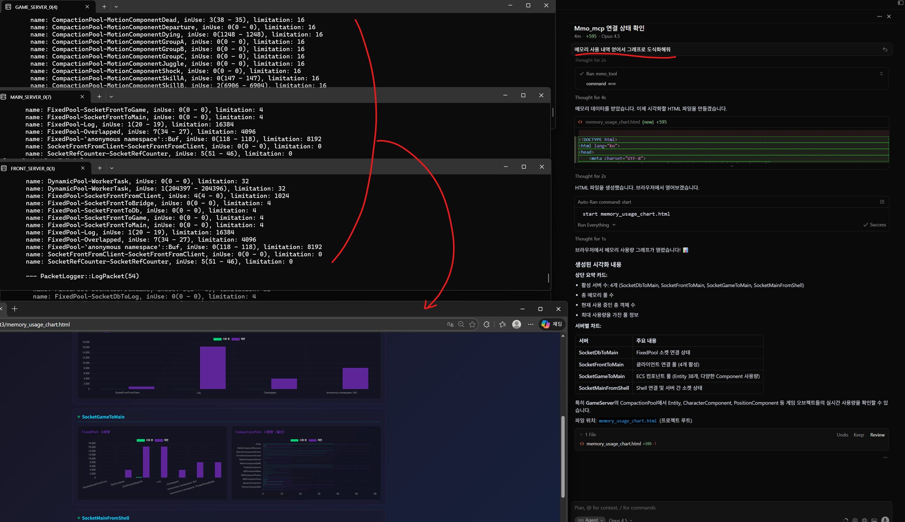
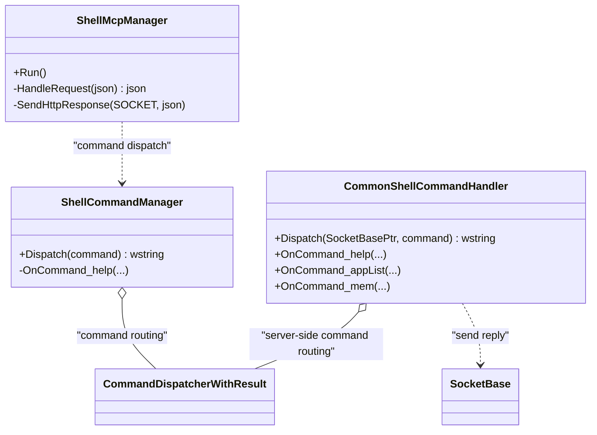

# 2. ShellMcpManager - MCP를 활용한 자연어 기반 서버 모니터링 시스템

작성자: 안명달 (mooondal@gmail.com)

> **목차로 돌아가기**: [tech.md](tech.md)

---

## 개요

AI 도구에서 자연어로 서버에 명령을 내리고 실시간 리포트를 받을 수 있는 MCP(Model Context Protocol) 기반 서버 모니터링 시스템이다.
개발 단계에서는 콘솔 명령어 기반으로 다수의 서버를 제어해 오곤 했는데, MCP를 활용하니 너무 편리하고 굳이 QA툴이나 운영툴이 서둘러 개발할 필요가 없겠다는 생각이 들고있다

### 실제 동작 화면



**자연어 한 마디로 전체 서버 클러스터를 투명하게 관리:**

| 패널 | 설명 |
|------|------|
| **좌측 터미널들** | GAME_SERVER, MAIN_SERVER, FRONT_SERVER의 실시간 메모리 풀 사용량 |
| **우측 AI 채팅** | "메모리 사용 내역 얻어서 그래프로 도식화해줘" 자연어 명령 |
| **하단 차트** | AI가 자동 생성한 `memory_usage_chart.html` 시각화 |

**핵심 가치:**
- **자연어 명령**: "메모리 보여줘", "서버 상태 확인해줘" 등 일상 언어로 서버 제어
- **투명한 관리**: 분산된 서버들의 상태를 하나의 인터페이스에서 통합 조회
- **자동 시각화**: AI가 데이터를 분석하고 차트까지 자동 생성
- **즉시 반응**: 실시간으로 모든 서버에서 데이터 수집 및 응답

### 사용 예시

```
[AI 도구 (Cursor)]
User: "메모리 사용량 보여줘"

-> ShellMcpManager로 "mem" 명령 전송
-> 각 서버(Main, Game, DB, Front)에서 메모리 통계 수집
-> 결과 반환

Response:
[MainServer]
    name: Worker-IoCompletionPacketHandler, inUse: 1234(5000 - 3766), limitation: 10000
    name: Worker-TimerInvoker, inUse: 45(100 - 55), limitation: 1000
    name: SocketPool-SocketMainToDb, inUse: 8(10 - 2), limitation: 20
    ...

[GameServer]
    name: Worker-GameChannel, inUse: 567(1000 - 433), limitation: 5000
    ...

[DbServer]
    name: DbConnectionPool-UserDb, inUse: 23(50 - 27), limitation: 100
    ...
```

```
User: "연결된 서버 목록 보여줘"

-> ShellMcpManager로 "appList" 명령 전송

Response:
[MainServer]
    appId: 1, appType: MAIN_SERVER
    appId: 2, appType: FRONT_SERVER
    appId: 3, appType: GAME_SERVER
    appId: 4, appType: DB_SERVER
    appId: 5, appType: BRIDGE_SERVER
```

---

## 시스템 아키텍처

### 전체 흐름

```
[AI 도구 (Cursor)]
      ↓ (1) HTTP JSON-RPC 요청
      ↓     "mem" (자연어 변환됨)
[ShellMcpManager]
(포트 8080)
      ↓ (2) 명령 디스패치
[ShellCommandManager]
      ↓ (3) Main 서버로 전달
[MainServer]
      ↓ (4) 전체 서버에 브로드캐스트
[GameServer, DbServer, FrontServer, ...]
      ↓ (5) 각 서버에서 통계 수집
[CommonShellCommandHandler]
  - OnCommand_mem()
  - OnCommand_appList()
  - OnCommand_help()
      ↓ (6) 결과 수집
[ShellMcpManager]
      ↓ (7) HTTP JSON 응답
[AI 도구 (Cursor)]
      ↓ (8) 자연어로 해석하여 사용자에게 표시
```

### 클래스 다이어그램 (핵심 구현/협력 구조)



---

## MCP (Model Context Protocol) 란?

**AI 도구가 외부 시스템과 통신하기 위한 표준 프로토콜**이다.

### 특징

| 특징 | 설명 |
|------|------|
| **JSON-RPC 2.0** | 표준 JSON-RPC 프로토콜 사용 |
| **Tool-based** | 도구 기반 상호작용 (함수 호출) |
| **SSE (Server-Sent Events)** | 실시간 이벤트 스트림 지원 |
| **AI-friendly** | AI 도구가 자연어를 명령으로 변환 |

### MCP 프로토콜 흐름

```json
// 1. 초기화 요청
{
  "jsonrpc": "2.0",
  "id": "1",
  "method": "initialize",
  "params": {}
}

// 2. 초기화 응답
{
  "jsonrpc": "2.0",
  "id": "1",
  "result": {
    "protocolVersion": "2024-11-05",
    "capabilities": {
      "statusProvider": true,
      "tools": {},
      "resources": {}
    },
    "serverInfo": {
      "name": "mmo_mcp",
      "version": "0.1.0",
      "command": "C:\\dev\\nearest3\\Build\\Debug\\16_shell\\16_shell.exe"
    }
  }
}

// 3. 도구 목록 요청
{
  "jsonrpc": "2.0",
  "id": "2",
  "method": "tools/list",
  "params": {}
}

// 4. 도구 목록 응답
{
  "jsonrpc": "2.0",
  "id": "2",
  "result": {
    "tools": [
      {
        "id": "mmo_tool_id",
        "name": "mmo_tool",
        "description": "mmo tool",
        "version": "1.0.0",
        "inputSchema": {
          "type": "object",
          "properties": {
            "command": {
              "type": "string",
              "description": "Command to execute"
            }
          },
          "required": ["command"]
        }
      }
    ]
  }
}

// 5. 도구 실행 요청
{
  "jsonrpc": "2.0",
  "id": "3",
  "method": "tools/call",
  "params": {
    "arguments": {
      "command": "mem"
    }
  }
}

// 6. 도구 실행 응답
{
  "jsonrpc": "2.0",
  "id": "3",
  "result": {
    "content": [
      {
        "type": "text",
        "text": "[MainServer]\n\tname: Worker-IoCompletionPacketHandler, inUse: 1234..."
      }
    ]
  }
}
```

---

## 핵심 구현

### 1. ShellMcpManager (MCP 서버)

```cpp
class ShellMcpManager
{
public:
    void Run();  // 포트 8080에서 HTTP 요청 대기

private:
    nlohmann::json HandleRequest(const nlohmann::json& request);
    void SendHttpResponse(SOCKET client, const nlohmann::json& response);
};
```

**주요 메서드 처리:**

```cpp
json ShellMcpManager::HandleRequest(const json& request)
{
    std::string method = request["method"];
    
    if (method == "initialize")
    {
        // 초기화: 서버 정보 반환
        return {
            {"result", {
                {"protocolVersion", "2024-11-05"},
                {"serverInfo", {
                    {"name", "mmo_mcp"},
                    {"version", "0.1.0"}
                }}
            }}
        };
    }
    else if (method == "tools/list")
    {
        // 도구 목록 반환
        return {
            {"result", {
                {"tools", {{
                    {"name", "mmo_tool"},
                    {"description", "mmo tool"}
                }}}
            }}
        };
    }
    else if (method == "tools/call")
    {
        // 명령 실행
        std::string commandA = request["params"]["arguments"]["command"];
        Buf_wchar_t commandW = StringUtil::utf8_to_w(commandA.c_str());
        
        // ShellCommandManager로 명령 전달
        std::wstring resultW = gShellCommandManager->Dispatch(*commandW);
        
        Buf_char resultA = StringUtil::w_to_utf8(resultW.c_str());
        
        return {
            {"result", {
                {"content", {{
                    {"type", "text"},
                    {"text", *resultA}
                }}}
            }}
        };
    }
}
```

### 2. ShellCommandManager (명령 라우팅)

```cpp
class ShellCommandManager
{
private:
    CommandDispatcherWithResult<std::wstring> mCommandDispatcher;

public:
    std::wstring Dispatch(const std::wstring& command)
    {
        // 1. 로컬 명령 처리 (help)
        std::wstring result = mCommandDispatcher.Dispatch(command);
        
        // 2. Main 서버로 명령 전달 (모든 서버에 브로드캐스트)
        SocketUtil::Request<REQ_SHELL_COMMAND::Writer> wp(*gSocketShellToMain, REQ);
        wp.SetValues(command.data());
        
        // 3. 응답 대기
        ACK_SHELL_COMMAND* ack = nullptr;
        if (wp.Wait(wp.GetHeader(), OUT ack))
            result += ack->Get_result();
        
        return result;
    }
};
```

### 3. CommonShellCommandHandler (명령 실행)

**각 서버에 공통으로 존재하며, 실제 명령을 처리한다.**

```cpp
class CommonShellCommandHandler
{
private:
    CommandDispatcherWithResult<std::wstring> mCommandDispatcher;

public:
    CommonShellCommandHandler()
    {
        // 명령 등록
        mCommandDispatcher.Register(
            L"help", L"도움말",
            std::bind(&CommonShellCommandHandler::OnCommand_help, this, _1)
        );
        mCommandDispatcher.Register(
            L"appList", L"앱 목록",
            std::bind(&CommonShellCommandHandler::OnCommand_appList, this, _1)
        );
        mCommandDispatcher.Register(
            L"mem", L"메모리 사용 내역",
            std::bind(&CommonShellCommandHandler::OnCommand_mem, this, _1)
        );
    }
};
```

---

## 주요 명령어

### 1. mem - 메모리 사용 통계

**각 서버의 메모리 풀, Worker, SocketPool 등의 사용 현황을 실시간으로 조회한다.**

```cpp
std::wstring CommonShellCommandHandler::OnCommand_mem(ArgList& argList)
{
    std::lock_guard<std::mutex> lock(GetUsageMeterDataMapMutex());
    
    std::wstring result = std::format(L"[{}]\n", socketBasePtr->GetSocketNameW());
    
    // UsageMeter 데이터 순회
    for (auto [_, data] : GetUsageMeterDataMap())
    {
        const std::wstring& parentName = data->mParentNameW;    // 부모 이름 (Worker, SocketPool 등)
        const std::wstring& className = data->mClassNameW;      // 클래스 이름
        const int64_t increase = data->mIncrease;              // 생성 횟수
        const int64_t decrease = data->mDecrease;              // 삭제 횟수
        const int64_t inUse = (increase - decrease);           // 현재 사용 중
        const int64_t limitation = data->mLimitation;          // 최대 제한
        
        result += std::format(
            L"\tname: {}-{}, inUse: {}({} - {}), limitation: {}\n",
            parentName, className, inUse, increase, decrease, limitation
        );
    }
    
    return result;
}
```

**출력 예시:**

```
[MainServer]
    name: Worker-IoCompletionPacketHandler, inUse: 1234(5000 - 3766), limitation: 10000
    name: Worker-TimerInvoker, inUse: 45(100 - 55), limitation: 1000
    name: SocketPool-SocketMainToDb, inUse: 8(10 - 2), limitation: 20
    name: MemoryPool-DynamicPool, inUse: 2048(3000 - 952), limitation: 5000

[GameServer]
    name: Worker-GameChannel, inUse: 567(1000 - 433), limitation: 5000
    name: Worker-GameLogic, inUse: 123(200 - 77), limitation: 500
    name: MemoryPool-FixedPool, inUse: 890(1000 - 110), limitation: 2000

[DbServer]
    name: DbConnectionPool-UserDb, inUse: 23(50 - 27), limitation: 100
    name: DbConnectionPool-StaticDb, inUse: 12(30 - 18), limitation: 50
    name: Worker-DbWorker, inUse: 34(50 - 16), limitation: 100
```

**활용:**
- 메모리 누수 감지 (increase만 계속 증가)
- 풀 고갈 위험 감지 (inUse ≈ limitation)
- 서버별 부하 비교

### 2. appList - 연결된 서버 목록

**Main 서버에 연결된 모든 앱(서버) 목록을 조회한다.**

```cpp
std::wstring CommonShellCommandHandler::OnCommand_appList(ArgList& argList)
{
    const auto [appList, lock] = gAppListManager->GetAppList();
    
    std::wstring result = std::format(L"[{}]\n", socketBasePtr->GetSocketNameW());
    
    for (const AppInfoPtr& appInfo : *appList)
    {
        if (appInfo->GetSocket().IsNull())
            continue;
        
        result += std::format(
            L"\t{}, {}\n",
            appInfo->GetData().Get_appId(),
            appInfo->GetData().Get_appType()
        );
    }
    
    return result;
}
```

**출력 예시:**

```
[MainServer]
    appId: 1, appType: MAIN_SERVER
    appId: 2, appType: FRONT_SERVER
    appId: 3, appType: GAME_SERVER
    appId: 4, appType: DB_SERVER
    appId: 5, appType: BRIDGE_SERVER
    appId: 6, appType: FRONT_SERVER
    appId: 7, appType: GAME_SERVER
```

**활용:**
- 서버 클러스터 상태 확인
- 서버 연결 끊김 감지
- 배포 후 서버 정상 기동 확인

### 3. help - 명령어 도움말

**사용 가능한 모든 명령어 목록을 조회한다.**

```cpp
std::wstring CommonShellCommandHandler::OnCommand_help(ArgList& argList)
{
    std::wstring result = L"\n* Common 명령:\n";
    
    for (const auto& [key, handler] : mCommandDispatcher.GetHandlerMap())
    {
        result += L"\t";
        result += std::get<0>(handler);  // 명령어 이름
        result += L"\t";
        result += std::get<1>(handler);  // 설명
        result += L"\n";
    }
    
    return result;
}
```

**출력 예시:**

```
* Shell 명령:
    help        도움말

* Common 명령:
    help        도움말
    appList     앱 목록
    mem         메모리 사용 내역
```

---

## 실전 시나리오

### 시나리오 1: 메모리 누수 탐지

```
[T+0시간] AI: "메모리 사용량 보여줘"
-> mem 명령 실행

[MainServer]
    name: Worker-IoCompletionPacketHandler, inUse: 1234(5000 - 3766)

[T+1시간] AI: "메모리 사용량 보여줘"
-> mem 명령 실행

[MainServer]
    name: Worker-IoCompletionPacketHandler, inUse: 2345(6000 - 3655)
    [주의] inUse가 1234 -> 2345 증가 (정상 범위)

[T+2시간] AI: "메모리 사용량 보여줘"
-> mem 명령 실행

[MainServer]
    name: Worker-IoCompletionPacketHandler, inUse: 8900(9000 - 100)
    [경고] inUse가 2345 -> 8900 급증! (메모리 누수 의심)

-> AI가 자동으로 "Worker-IoCompletionPacketHandler에서 메모리 누수 의심된다" 알림
```

### 시나리오 2: 서버 배포 검증

```
[배포 전]
AI: "연결된 서버 목록 보여줘"
-> appList 명령 실행

[MainServer]
    appId: 1, appType: MAIN_SERVER
    appId: 2, appType: FRONT_SERVER (old)
    appId: 3, appType: GAME_SERVER (old)
    appId: 4, appType: DB_SERVER

[배포 중]
(GAME_SERVER 재시작)

[배포 후]
AI: "연결된 서버 목록 보여줘"
-> appList 명령 실행

[MainServer]
    appId: 1, appType: MAIN_SERVER
    appId: 2, appType: FRONT_SERVER (old)
    appId: 5, appType: GAME_SERVER (new) <- 새 appId
    appId: 4, appType: DB_SERVER

-> AI가 자동으로 "GAME_SERVER 배포 완료 확인" 알림
```

### 시나리오 3: 풀 고갈 조기 경보

```
AI: "메모리 사용량 보여줘"
-> mem 명령 실행

[DbServer]
    name: DbConnectionPool-UserDb, inUse: 95(100 - 5), limitation: 100
    [경고] 95/100 (95% 사용)

-> AI가 자동으로 "DbConnectionPool-UserDb가 거의 고갈됨. limitation 증가를 고려할 것" 경고

-> 개발자가 즉시 대응:
    - 설정 파일에서 limitation 100 -> 200으로 증가
    - 서버 재시작 없이 동적 조정 가능
```

---

## 확장 가능한 명령어 시스템

### 새 명령어 추가 방법

**1. CommonShellCommandHandler에 명령 등록:**

```cpp
CommonShellCommandHandler::CommonShellCommandHandler()
{
    // 기존 명령
    mCommandDispatcher.Register(L"mem", L"메모리 사용 내역", ...);
    mCommandDispatcher.Register(L"appList", L"앱 목록", ...);
    
    // 새 명령 추가
    mCommandDispatcher.Register(
        L"cpu", L"CPU 사용률",
        std::bind(&CommonShellCommandHandler::OnCommand_cpu, this, _1)
    );
    mCommandDispatcher.Register(
        L"network", L"네트워크 통계",
        std::bind(&CommonShellCommandHandler::OnCommand_network, this, _1)
    );
    mCommandDispatcher.Register(
        L"error", L"최근 에러 로그",
        std::bind(&CommonShellCommandHandler::OnCommand_error, this, _1)
    );
}
```

**2. 명령 핸들러 구현:**

```cpp
std::wstring CommonShellCommandHandler::OnCommand_cpu(ArgList& argList)
{
    // CPU 사용률 수집 (Windows Performance Counter 등)
    double cpuUsage = GetCurrentCpuUsage();
    
    return std::format(L"[{}]\n\tCPU 사용률: {:.2f}%\n",
        socketBasePtr->GetSocketNameW(),
        cpuUsage
    );
}

std::wstring CommonShellCommandHandler::OnCommand_network(ArgList& argList)
{
    // 네트워크 통계 수집
    auto stats = gNetworkManager->GetStatistics();
    
    return std::format(
        L"[{}]\n"
        L"\t송신: {:.2f} MB/s\n"
        L"\t수신: {:.2f} MB/s\n"
        L"\t연결 수: {}\n",
        socketBasePtr->GetSocketNameW(),
        stats.sendMBps,
        stats.recvMBps,
        stats.connectionCount
    );
}

std::wstring CommonShellCommandHandler::OnCommand_error(ArgList& argList)
{
    // 최근 에러 로그 조회
    auto errorLog = gLogManager->GetRecentErrors(10);
    
    std::wstring result = std::format(L"[{}]\n", socketBasePtr->GetSocketNameW());
    for (const auto& error : errorLog)
    {
        result += std::format(L"\t[{}] {}\n", error.timestamp, error.message);
    }
    
    return result;
}
```

**3. 즉시 사용 가능:**

```
AI: "CPU 사용률 보여줘"
-> cpu 명령 실행

[MainServer]
    CPU 사용률: 23.45%

[GameServer]
    CPU 사용률: 67.89%

[DbServer]
    CPU 사용률: 12.34%
```

---

## AI 자연어 처리 예시

**Cursor나 다른 AI 도구는 사용자의 자연어를 MCP 명령으로 자동 변환한다.**

| 자연어 입력 | 변환된 명령 | 결과 |
|------------|------------|------|
| "메모리 사용량 보여줘" | `mem` | 전체 서버 메모리 통계 |
| "서버 목록 알려줘" | `appList` | 연결된 서버 목록 |
| "도움말" | `help` | 사용 가능한 명령어 목록 |
| "CPU 사용률은?" | `cpu` | 전체 서버 CPU 통계 |
| "네트워크 상태 확인" | `network` | 네트워크 송수신 통계 |
| "최근 에러 로그" | `error` | 최근 10개 에러 로그 |

**AI가 자동으로:**
- 자연어 -> 명령 변환
- 명령 실행
- 결과 해석
- 사용자에게 자연어로 설명

---

## 기술 스택

| 계층 | 기술 |
|------|------|
| **프로토콜** | JSON-RPC 2.0, MCP (Model Context Protocol) |
| **네트워크** | HTTP/1.1, SSE (Server-Sent Events) |
| **데이터 형식** | JSON (nlohmann/json) |
| **포트** | 8080 (HTTP) |
| **인코딩** | UTF-8 |
| **소켓** | Windows Winsock2 |
| **스레드** | 별도 스레드 (ShellMcpThread) |

---

## 시스템 시작

```cpp
// ShellApp 초기화
ShellApp::ShellApp()
{
    // MCP 서버 생성
    gShellMcpManager = std::make_shared<ShellMcpManager>();
    
    // 별도 스레드에서 실행
    mThreadShellMcp = std::make_shared<ShellMcpThread>();
}

// ShellMcpThread::Run()
void ShellMcpThread::Run()
{
    if (gShellMcpManager)
        gShellMcpManager->Run();  // 포트 8080 대기
}
```

---

## 장점

| 장점 | 설명 |
|------|------|
| **자연어 명령** | AI 도구를 통해 자연어로 서버 제어 |
| **실시간 모니터링** | 메모리, 네트워크, CPU 등 실시간 조회 |
| **확장 가능** | 새 명령어 추가 간편 (함수 등록만) |
| **표준 프로토콜** | MCP 표준 준수로 다양한 AI 도구 연동 |
| **중앙 집중** | 하나의 Shell 앱에서 전체 서버 제어 |
| **자동 수집** | Main 서버가 전체 서버에 브로드캐스트 |
| **비침투적** | 기존 서버 코드 수정 최소화 |
| **AI 분석** | AI가 자동으로 이상 징후 분석 및 경보 |

---

## 한계 및 개선 방향

### 한계

1. **동기 방식**: 명령 실행 중 다른 요청 차단
2. **HTTP/1.1**: 단일 요청-응답 모델
3. **텍스트 기반**: 구조화된 데이터 시각화 한계
4. **보안**: 현재는 인증/권한 없음

### 개선 방향

**1. 비동기 처리**

```cpp
// 명령 큐 + Worker Pool
class ShellMcpManager
{
private:
    std::queue<Request> mRequestQueue;
    std::vector<std::thread> mWorkerPool;
    
public:
    void HandleRequestAsync(const json& request)
    {
        mRequestQueue.push(request);
        // Worker가 큐에서 가져가서 처리
    }
};
```

**2. WebSocket 지원**

```cpp
// HTTP -> WebSocket 업그레이드
if (request.headers["Upgrade"] == "websocket")
{
    UpgradeToWebSocket(client);
    // 양방향 실시간 통신
}
```

**3. 구조화된 데이터 반환**

```json
// 현재: 텍스트
{
  "result": {
    "content": [{"type": "text", "text": "[MainServer]\n\t..."}]
  }
}

// 개선: JSON 구조
{
  "result": {
    "servers": [
      {
        "name": "MainServer",
        "memory": [
          {"name": "Worker-IoHandler", "inUse": 1234, "limit": 10000}
        ]
      }
    ]
  }
}
```

**4. 인증 및 권한 관리**

```cpp
// JWT 토큰 검증
bool ShellMcpManager::ValidateToken(const std::string& token)
{
    // JWT 디코딩 및 서명 검증
    auto decoded = jwt::decode(token);
    // 권한 확인
    if (decoded["role"] != "admin")
        return false;
    return true;
}
```

**5. 명령 이력 및 감사 로그**

```cpp
// 명령 실행 이력 저장
void ShellMcpManager::LogCommand(const std::string& command, const std::string& user)
{
    gLogManager->WriteAudit(std::format(
        "[AUDIT] User: {}, Command: {}, Time: {}",
        user, command, TimeUtil::GetCurrentTimeString()
    ));
}
```

---

## 관련 시스템

| 시스템 | 관계 |
|--------|------|
| **CommandDispatcher** | 명령 등록 및 디스패치 |
| **UsageMeter** | 메모리 풀 사용량 추적 |
| **AppListManager** | 서버 목록 관리 |
| **SocketUtil::Request** | 서버 간 동기 RPC |
| **Worker System** | 비동기 작업 처리 |

---

## 결론

**ShellMcpManager**는 **AI 도구와 서버 시스템을 연결하는 브릿지**로, **자연어로 서버 상태를 조회하고 제어**할 수 있게 한다.

**핵심:**
- MCP(Model Context Protocol) 표준 준수
- JSON-RPC 2.0 기반 HTTP API
- 자연어 -> 명령 자동 변환 (AI)
- 실시간 메모리/서버 통계 수집
- 확장 가능한 명령어 시스템

**효과:**
- AI 도구를 통한 직관적인 서버 모니터링
- 메모리 누수/풀 고갈 조기 감지
- 배포 검증 자동화
- 개발자 생산성 향상

---

[목차로 돌아가기](tech.md)
