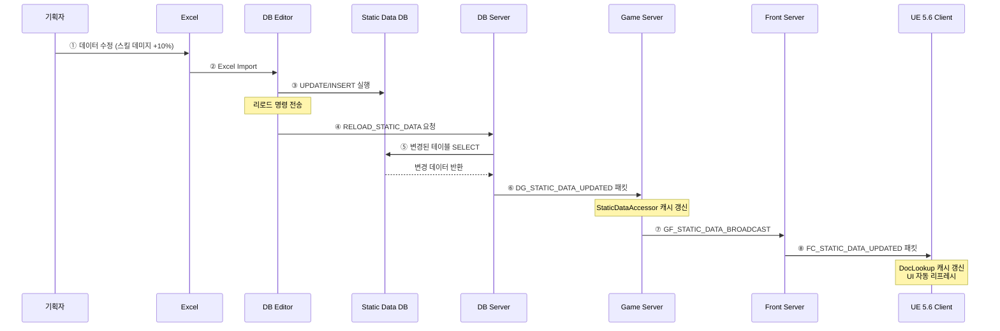
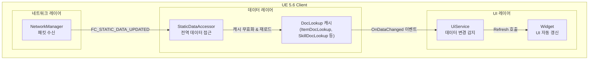
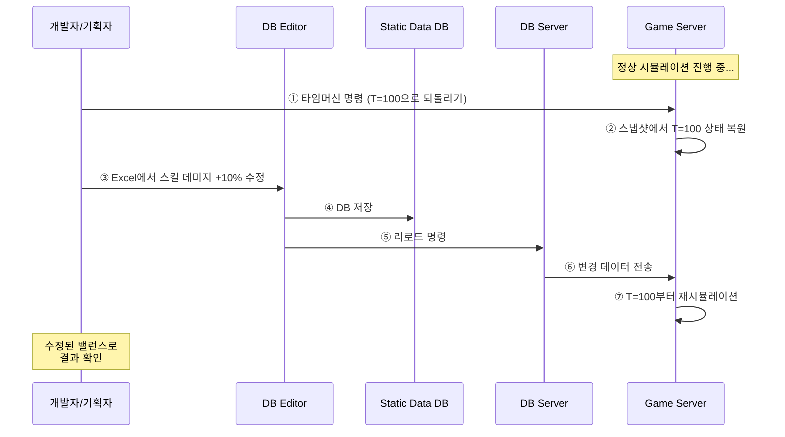

# 3. 생산성 향상을 위한 테스트 중 기획 데이터 실시간 전파 기능 소개

작성자: 안명달 (mooondal@gmail.com)

## 개요

개발 과정에 가장 많은 시간이 낭비되는 과정중의 하나가 밸런싱을 하고 배포하여 확인하는 구간이다.
서버와 클라이언트가 구동 중인 상태에서 기획 데이터를 실시간으로 반영할 수 있는 시스템이다. 기획자가 Excel에서 데이터를 수정하면 DB Editor(외부 도구, 레포지토리에 포함되지 않음)를 통해 StaticData DB에 저장되고, 이 변경사항이 DB Server -> Game Server -> Front Server -> UE 5.6 Client까지 재시작 없이 즉시 전파된다.

## 전체 데이터 파이프라인

```mermaid
flowchart LR
    subgraph Planning["기획 단계"]
        P["기획자"]
        E["Excel<br/>(스킬, 아이템, 몬스터 등)"]
    end
    
    subgraph Tool["도구"]
        DE["DB Editor<br/>(Excel ↔ DB 동기화)"]
    end
    
    subgraph Database["데이터베이스"]
        SDB["StaticData DB<br/>(MySQL)"]
    end
    
    subgraph ServerCluster["서버 클러스터"]
        DBS["DB Server<br/>StaticDataAccessor"]
        GS["Game Server<br/>StaticData 캐시"]
        FS["Front Server<br/>클라이언트 중계"]
    end
    
    subgraph Client["클라이언트"]
        UE["UE 5.6 Client<br/>UI/로직 반영"]
    end
    
    P -->|"① 데이터 작성/수정"| E
    E -->|"② Import"| DE
    DE -->|"③ 저장"| SDB
    SDB -->|"④ 리로드 명령"| DBS
    DBS -->|"⑤ 데이터 푸시"| GS
    GS -->|"⑥ 전파"| FS
    FS -->|"⑦ 클라이언트 갱신"| UE
```

## 단계별 상세 설명

| 단계 | 구성요소 | 역할 |
|------|----------|------|
| ① | **기획자 -> Excel** | 스킬 데미지, 아이템 가격, 몬스터 스탯 등 게임 데이터 작성 |
| ② | **Excel -> DB Editor** | Excel 파일을 DB Editor에서 Import하여 검증 및 편집 |
| ③ | **DB Editor -> StaticData DB** | 변경된 데이터를 MySQL에 저장 (트랜잭션 단위) |
| ④ | **StaticData DB -> DB Server** | 리로드 명령 수신 시 변경된 테이블 감지 및 로드 |
| ⑤ | **DB Server -> Game Server** | StaticData 패킷으로 변경 데이터 전송, 캐시 갱신 |
| ⑥ | **Game Server -> Front Server** | 접속 중인 유저들에게 전파할 데이터 중계 |
| ⑦ | **Front Server -> UE 5.6 Client** | 클라이언트 StaticDataAccessor 갱신, UI 즉시 반영 |

## 서버 간 통신 시퀀스

## 클라이언트 반영 메커니즘

**클라이언트 처리 흐름:**

1. **패킷 수신**: `NetworkManager`가 `FC_STATIC_DATA_UPDATED` 패킷 수신
2. **캐시 갱신**: `StaticDataAccessor`가 변경된 Doc 타입의 `DocLookup` 캐시 무효화
3. **이벤트 발행**: 데이터 변경 이벤트를 구독 중인 `UiService`에 통지
4. **UI 리프레시**: 해당 데이터를 사용하는 Widget들이 자동으로 Refresh

## 타임머신 - 시간 되돌리기 및 데이터 재적용

게임 서버의 **시간을 특정 시점으로 되돌리고, 기획 데이터를 수정하여 다시 적용**해볼 수 있는 디버깅/테스트 기능이다.

| 기능 | 설명 |
|------|------|
| **시간 되돌리기** | 서버 시뮬레이션을 특정 시점으로 롤백하여 상태 복원 |
| **데이터 수정 후 재실행** | 기획 데이터를 수정한 뒤 해당 시점부터 다시 시뮬레이션 |
| **결과 비교** | 수정 전/후 결과를 비교하여 밸런스 영향 분석 |
| **재현 가능 테스트** | 동일 시점에서 반복 테스트로 버그 재현 및 수정 검증 |

**활용 시나리오:**
- **밸런스 조정 검증**: 특정 전투 시점으로 돌아가 스탯 수정 후 결과 비교
- **버그 재현**: 버그 발생 직전 시점으로 돌아가 반복 테스트
- **기획 실험**: 다양한 수치로 여러 번 시뮬레이션하여 최적값 탐색

## 장점

| 장점 | 설명 |
|------|------|
| **빠른 기획 이터레이션** | 서버/클라이언트 재시작 없이 밸런스 조정 |
| **End-to-End 실시간 반영** | Excel -> DB -> 모든 서버 -> 클라이언트까지 자동 전파 |
| **QA 효율화** | 테스트 중 즉시 수치 변경하여 검증 |
| **라이브 핫픽스** | 긴급 밸런스 패치 시 재배포 없이 적용 가능 |
| **버전 일관성** | Checksum 기반 데이터 버전 검증으로 불일치 방지 |

---

