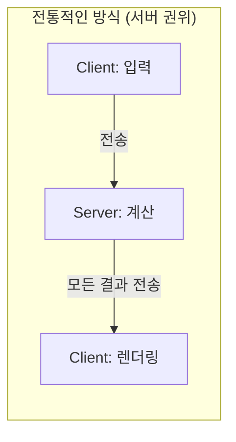
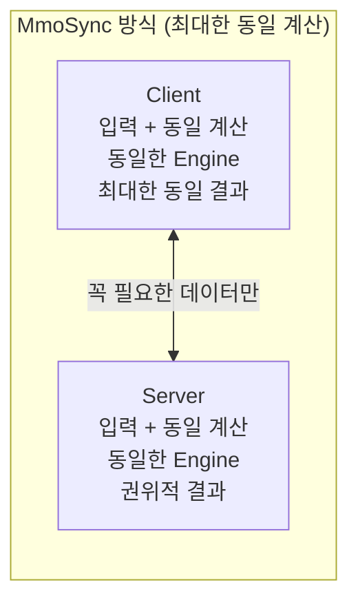
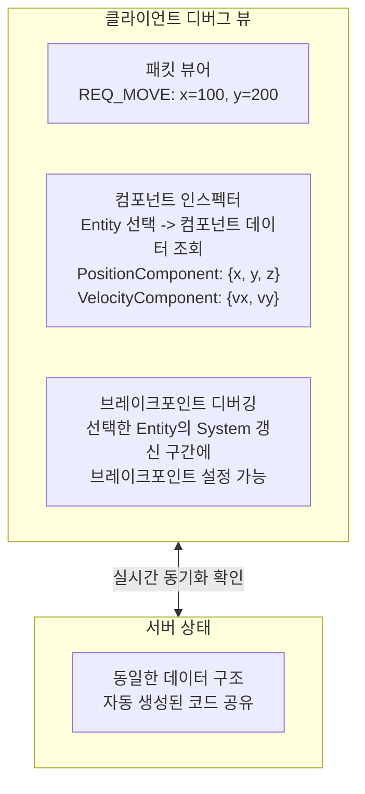
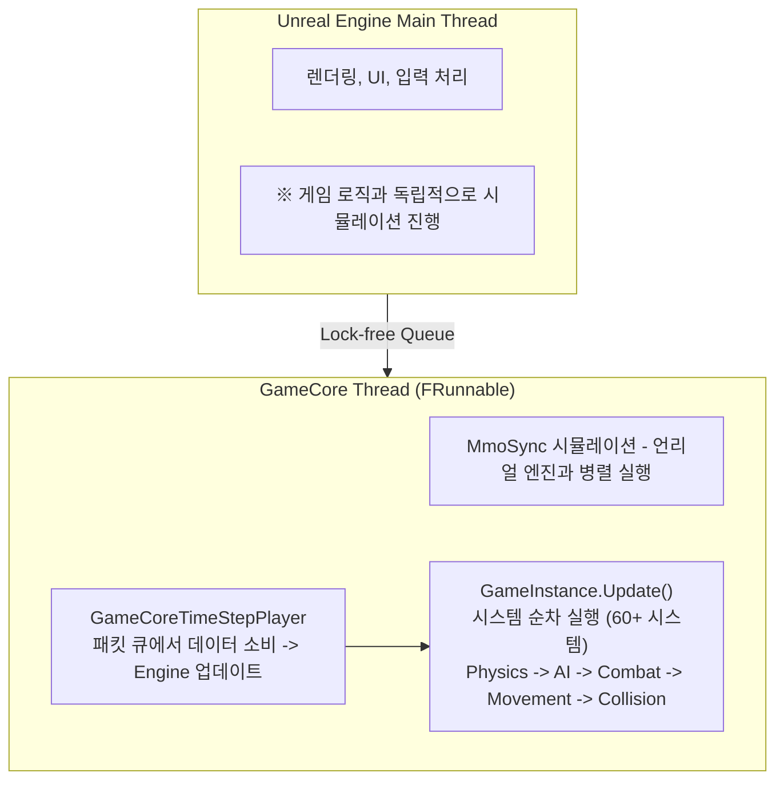
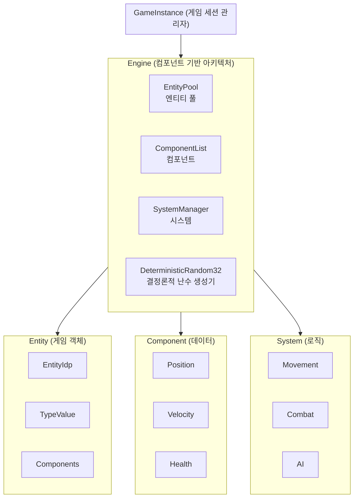

# 4. 클라이언트-서버 통합 동기화 엔진 소개

작성자: 안명달 (mooondal@gmail.com)

## MmoSync - 최대한 동일 연산으로 동기화 품질 향상 및 전송량 최소화

**클라이언트와 서버가 최대한 동일한 코드로 동일한 계산을 수행**하는 방식의 라이브러리를 구상했다. 클라이언트 프로그래머와 서버 프로그래머가 각각 로직을 구현하고 동기화의 협의하는 방식은 너무 비효울적이다. 데디케이티드서버와 같은 개발방식이 훨씬 세련되었다고 생각한다. 하지만, MMO 이거나 수 많은 객체의 동기화가 필요한 경우는 데디케이티드서버를 적용하기 힘든 경우여서 직접 개발해 보기로 했다. 양쪽에서 최대한 같은 로직을 실행하여 **동기화 품질을 높이고 네트워크 전송량을 최소화**한다.

| 특징 | 설명 |
|------|------|
| **단일 코드베이스** | 클라이언트/서버 동일 코드 -> 별도 구현 불필요 |
| **최대한 동일 계산** | 동일 입력 -> 최대한 동일 결과, 불일치 시 서버 권위로 보정 |
| **전송량 최소화** | 동일 코드로 대부분 연산 수행, 입력/검증 데이터만 전송하여 대역폭 절감 |
| **멀티스레드 분리** | 시뮬레이션을 별도 스레드로 분리하여 언리얼 엔진 스레드와 병렬 처리 |
| **데이터 지향 설계** | 컴포넌트 기반 패턴으로 캐시 친화적 처리 |
| **TimeStep 기반** | 고정 타임스텝으로 프레임 독립적, 재현 가능한 시뮬레이션 |

**동기화 원리:**



> **전통적 방식**: 대역폭 증가, 지연 증가



> **MmoSync 방식**: 전송량 최소화, 동기화 품질 향상

**핵심 원리:**
- **동일 코드 기반 동기화**: 클라-서버가 동일한 Engine을 사용하여 최대한 같은 로직 수행
- **전송량 최소화**: 물리/AI/전투 등 대부분 연산을 로컬에서 수행, 입력/검증 데이터만 전송하여 대역폭 절감
- **높은 동기화 품질**: 최대한 동일 계산으로 클라이언트 예측과 서버 결과가 유사 -> 부드러운 플레이
- **즉각적인 반응성**: 서버 응답 대기 없이 로컬 계산 결과 즉시 표시, 불일치 시 서버 권위로 보정

---

## 클라이언트 디버깅 시스템

클라이언트에서 **패킷 및 컴포넌트 데이터를 실시간으로 확인하고, 선택한 Entity의 처리 과정을 브레이크포인트로 추적**할 수 있는 디버깅 시스템이다.

| 기능 | 설명 |
|------|------|
| **패킷 뷰어** | 송수신 패킷의 모든 필드를 실시간으로 표시 |
| **컴포넌트 인스펙터** | 엔티티의 모든 컴포넌트 데이터를 트리 형태로 조회 |
| **브레이크포인트 디버깅** | 디버깅 뷰에서 선택한 Entity의 System 갱신 구간에 브레이크포인트 설정 가능 |



**장점:**
- **편리한 디버깅**: Entity 선택 -> System 갱신 구간에 브레이크포인트 설정으로 효율적인 디버깅
- **투명한 데이터 확인**: 패킷 및 컴포넌트의 모든 필드를 실시간으로 확인 가능
- **자동 생성 연동**: Setup Project가 생성한 패킷/컴포넌트 정의와 자동 연동
- **프로덕션 비활성화**: 릴리스 빌드에서는 오버헤드 제거

---

## 클라이언트 멀티스레드 아키텍처

MmoSync 시뮬레이션을 **별도 스레드로 분리**하여 **언리얼 엔진 스레드와 병렬**로 처리한다.



**장점:**
- **언리얼 엔진과 병렬 처리**: 시뮬레이션이 렌더링/UI와 독립적으로 실행
- **프레임 드랍 방지**: 복잡한 시뮬레이션이 렌더링 프레임에 영향 없음
- **안정적인 Tick Rate**: 고정 타임스텝 시뮬레이션 보장

```cpp
// GameCore - FRunnable 상속으로 별도 스레드 실행
class FGameCore : public FRunnable
{
    TSharedPtr<GameInstance> mGameInstance;
    FRunnableThread* mThread;  // TPri_Highest 우선순위
    
    uint32 Run() override
    {
        while (!mThreadStop)
        {
            // 패킷 큐에서 데이터 소비
            GamePacketDataQueueTimePair step = mTimeStepPlayer->Play();
            
            // 시뮬레이션 업데이트 (고정 타임스텝)
            mGameInstance->Update(OUT mLastChecksum);
        }
    }
};
```

## 아키텍처 및 주요 컴포넌트



## 주요 컴포넌트

### Engine
- **역할**: 컴포넌트 기반 아키텍처의 중앙 관리자
- **기능**: Entity 생성/파괴, Component 등록/부착, System 업데이트
- **특징**: TimeStep 기반 업데이트, 직렬화/역직렬화 지원

### Entity
- **역할**: 게임 객체의 고유 식별자
- **구조**: EntityIdp(ID + Pool Index), ComponentTypeValue(비트셋)
- **특징**: 컴포넌트 조합으로 다양한 게임 객체 표현

### Component
- **역할**: 순수 데이터 컨테이너
- **예시**: PositionComponent, PhysicsComponent, SkillComponent, DamageComponent
- **특징**: 약 20종 규모의 게임 컴포넌트 정의

### System
- **역할**: 특정 컴포넌트 조합에 대한 로직 처리
- **예시**: PcSystem, MotionSystemArrival, TacticsSystemCombat, SearchSystem

## 동기화 전략

클라이언트와 서버가 **동일한 코드(Engine)를 사용하여 동일한 연산을 수행**하여 **상태 전송을 최소화**하면서도 **높은 동기화 품질**을 가진다.

- **동일 코드 공유**: 서버/클라이언트가 같은 시뮬레이션 코드(MmoSync Engine)를 사용
- **효율적 전송**: 입력/검증 데이터만 전송, 대부분의 상태는 로컬 연산으로 복원
- **매우 높은 동기화 품질**: 클라이언트 예측과 서버 결과가 정확히 일치하여 끊김 없는 플레이 경험

## 월드 시스템

- **GridGenerator**: 절차적 지형 생성
- **EntityGenerator**: 유닛/몬스터 스폰 관리
- **WorldManager**: 멀티플레이 월드 상태 관리

---
