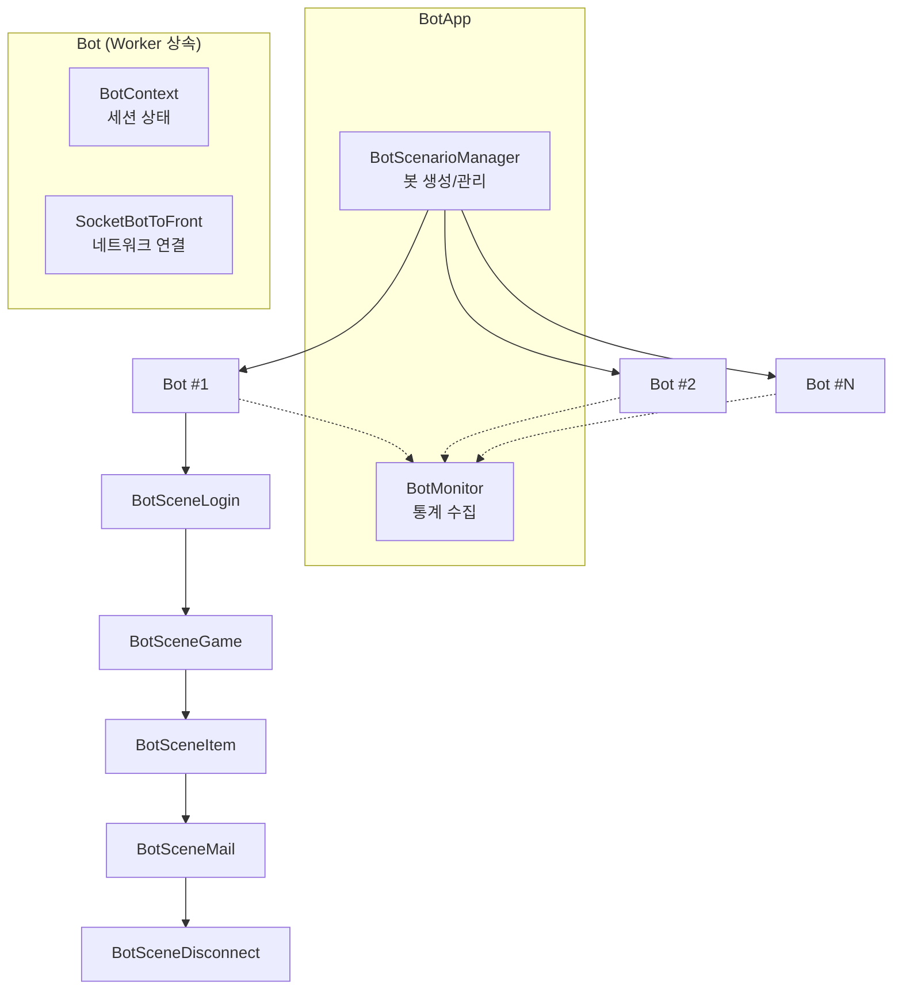
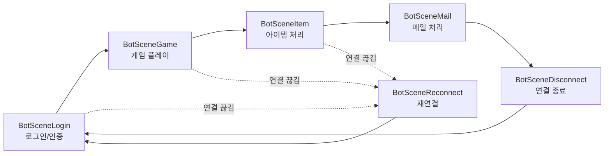
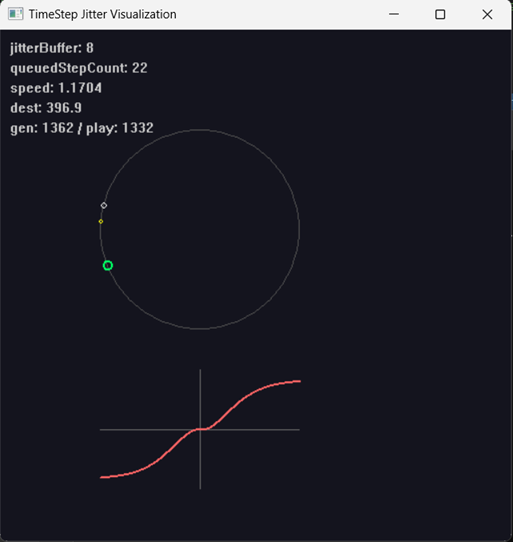

# 5. 봇 프레임워크를 활용한 부하 테스트 자동화

작성자: 안명달 (mooondal@gmail.com)

## 개요

긴박한 일정으로 인해 테스트를 작성할 시간이 부족하여 소홀했다가 너무 큰 손해를 본 경우가 많다. 구현량이 많아질수록 단위 테스트를 추가하고 매번 전체를 실행하여 확인해보아야 한다
이제는 AI가 테스트와 봇을 구현해 줄 수 있기 때문에 너무나 편리해졌다.
서버 부하 테스트 및 시나리오 자동화를 위한 봇 프레임워크이다. 다수의 가상 클라이언트(봇)를 생성하여 실제 클라이언트와 동일한 패킷 흐름으로 서버에 접속하고, 게임 플레이를 시뮬레이션한다.

## 핵심 특징

| 특징 | 설명 |
|------|------|
| **시퀀스 기반 시나리오** | `RegisterSeq()` -> `NextSeq()` 패턴으로 단계별 진행 |
| **씬(Scene) 단위 모듈화** | Login, Game, Item, Mail 등 기능별 씬 분리 |
| **실시간 통계 모니터링** | 패킷 송수신 카운트, 이벤트 추적, 성능 메트릭 |
| **재연결 자동 처리** | 연결 끊김 시 `BotSceneReconnect`로 자동 복구 |
| **Worker 기반 비동기 처리** | 각 봇이 독립적인 Worker로 동작 |

## 아키텍처



## 프로젝트 구조

```
server/bot/
├── Bot/
│   ├── App/                    # 메인 애플리케이션
│   │   ├── BotApp.h/cpp        # BotApp - AppBase 상속
│   │   └── main.cpp            # 진입점
│   ├── Bot/                    # 봇 핵심 클래스
│   │   ├── Bot.h/cpp           # 개별 봇 인스턴스 (Worker 상속)
│   │   ├── BotContext.h/cpp    # 세션 상태 보관
│   │   ├── BotMonitor.h/cpp    # 통계 수집 및 출력
│   │   └── BotStatistics.h     # 통계 데이터 구조체
│   ├── BotManager/             # 봇 관리
│   │   ├── BotAccountManager   # 계정 정보 관리
│   │   └── BotScenarioManager  # 봇 생성 및 시나리오 관리
│   ├── BotScene/               # 시나리오 씬들
│   │   ├── Base/               # BotScene 기본 클래스
│   │   ├── BotSceneLogin/      # 로그인 시나리오
│   │   ├── BotSceneGame/       # 게임 플레이 시나리오
│   │   ├── BotSceneItem/       # 아이템 시나리오
│   │   ├── BotSceneMail/       # 메일 시나리오
│   │   ├── BotSceneReconnect/  # 재연결 처리
│   │   └── BotSceneDisconnect/ # 연결 종료
│   ├── Socket/                 # 소켓 클래스
│   └── Util/                   # 유틸리티
└── *.ixx                       # C++20 모듈 파일
```

## 핵심 클래스

### Bot - 개별 봇 인스턴스

```cpp
// Worker를 상속받아 비동기 작업 단위로 동작
class Bot final : public Worker
{
private:
    BotId mBotId;
    std::shared_ptr<BotContext> mBotContext;       // 세션 상태
    std::shared_ptr<BotScene> mBotScene;           // 현재 씬
    SocketBotToFrontWeakPtr mSocketBotToFrontWeakPtr;

public:
    void Start();
    void OnHandshakeCompletedFront_async(bool reconnected);
    void OnLostConnectionFront_async();
    void OnDispatchPacketFront_async(PacketTemp tp);

private:
    void NextScene_async();
    void ChangeToReconnectScene_async();
};
```

### BotScene - 시나리오 기본 클래스

```cpp
// 시퀀스 기반 시나리오 실행
class BotScene
{
private:
    SeqHandlerList mSeqHandlerList;  // 시퀀스 핸들러 목록
    BotSceneSeq mSeq;                // 현재 시퀀스 인덱스

protected:
    // 시퀀스 등록 - 생성자에서 호출
    template <typename _Owner, typename _Function>
    void RegisterSeq(_Owner* scene, _Function&& function);

    // 다음 시퀀스로 진행
    void NextSeq();
    void NextSeq_timer_async();  // 딜레이 후 진행

    // 현재 시퀀스 재시도
    void RetrySeq();

    // 특정 시퀀스로 점프
    template <typename _Owner, typename _Function>
    void JumpToSeq(_Owner* scene, _Function&& function);

public:
    virtual bool OnDispatchPacket(NetworkPacket& rp) = 0;
};
```

### BotContext - 세션 상태 보관

```cpp
// 봇의 세션 상태를 보관하는 컨텍스트 클래스
class BotContext
{
private:
    PacketHeader mCurrPacketHeader;
    ServerList mServerList;              // 서버 목록
    AccountUserList mAccountUserList;    // 계정 유저 목록
    AuthTicket mAuthTicket;              // 인증 티켓
    Checksum mStaticDataChecksum;        // 정적 데이터 체크섬
    std::shared_ptr<UserCacheAccessor> mUserCacheAccessor;
    GameMap mGameMap;                    // 게임 목록
    GameId mCurrGameId;                  // 현재 게임 ID

public:
    UserItemRowPtr FindItemIdByItemSid(ItemSid itemSid) const;
};
```

## 시나리오 구현 예시

### BotSceneLogin - 로그인 시나리오

```cpp
BotSceneLogin::BotSceneLogin(BotPtr& bot) : BotScene(bot)
{
    // 시퀀스 등록 - 순서대로 실행
    RegisterSeq(this, &BotSceneLogin::CF_CONNECT);
    RegisterSeq(this, &BotSceneLogin::REQ_GLOBAL_NOW);
    RegisterSeq(this, &BotSceneLogin::CF_REQ_PACKET_LIST);
    RegisterSeq(this, &BotSceneLogin::CM_REQ_SERVER_LIST);
    RegisterSeq(this, &BotSceneLogin::CM_REQ_ACCOUNT_USER_LIST);
    RegisterSeq(this, &BotSceneLogin::CM_REQ_ACCOUNT_USER_CREATE);
    RegisterSeq(this, &BotSceneLogin::CM_REQ_AUTH_TICKET);
    RegisterSeq(this, &BotSceneLogin::CF_REQ_USER_LOGIN);
    RegisterSeq(this, &BotSceneLogin::CD_REQ_STATIC_DATA_CHECKSUM);
    RegisterSeq(this, &BotSceneLogin::CD_REQ_STATIC_DATA);
    RegisterSeq(this, &BotSceneLogin::CD_REQ_USER_DATA);
    NextSeq();  // 첫 시퀀스 시작
}

// 패킷 응답 처리
HandleResult BotSceneLogin::OnPacket(MC_ACK_SERVER_LIST& rp)
{
    const Result result = rp.GetHeader().GetPacketResult();
    ReportResultAndYield(result);

    switch (result)
    {
    case Result::SUCCEEDED:
        GetBotContext().ServerList().clear();
        for (const SERVER* server : rp.Get_serverList())
            GetBotContext().ServerList().emplace_back(*server);
        NextSeq();  // 다음 시퀀스로
        break;
    case Result::RETRY_LATER:
        RetrySeq();  // 현재 시퀀스 재시도
        break;
    default:
        RetrySeq();
        break;
    }
    return HandleResult::OK;
}

// 조건부 점프
void BotSceneLogin::CM_REQ_AUTH_TICKET()
{
    if (GetBotContext().AccountUserList().empty())
    {
        // 계정이 없으면 생성 단계로 점프
        JumpToSeq(this, &BotSceneLogin::CM_REQ_ACCOUNT_USER_CREATE);
        return;
    }
    // 인증 티켓 요청 패킷 전송...
}
```

### BotSceneGame - 게임 플레이 시나리오

```cpp
BotSceneGame::BotSceneGame(BotPtr& bot) : BotScene(bot)
{
    RegisterSeq(this, &BotSceneGame::CD_REQ_CHEAT_CREATE_ITEM_GAME);
    RegisterSeq(this, &BotSceneGame::CM_REQ_GAME_LIST);
    RegisterSeq(this, &BotSceneGame::CD_REQ_GAME_CREATE);
    RegisterSeq(this, &BotSceneGame::CD_REQ_GAME_USER_ENTER);
    RegisterSeq(this, &BotSceneGame::CF_REQ_GAME_CHANNEL_USER_ENTER);
    RegisterSeq(this, &BotSceneGame::CD_REQ_GAME_USER_LEAVE);
    NextSeq();
}
```

## 통계 모니터링

### BotMonitor - 실시간 통계

```cpp
class BotMonitor : public Worker
{
private:
    static constexpr ClockMs PRINT_INTERVAL = 10 * 1000ms;

    // 패킷 타입별 카운트 배열
    CountArray_MC mCountArray_MC;  // Main -> Client
    CountArray_CM mCountArray_CM;  // Client -> Main
    CountArray_FC mCountArray_FC;  // Front -> Client
    CountArray_CF mCountArray_CF;  // Client -> Front
    CountArray_DC mCountArray_DC;  // Db -> Client
    CountArray_CD mCountArray_CD;  // Client -> Db
    CountArray_GC mCountArray_GC;  // Game -> Client
    CountArray_CG mCountArray_CG;  // Client -> Game
    CountArray_BC mCountArray_BC;  // Bridge -> Client
    CountArray_CB mCountArray_CB;  // Client -> Bridge

    ResultCountArray mResultCountArray;  // 결과 코드별 카운트

public:
    void OnBotEvent_async(BotEventType eventType, BotId botId, ...);
    void OnPacketRecv_async(PacketType packetType);
    void OnPacketSend_async(PacketType packetType);
    void OnPacketResult_async(Result result);
    void Print_timer_async();  // 주기적 통계 출력
};
```

### BotStatistics - 봇별 통계

```cpp
struct BotStatistics
{
    BotId botId;
    std::wstring sceneName;
    BotSceneSeq sceneSeq;

    // 이벤트 타입별 히트 카운트
    std::array<size_t, _IDX(BotEventType::MAX)> hitCount;
    // 이벤트 발생 시점
    std::array<ClockPoint, _IDX(BotEventType::MAX)> clockPoint;
    // 총 소요 시간
    std::array<ClockDuration, _IDX(BotEventType::MAX)> totalDuration;
};
```

## 씬 전환 흐름



## 주요 기능

| 기능 | 설명 |
|------|------|
| **자동 계정 생성** | 봇 ID 기반 계정 자동 생성 및 관리 |
| **정적 데이터 동기화** | 서버와 정적 데이터 체크섬 비교 후 동기화 |
| **게임 생성/입장/퇴장** | 실제 클라이언트와 동일한 게임 플레이 흐름 |
| **치트 명령 지원** | 테스트용 아이템 생성 등 치트 명령 실행 |
| **재연결 자동 복구** | 연결 끊김 감지 시 `BotSceneReconnect`로 전환 |
| **패킷 히스토리** | 송수신 패킷 기록으로 디버깅 용이 |

## 시각적 테스트 리포트

테스트 프레임워크에는 **simple2d 라이브러리**가 탑재되어 있어, 테스트 결과를 시각화 리포트로 출력할 수 있다. 복잡한 알고리즘의 동작을 실시간으로 확인하고 분석하는 데 유용하다.

### 예시: TimeStep Jitter Visualization

네트워크 지터 보상 알고리즘의 동작을 시각화한 테스트 리포트 예시이다.



**구성 요소:**

| 항목 | 설명 |
|------|------|
| **jitterBuffer** | 지터 버퍼 크기 (네트워크 불안정성 흡수용) |
| **queuedStepCount** | 대기 중인 시뮬레이션 스텝 수 |
| **speed** | 현재 재생 속도 (1.0 = 정상, >1.0 = 따라잡기 모드) |
| **dest** | 목표 위치 (서버 기준) |
| **gen / play** | 생성된 스텝 / 재생된 스텝 (차이 = 지연) |
| **원형 시계** | 현재 위치(녹색)와 목표 위치를 직관적으로 표시 |
| **하단 그래프** | 시간에 따른 속도 조절 곡선 (S-curve 기반 부드러운 보간) |

**활용 사례:**
- 네트워크 지연/손실 상황에서 동기화 알고리즘 검증
- 따라잡기(catch-up) 로직의 부드러움 확인
- 지터 버퍼 크기 최적화

---

