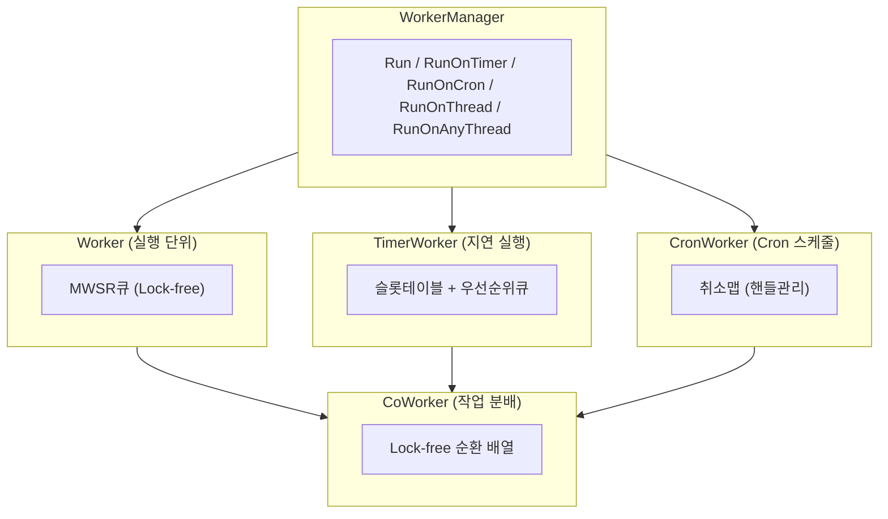
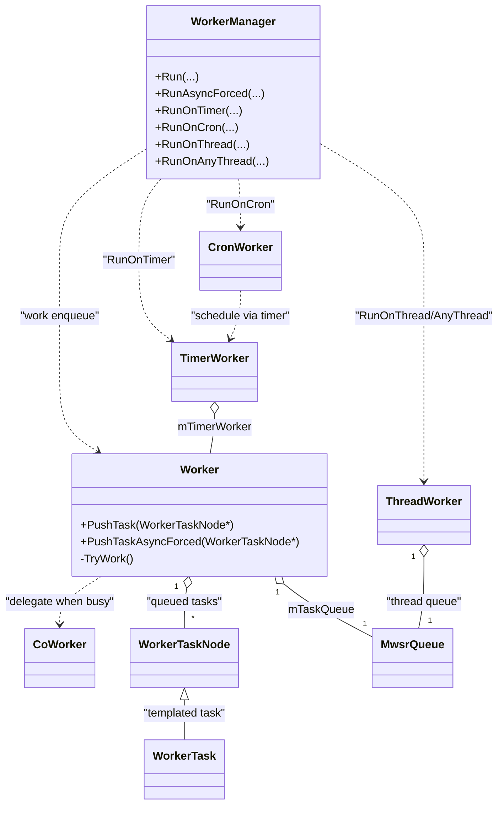
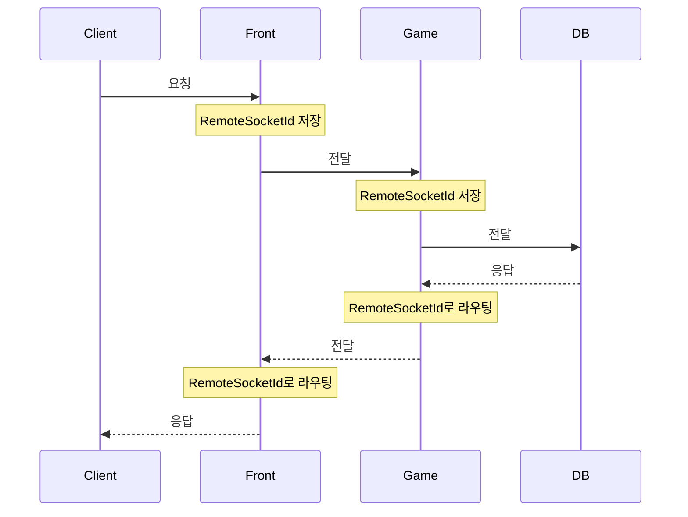

# 6. 고성능 비동기 함수 호출 시스템

작성자: 안명달 (mooondal@gmail.com)

## 개요

많은 C++ MMORPG에서 오랜동안 활용되었다고 하는 함수 비동기 호출 큐잉 시스템을 최대한 간결하게 구현한 시스템이다. 장르에 따라 성능 튜닝 작업이 필요할 것이다.

## 핵심 특징

| 특징 | 설명 |
|------|------|
| **고성능 비동기 함수 호출** | 각 Worker는 독립적인 함수 호출 정보 큐를 소유, 가능한 직접 호출하여 오버헤드 최소화 |
| **타이머/Cron 스케줄** | 밀리초 단위 지연 실행, Unix Cron 표현식 기반 반복 스케줄, **취소 가능** |
| **메모리 풀 시스템** | DynamicPool, FixedPool, CompactionPool 3종 메모리 풀 ([상세 문서](tech_34.md)) |
| **MwsrQueue** | Lock-free Multi-Writer Single-Reader 큐 (Windows SLIST 기반) |

## 아키텍처



## 클래스 다이어그램 (핵심 구현/협력 구조)



## 주요 컴포넌트

### WorkerManager
- **역할**: 비동기 작업 스케줄링의 단일 진입점
- **API**: `Run()`, `RunOnTimer()`, `RunOnCron()`, `RunOnThread()`, `RunOnAnyThread()`
- **특징**: 템플릿 기반 타입 안전성, Perfect Forwarding

### Worker
- **역할**: 함수 호출 큐를 소유한 논리적 실행 단위 (세션, 채널, 유저 등)
- **구조**: **MwsrQueue** (Multi-Writer Single-Reader) Lock-free 큐로 Task 관리
- **최적화**: 같은 Worker 내 연속 호출 시 큐잉 없이 직접 실행

### MwsrQueue
- **역할**: 다중 Writer, 단일 Reader용 Lock-free 큐
- **구현**: Windows SLIST (`InterlockedPushEntrySList` / `InterlockedFlushSList`)
- **특징**: Push는 개별 추가, Pop은 전체 Flush 후 역순 정렬하여 FIFO 순서 보장

### TimerWorker
- **역할**: 시간 기반 지연 실행
- **구조**: 슬롯 테이블(~65초, O(1)) + 우선순위 큐(65초 초과, O(log N))
- **정밀도**: 16ms 단위 슬롯

### CronWorker
- **역할**: Unix Cron 표현식 기반 반복 스케줄
- **기능**: 취소 가능한 스케줄 관리
- **예시**: `"0 0 * * *"` (매일 자정)

### CoWorker
- **역할**: 유휴 스레드에 대기 Worker 작업 분배
- **구조**: Lock-free 순환 배열 (16384 슬롯)
- **목적**: Worker 단일 스레드 보장 유지하면서 작업 지연 방지

## 서버 간 통신 (RPC)

게임 서버는 여러 서버(Front, Game, DB, Main 등)가 협력하여 동작한다. 패킷 헤더에 **RpcId**와 **라우팅 정보**를 포함하여 효율적인 서버 간 통신을 구현한다.

### RpcId 구조
```cpp
struct RpcId {
    RpcIdx mIdx;     // 풀 인덱스 (순환 배열 위치)
    RpcToken mToken; // 고유 토큰 (재사용 시 충돌 방지)
};
```

### PacketHeader 구성

| 필드 | 용도 |
|------|------|
| `mAppIds[3]` | 경유 서버 ID 추적 (DB, Front, Game) |
| `mRemoteSocketIds[4]` | 응답 라우팅용 소켓 ID (DB, Front, Game, Main) |
| `mRemoteRequestIds[2]` | RPC 요청-응답 매칭용 (DB, Main/Shell) |
| `mAccountId, mUserId, ...` | 사용자 컨텍스트 정보 |

### 동작 원리



1. **요청 전달 시**: 각 서버가 자신의 `RemoteSocketId`를 헤더에 기록
2. **응답 반환 시**: 헤더의 `RemoteSocketId`로 역방향 라우팅
3. **RPC 완료 시**: `RemoteRequestId`로 원본 요청과 응답 매칭

### 장점
- **중앙 라우팅 테이블 불필요**: 패킷 자체가 경로 정보 보유
- **토큰 기반 안전성**: 재사용된 인덱스도 토큰으로 구분
- **확장성**: 서버 추가 시 헤더 배열만 확장

## 사용 예시

```cpp
// 기본 비동기 실행
WorkerManager::Run(sessionWorker, session, &Session::ProcessPacket, packet);

// 1초 후 실행
WorkerManager::RunOnTimer(1000ms, channelWorker, channel, &Channel::Tick);

// 매일 자정 실행
auto handle = WorkerManager::RunOnCron(now, cronExpr, worker, owner, &Owner::DailyReset);
WorkerManager::CancelCron(handle);  // 취소

// 특정 스레드에서 실행
WorkerManager::RunOnThread(0, owner, &Owner::ThreadLocalUpdate);

// 모든 스레드에 브로드캐스트
WorkerManager::RunOnEachAllThread(owner, &Owner::InvalidateCache);
```

## 성능 특성

- **Lock-free 큐**: CAS 연산으로 경합 최소화
- **동기 최적화**: 같은 Worker 내 연속 호출 시 오버헤드 제거
- **메모리 풀링**: Task 할당/해제 비용 O(1)
- **타이머 슬롯**: 단기 타이머 O(1) 처리

## 메모리 풀 시스템

용도별로 최적화된 3종 메모리 풀을 제공한다. **상세 내용은 [메모리 풀 시스템 문서](tech_34.md) 참조.**

| 풀 타입 | 특징 | 스레드 모델 | 사용처 |
|---------|------|-------------|--------|
| **DynamicPool** | 동적 확장 (1.5배), 상한 없음 | 단일 스레드 | WorkerTask, 가변 크기 객체 |
| **FixedPool** | 고정 크기 (2^N), Lock-free | 스레드 안전 | Socket, SendBuffer 등 고빈도 멀티스레드 객체 |
| **CompactionPool** | 연속 메모리, 캐시 친화적, 키 기반 | 단일 스레드 | 게임 엔티티, 시뮬레이션 객체 |

---

