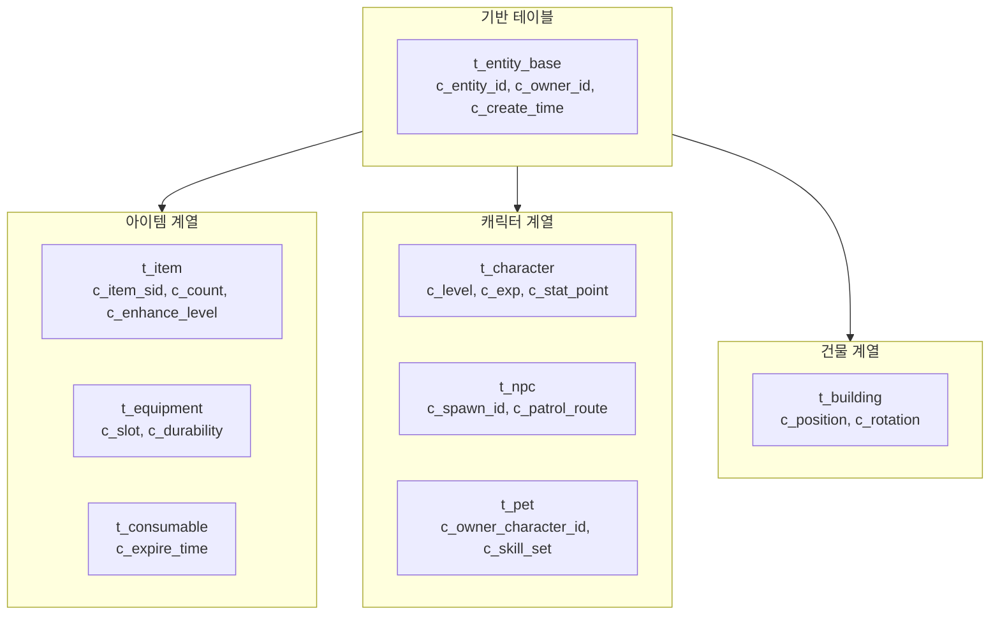
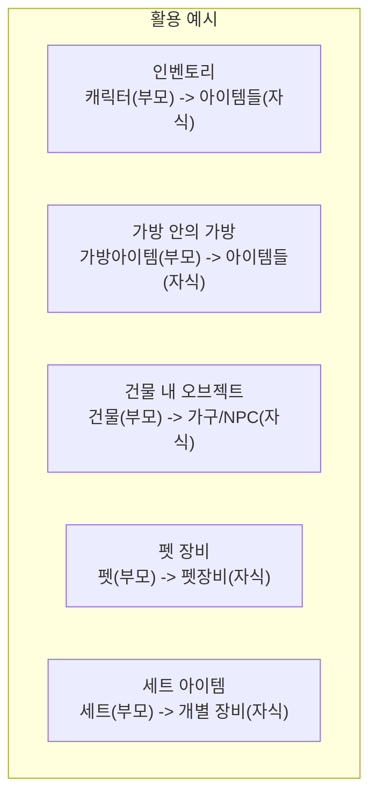

# 7. 상속 구조와 노드 모델을 결합한 통합 아이템 시스템

작성자: 안명달 (mooondal@gmail.com)

게임 서버의 **데이터 구조를 체계적으로 설계**하여 확장성, 유지보수성, 추적성을 고려한 시스템이다.

> **참고**: 엔티티 고유 ID는 [UUID - 서버 가상화를 위한 분산 고유 식별자](tech_33.md)를 사용한다.

## 상속 구조 설계 - 기능 재활용 (아이템->캐릭터)

게임 데이터 테이블을 **상속 구조로 설계**하여 공통 기능을 재활용한다.



**장점:**
- **코드 재사용**: 공통 필드/로직을 기반 테이블에서 한 번만 구현
- **일관된 API**: 모든 엔티티에 동일한 CRUD 인터페이스 적용
- **확장 용이**: 새 엔티티 타입 추가 시 기반 테이블 상속

---

## 부모-자식 관계의 범용적 활용

아이템, 캐릭터, 건물 등 모든 엔티티에 **부모-자식 관계**를 적용하여 기능을 범용화한다.



```sql
-- 범용 부모-자식 관계 테이블
CREATE TABLE t_entity_relation (
    c_parent_entity_id BIGINT NOT NULL,  -- 부모 UUID
    c_child_entity_id BIGINT NOT NULL,   -- 자식 UUID
    c_relation_type TINYINT NOT NULL,    -- 관계 유형 (인벤토리, 장착, 보관 등)
    c_slot_index INT DEFAULT NULL,       -- 슬롯 위치 (nullable)
    PRIMARY KEY (c_parent_entity_id, c_child_entity_id)
);
```

**장점:**
- **단일 테이블**: 모든 관계를 하나의 테이블로 관리
- **무한 계층**: 가방 안의 가방 등 n-depth 구조 지원
- **쿼리 단순화**: 부모 ID로 모든 자식 조회 가능

---

## 로그 시스템 연동

아이템 시스템의 모든 데이터 변경은 자동으로 로그 DB에 기록된다.

- **로그 자동화**: SP(Stored Procedure) 내부에서 자동 INSERT
- **LogId 연결**: 하나의 행위(거래, 강화 등)와 관련된 모든 로그를 LogId로 추적
- **Before/After**: 변경 전/후 값 모두 기록
- **자동 생성**: Excel 정의 -> 패킷/SP/핸들러 자동 생성

> **상세 내용**: [로그 시스템 - Excel 정의에서 DB 저장까지 자동화](tech_26.md) 참조.

---
