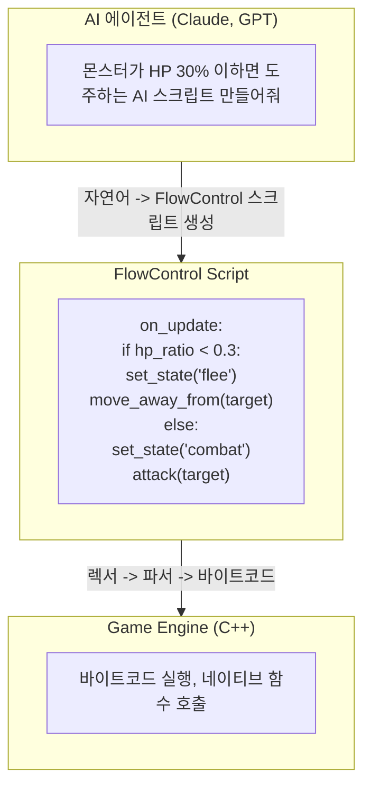
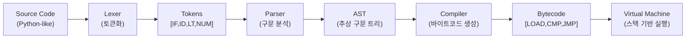

# 8. C++ 바인딩 Python 스타일 경량 스크립트 언어 자체 개발 (Lua 대체)

작성자: 안명달 (mooondal@gmail.com)

## 개요

C++은 Lua와 같은 스크립트 언어 연동이나 Behavior Tree 툴 연동이 필요한 경우가 많은데, 이들을 활용하다 보면 **로직 구현의 경계가 모호해지는 경험**이 많았다.

Lua(Sol2) 스타일이 **AI와의 협업에는 가장 유리**할 것이라 판단했다. 그러나 Lua는 지원하는 기능이 많고 자유도가 높아 혼선이 생기기 쉽다. 그래서 **꼭 필요한 기능으로 제한한 새로운 스크립트 언어**를 정의하여 혼선을 줄이고자 했다.

**Python 문법을 차용한 자체 개발 스크립트 언어**이다. Lua(sol2)의 성능과 Behavior Tree의 구조적 장점을 결합하되, **AI 에이전트와의 협업 효율을 높이기** 위해 설계했다.

## 자체 개발 배경

| 기존 솔루션 | 문제점 | FlowControl 해결책 |
|-------------|--------|-------------------|
| **Lua (sol2)** | C++ 바인딩 복잡, 디버깅 어려움, AI가 이해하기 어려운 문법 | Python 스타일 문법으로 가독성 ↑ |
| **Behavior Tree** | 시각적 편집기 의존, 복잡한 조건 표현 한계, 버전 관리 어려움 | 텍스트 기반, Git 친화적, 조건문 자유도 ↑ |
| **Blueprint** | 바이너리 포맷, Diff 불가, AI 수정 불가 | 텍스트 기반, AI가 직접 수정 가능 |

## 핵심 특징

| 특징 | 설명 |
|------|------|
| **Python 스타일 문법** | 들여쓰기 기반, 가독성 우수, AI가 쉽게 이해/생성 |
| **최소 문법 설계** | 꼭 필요한 기능만 (조건, 반복, 함수 호출) - 학습 비용 최소화 |
| **자체 컴파일러** | 렉서 -> 파서 -> AST -> 바이트코드 변환 직접 구현 |
| **C++ 네이티브 연동** | 게임 엔진 함수 직접 호출, 오버헤드 최소화 |
| **AI 수정 가능** | 텍스트 기반으로 AI가 스크립트 생성/수정/분석 가능 |

## AI 협업 바운더리



**AI가 할 수 있는 것:**
- 자연어 명세 -> 스크립트 자동 생성
- 기존 스크립트 분석 및 버그 탐지
- 밸런스 조정 (수치 변경)
- 새로운 행동 패턴 제안

## 문법 예시

```python
# 몬스터 AI 스크립트
on_spawn:
    set_patrol_route(waypoints)

on_update:
    if detect_player(range=10):
        if hp_ratio < 0.3:
            call_for_help(radius=20)
            flee_to(spawn_point)
        else:
            chase(target)
            if distance(target) < 2:
                attack(target)
    else:
        patrol()

on_damaged:
    if attacker.is_player:
        set_aggro(attacker)
```

## 컴파일러 구조



### 컴파일 단계

| 단계 | 역할 | 입력 예시 | 출력 예시 |
|------|------|----------|----------|
| **Lexer** | 소스 코드를 토큰으로 분해 | `"if hp < 30"` | `[IF, ID(hp), LT, NUM(30)]` |
| **Parser** | 토큰을 AST로 변환 | 토큰 스트림 | `IfNode(Condition, ThenBlock, ElseBlock)` |
| **Compiler** | AST를 바이트코드로 컴파일 | AST 노드 | `[LOAD_VAR, LOAD_CONST, CMP_LT, JUMP_IF_FALSE]` |
| **VM** | 바이트코드를 스택 기반으로 실행 | 바이트코드 | 최종 결과값 |

**자체 구현 이유:**
- 외부 의존성 제거 (Lua VM, Python 인터프리터 불필요)
- 게임에 특화된 최적화 가능
- AI가 이해하기 쉬운 단순한 문법
- 컴파일 타임 검증으로 런타임 오류 최소화

---

## Test 프로젝트 - 모든 기능 검증

FlowControlScript의 정확성과 안정성을 보장하기 위해 **Test 프로젝트에 종합 테스트**를 구현했다. 각 테스트는 언어의 핵심 기능을 검증하며, **실제 게임 로직 시나리오**도 포함되어 있다.

### 테스트 아키텍처

```cpp
// 테스트 실행 흐름
소스 코드 문자열 -> Lexer -> Parser -> Compiler -> VirtualMachine -> 결과 검증
                    (토큰)    (AST)   (바이트코드)  (실행)      (Pass/Fail)
```

### 주요 테스트 목록

#### 1. 기본 기능 테스트 (Foundation)

| 테스트 | 검증 내용 | 중요도 |
|--------|----------|--------|
| **Foreign func execution** | C++ 네이티브 함수 바인딩, 전역 상수 사용 | 핵심 |
| **Basic arithmetic** | 기본 산술 연산 (+, -, *, /) | 핵심 |
| **Variable assignment** | 변수 선언 및 할당, Print 함수 | 핵심 |

```python
# Foreign func execution 예시
a = +Result::SUCCEEDED  # 전역 상수 (123)
b = -Result::DB_ERROR   # 전역 상수 (321)
c = Add(a, b)           # C++ 네이티브 함수 호출
Print(c)                # 결과: -198
return 54321
```

#### 2. 제어 흐름 테스트 (Control Flow)

| 테스트 | 검증 내용 | 중요도 |
|--------|----------|--------|
| **If statement** | 조건문, 논리 연산 (&&, \|\|) | 핵심 |
| **중첩된 IF-ELSE** | 다중 중첩 조건문 | 중요 |
| **조건 테스트** | 복잡한 조건식, 네이티브 함수 혼합 | 중요 |

```python
# If statement 예시
def test(a, b):
    if (a > b || 2 < 3) && 5 < 2:
        return a
    else:
        return b

return test(30, 20)  # 결과: 20
```

#### 3. 함수 정의 및 호출 테스트 (Functions)

| 테스트 | 검증 내용 | 중요도 |
|--------|----------|--------|
| **Rectangle area** | 함수 정의, 파라미터 전달 | 중요 |
| **계산 함수 테스트** | 복잡한 수식 계산 | 중요 |
| **반환없는함수테스트** | void 함수, 여러 함수 정의 | 기본 |

```python
# Rectangle area 예시
def calculate_area(length, width):
    return length * width

return calculate_area(5, 4)  # 결과: 20
```

#### 4. 재귀 함수 테스트 (Recursion)

| 테스트 | 검증 내용 | 중요도 |
|--------|----------|--------|
| **재귀 함수 (피보나치)** | 단순 재귀, 스택 관리 | 핵심 |
| **최대공약수 (GCD)** | 재귀 + 네이티브 함수 혼합 | 핵심 |
| **홀수 짝수 판별** | 상호 재귀 (Mutual Recursion) | 핵심 |

```python
# 재귀 함수 (피보나치) 예시
def Fibonacci(n):
    if n <= 0:
        return 0
    if n == 1:
        return 1
    return Fibonacci(n - 1) + Fibonacci(n - 2)

# Fibonacci(7) = 13
```

```python
# 상호 재귀 예시
def IsEven(n):
    if n == 0:
        return 1
    return IsOdd(n - 1)

def IsOdd(n):
    if n == 0:
        return 0
    return IsEven(n - 1)

# IsEven(5) = 0, IsOdd(5) = 1
```

#### 5. 실용 게임 로직 테스트 (Real-world Scenarios)

| 테스트 | 검증 내용 | 중요도 |
|--------|----------|--------|
| **아이템 사용 조건 체크** | 게임 아이템 시스템 시뮬레이션 | 핵심 |
| **그리드 위치 계산** | 2D 그리드 좌표 계산 (MMO 필수) | 핵심 |
| **중첩된 함수 호출** | 복잡한 함수 체이닝 | 중요 |

```python
# 아이템 사용 조건 체크 예시
def OnUse(count0, count1):
    if count0 + Add(count0, count1) < count1 * 14:
        return Add(count0, count1)
    else:
        return Sub(count0 + 100, count1)

# 게임에서 아이템 사용 가능 여부 판단
```

```python
# 그리드 위치 계산 예시
def GetGridPosition(index):
    x = Mod(index, GRID_SIZE)  # GRID_SIZE = 1024 (전역 상수)
    y = Div(index, GRID_SIZE)
    return Add(Mul(x, 100), Mul(y, 100))

# MMO에서 1차원 인덱스를 2D 좌표로 변환
```

### C++ 네이티브 함수 바인딩

Test 프로젝트에서는 **C++ 함수를 스크립트에서 호출 가능**하도록 바인딩한다:

```cpp
// C++ 클래스 정의
class CppInstance {
public:
    Value Add(Value a, Value b) { return a + b; }
    Value Sub(Value a, Value b) { return a - b; }
    Value Mul(Value a, Value b) { return a * b; }
    Value Div(Value a, Value b) { return (b == 0) ? 0 : a / b; }
    Value Mod(Value a, Value b) { return (b == 0) ? 0 : a % b; }
    void Print(Value value) { /* 출력 로깅 */ }
};

// 바인딩
Compiler compiler(bytecode);
compiler.BindNativeFunction(L"Add", cppInstance, &CppInstance::Add);
compiler.BindNativeFunction(L"Sub", cppInstance, &CppInstance::Sub);
compiler.BindNativeFunction(L"Mul", cppInstance, &CppInstance::Mul);
compiler.BindNativeFunction(L"Div", cppInstance, &CppInstance::Div);
compiler.BindNativeFunction(L"Mod", cppInstance, &CppInstance::Mod);
compiler.BindNativeFunction(L"Print", cppInstance, &CppInstance::Print);
```

**스크립트에서 호출:**
```python
result = Add(10, 20)       # C++ CppInstance::Add 호출
Print(result)              # C++ CppInstance::Print 호출
x = Mul(5, 6)              # C++ CppInstance::Mul 호출
```

### 전역 상수 사용

게임 상수를 스크립트에 노출:

```cpp
// C++ 전역 환경 설정
gGlobalEnvironment->RegisterConstant(L"Result::SUCCEEDED", 123);
gGlobalEnvironment->RegisterConstant(L"Result::DB_ERROR", 321);
gGlobalEnvironment->RegisterConstant(L"GRID_SIZE", 1024);
```

**스크립트에서 사용:**
```python
if result == Result::SUCCEEDED:
    Print(GRID_SIZE)
else:
    return Result::DB_ERROR
```

### 테스트 결과 검증

각 테스트는 다음을 검증한다:

1. **반환값 검증**: 기대값과 실제 실행 결과 비교
2. **출력값 검증**: `Print()` 함수로 출력된 값들의 순서와 내용 확인

```cpp
// 테스트 실행 예시
RunTest(
    L"아이템 사용 조건 체크 테스트",
    scriptSource,
    [](VirtualMachine& vm) {
        size_t func = vm.GetFunc(L"OnUse");
        return vm.CallFunc(func, {1, 2});
    },
    3,           // 기대 반환값
    {}           // 기대 출력값 (Print 호출)
);
```

### 테스트의 중요성

| 영역 | 테스트 수 | 커버 범위 |
|------|----------|----------|
| **기본 연산** | 3개 | 변수, 산술, 네이티브 함수 |
| **제어 흐름** | 3개 | 조건문, 논리 연산, 중첩 |
| **함수** | 3개 | 정의, 호출, 파라미터 |
| **재귀** | 3개 | 단순 재귀, 상호 재귀 |
| **실용 로직** | 3개 | 게임 아이템, 그리드, 복잡한 계산 |

**총 커버리지:** 
- Lexer (토큰화)
- Parser (AST 생성)
- Compiler (바이트코드 생성)
- VirtualMachine (실행)
- 네이티브 함수 바인딩
- 전역 상수
- 재귀 함수 (스택 관리)

**실전 검증:**
- 15/15 테스트 통과 = 언어 기능 완전 동작
- 게임 로직 시뮬레이션 = 실제 사용 가능 검증
- AI 생성 스크립트 테스트 = AI 협업 검증

---
