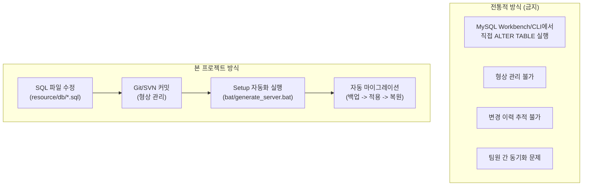
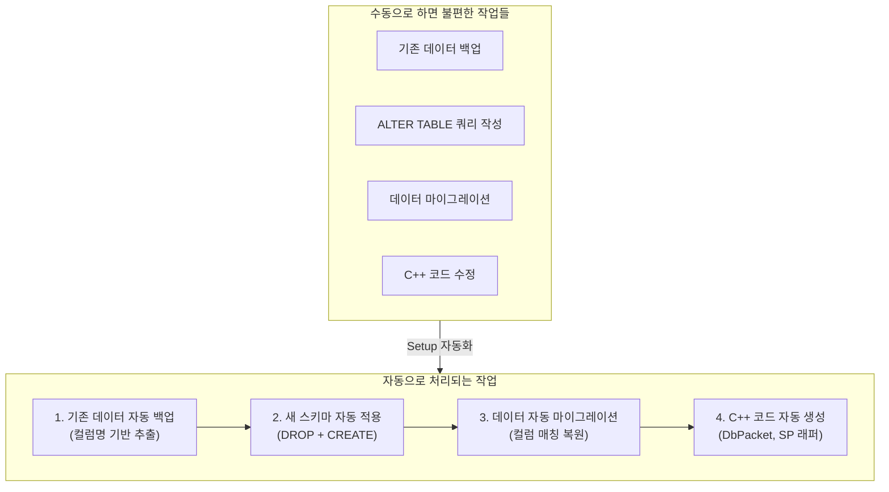

# 9. 효율적이고 투명한 DB Schema 형상 관리 자동화

작성자: 안명달 (mooondal@gmail.com)

## 개요

데이터를 생산하고 편집하는 직군은 엑셀을 가장 선호한다. 구글시트의 활용이 늘고 있지만 대규모 데이터 작업은 역시 엑셀이 편하다. 기획 데이터를 엑셀로 입력하고 DB화하여 관리하겠다는 목적의 구현이다.

프로그래머들이 데이터를 파싱하기 위한 코드, 데이터를 저장하고 원격지에 전달하기 위한 코드도 자동 생성된다.

MySQL에서 직접 스키마 수정 쿼리를 금지하고, 모든 스키마 변경을 SQL 파일로만 관리하여 Git/SVN으로 형상 히스토리를 관리한다. 이로 인한 불편함은 Setup 프로젝트의 자동화 기능으로 해결된다.



| 핵심 원칙 | 설명 |
|------|------|
| **직접 수정 금지** | MySQL에서 직접 스키마 수정 쿼리 실행 금지 (ALTER TABLE, CREATE TABLE 등) |
| **SQL 파일 관리** | 모든 스키마 정의를 SQL 파일로 관리 -> Git/SVN 버전 관리 |
| **자동화로 해결** | 불편함은 Setup 프로젝트의 자동 백업/마이그레이션/코드생성으로 해소 |
| **완벽한 추적** | 모든 변경 이력이 Git 커밋으로 남아 언제든 되돌리기 가능 |

## 주요 특징

| 특징 | 설명 |
|------|------|
| **직접 수정 금지** | MySQL에서 스키마 수정 쿼리 직접 실행 금지 |
| **SQL 파일 관리** | 모든 스키마를 SQL 파일로 관리 -> Git/SVN 버전 관리 |
| **자동 마이그레이션** | Setup이 백업/적용/복원을 자동 처리 |
| **자동 코드 생성** | DB 스키마 변경 시 C++ 코드 자동 생성 |
| **4개 DB 분리** | user, static, main, log DB 독립 관리 |

---

## DB 구조 및 배치 스크립트

```
resource/db/
├── user/           # 유저 데이터베이스
│   ├── table/      # 테이블 정의 (*.sql)
│   └── sp/         # 저장 프로시저 (*.sql)
├── static/         # 정적 데이터베이스 (게임 데이터)
│   ├── table/
│   └── sp/
├── main/           # 메인 서버 데이터베이스
│   ├── table/
│   └── sp/
└── log/            # 로그 데이터베이스
    ├── table/
    └── sp/
```

**배치 스크립트:**

```batch
# DB 자동화
bat/dbAutomation/db_to_cpp.bat      # DB -> C++ 코드 생성
bat/dbAutomation/db_to_sql.bat      # DB -> SQL 파일 역공학
bat/dbAutomation/sql_to_db_table.bat # SQL 테이블 -> DB 적용
bat/dbAutomation/sql_to_db_sp.bat    # SQL SP -> DB 적용

# DB 백업/복원
bat/dumpStaticDb/dumpStaticDb.bat   # 정적 DB 백업
bat/dumpStaticDb/restoreStaticDb.bat # 정적 DB 복원
bat/dumpUserDb/dumpUserDb.bat       # 유저 DB 백업
bat/dumpUserDb/restoreUserDb.bat    # 유저 DB 복원
bat/dumpMainDb/dumpMainDb.bat       # 메인 DB 백업
bat/dumpMainDb/restoreMainDb.bat    # 메인 DB 복원

# DB 초기화
bat/cleanUpDb/db_create_database.bat # 모든 DB 스키마 생성
bat/cleanUpDb/db_truncate_*.bat      # 각 DB 데이터 삭제
```

## Setup 자동화가 해결하는 불편함

**"SQL 파일만 수정할 수 있다"는 제약이 불편할 수 있지만, Setup 프로젝트가 모든 불편함을 자동으로 해결한다:**



### 자동 마이그레이션 원리

**스키마 변경 예시:** `c_user_id, c_name, c_level` -> `c_user_id, c_name, c_level, c_exp` (컬럼 추가)

| 단계 | 자동 처리 내용 |
|------|----------------|
| **1. 백업** | 기존 데이터를 컬럼명 기반으로 추출 (SELECT * INTO OUTFILE) |
| **2. 적용** | SQL 파일 기준으로 테이블 재생성 (DROP + CREATE) |
| **3. 복원** | 기존 컬럼은 그대로, 새 컬럼은 DEFAULT 값, 삭제된 컬럼은 무시 |
| **4. 코드 생성** | C++ DbPacket 클래스와 SP 래퍼 자동 생성 |

**장점:**
- **수동 작업 제로**: SQL 파일만 수정하면 나머지는 모두 자동
- **형상 관리**: Git으로 모든 변경 이력 추적, 언제든 되돌리기 가능
- **팀 협업**: 스키마 충돌을 Git 머지로 해결
- **환경 동기화**: 개발/스테이징/프로덕션 DB를 동일한 SQL 파일로 유지

## 개발 워크플로우

**핵심: MySQL에서 직접 수정하지 않고, SQL 파일만 수정한다.**

```
[금지] MySQL Workbench/CLI에서 ALTER TABLE 직접 실행
[올바른 방법]

1. resource/db/user/table/*.sql 파일 수정 (컬럼 추가/삭제/변경)
2. git add/commit으로 형상 관리
3. bat/generate_server.bat 실행
   └─ Setup 자동화가 모두 처리:
      ├─ 기존 DB 데이터 백업 (컬럼명 기반)
      ├─ 새 스키마 적용 (테이블 재생성)
      ├─ 데이터 마이그레이션 (컬럼 매칭 복원)
      └─ C++ DbPacket/SP 래퍼 코드 생성
4. 서버 빌드 및 테스트
```

**직접 수정 금지 이유**
- **형상 관리**: Git으로 모든 변경을 추적해야 팀 협업 가능
- **재현 가능**: 언제든 과거 시점의 DB 스키마로 되돌리기 가능
- **환경 동기화**: 개발/스테이징/프로덕션 DB를 동일하게 유지
- **자동화 연계**: SQL 파일 기준으로 C++ 코드가 자동 생성됨

## 테이블 정의 예시

```sql
-- resource/db/user/table/t_user_account.sql
DROP TABLE IF EXISTS `t_user_account`;

CREATE TABLE `t_user_account` (
    `c_account_seq` bigint unsigned NOT NULL AUTO_INCREMENT COMMENT 'type: AccountSeq',
    `c_user_id` varchar(64) NOT NULL COMMENT 'type: STRING',
    `c_create_date_utc` datetime NOT NULL COMMENT 'type: time_t',
    `c_last_login_date_utc` datetime DEFAULT NULL COMMENT 'type: time_t',
    PRIMARY KEY (`c_account_seq`),
    UNIQUE KEY `idx_user_id` (`c_user_id`)
) ENGINE=InnoDB DEFAULT CHARSET=utf8mb4;
```

---
