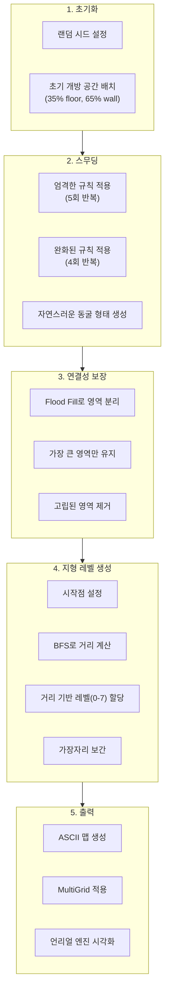
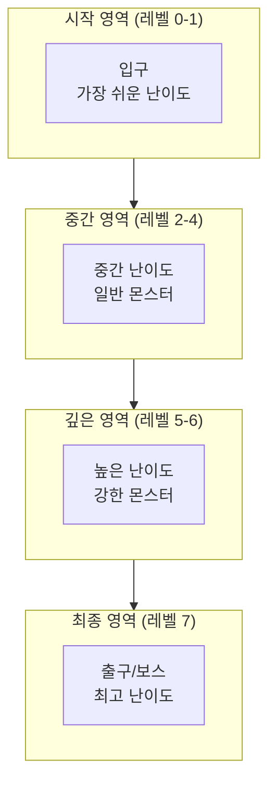
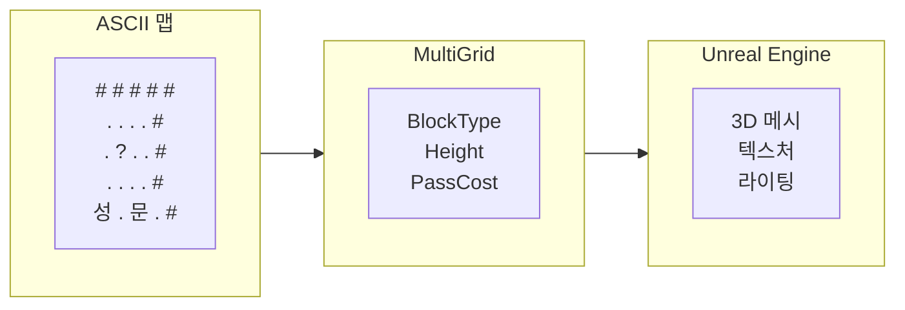
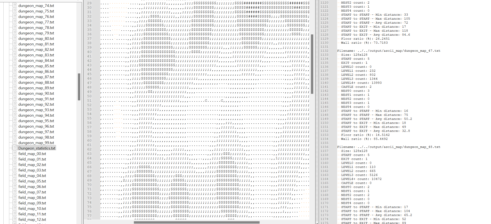
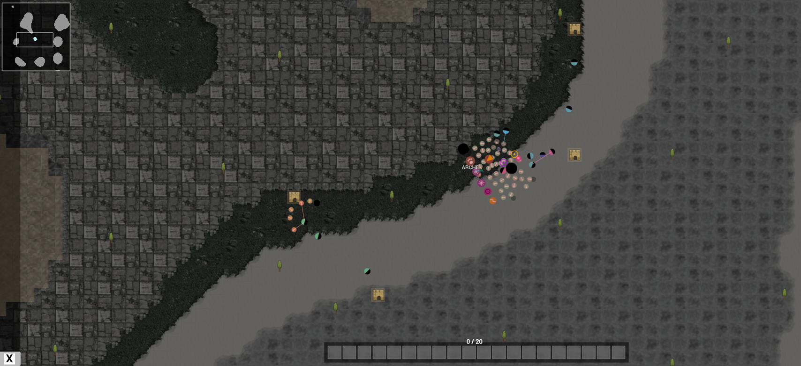

# 11. 실용적인 ASCII 던전 생성 시스템 - 절차적 던전 생성

작성자: 안명달 (mooondal@gmail.com)

## 개요

맵을 절차적 생성을 사용하면 시드값 하나로 무한한 변형을 만들 수 있고 로그라이크 장르에서 핵심이 되는 기술이다.
로그라이크 장르가 아닐지라도 프로토타이핑 단계에서 활용하기 좋고,실제 서비스 단계에서도 사용하게 된다면 리소스 관리 및 데이터 전송량에도 강점이 있다 (서버와 클라이언트가 동일한 맵 데이터를 공유해야 할 때, 시드값 하나로 커버될 수 있다던지..)
프로토타이핑 단계에서 편하게 다양한 요소를 실험하기 위해, 절차적 댕성 맵을 ASCII 문자로 표현하는 아이디어를 냈다. 
또한, 맵 생성 과정을 AI가 분석하고 필터링하여 품질 좋은 맵만 선별하는 것도 용이하다.

| 특징 | 설명 |
|------|------|
| **절차적 생성** | 시드값 기반으로 재현 가능한 던전 생성 |
| **ASCII 시각화** | 문자 기반 맵 표현으로 빠른 프로토타이핑 및 디버깅 지원 |
| **통합 맵 시스템** | Field Map과 Dungeon Map의 기능을 AsciiMap으로 통합 |
| **스무딩 알고리즘** | 반복적 규칙 적용으로 유기적인 동굴 형태 생성 |
| **지형 레벨** | 시작점으로부터 거리 기반 지형 레벨(0-7) 자동 생성 |
| **연결성 보장** | 가장 큰 동굴 영역만 유지하여 탐색 가능한 공간 보장 |

## 핵심 알고리즘

### 던전 생성기 구조

```cpp
// DungeonGridGenerator.h - 절차적 던전/동굴 맵 생성기
class DungeonGridGenerator : public GridGeneratorBase
{
private:
    /// 절차적 알고리즘을 사용하여 던전/동굴을 생성
    std::unique_ptr<AsciiMap> GenerateDungeon(OUT MultiGrid& multiGrid);
    
    /// 시작점에서의 거리에 따라 TerrainLevel을 생성
    void GenerateDistanceBasedTerrainLevels(
        AsciiMap& out, 
        const std::vector<std::pair<int, int>>& startPositions, 
        const std::pair<int, int>& exitPos
    );
    
    /// 가장자리로부터 거리에 따라 벽을 보간
    void ApplyBorderInterpolation(AsciiMap& out);
};
```

### 생성 단계



## 스무딩 규칙

### 엄격한 스무딩 (Strict Smoothing)
```
주변 8칸 중 벽이 5개 이상이면 -> 벽으로 변경
주변 8칸 중 바닥이 5개 이상이면 -> 바닥으로 변경
```
-> 작은 공간을 메우고 큰 공간을 유지

### 완화된 스무딩 (Relaxed Smoothing)
```
주변 8칸 중 벽이 4개 이상이면 -> 벽으로 유지
주변 8칸 중 바닥이 4개 이상이면 -> 바닥으로 유지
```
-> 자연스러운 동굴 형태 다듬기

## ASCII 맵 구조

### 통합 맵 클래스 (AsciiMap)

```cpp
// AsciiMap.h - ASCII 문자 기반 통합 맵 클래스
class AsciiMap
{
private:
    int mW = 0;  // 맵 너비
    int mH = 0;  // 맵 높이
    std::vector<wchar_t> mGrid;  // ASCII 문자 그리드 (size = mW * mH)
    
    MapKind mMapKind = MapKind::FIELD;  // FIELD 또는 DUNGEON
    std::optional<std::variant<FieldMapConfig, DungeonMapConfig>> mConfig;

public:
    // 맵 타입별 생성자
    explicit AsciiMap(const FieldMapConfig& config);
    explicit AsciiMap(const DungeonMapConfig& config);
    
    // 기본 인터페이스
    void Init(int w, int h, wchar_t fill);
    int Width() const noexcept;
    int Height() const noexcept;
    
    // 맵 타입 확인
    bool IsField() const noexcept;
    bool IsDungeon() const noexcept;
};
```

### ASCII 정의 시스템

```cpp
// AsciiDefinition.h - ASCII 문자 정의
struct MapAsciiDefinition
{
    wchar_t ascii;               // ASCII 문자 ('#', '.', '성', '문')
    std::wstring name;           // 이름 ("Wall", "Floor", "Castle")
    AsciiCategory category;      // TERRAIN, ENTITY, SPECIAL
    int terrainLevel;            // 지형 레벨 (0=가장 낮음, 7=가장 높음)
    GridCellBlockType blockType; // MultiGrid 통합용
};
```

**ASCII 카테고리:**
- **TerrainLevel**: 지형 레벨 (0-7) - Field와 Dungeon 공통
- **Npc**: 성, 둥지, NPC 등
- **Special**: 시작점, 출구, 문 등

## 던전 설정 구조

```cpp
// DungeonMapConfig.h - 던전 맵 설정
struct DungeonMapConfig
{
    // 맵 크기
    uint8_t mGridColCountFactor = 5;  // 32x32 그리드 (1 << 5 = 32)
    uint8_t mGridRowCountFactor = 5;  // 32x32 그리드 (1 << 5 = 32)
    
    // 동굴 생성 설정
    int caveInitialFloorPercent = 35;   // 초기 개방 공간 비율 (0-100)
    int caveSmoothingPasses = 5;        // 엄격한 스무딩 반복 횟수
    int caveRelaxedPasses = 4;          // 완화된 스무딩 반복 횟수
    bool caveEnsureConnected = true;    // 가장 큰 동굴 영역만 유지
    
    // 시드 값
    uint64_t mRandomSeed = 0;
};
```

## 지형 레벨 시스템

### 거리 기반 레벨 생성



**레벨 할당 알고리즘:**
1. **BFS(Breadth-First Search)**로 시작점으로부터 모든 셀까지의 최단 거리 계산
2. 거리를 0-7 범위로 정규화하여 지형 레벨 할당
3. 가장자리 보간으로 자연스러운 전이 생성

## 통합 시각화

### ASCII -> MultiGrid -> Unreal Engine



**변환 과정:**
1. **ASCII 문자** -> `MapAsciiDefinition` 조회
2. **TerrainLevel/BlockType** -> `MultiGrid` 셀 설정
3. **MultiGrid** -> 언리얼 엔진 3D 비주얼

## 장점

| 장점 | 설명 |
|------|------|
| **빠른 프로토타이핑** | ASCII 출력으로 알고리즘 검증 즉시 가능 |
| **재현 가능성** | 동일한 시드로 동일한 던전 재생성 |
| **자연스러운 형태** | 스무딩 알고리즘으로 유기적인 동굴 구조 생성 |
| **난이도 곡선** | 거리 기반 지형 레벨로 자연스러운 난이도 증가 |
| **연결성 보장** | 항상 탐색 가능한 공간만 생성 |
| **디버깅 용이** | 콘솔 출력만으로 맵 구조 확인 가능 |
| **무한 확장** | 시드값만으로 무한한 콘텐츠 생성 |
| **AI 연동** | 대량 생성 후 품질 분석 및 자동 선별 가능 |

## 던전 생성 결과 예시

### 생성 결과 시각화

던전 생성기는 **100개의 던전 맵과 필드 맵**을 자동 생성하며, 각 맵에 대한 **상세 통계 리포트**를 함께 출력한다.



**구성 요소:**

| 패널 | 설명 |
|------|------|
| **좌측 파일 목록** | 생성된 `dungeon_map_XX.txt`, `field_map_XX.txt` 파일들 |
| **중앙 ASCII 맵** | 128x128 크기의 던전 맵 (ASCII 문자로 지형 표현) |
| **우측 통계** | 각 맵별 지형 레벨 분포, 거리 통계, Floor/Wall 비율 |

### 클라이언트 게임 실제 활용



> **중요**: 개발 단계에서는 ASCII 문자로 맵을 시각화하지만, **실제 저장되는 데이터는 랜덤 시드 값 하나뿐**이다.

| 단계 | 데이터 | 설명 |
|------|--------|------|
| **저장** | `uint64_t seed = 12345` | 8바이트 시드값만 저장/전송 |
| **개발/디버깅** | ASCII 맵 (`.txt`) | 사람이 읽을 수 있는 형태로 시각화 |
| **클라이언트 게임** | 3D 타일맵 렌더링 | 동일한 시드로 실시간 생성 후 렌더링 |

**클라이언트 렌더링 흐름:**

```
시드값 -> 절차적 생성 -> AsciiMap -> MultiGrid -> 타일 텍스처 매핑 -> 게임 화면
```

- **좌측 미니맵**: ASCII 맵 구조를 축소하여 표시
- **메인 화면**: 각 ASCII 심볼이 실제 타일 텍스처로 변환되어 렌더링
- **엔티티 배치**: 성(`C`), 둥지(`N`), 시작점(`S`) 등이 게임 오브젝트로 스폰

따라서 **서버-클라이언트 간 맵 데이터 동기화 없이** 동일한 시드만 공유하면 양쪽에서 완전히 동일한 맵을 생성할 수 있다.

### 생성된 파일 구조

```
output/ascii_map/
├── dungeon_map_00.txt ~ dungeon_map_99.txt   # 100개의 던전 맵
├── field_map_00.txt ~ field_map_99.txt       # 100개의 필드 맵
└── Dungeon_statistics.txt                     # 전체 통계 리포트
```

### ASCII 심볼 정의

| 심볼 | 의미 | TerrainLevel |
|------|------|--------------|
| `.` | 바닥 레벨 0 (Floor Level 0) | 0 |
| `,` | 바닥 레벨 1 (Floor Level 1) | 1 |
| `;` | 바닥 레벨 2 (Floor Level 2) | 2 |
| `$` | 바닥 레벨 3 (Floor Level 3) | 3 |
| `S` | 바닥 레벨 4 (Floor Level 4) | 4 |
| `#` | 벽/높은 지형 (Wall) | 5+ |
| `C` | 성/캐슬 (Castle) | NPC |
| `0-9` | 시작점/출구 (Start/Exit) | Special |

### 통계 리포트 항목

| 항목 | 설명 |
|------|------|
| **Size** | 맵 크기 (Width x Height) |
| **START count** | 시작점 개수 (플레이어 스폰 위치) |
| **EXIT count** | 출구 개수 (던전 탈출 위치) |
| **LEVELn count** | 각 지형 레벨별 셀 개수 |
| **CASTLE count** | 성/보스 방 개수 |
| **NESTn count** | 둥지(몬스터 스폰 지역) 레벨별 개수 |
| **START to START distance** | 시작점 간 최소/최대/평균 거리 |
| **START to EXIT distance** | 시작점에서 출구까지 최소/최대/평균 거리 |
| **Floor ratio (%)** | 이동 가능 영역 비율 |
| **Wall ratio (%)** | 벽/장애물 비율 |

### 생성 품질 검증

통계 데이터를 통해 던전 품질을 자동 검증한다:

- **연결성 검증**: START to EXIT 거리가 유효한 범위 내인지 확인
- **난이도 곡선**: 지형 레벨 분포가 적절한지 확인
- **탐험 가치**: Floor ratio가 너무 낮거나 높지 않은지 확인
- **밸런스**: NEST 분포가 균일한지 확인

---

