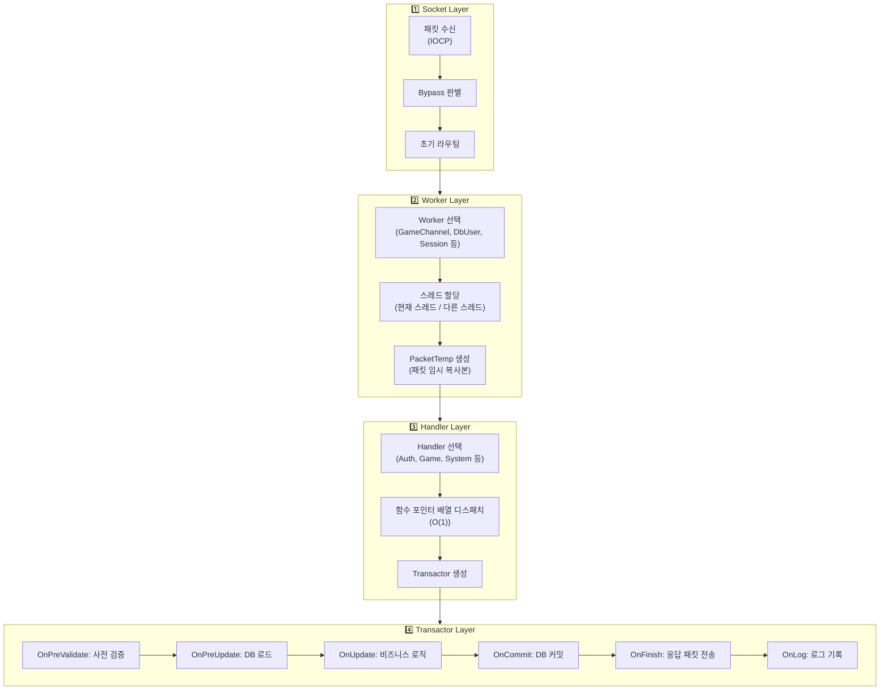
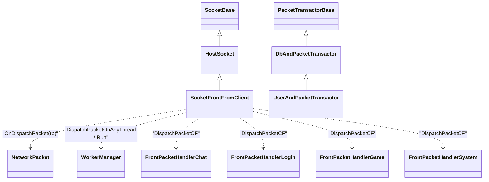
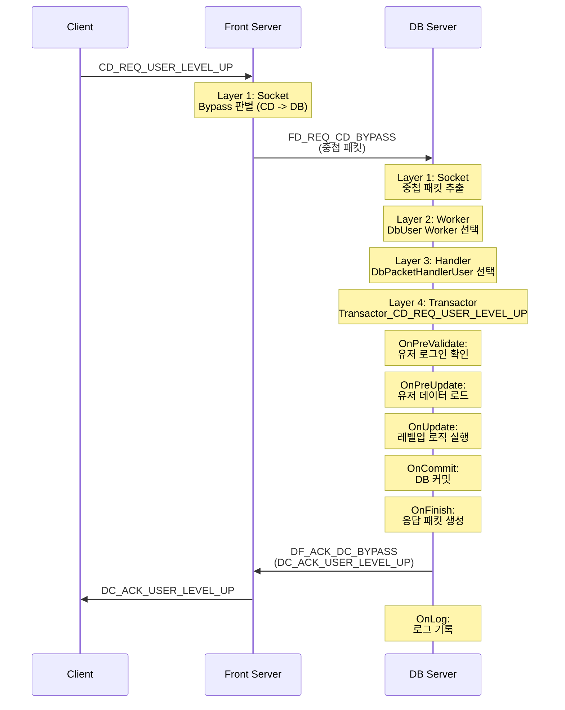

# 12. 패킷 처리 4단 레이어 아키텍처 - Socket -> Worker -> Handler -> Transactor

작성자: 안명달 (mooondal@gmail.com)

## 개요

멀티쓰래드로 분산하여 패킷 처리를 구현하다보면 너무 복잡해지고 버그가 발생하곤 한다. 패킷 처리를 할 때 일반적으로 필요한 공통 로직을 레이어로 구분하여 모음으로써 실수를 방지하고 생산성을 높이고자 시도했다. 

패킷 수신부터 비즈니스 로직 실행까지 4단계 레이어로 분리된 아키텍처이다. 각 레이어가 독립적인 책임을 가지며, Worker 시스템과 통합되어 고성능 비동기 처리를 제공한다.

| 레이어 | 책임 | 핵심 기능 |
|--------|------|----------|
| **1. Socket Layer** | 패킷 수신 및 라우팅 | Bypass 판별, 초기 라우팅 |
| **2. Worker Layer** | 실행 스레드/Worker 선택 | GameChannel, DbUser, Session Worker 할당 |
| **3. Handler Layer** | 패킷 타입별 핸들러 선택 | 함수 포인터 배열 기반 O(1) 디스패치 |
| **4. Transactor Layer** | 비즈니스 로직 + 트랜잭션 | OnPreValidate -> OnUpdate -> OnCommit -> OnFinish |

---

## 전체 흐름



---

## 클래스 다이어그램 (핵심 상속/협력 구조)



## Layer 1: Socket Layer - 패킷 수신 및 라우팅

### 역할
- IOCP에서 패킷 수신
- Bypass 패킷 여부 판별
- 목적지 서버로 라우팅 또는 자체 처리

### 코드 예시

```cpp
// SocketFrontFromClient.cpp - Front 서버에서 클라이언트 패킷 수신
bool SocketFrontFromClient::OnDispatchPacket(NetworkPacket& rp)
{
    // CM Bypass 처리 (Client -> Main)
    if ((PacketTypes::CM_PACKET_START < rp.GetPacketType()) &&
        (PacketTypes::CM_PACKET_END > rp.GetPacketType()))
    {
        OnDispatchPacketBypassCM(rp);  // Main 서버로 전달
        return true;
    }

    // CD Bypass 처리 (Client -> DB)
    if ((PacketTypes::CD_PACKET_START < rp.GetPacketType()) &&
        (PacketTypes::CD_PACKET_END > rp.GetPacketType()))
    {
        OnDispatchPacketBypassCD(rp);  // DB 서버로 전달
        return true;
    }

    // CG Bypass 처리 (Client -> Game)
    if ((PacketTypes::CG_PACKET_START < rp.GetPacketType()) &&
        (PacketTypes::CG_PACKET_END > rp.GetPacketType()))
    {
        OnDispatchPacketBypassCG(rp);  // Game 서버로 전달
        return true;
    }

    // 자체 처리 (Front 서버에서 직접 처리)
    DispatchPacket(rp);
    return true;
}
```

**특징:**
- **패킷 타입 범위**로 Bypass 여부 판별 (O(1))
- **중첩 패킷**을 목적지 서버로 직접 전달
- 자체 처리 패킷은 다음 레이어로 전달

---

## Layer 2: Worker Layer - 실행 스레드/Worker 선택

### 역할
- 패킷을 처리할 **Worker 선택** (GameChannel, DbUser, Session 등)
- **스레드 선택** (현재 스레드 / 특정 Worker 스레드 / 임의 스레드)
- **PacketTemp 생성** (패킷 임시 복사본으로 안전한 비동기 전달)

### 코드 예시

```cpp
// SocketGameToMain.cpp - Game 서버에서 Worker 선택
void SocketGameToMain::DispatchPacket(NetworkPacket& rp)
{
    const GameId gameId = rp.GetHeader().GetGameId();
    const GameChannelIndex gameChannelIndex = rp.GetHeader().GetGameChannelIndex();
    
    // GameChannel Worker로 디스패치
    if (INVALID_GAME_CHANNEL_INDEX != gameChannelIndex)
    {
        if (GameChannelPtr gameChannel = gGameChannelManager->GetGameChannel(gameChannelIndex))
        {
            // GameChannel의 Worker 스레드에서 실행
            PacketUtil::DispatchPacketOnWorker(
                gameChannel,  // Worker
                this,         // Socket
                &SocketGameToMain::DispatchPacket_async,  // Callback
                rp            // Packet
            );
        }
    }
    // 현재 스레드가 Worker 스레드가 아니면 임의 Worker에 디스패치
    else if (tThreadId == INVALID_THREAD_ID)
    {
        PacketUtil::DispatchPacketOnAnyThread(
            this,
            &SocketGameToMain::DispatchPacket_async,
            rp
        );
    }
    // 현재 스레드에서 바로 처리
    else
    {
        DispatchPacketToHandler(rp);
    }
}
```

**특징:**
- **Worker 기반 동시성**: 각 게임 채널/유저가 독립적인 Worker로 실행
- **스레드 안전성**: Worker는 단일 스레드 보장 (Lock 불필요)
- **PacketTemp**: 패킷 복사본으로 원본 버퍼 재사용 가능

### PacketUtil::DispatchPacketOnWorker 구현

```cpp
// ServerEnginePacketUtil.ixx
template <typename _Worker, typename _SocketType, typename _Function, typename... _Args>
void DispatchPacketOnWorker(
    std::shared_ptr<_Worker> workerPtr, 
    _SocketType* socket, 
    _Function&& function, 
    NetworkPacket& rp, 
    _Args&&... args
)
{
    SocketPtr<_SocketType> ptr(socket, L"DispatchPacketOnWorker");
    PacketTemp tp(rp);  // 패킷 임시 복사본 생성

    if (tThreadId == INVALID_THREAD_ID)
    {
        // IOCP 스레드 -> Worker 스레드 비동기 전달
        WorkerManager::RunAsyncForced(
            workerPtr, socket, 
            std::forward<_Function>(function), 
            ptr, tp, 
            std::forward<_Args>(args)...
        );
    }
    else
    {
        // 이미 Worker 스레드면 동기 실행
        WorkerManager::Run(
            workerPtr, socket, 
            std::forward<_Function>(function), 
            ptr, tp, 
            std::forward<_Args>(args)...
        );
    }
}
```

---

## Layer 3: Handler Layer - 패킷 타입별 핸들러 선택

### 역할
- 패킷 타입에 맞는 **Handler 선택** (Auth, Game, System 등)
- **함수 포인터 배열**로 O(1) 디스패치
- **Transactor 생성** 및 실행

### 코드 예시

```cpp
// SocketGameToMain.cpp - Handler 선택
void SocketGameToMain::DispatchPacketToHandler(NetworkPacket& rp)
{
    auto DispatchPacketToHandler = [this](auto handler, NetworkPacket& rp)
    {
        // MG 패킷 (Main -> Game) 처리
        if (DispatchPacketMG(mSocket, handler, rp, *this) != HandleResult::NOT_EXISTS) 
            return true;
        return false;
    };

    // Handler 순서대로 시도
    if (DispatchPacketToHandler(gGamePacketHandlerGame.get(), rp)) return;
    if (DispatchPacketToHandler(gGamePacketHandlerSystem.get(), rp)) return;

    // 기본 핸들러
    if (DispatchPacketMG<MainPeerSocket>(mSocket, this, rp) != HandleResult::NOT_EXISTS) 
        return;

    _DEBUG_LOG(RED, L"Unhandled packet: {}", GetPacketTypeString(rp.GetPacketType()));
}
```

### Handler 내부 (자동 생성 코드)

```cpp
// MainPacketHandlerGame.cpp - Transactor 생성 및 실행
HandleResult MainPacketHandlerGame::OnPacket(
    CM_REQ_GAME_LIST_OVER& rp, 
    SocketMainFromFront& socket
)
{
    // Transactor 생성
    Transactor_CM_REQ_GAME_LIST_OVER transactor(socket, rp);
    
    // 트랜잭션 실행
    transactor.Run();
    
    return HandleResult::SUCCEEDED;
}
```

**특징:**
- **함수 포인터 배열**: 패킷 타입 -> 핸들러 함수 (O(1), Setup Project가 자동 생성)
- **Handler 그룹화**: Auth, Game, System 등 도메인별 분리
- **Transactor 생성**: 패킷별 로직을 캡슐화한 Transactor 객체 생성

---

## Layer 4: Transactor Layer - 비즈니스 로직 + 트랜잭션

### 역할
- **비즈니스 로직** 실행
- **DB 트랜잭션** 관리 (Commit/Rollback)
- **응답 패킷** 전송
- **로그 기록**

### Transactor 실행 흐름

```cpp
// PacketTransactorBase.cpp - 트랜잭션 실행
void PacketTransactorBase::Run()
{
    // 1. 사전 검증
    mResult = OnPreValidate();
    if (HasError())
    {
        OnError();
        return;
    }
    
    // 2. 사전 갱신 (DB 로드 등)
    OnPreUpdate();

    // 3. 메인 로직 실행
    mResult = OnUpdate();
    if (HasError())
    {
        // 롤백
        if (!OnRollback())
        {
            _DEBUG_RED;  // 롤백 실패 - 심각한 오류
        }
        OnError();
        return;
    }

    // 4. DB 커밋
    if (!OnCommit())
    {
        _DEBUG_RED;  // 커밋 실패 - 심각한 오류
    }

    // 5. 완료 처리 (응답 패킷 전송)
    OnFinish();

    // 6. 로그 기록
    OnLog();
}
```

### Transactor 구현 예시

```cpp
// Transactor_CD_REQ_USER_LEVEL_UP.cpp - 레벨업 처리
class Transactor_CD_REQ_USER_LEVEL_UP : public UserAndPacketTransactor
{
public:
    Transactor_CD_REQ_USER_LEVEL_UP(
        DbUser& dbUser, 
        DbUserContext& userContext, 
        SocketDbFromFront& frontSocket,
        CD_REQ_USER_LEVEL_UP& rp
    );

protected:
    // 사전 검증
    Result OnPreValidate() override
    {
        // 유저 상태 확인
        if (!GetUserContext().IsLoggedIn())
            return Result::USER_NOT_LOGGED_IN;
        
        return Result::SUCCEEDED;
    }

    // 메인 로직
    Result OnUpdate() override
    {
        UserCacheAccessor& userCache = GetUserCache();
        
        // 레벨업 가능 여부 확인
        if (userCache.GetExp() < GetRequiredExp(userCache.GetLevel()))
            return Result::NOT_ENOUGH_EXP;
        
        // 레벨 증가
        userCache.SetLevel(userCache.GetLevel() + 1);
        userCache.SetExp(0);
        
        // DB에 저장 (UserAndPacketTransactor가 자동 커밋)
        GetUserDbSession()->Exec_sp_user_update(
            userCache.GetUserId(),
            userCache.GetLevel(),
            userCache.GetExp()
        );
        
        return Result::SUCCEEDED;
    }

    // 완료 처리 (응답 전송)
    void OnFinish() override
    {
        // 클라이언트에 응답
        DbSocketUtil::SendToClient<DC_ACK_USER_LEVEL_UP::Writer> wp(
            mFrontSocket, ACK, mRp, GetResult()
        );
        wp.SetValues(
            GetUserCacheDiffWp(),  // 변경된 유저 데이터
            GetUserCache().GetLevel(),
            GetUserCache().GetExp()
        );
    }

    // 에러 처리
    void OnError() override
    {
        // 에러 응답
        DbSocketUtil::SendToClient<DC_ACK_USER_LEVEL_UP::Writer> wp(
            mFrontSocket, ACK, mRp, GetResult()
        );
    }

    // 로그 기록
    void OnLog() override
    {
        // DB 로그 테이블에 레벨업 이력 기록
    }
};
```

### DB 트랜잭션 통합 (UserAndPacketTransactor)

```cpp
// UserAndPacketTransactor - DB 세션 + 유저 캐시 + 패킷 헤더 통합
class UserAndPacketTransactor : public DbAndPacketTransactor
{
private:
    DbUser& mDbUser;
    DbUserContext& mUserContext;
    UserCacheAccessor& mUserCacheAccessor;  // 유저 데이터 캐시
    UserCacheDiff& mUserCacheDiff;          // 변경사항 추적

protected:
    // Commit: DB 세션 커밋 + 유저 캐시 변경사항 적용
    bool OnCommit() override
    {
        bool result0 = mUserDbSession->Commit();
        bool result1 = mMainDbSession->Commit();
        
        // 캐시 변경사항 확정
        mUserCacheDiff.Apply(mUserCacheAccessor);
        
        return result0 && result1;
    }

    // Rollback: DB 세션 롤백 + 유저 캐시 변경사항 폐기
    bool OnRollback() override
    {
        bool result0 = mUserDbSession->Rollback();
        bool result1 = mMainDbSession->Rollback();
        
        // 캐시 변경사항 폐기
        mUserCacheDiff.Discard();
        
        return result0 && result1;
    }
};
```

---

## 장점

| 장점 | 설명 |
|------|------|
| **명확한 책임 분리** | 각 레이어가 독립적인 책임 (수신/라우팅/디스패치/로직) |
| **Worker 기반 동시성** | 채널/유저별 독립 스레드, Lock 불필요 |
| **트랜잭션 통합** | DB 트랜잭션 + 패킷 처리 + 응답 전송을 하나의 Transactor로 캡슐화 |
| **에러 처리 일관성** | OnError, OnRollback으로 실패 시나리오 명확화 |
| **코드 생성 연동** | Handler -> Transactor 생성 코드 자동 생성 |
| **테스트 용이성** | Transactor 단위로 비즈니스 로직 테스트 가능 |

---

## 패킷 처리 시퀀스 예시



---

