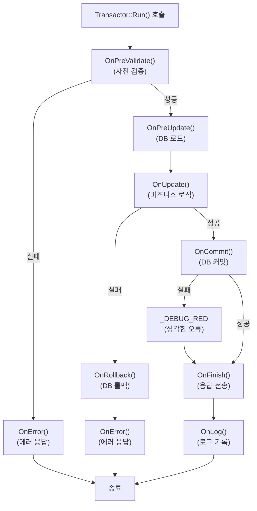
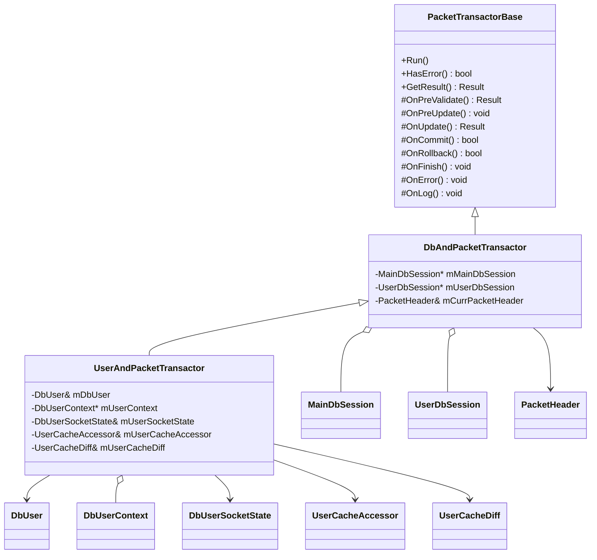

# 13. DB 트랜잭션과 패킷 처리의 통합

작성자: 안명달 (mooondal@gmail.com)

## 개요

Transactor 패턴은 DB 트랜잭션 + 패킷 처리 + 응답 전송 + 로그 기록을 하나의 객체로 캡슐화했다. 
에러 처리 일관성, 코드 재사용성이 높으며, Setup Project가 자동 생성하는 Handler 코드와 연동된다.

---

## 핵심 아이디어

### 기존 문제점
- 패킷 처리 함수가 **DB 트랜잭션 관리, 비즈니스 로직, 응답 전송, 에러 처리**를 모두 포함
- 에러 발생 시 **Rollback 누락** 위험
- 코드 중복 (Commit/Rollback 보일러플레이트)

### Transactor 패턴의 해결책
- **트랜잭션 생명주기**를 템플릿 메서드 패턴으로 관리
- **OnPreValidate -> OnUpdate -> OnCommit -> OnFinish** 단계별 훅
- **OnRollback 자동 호출** (에러 시)
- **OnLog 자동 호출** (완료 시)

---

## 트랜잭션 실행 흐름



---

## 클래스 다이어그램 (상속/소유 관계)



## PacketTransactorBase - 기본 클래스

### 핵심 구현

```cpp
// PacketTransactorBase.h - 트랜잭션 템플릿
class PacketTransactorBase
{
private:
    Result mResult = Result::SUCCEEDED;  // 실행 결과

public:
    // 트랜잭션 실행 (템플릿 메서드 패턴)
    void Run()
    {
        // 1. 사전 검증
        mResult = OnPreValidate();
        if (HasError())
        {
            OnError();
            return;
        }
        
        // 2. 사전 갱신 (DB 로드 등)
        OnPreUpdate();

        // 3. 메인 로직 실행
        mResult = OnUpdate();
        if (HasError())
        {
            // 롤백 자동 호출
            if (!OnRollback())
            {
                _DEBUG_RED;  // 롤백 실패 - 심각한 오류
            }
            OnError();
            return;
        }

        // 4. DB 커밋
        if (!OnCommit())
        {
            _DEBUG_RED;  // 커밋 실패 - 심각한 오류
        }

        // 5. 완료 처리 (응답 패킷 전송)
        OnFinish();

        // 6. 로그 기록
        OnLog();
    }

    // 에러 발생 여부 확인
    bool HasError() const { return (Result::SUCCEEDED != mResult); }
    
    // 실행 결과 조회
    const Result GetResult() const { return mResult; }

protected:
    // 파생 클래스에서 오버라이드할 훅 메서드들
    virtual Result OnPreValidate() { return Result::SUCCEEDED; }
    virtual void OnPreUpdate() {}
    virtual Result OnUpdate() { return Result::SUCCEEDED; }
    virtual bool OnCommit() { return true; }
    virtual bool OnRollback() { return true; }
    virtual void OnFinish() {}
    virtual void OnError() {}
    virtual void OnLog() {}
};
```

**특징:**
- **템플릿 메서드 패턴**: `Run()`이 트랜잭션 흐름 제어
- **에러 자동 처리**: `OnRollback()` 자동 호출
- **로그 자동 기록**: `OnLog()` 자동 호출
- **파생 클래스**: 비즈니스 로직만 구현 (OnUpdate)

---

## DbAndPacketTransactor - DB 트랜잭션 통합

### 역할
- **Main DB + User DB** 2개의 DB 세션 관리
- **Commit/Rollback** 자동 처리
- **패킷 헤더** 보관 (응답 패킷 생성 시 사용)

### 구현

```cpp
// DbAndPacketTransactor.h
class DbAndPacketTransactor : public PacketTransactorBase
{
private:
    std::shared_ptr<MainDbSession> mMainDbSession;  // Main DB 세션
    std::shared_ptr<UserDbSession> mUserDbSession;  // User DB 세션
    PacketHeader& mCurrPacketHeader;                // 패킷 헤더

public:
    explicit DbAndPacketTransactor(PacketHeader& packetHeader)
        :
        mMainDbSession(std::make_shared<MainDbSession>(CommitType::MANUAL)),
        mUserDbSession(std::make_shared<UserDbSession>(
            CommitType::MANUAL, 
            packetHeader.GetDbShardIdx()  // DB 샤드 인덱스
        )),
        mCurrPacketHeader(packetHeader)
    {
    }

protected:
    // 양쪽 DB 모두 Commit
    bool OnCommit() override
    {
        bool result0 = mUserDbSession->Commit();
        bool result1 = mMainDbSession->Commit();
        return result0 && result1;
    }

    // 양쪽 DB 모두 Rollback
    bool OnRollback() override
    {
        bool result0 = mUserDbSession->Rollback();
        bool result1 = mMainDbSession->Rollback();
        return result0 && result1;
    }

    // DB 세션 접근자
    std::shared_ptr<MainDbSession>& GetMainDbSession() { return mMainDbSession; }
    std::shared_ptr<UserDbSession>& GetUserDbSession() { return mUserDbSession; }
    PacketHeader& GetPacketHeader() { return mCurrPacketHeader; }
};
```

**특징:**
- **2개의 DB 세션**: Main DB + User DB (샤딩 지원)
- **자동 Commit/Rollback**: 양쪽 DB 동시 처리
- **Manual Commit**: 트랜잭션 제어권을 Transactor에게 위임

---

## UserAndPacketTransactor - 유저 캐시 통합

### 역할
- **DbUser, DbUserContext** 연동
- **UserCache** (인메모리 캐시) 관리
- **UserCacheDiff** (변경사항 추적) 자동 적용/폐기

### 구현

```cpp
// UserAndPacketTransactor.h
class UserAndPacketTransactor : public DbAndPacketTransactor
{
private:
    DbUser& mDbUser;
    std::shared_ptr<DbUserContext> mUserContext = nullptr;
    
    DbUserSocketState& mUserSocketState;    // 유저 소켓 상태
    UserCacheAccessor& mUserCacheAccessor;  // 유저 캐시 접근자
    UserCacheDiff& mUserCacheDiff;          // 변경사항 추적
    
    USER_CACHE_DIFF::Writer mUserCacheDiffWp;  // 응답 패킷용 diff

public:
    explicit UserAndPacketTransactor(
        DbUser& dbUser, 
        DbUserContext& userContext, 
        PacketHeader& packetHeader
    );

protected:
    // 사전 검증: 유저 로그인 상태 확인
    Result OnPreValidate() override
    {
        if (!mUserContext->IsLoggedIn())
            return Result::USER_NOT_LOGGED_IN;
        
        return Result::SUCCEEDED;
    }

    // 사전 갱신: 유저 캐시 로드
    void OnPreUpdate() override
    {
        // UserCacheDiff 시작 (변경사항 추적 시작)
        mUserCacheDiff.Begin();
    }

    // Commit: DB 커밋 + 캐시 변경사항 적용
    bool OnCommit() override
    {
        bool result = DbAndPacketTransactor::OnCommit();
        
        if (result)
        {
            // 캐시 변경사항 확정
            mUserCacheDiff.Apply(mUserCacheAccessor);
            
            // Diff Writer 생성 (클라이언트에 전송)
            mUserCacheDiffWp = mUserCacheDiff.MakeWriter();
        }
        
        return result;
    }

    // Rollback: DB 롤백 + 캐시 변경사항 폐기
    bool OnRollback() override
    {
        bool result = DbAndPacketTransactor::OnRollback();
        
        // 캐시 변경사항 폐기
        mUserCacheDiff.Discard();
        
        return result;
    }

    // 접근자
    DbUserContext& GetUserContext() { return *mUserContext; }
    UserCacheAccessor& GetUserCache() { return mUserCacheAccessor; }
    UserCacheDiff& GetUserCacheDiff() { return mUserCacheDiff; }
    const USER_CACHE_DIFF::Writer& GetUserCacheDiffWp() const { return mUserCacheDiffWp; }
};
```

**특징:**
- **UserCache + UserCacheDiff**: 인메모리 캐시 + 변경사항 추적
- **OnCommit**: DB 커밋 + 캐시 변경사항 적용
- **OnRollback**: DB 롤백 + 캐시 변경사항 폐기
- **Diff Writer**: 클라이언트에 변경된 데이터만 전송 (최적화)

---

## 실전 예시: 레벨업 Transactor

### 구현

```cpp
// Transactor_CD_REQ_USER_LEVEL_UP.h
class Transactor_CD_REQ_USER_LEVEL_UP : public UserAndPacketTransactor
{
private:
    SocketDbFromFront& mFrontSocket;  // 응답 전송용 소켓
    CD_REQ_USER_LEVEL_UP& mRp;        // 요청 패킷

public:
    Transactor_CD_REQ_USER_LEVEL_UP(
        DbUser& dbUser, 
        DbUserContext& userContext, 
        SocketDbFromFront& frontSocket,
        CD_REQ_USER_LEVEL_UP& rp
    )
        :
        UserAndPacketTransactor(dbUser, userContext, rp.GetHeader()),
        mFrontSocket(frontSocket),
        mRp(rp)
    {
    }

protected:
    // OnPreValidate, OnPreUpdate는 UserAndPacketTransactor가 자동 처리

    // 메인 로직: 레벨업 실행
    Result OnUpdate() override
    {
        UserCacheAccessor& userCache = GetUserCache();
        
        // 경험치 확인
        int32_t requiredExp = GetRequiredExp(userCache.GetLevel());
        if (userCache.GetExp() < requiredExp)
            return Result::NOT_ENOUGH_EXP;
        
        // 최대 레벨 확인
        if (userCache.GetLevel() >= MAX_LEVEL)
            return Result::MAX_LEVEL_REACHED;
        
        // 레벨 증가
        int32_t newLevel = userCache.GetLevel() + 1;
        int32_t newExp = userCache.GetExp() - requiredExp;
        
        userCache.SetLevel(newLevel);
        userCache.SetExp(newExp);
        
        // DB에 저장 (UserDbSession에 쿼리 추가)
        GetUserDbSession()->Exec_sp_user_update(
            userCache.GetUserId(),
            newLevel,
            newExp
        );
        
        // 아이템 보상 지급
        for (const auto& reward : GetLevelUpRewards(newLevel))
        {
            userCache.AddItem(reward.itemSid, reward.count);
        }
        
        return Result::SUCCEEDED;
    }

    // 완료 처리: 클라이언트에 응답 전송
    void OnFinish() override
    {
        // 성공 응답
        DbSocketUtil::SendToClient<DC_ACK_USER_LEVEL_UP::Writer> wp(
            mFrontSocket, ACK, mRp, GetResult()
        );
        
        wp.SetValues(
            GetUserCacheDiffWp(),  // 변경된 유저 데이터 (레벨, 경험치, 아이템 등)
            GetUserCache().GetLevel(),
            GetUserCache().GetExp()
        );
    }

    // 에러 처리: 에러 응답 전송
    void OnError() override
    {
        // 에러 응답 (diff 없음)
        DbSocketUtil::SendToClient<DC_ACK_USER_LEVEL_UP::Writer> wp(
            mFrontSocket, ACK, mRp, GetResult()
        );
        
        wp.SetValues(
            USER_CACHE_DIFF_WRITER(nullptr),  // diff 없음
            0,
            0
        );
    }

    // 로그 기록
    void OnLog() override
    {
        if (GetResult() == Result::SUCCEEDED)
        {
            // DB 로그 테이블에 레벨업 이력 기록
            GetMainDbSession()->Exec_sp_log_user_level_up(
                GetUserCache().GetUserId(),
                GetUserCache().GetLevel(),
                Clock::Now()
            );
        }
    }

private:
    // Helper 함수들
    int32_t GetRequiredExp(int32_t level) { /* ... */ }
    std::vector<ItemReward> GetLevelUpRewards(int32_t level) { /* ... */ }
};
```

**동작 흐름:**
1. **OnPreValidate** (UserAndPacketTransactor): 유저 로그인 확인
2. **OnPreUpdate** (UserAndPacketTransactor): UserCacheDiff 시작
3. **OnUpdate**: 레벨업 로직 실행 + DB 쿼리 추가
4. **OnCommit**: DB 커밋 + UserCache 변경사항 적용
5. **OnFinish**: 클라이언트에 응답 전송 (diff 포함)
6. **OnLog**: 로그 기록

---

## Handler 연동 (Setup Project 자동 생성)

### Handler에서 Transactor 호출

```cpp
// DbPacketHandlerUser.cpp - Setup Project가 자동 생성
HandleResult DbPacketHandlerUser::OnPacket(
    CD_REQ_USER_LEVEL_UP& rp, 
    SocketDbFromFront& socket
)
{
    // DbUser 조회
    DbUserPtr dbUser = gDbUserManager->GetDbUser(rp.GetHeader().GetUserId());
    if (!dbUser)
        return HandleResult::FAILED;
    
    // DbUserContext 조회
    DbUserContext& userContext = dbUser->GetUserContext();
    
    // Transactor 생성
    Transactor_CD_REQ_USER_LEVEL_UP transactor(
        *dbUser, 
        userContext, 
        socket, 
        rp
    );
    
    // 트랜잭션 실행
    transactor.Run();
    
    return HandleResult::SUCCEEDED;
}
```

**특징:**
- **Handler는 단순 라우팅**: DbUser 조회 + Transactor 생성 + Run() 호출
- **비즈니스 로직 캡슐화**: Transactor에 모든 로직 집중
- **Setup Project 자동 생성**: Handler 코드는 Excel에서 자동 생성

---

## 장점

| 장점 | 설명 |
|------|------|
| **ACID 보장** | Commit/Rollback 자동 호출로 트랜잭션 안전성 보장 |
| **에러 처리 일관성** | OnError, OnRollback 패턴 강제 |
| **코드 재사용** | 트랜잭션 흐름 제어 로직 재사용 (템플릿 메서드 패턴) |
| **DB + 캐시 통합** | DB 트랜잭션 + UserCache Diff 동기화 |
| **로그 자동 기록** | OnLog 자동 호출로 감사 로그 누락 방지 |
| **테스트 용이성** | Transactor 단위로 비즈니스 로직 테스트 가능 |
| **코드 생성 연동** | Handler는 자동 생성, Transactor만 수동 작성 |

---

## 실전 시나리오: 거래 트랜잭션

### 문제
- 플레이어 A가 플레이어 B에게 아이템 거래
- **양쪽 DB 모두 성공** 또는 **양쪽 모두 롤백** 필요

### 해결책

```cpp
// Transactor_CD_REQ_TRADE.cpp
class Transactor_CD_REQ_TRADE : public UserAndPacketTransactor
{
protected:
    Result OnUpdate() override
    {
        UserCacheAccessor& userA = GetUserCache();
        
        // 플레이어 B 캐시 로드 (교차 검증)
        UserCacheAccessor userB = LoadUserCache(mRp.Get_targetUserId());
        if (!userB.IsValid())
            return Result::USER_NOT_FOUND;
        
        // 플레이어 A: 아이템 제거
        if (!userA.HasItem(mRp.Get_itemSid(), mRp.Get_itemCount()))
            return Result::NOT_ENOUGH_ITEM;
        
        userA.RemoveItem(mRp.Get_itemSid(), mRp.Get_itemCount());
        
        // 플레이어 B: 아이템 추가
        userB.AddItem(mRp.Get_itemSid(), mRp.Get_itemCount());
        
        // 플레이어 A DB 업데이트
        GetUserDbSession()->Exec_sp_user_item_update(
            userA.GetUserId(),
            mRp.Get_itemSid(),
            userA.GetItemCount(mRp.Get_itemSid())
        );
        
        // 플레이어 B DB 업데이트
        GetUserDbSession()->Exec_sp_user_item_update(
            userB.GetUserId(),
            mRp.Get_itemSid(),
            userB.GetItemCount(mRp.Get_itemSid())
        );
        
        return Result::SUCCEEDED;
    }
    
    // OnCommit: 양쪽 UserCache 변경사항 모두 적용
    // OnRollback: 양쪽 UserCache 변경사항 모두 폐기
};
```

**보장:**
- **OnUpdate 실패 시**: OnRollback 자동 호출 -> 양쪽 DB 롤백 + 양쪽 캐시 폐기
- **OnCommit 실패 시**: 심각한 오류 로그 (_DEBUG_RED)
- **OnFinish**: 양쪽 플레이어에게 거래 결과 전송

---

