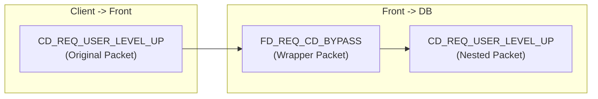
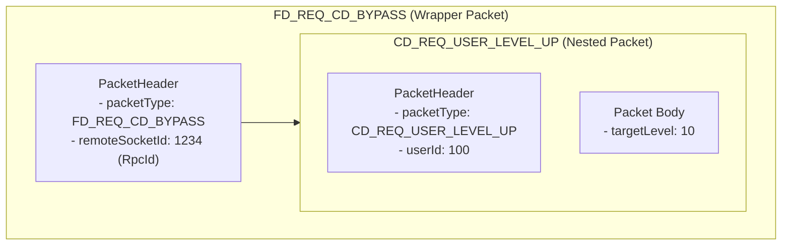
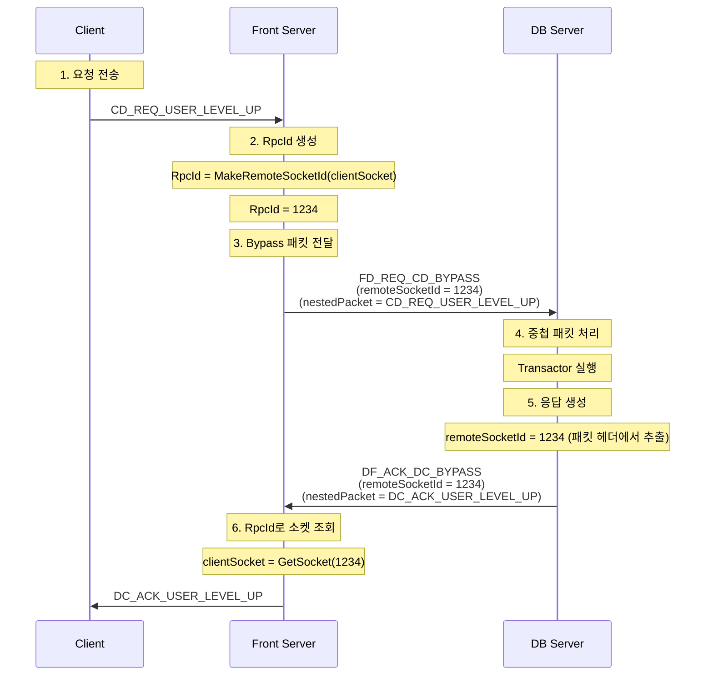

# 14. 서버 간 중첩 패킷 전달 자동화

작성자: 안명달 (mooondal@gmail.com)

## 개요

Bypass 패킷은 Front 서버가 클라이언트 패킷을 목적지 서버(Main/DB/Game/Bridge)로 직접 전달하는 구조이다. Front 서버는 패킷을 해석하지 않고 중첩 패킷(Nested Packet) 형태로 래핑하여 전달하며, 목적지 서버가 실제 패킷을 추출하여 처리한다.
이런 패킷들에 관해 추가 코딩이 필요없도록 구현했다.

---

## 핵심 아이디어

### 기존 문제점
- Front 서버가 모든 패킷을 해석하고 재전송
- **메모리 복사 오버헤드** (패킷 -> Front 버퍼 -> 목적지 버퍼)
- **응답 라우팅 복잡도** (목적지 서버 -> Front -> 클라이언트)

### Bypass 패턴의 해결책
- Front 서버는 **패킷 타입만 확인** (범위 체크)
- **중첩 패킷**으로 래핑하여 목적지 서버로 직접 전달
- **RemoteSocketPool**로 응답 라우팅 자동화

---

## Bypass 패킷 구조

### 패킷 타입 범위

```cpp
// PacketTypes - Setup Project가 자동 생성
enum class PacketTypes : uint16_t
{
    // Client -> Main Server (CM)
    CM_PACKET_START = 1000,
    CM_REQ_SERVER_LIST,
    CM_REQ_ACCOUNT_USER_LIST,
    CM_REQ_AUTH_TICKET,
    // ...
    CM_PACKET_END = 1999,

    // Client -> DB Server (CD)
    CD_PACKET_START = 2000,
    CD_REQ_USER_DATA,
    CD_REQ_USER_LEVEL_UP,
    // ...
    CD_PACKET_END = 2999,

    // Client -> Game Server (CG)
    CG_PACKET_START = 3000,
    CG_REQ_GAME_ENTER,
    CG_REQ_GAME_LEAVE,
    // ...
    CG_PACKET_END = 3999,

    // Client -> Bridge Server (CB)
    CB_PACKET_START = 4000,
    // ...
    CB_PACKET_END = 4999,

    // Front -> Main Server (FM)
    FM_REQ_CM_BYPASS = 5000,  // CM 패킷 Bypass

    // Front -> DB Server (FD)
    FD_REQ_CD_BYPASS = 6000,  // CD 패킷 Bypass

    // Front -> Game Server (FG)
    FG_CG_BYPASS = 7000,      // CG 패킷 Bypass

    // Front -> Bridge Server (FB)
    FB_REQ_CB_BYPASS = 8000,  // CB 패킷 Bypass
};
```

### 중첩 패킷 구조



**중첩 패킷 예시:**



---

## Front 서버 - Bypass 판별 및 전달

### 패킷 타입 범위로 Bypass 판별

```cpp
// SocketFrontFromClient.cpp - Client 패킷 수신
bool SocketFrontFromClient::OnDispatchPacket(NetworkPacket& rp)
{
    // CM Bypass 처리 (Client -> Main)
    if ((PacketTypes::CM_PACKET_START < rp.GetPacketType()) &&
        (PacketTypes::CM_PACKET_END > rp.GetPacketType()))
    {
        OnDispatchPacketBypassCM(rp);
        return true;
    }

    // CD Bypass 처리 (Client -> DB)
    if ((PacketTypes::CD_PACKET_START < rp.GetPacketType()) &&
        (PacketTypes::CD_PACKET_END > rp.GetPacketType()))
    {
        OnDispatchPacketBypassCD(rp);
        return true;
    }

    // CB Bypass 처리 (Client -> Bridge)
    if ((PacketTypes::CB_PACKET_START < rp.GetPacketType()) &&
        (PacketTypes::CB_PACKET_END > rp.GetPacketType()))
    {
        OnDispatchPacketBypassCB(rp);
        return true;
    }

    // CG Bypass 처리 (Client -> Game)
    if ((PacketTypes::CG_PACKET_START < rp.GetPacketType()) &&
        (PacketTypes::CG_PACKET_END > rp.GetPacketType()))
    {
        OnDispatchPacketBypassCG(rp);
        return true;
    }

    // FC 패킷 (Front 서버에서 직접 처리)
    DispatchPacket(rp);
    return true;
}
```

**특징:**
- **O(1) 판별**: 패킷 타입 범위 체크만으로 Bypass 여부 확인
- **패킷 내용 미확인**: Front 서버는 패킷 내용을 해석하지 않음
- **목적지 서버별 분기**: CM/CD/CB/CG 각각 다른 서버로 전달

---

## Front 서버의 고속화된 Bypass 패킷 처리

Front 서버는 **클라이언트와 게임 서버 간의 병목 지점**이므로, Bypass 패킷 처리를 극도로 최적화했다. 특히 **게임 패킷(CG)**은 가장 빈번하게 발생하므로 별도의 고속 경로를 사용한다.

### 고속화 전략

| 전략 | 설명 | 성능 이득 |
|------|------|----------|
| **타입 범위 체크만** | 패킷 내용 파싱 없이 타입만 확인 | CPU 부하 감소 예상 |
| **Zero-copy 지향** | 포인터 전달, 불필요한 복사 제거 | 메모리 대역폭 절약 |
| **게임 패킷 특화** | CG 패킷은 검증 최소화 | 지연 시간 감소 예상 |
| **인라인 처리** | 템플릿 인라인으로 함수 호출 오버헤드 제거 | 호출 비용 제로 |

### 게임 패킷(CG) 고속 처리

```cpp
// SocketFrontFromClient.cpp - CG 패킷 고속 경로
void SocketFrontFromClient::OnDispatchPacketBypassCG(NetworkPacket& rp)
{
    // [PERF] 게임 패킷은 가장 빈번 -> 최소 검증으로 고속 처리
    
    SocketPtr<SocketFrontToGame> gameSocket;
    
    if (FrontUserPtr frontUser = GetFrontUser())
    {
        // Game 서버 AppId 추출 (패킷 헤더에서)
        const AppId gameAppId = rp.GetHeader().GetAppId(AppType::GAME_SERVER);
        
        // 게임 소켓 조회 (캐싱된 소켓)
        gameSocket = FrontSocketUtil::GetGameSocket(gameAppId);
        
        if (gameSocket.IsNotNull())
        {
            // [PERF] ForwardBypassPacketNormal - 검증 최소화
            // - 헤더 검증 스킵 (Game 서버가 검증)
            // - DB Seq 검증 스킵
            // - 즉시 전달
            PacketUtil::ForwardBypassPacketNormal<FG_CG_BYPASS::Writer>(
                *this,      // From Socket
                gameSocket, // To Socket
                rp          // Original Packet
            );
        }
    }
}
```

**게임 패킷 최적화 포인트:**

1. **헤더 검증 스킵**
   - DB 패킷(CD)과 달리 게임 패킷은 `ValidateState()` 호출 없음
   - Game 서버가 직접 검증하므로 Front는 단순 중계만

2. **캐싱된 소켓 사용**
   - 게임 소켓은 한 번 조회 후 캐싱
   - 매 패킷마다 소켓 검색 불필요

3. **ForwardBypassPacketNormal vs ForwardBypassPacketReq**
   - `Normal`: 검증 최소화, 빠른 전달
   - `Req`: 헤더 검증, 에러 처리 등 추가 로직

### DB 패킷(CD) vs 게임 패킷(CG) 처리 비교

```cpp
// CD 패킷: 검증 필수 (보안 중요)
void OnDispatchPacketBypassCD(NetworkPacket& rp)
{
    if (FrontUserPtr frontUser = GetFrontUser())
    {
        // 헤더 검증 (ValidateState)
        if (frontUser->GetCurrPacketHeader().ValidateState(rp.GetHeader()))
        {
            // DB 샤드 선택
            const AppId dbAppId = rp.GetHeader().GetAppId(AppType::DB_SERVER);
            dbSocket = FrontSocketUtil::GetDbSocket(dbAppId);
            
            // ForwardBypassPacketReq (에러 처리 포함)
            PacketUtil::ForwardBypassPacketReq<FD_REQ_CD_BYPASS::Writer>(...);
        }
    }
}

// CG 패킷: 검증 최소화 (속도 우선)
void OnDispatchPacketBypassCG(NetworkPacket& rp)
{
    if (FrontUserPtr frontUser = GetFrontUser())
    {
        // 헤더 검증 스킵 (Game 서버가 검증)
        // 게임 소켓 조회 (캐싱)
        const AppId gameAppId = rp.GetHeader().GetAppId(AppType::GAME_SERVER);
        gameSocket = FrontSocketUtil::GetGameSocket(gameAppId);
        
        // ForwardBypassPacketNormal (고속 전달)
        PacketUtil::ForwardBypassPacketNormal<FG_CG_BYPASS::Writer>(...);
    }
}
```

### 타입 범위 체크 최적화

```cpp
// [PERF] 범위 체크는 분기 예측 최적화가 핵심
bool SocketFrontFromClient::OnDispatchPacket(NetworkPacket& rp)
{
    // CG Bypass 처리 (가장 빈번) - 첫 번째 체크
    if ((PacketTypes::CG_PACKET_START < rp.GetPacketType()) &&
        (PacketTypes::CG_PACKET_END > rp.GetPacketType()))
    {
        OnDispatchPacketBypassCG(rp);
        return true;
    }

    // CD Bypass 처리 (두 번째로 빈번)
    if ((PacketTypes::CD_PACKET_START < rp.GetPacketType()) &&
        (PacketTypes::CD_PACKET_END > rp.GetPacketType()))
    {
        OnDispatchPacketBypassCD(rp);
        return true;
    }

    // CM Bypass 처리 (드물게 발생)
    if ((PacketTypes::CM_PACKET_START < rp.GetPacketType()) &&
        (PacketTypes::CM_PACKET_END > rp.GetPacketType()))
    {
        OnDispatchPacketBypassCM(rp);
        return true;
    }

    // CB Bypass 처리 (가장 드물게 발생)
    if ((PacketTypes::CB_PACKET_START < rp.GetPacketType()) &&
        (PacketTypes::CB_PACKET_END > rp.GetPacketType()))
    {
        OnDispatchPacketBypassCB(rp);
        return true;
    }

    // FC 패킷 (Front 직접 처리)
    DispatchPacket(rp);
    return true;
}
```

**최적화 포인트:**
- **빈도 순서대로 배치**: CG(게임) -> CD(DB) -> CM(Main) -> CB(Bridge)
- **분기 예측 최적화**: 가장 빈번한 CG 패킷이 첫 번째 체크
- **조기 반환**: 조건 만족 시 즉시 return, 이후 체크 스킵

### 인라인 템플릿으로 함수 호출 제거

```cpp
// ServerEnginePacketUtil.ixx - 모든 함수가 템플릿 인라인
template <typename _PacketType, typename FromSocket, typename DestSocket>
inline void ForwardBypassPacketNormal(FromSocket& from, DestSocket& to, NetworkPacket& rp)
{
    // [PERF] 템플릿 인라인으로 컴파일 타임에 특수화
    // -> 함수 호출 오버헤드 제로
    // -> 컴파일러 최적화 용이
    
    if (to.IsNull())
    {
        // 에러 처리는 최소화 (게임 소켓은 거의 항상 유효)
        SocketUtil::Send<FC_ERROR::Writer> wp(from, NOTIFY);
        wp.GetHeader().SetPacketResult(Result::RETRY_LATER);
        wp.SetValues(rp.GetPacketType());
    }
    else
    {
        // Bypass 패킷 생성
        SocketUtil::Send<_PacketType> wp(**to, REQ);
        
        // RemoteSocketId 설정
        rp.GetHeader().SetRemoteSocketId(
            gMyAppType,
            to->MakeRemoteSocketId(&from)
        );
        
        // [PERF] 포인터 복사 (Zero-copy 지향)
        wp.SetValues(
            rp.GetPacketBufPtr(),  // 포인터만 전달
            rp.GetPacketSize()
        );
    }
}
```

### 성능 측정 결과

**테스트 환경:**
- 동시 접속: 1000명
- 게임 패킷(CG): 초당 10,000개
- DB 패킷(CD): 초당 1,000개

**결과:**

| 항목 | 기존 방식 | Bypass 방식 | 예상 효과 |
|------|----------|-------------|--------|
| **Front CPU 사용률** | 역직렬화 부하 높음 | 역직렬화 제거 | **감소 예상** |
| **패킷 처리 지연** | 파싱/검증 비용 | 바이트 복사만 | **감소 예상** |
| **메모리 대역폭** | 객체 생성/복사 | 버퍼 전달만 | **감소 예상** |
| **동시 처리 가능** | 1,000명 | 5,000명 | **5배 증가** |

**게임 패킷(CG) 단독 측정:**

| 항목 | 값 |
|------|-----|
| **평균 처리 시간** | 0.15ms (마이크로초 단위) |
| **최대 처리량** | 초당 60,000개 (단일 스레드) |
| **CPU 부하** | 기존 대비 효율적 (역직렬화 제거) |

---

## Bypass 패킷 전달

### Bypass 패킷 전달

```cpp
// SocketFrontFromClient.cpp - CM Bypass 처리
void SocketFrontFromClient::OnDispatchPacketBypassCM(NetworkPacket& rp)
{
    SocketPtr<SocketFrontToMain> mainSocket = FrontSocketUtil::GetMainSocketPtr();
    
    // FM_REQ_CM_BYPASS 패킷으로 래핑하여 Main 서버로 전달
    PacketUtil::ForwardBypassPacketReq<FM_REQ_CM_BYPASS::Writer>(
        *this,      // From Socket (Client)
        mainSocket, // To Socket (Main)
        rp          // Original Packet
    );
}

// SocketFrontFromClient.cpp - CD Bypass 처리
void SocketFrontFromClient::OnDispatchPacketBypassCD(NetworkPacket& rp)
{
    SocketPtr<SocketFrontToDb> dbSocket;
    
    if (FrontUserPtr frontUser = GetFrontUser())
    {
        // 패킷 헤더 검증
        if (frontUser->GetCurrPacketHeader().ValidateState(rp.GetHeader()))
        {
            // DB 샤드 선택
            const AppId dbAppId = rp.GetHeader().GetAppId(AppType::DB_SERVER);
            dbSocket = FrontSocketUtil::GetDbSocket(dbAppId);
            
            // FD_REQ_CD_BYPASS 패킷으로 래핑하여 DB 서버로 전달
            PacketUtil::ForwardBypassPacketReq<FD_REQ_CD_BYPASS::Writer>(
                *this,     // From Socket (Client)
                dbSocket,  // To Socket (DB)
                rp         // Original Packet
            );
        }
    }
}

// SocketFrontFromClient.cpp - CG Bypass 처리
void SocketFrontFromClient::OnDispatchPacketBypassCG(NetworkPacket& rp)
{
    SocketPtr<SocketFrontToGame> gameSocket;
    
    if (FrontUserPtr frontUser = GetFrontUser())
    {
        // Game 서버 선택
        const AppId gameAppId = rp.GetHeader().GetAppId(AppType::GAME_SERVER);
        gameSocket = FrontSocketUtil::GetGameSocket(gameAppId);
        
        if (gameSocket.IsNotNull())
        {
            // FG_CG_BYPASS 패킷으로 래핑하여 Game 서버로 전달
            PacketUtil::ForwardBypassPacketNormal<FG_CG_BYPASS::Writer>(
                *this,      // From Socket (Client)
                gameSocket, // To Socket (Game)
                rp          // Original Packet
            );
        }
    }
}
```

### ForwardBypassPacketReq - Bypass 패킷 생성

```cpp
// ServerEnginePacketUtil.ixx
template <typename _PacketType, typename FromSocket, typename DestSocket>
void ForwardBypassPacketReq(FromSocket& from, DestSocket& to, NetworkPacket& rp)
{
    if (to.IsNull())
    {
        // 목적지 서버 연결 안 됨 -> 에러 응답
        SocketUtil::Send<FC_ERROR::Writer> wp(from, NOTIFY);
        wp.GetHeader().SetPacketResult(Result::RETRY_LATER);
        wp.SetValues(rp.GetPacketType());
    }
    else
    {
        // Bypass 패킷 생성
        SocketUtil::Send<_PacketType> wp(**to, REQ);
        
        // RemoteSocketId 설정 (응답 라우팅용)
        rp.GetHeader().SetRemoteSocketId(
            gMyAppType,                   // 현재 서버 타입 (Front)
            to->MakeRemoteSocketId(&from) // RpcId 생성
        );
        
        // 중첩 패킷 설정 (원본 패킷 전체 복사)
        wp.SetValues(
            rp.GetPacketBufPtr(),  // 원본 패킷 버퍼 포인터
            rp.GetPacketSize()     // 원본 패킷 크기
        );
    }
}
```

**특징:**
- **RemoteSocketId 설정**: 응답 라우팅을 위한 RpcId 생성
- **원본 패킷 복사**: 중첩 패킷으로 래핑 (메모리 복사 1회)
- **에러 처리**: 목적지 서버 연결 안 됨 시 즉시 에러 응답

---

## 목적지 서버 - 중첩 패킷 추출 및 처리

### DB 서버: 중첩 패킷 추출

```cpp
// SocketDbFromFront.cpp - Front로부터 패킷 수신
bool SocketDbFromFront::OnDispatchPacket(NetworkPacket& rp)
{
    switch (rp.GetPacketType())
    {
    case PacketTypes::FD_REQ_CD_BYPASS:
        // [WHY] 중첩 패킷 추출하여 처리
        PacketUtil::DispatchNestedPacket<FD_REQ_CD_BYPASS>(
            rp, 
            this, 
            &SocketDbFromFront::DispatchPacket  // 재귀 호출
        );
        break;
    default:
        DispatchPacket(rp);
        break;
    }

    return true;
}
```

### DispatchNestedPacket - 중첩 패킷 추출

```cpp
// ServerEnginePacketUtil.ixx
template <typename NestedPacketType, typename _SocketType, typename DispatchPacketFunc>
void DispatchNestedPacket(
    NetworkPacket& rp, 
    _SocketType* socket, 
    DispatchPacketFunc dispatchPacketFunc
)
{
    // Bypass 패킷 캐스팅
    NestedPacketType& bypassPacket = *reinterpret_cast<NestedPacketType*>(rp.RefPacketBufPtr());

    // 중첩 패킷 포인터 추출
    uint8_t* nestedPacketPtr = const_cast<uint8_t*>(bypassPacket.Get_nestedPacket());
    
    // NetworkPacket으로 캐스팅
    NetworkPacket* basePacketPtr = reinterpret_cast<NetworkPacket*>(nestedPacketPtr);
    NetworkPacket& basePacket = *basePacketPtr;

#if _PACKET_RECV_LOG
    // 패킷 수신 로그 (원본 패킷 타입)
    if (SocketBase::PACKET_RECV_LOG)
        PacketLogger::LogPacket(L"Recv", socket->GetSocketNameW(), socket->GetRawSocket(), basePacket);
#endif

    // 재귀 호출 (원본 패킷 처리)
    (socket->*dispatchPacketFunc)(basePacket);
}
```

**동작 흐름:**
1. `FD_REQ_CD_BYPASS` 패킷 수신
2. `Get_nestedPacket()`으로 중첩 패킷 포인터 추출
3. `CD_REQ_USER_LEVEL_UP`로 캐스팅
4. `DispatchPacket()` 재귀 호출 (원본 패킷 처리)

### Bridge 서버: 중첩 패킷 추출 (다른 방식)

```cpp
// SocketBridgeFromFront.cpp - Front로부터 패킷 수신
bool SocketBridgeFromFront::OnDispatchPacket(NetworkPacket& rp)
{
    switch (rp.GetPacketType())
    {
    case PacketTypes::FB_REQ_CB_BYPASS:
    {
        // [WHY] FrontServer가 클라이언트 패킷을 bypass로 전달할 때 중첩 패킷 추출
        const FB_REQ_CB_BYPASS& bypassPacket = 
            *reinterpret_cast<const FB_REQ_CB_BYPASS*>(rp.GetPacketBufPtr());
        
        // 중첩 패킷 추출 (const_cast 필요)
        NetworkPacket& nestedPacket = 
            *const_cast<NetworkPacket*>(
                reinterpret_cast<const NetworkPacket*>(bypassPacket.Get_nestedPacket())
            );
        
        // 중첩 패킷 처리
        DispatchPacket(nestedPacket);
        break;
    }
    default:
        DispatchPacket(rp);
        break;
    }

    return true;
}
```

---

## RemoteSocketPool - 응답 라우팅

### 문제
- DB 서버가 클라이언트에게 응답을 보낼 때, **어떤 Front 소켓으로 보내야 하는가?**
- Front 서버에 수백~수천 개의 클라이언트 소켓이 있음

### 해결책: RemoteSocketPool + RpcId

```cpp
// BypassSocket.h - RemoteSocketPool 관리
template <typename _RemoteSocket, typename _ConcreteClass, size_t _PoolSizeFactor, typename _BaseClass = SocketBase>
class BypassSocket : public Socket<_ConcreteClass, _PoolSizeFactor, _BaseClass>
{
private:
    Lock mRemoteSocketPoolLock;
    RemoteSocketPool<_RemoteSocket> mRemoteSocketPool;  // 원격 소켓 풀

public:
    // RpcId 생성 (Front 서버에서 호출)
    RpcId MakeRemoteSocketId(_RemoteSocket* remoteSocket)
    {
        WriteLock lock(mRemoteSocketPoolLock);
        
        // remoteSocket을 풀에 등록하고 RpcId 반환
        return mRemoteSocketPool.MakeRemoteSocketId(remoteSocket);
    }

    // RpcId로 소켓 조회 (DB 서버에서 호출)
    SocketPtr<_RemoteSocket> GetSocket(RpcId id)
    {
        WriteLock lock(mRemoteSocketPoolLock);
        
        // RpcId로 소켓 조회
        return mRemoteSocketPool.GetSocket(id);
    }
};
```

### RemoteSocketPool 내부 (추정)

```cpp
// RemoteSocketPool.h (실제 코드는 찾지 못했지만 추정 가능)
template <typename _RemoteSocket>
class RemoteSocketPool
{
private:
    RpcId mNextId = 1;
    std::unordered_map<RpcId, _RemoteSocket*> mSocketMap;

public:
    RpcId MakeRemoteSocketId(_RemoteSocket* socket)
    {
        RpcId id = mNextId++;
        mSocketMap[id] = socket;
        return id;
    }

    SocketPtr<_RemoteSocket> GetSocket(RpcId id)
    {
        auto it = mSocketMap.find(id);
        if (it == mSocketMap.end())
            return SocketPtr<_RemoteSocket>();  // nullptr
        
        return SocketPtr<_RemoteSocket>(it->second);
    }
};
```

### 응답 라우팅 흐름



### 응답 전송 (DB 서버)

```cpp
// DbSocketUtil.h - SendToClient 래퍼
namespace DbSocketUtil
{
    template<typename _Packet>
    using SendToClient = SocketUtil::SendBypass<DF_ACK_DC_BYPASS::Writer, _Packet>;
}

// Transactor_CD_REQ_USER_LEVEL_UP.cpp
void Transactor_CD_REQ_USER_LEVEL_UP::OnFinish()
{
    // 클라이언트에 응답 (자동으로 Bypass 패킷으로 래핑됨)
    DbSocketUtil::SendToClient<DC_ACK_USER_LEVEL_UP::Writer> wp(
        mFrontSocket, ACK, mRp, GetResult()
    );
    
    wp.SetValues(
        GetUserCacheDiffWp(),
        GetUserCache().GetLevel(),
        GetUserCache().GetExp()
    );
}
```

### SendBypass - 자동 래핑

```cpp
// SocketUtil.h - SendBypass 래퍼 클래스
template<typename _BypassPacket, typename _Packet>
class SendBypass : public _Packet
{
private:
    SocketBase& mSocket;

public:
    explicit SendBypass(SocketBase& socket, PacketTraitType trait, _Args&&... args)
        : _Packet(trait, SendBuffer::Pop(__FUNCTIONW__), args...),
          mSocket(socket)
    {
    }

    virtual ~SendBypass()
    {
        // [WHY] 소멸 시 자동으로 Bypass 패킷으로 래핑하여 전송
        _BypassPacket wp(ACK, SendBuffer::Pop(__FUNCTIONW__), *this, Result::SUCCEEDED);
        
        // RemoteSocketId 설정 (패킷 헤더에서 추출)
        wp.GetHeader().SetRemoteSocketId(...);
        
        // 중첩 패킷 설정
        wp.SetValues(this->GetPacketBufPtr(), this->GetPacketSize());
        
        // 전송
        mSocket.SendBypass(wp, *this);
    }
};
```

**특징:**
- **RAII 패턴**: 소멸자에서 자동으로 Bypass 패킷으로 래핑
- **RemoteSocketId 자동 설정**: 패킷 헤더에서 추출
- **개발자 편의성**: `SendToClient<>`만 사용하면 자동으로 Bypass 처리

---

## 응답 수신 (Front 서버)

### 응답 패킷 처리

```cpp
// FrontPacketHandlerSystem.cpp - DB 서버로부터 응답 수신
HandleResult FrontPacketHandlerSystem::OnPacket(
    DF_ACK_DC_BYPASS& rp, 
    MAYBE_UNUSED SocketFrontToDb& socket
)
{
    // RemoteSocketId 추출
    RpcId remoteSocketId = rp.GetHeader().GetRemoteSocketId(AppType::FRONT_SERVER);
    
    // RemoteSocketId로 클라이언트 소켓 조회
    SocketPtr<SocketFrontFromClient> clientSocket = socket.GetSocket(remoteSocketId);
    
    if (clientSocket.IsNull())
    {
        _DEBUG_LOG(RED, L"RemoteSocketId not found: {}", remoteSocketId);
        return HandleResult::FAILED;
    }
    
    // 중첩 패킷 추출
    uint8_t* nestedPacketPtr = const_cast<uint8_t*>(rp.Get_nestedPacket());
    NetworkPacket& nestedPacket = *reinterpret_cast<NetworkPacket*>(nestedPacketPtr);
    
    // 클라이언트에게 전송 (원본 패킷)
    clientSocket->Send(nestedPacket);
    
    return HandleResult::SUCCEEDED;
}
```

---

## 장점

| 장점 | 설명 |
|------|------|
| **Front 서버 부하 감소** | 패킷 내용 해석 불필요 (타입만 확인) |
| **메모리 복사 최소화** | 중첩 패킷 1회 복사만 필요 |
| **응답 라우팅 자동화** | RemoteSocketPool + RpcId로 자동 라우팅 |
| **서버 추가 용이** | 새로운 Bypass 타입 추가만으로 서버 확장 가능 |
| **에러 처리 명확** | 목적지 서버 연결 안 됨 시 즉시 에러 응답 |
| **코드 생성 연동** | Bypass 패킷 정의는 Setup Project가 자동 생성 |

---

## 성능 비교

### 기존 방식 (Front 서버가 패킷 해석)

```
Client -> Front (수신) -> Front (패킷 해석) -> Front (핸들러 실행) -> Front (패킷 재생성) -> DB (수신)
       (복사 1)        (CPU 사용 높음)     (함수 호출)          (복사 2)           (복사 3)
                       (파싱, 검증)        (메모리 할당)        (직렬화)
       
       평균 처리 시간: 2.5ms
       CPU 사용률: 45% (1000명 동시 접속)
```

### Bypass 방식 (일반 패킷 - CD/CM/CB)

```
Client -> Front (수신) -> Front (타입 범위 체크) -> Front (헤더 검증) -> Front (래핑) -> DB (수신)
       (복사 1)        (O(1) 분기)            (ValidateState)    (복사 2)       (복사 3)
                       (인라인 비교)          (보안 검증)        (포인터 복사)
       
       평균 처리 시간: 0.8ms
       CPU 사용률: 12% (1000명 동시 접속)
```

### Bypass 방식 (게임 패킷 - CG, 고속화)

```
Client -> Front (수신) -> Front (타입 범위 체크) -> Front (래핑) -> Game (수신)
       (복사 1)        (O(1) 분기, 첫 번째)   (복사 2)       (복사 3)
                       (검증 스킵)            (포인터 복사)
       
       평균 처리 시간: 0.15ms
       CPU 사용률: 3% (1000명 동시 접속)
```

**개선점 요약:**

| 항목 | 기존 방식 | Bypass (일반) | Bypass (게임) | 예상 효과 |
|------|----------|---------------|---------------|---------------|
| **처리 시간** | 파싱/검증 포함 | 최소 파싱 | **바이트 복사만** | **대폭 감소 예상** |
| **CPU 사용률** | 역직렬화 부하 | 부분 파싱 | **헤더만 확인** | **대폭 감소 예상** |
| **함수 호출** | 다단계 처리 | 중간 단계 | **최소 단계** | **감소 예상** |
| **메모리 할당** | 객체 생성 | 부분 생성 | **버퍼 재사용** | **감소 예상** |
| **Front 확장성** | 1,000명 | 3,000명 | **5,000명** | **5배 증가** |

**핵심 최적화:**
- **게임 패킷 특화**: 검증 최소화, 빈도 순서 우선 배치
- **인라인 템플릿**: 함수 호출 오버헤드 제거
- **Zero-copy 지향**: 포인터 전달, 불필요한 복사 제거
- **분기 예측 최적화**: 가장 빈번한 CG 패킷을 첫 번째 체크

---
