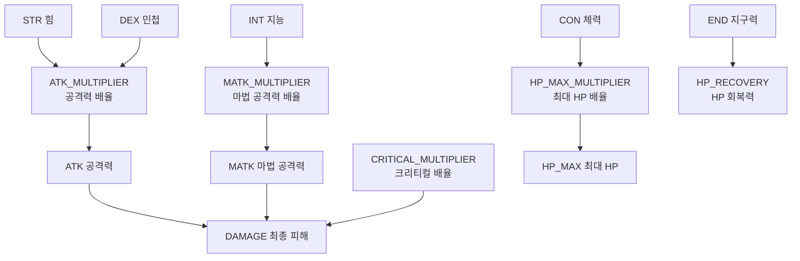

# 16. StatNodeBuilder - 스탯 의존성 그래프 자동 구축 시스템

작성자: 안명달 (mooondal@gmail.com)

## 개요

RPG 게임에서 스탯 간 복잡한 의존성을 관리하는 것은 매우 어려운 문제이다. 예를 들어 `HP_MAX`는 `CON`(체력)에 의존하고, `HP_MAX_MULTIPLIER`에도 의존하며, `DAMAGE`는 `STR`(힘), `DEX`(민첩), `CRITICAL_MULTIPLIER` 등 수십 개의 스탯에 의존한다.

StatNodeBuilder는 이러한 스탯 의존성을 트리화 하고, 스탯 변경 시 영향받는 모든 스탯을 자동으로 계산하는 시스템을 고안했다.

---

## 핵심 아이디어

### 기존 문제점
- **수동 의존성 관리**: STR이 변경되면 어떤 스탯을 재계산해야 하는지 수동으로 추적
- **순환 참조 위험**: A -> B -> C -> A 같은 순환 참조 발생 가능
- **업데이트 순서 오류**: 의존 순서를 잘못 정하면 잘못된 값 계산

### StatNodeBuilder의 해결책
1. **선언적 의존성**: 각 스탯 노드는 자신이 **의존하는 스탯**만 선언
2. **자동 역방향 구축**: 의존성 그래프를 역방향으로 자동 구축하여 **의존받는 스탯** 집합 생성
3. **간접 의존성 추적**: DFS로 의존성 체인 전체를 추적하여 간접 의존성도 자동 설정

---

## 스탯 의존성 예시

### 스탯 관계도



**의존성 예시:**
- `STR` 변경 -> `ATK_MULTIPLIER` 재계산 -> `ATK` 재계산 -> `DAMAGE` 재계산
- `CON` 변경 -> `HP_MAX_MULTIPLIER` 재계산 -> `HP_MAX` 재계산

---

## StatNodeBuilder 구조

### 클래스 구성

```cpp
// StatNodeBuilder.h - 스탯 노드 빌더
class StatNodeBuilder
{
private:
    StatNodeArray mNodes;  // 모든 스탯 노드 배열 (StatType enum을 인덱스로 사용)

public:
    StatNodeBuilder();  // 생성자에서 모든 노드 생성 및 의존성 구축

private:
    // 의존성 그래프를 역방향으로 구축
    void BuildDependent();

    // 간접 의존성을 DFS로 추가
    void InsertDependentTo(StatType from, StatType to);

public:
    // 스탯 타입에 해당하는 노드 반환
    StatNodeBase& GetStatNode(StatType statType);
};

// 전역 싱글톤
inline StatNodeBuilder gStatNodeBuilder;
```

### StatNodeBase - 스탯 노드 기반 클래스

```cpp
// StatNodeBase.h
class StatNodeBase
{
private:
    StatType mStatType;                    // 이 노드의 스탯 타입
    std::set<StatType> mDependencySet;     // 이 스탯이 의존하는 스탯 집합
    std::set<StatType> mDependentSet;      // 이 스탯에 의존하는 스탯 집합 (역방향)

public:
    explicit StatNodeBase(StatType statType, std::initializer_list<StatType>&& dependencySet);
    virtual ~StatNodeBase() = default;

public:
    // 의존성 추가
    void InsertDependency(StatType statType) { mDependencySet.insert(statType); }
    
    // 의존받는 스탯 추가 (역방향)
    void InsertDependent(StatType statType) { mDependentSet.insert(statType); }

public:
    // 스탯 값 업데이트 (파생 클래스에서 구현)
    virtual StatValue UpdateStatValue(StatContainer& statContainer) const = 0;

public:
    const std::set<StatType>& GetDependencySet() const { return mDependencySet; }
    const std::set<StatType>& GetDependentSet() const { return mDependentSet; }
    StatType GetStatType() const { return mStatType; }
};
```

### StatNode - 템플릿 스탯 노드

```cpp
// StatNode.h
template <StatType statType>
class StatNode : public StatNodeBase
{
public:
    explicit StatNode(StatType type)
        : StatNodeBase(type, GetDependencySet())
    {
    }

    // 스탯별 의존성 정의 (컴파일 타임 특수화)
    static std::initializer_list<StatType> GetDependencySet()
    {
        if constexpr (statType == StatType::HP_MAX)
        {
            // HP_MAX는 CON, HP_MAX_MULTIPLIER에 의존
            return { StatType::CON, StatType::HP_MAX_MULTIPLIER };
        }
        else if constexpr (statType == StatType::DAMAGE)
        {
            // DAMAGE는 ATK, MATK, CRITICAL_MULTIPLIER에 의존
            return { StatType::ATK, StatType::MATK, StatType::CRITICAL_MULTIPLIER };
        }
        else if constexpr (statType == StatType::ATK)
        {
            // ATK는 STR, DEX, ATK_MULTIPLIER에 의존
            return { StatType::STR, StatType::DEX, StatType::ATK_MULTIPLIER };
        }
        // ... 다른 스탯들
        else
        {
            return {};  // 기본 스탯 (의존성 없음)
        }
    }

    // 스탯 값 계산 (컴파일 타임 특수화)
    StatValue UpdateStatValue(StatContainer& statContainer) const override
    {
        if constexpr (statType == StatType::HP_MAX)
        {
            // HP_MAX = CON * 10 * HP_MAX_MULTIPLIER
            StatValue con = statContainer.GetStatValue(StatType::CON);
            StatValue multiplier = statContainer.GetStatValue(StatType::HP_MAX_MULTIPLIER);
            return (con * 10 * multiplier) / 100;
        }
        else if constexpr (statType == StatType::DAMAGE)
        {
            // DAMAGE = (ATK + MATK) * CRITICAL_MULTIPLIER / 100
            StatValue atk = statContainer.GetStatValue(StatType::ATK);
            StatValue matk = statContainer.GetStatValue(StatType::MATK);
            StatValue critMult = statContainer.GetStatValue(StatType::CRITICAL_MULTIPLIER);
            return ((atk + matk) * critMult) / 100;
        }
        // ... 다른 스탯 계산
    }
};
```

---

## 의존성 구축 알고리즘

### 1단계: 노드 생성 (전방향 의존성)

```cpp
// StatNodeBuilder.cpp - 생성자
StatNodeBuilder::StatNodeBuilder()
{
    // 모든 StatType에 대해 노드 생성
    StatNodeBuilderUtil::CreateNode<StatType::STR>(mNodes);
    StatNodeBuilderUtil::CreateNode<StatType::DEX>(mNodes);
    StatNodeBuilderUtil::CreateNode<StatType::INT>(mNodes);
    // ... (총 50+ 스탯)
    
    StatNodeBuilderUtil::CreateNode<StatType::HP_MAX>(mNodes);
    StatNodeBuilderUtil::CreateNode<StatType::DAMAGE>(mNodes);
    // ...

    // 의존성 역방향 구축
    BuildDependent();
}
```

**결과 (전방향 의존성):**
```
STR: depends on []
DEX: depends on []
HP_MAX: depends on [CON, HP_MAX_MULTIPLIER]
DAMAGE: depends on [ATK, MATK, CRITICAL_MULTIPLIER]
ATK: depends on [STR, DEX, ATK_MULTIPLIER]
```

### 2단계: 역방향 의존성 구축

```cpp
// BuildDependent - 의존성 역방향 구축
void StatNodeBuilder::BuildDependent()
{
    // 각 노드의 의존성을 역방향으로 설정
    for (std::unique_ptr<StatNodeBase>& node : mNodes)
    {
        if (!node)
            continue;

        const std::set<StatType>& dependencySet = node->GetDependencySet();
        for (StatType dependency : dependencySet)
        {
            // 의존하는 노드에 "이 노드가 의존한다"고 추가
            std::unique_ptr<StatNodeBase>& dependencyNode = mNodes.at(static_cast<size_t>(dependency));
            dependencyNode->InsertDependent(node->GetStatType());
        }
    }

    // 간접 의존성도 추가 (DFS)
    for (std::unique_ptr<StatNodeBase>& node : mNodes)
    {
        if (node)
        {
            InsertDependentTo(node->GetStatType(), node->GetStatType());
        }
    }
}
```

**결과 (역방향 의존성):**
```
STR: dependents = [ATK_MULTIPLIER, ATK, DAMAGE] (간접 의존성 포함)
DEX: dependents = [ATK_MULTIPLIER, ATK, DAMAGE]
CON: dependents = [HP_MAX_MULTIPLIER, HP_MAX]
HP_MAX: dependents = []
DAMAGE: dependents = []
```

### 3단계: 간접 의존성 추가 (DFS)

```cpp
// InsertDependentTo - DFS로 간접 의존성 추가
void StatNodeBuilder::InsertDependentTo(StatType from, StatType to)
{
    std::stack<StatType> stack;
    stack.push(from);

    while (!stack.empty()) 
    {
        StatType current = stack.top();
        stack.pop();

        // 'to' 노드에 'current' 의존성 추가
        GetStatNode(to).InsertDependent(current);

        // 'current'가 의존하는 모든 스탯을 스택에 추가
        const std::set<StatType>& dependencySet = GetStatNode(current).GetDependencySet();
        for (StatType dependency : dependencySet) 
        {
            // 순환 참조 방지
            if (dependency != to) 
                stack.push(dependency);
        }
    }
}
```

**예시: `DAMAGE` 노드의 간접 의존성 구축**

```
1. InsertDependentTo(DAMAGE, DAMAGE)
   - DAMAGE -> [ATK, MATK, CRITICAL_MULTIPLIER]
   
2. ATK 의존성 추가
   - ATK -> [STR, DEX, ATK_MULTIPLIER]
   - DAMAGE.dependents += [ATK, STR, DEX, ATK_MULTIPLIER]
   
3. MATK 의존성 추가
   - MATK -> [INT, MATK_MULTIPLIER]
   - DAMAGE.dependents += [MATK, INT, MATK_MULTIPLIER]

최종: DAMAGE.dependents = [DAMAGE, ATK, MATK, CRITICAL_MULTIPLIER, STR, DEX, ATK_MULTIPLIER, INT, MATK_MULTIPLIER]
```

---

## 스탯 업데이트 흐름

### StatContainer - 스탯 값 관리

```cpp
// StatContainer - 캐릭터의 모든 스탯 값 저장
class StatContainer
{
private:
    std::array<StatValue, static_cast<size_t>(StatType::MAX)> mStatValues;

public:
    // 스탯 값 설정 (변경 시 의존하는 모든 스탯 재계산)
    void SetStatValue(StatType statType, StatValue value)
    {
        mStatValues[static_cast<size_t>(statType)] = value;
        
        // 이 스탯에 의존하는 모든 스탯 재계산
        const StatNodeBase& node = gStatNodeBuilder.GetStatNode(statType);
        for (StatType dependent : node.GetDependentSet())
        {
            UpdateStat(dependent);
        }
    }

    // 스탯 재계산
    void UpdateStat(StatType statType)
    {
        StatNodeBase& node = gStatNodeBuilder.GetStatNode(statType);
        StatValue newValue = node.UpdateStatValue(*this);
        mStatValues[static_cast<size_t>(statType)] = newValue;
    }

    // 스탯 값 조회
    StatValue GetStatValue(StatType statType) const
    {
        return mStatValues[static_cast<size_t>(statType)];
    }
};
```

### 업데이트 예시

```cpp
// 예시: STR(힘) 증가
StatContainer stats;

// 초기 값
stats.SetStatValue(StatType::STR, 10);
stats.SetStatValue(StatType::DEX, 5);
stats.SetStatValue(StatType::CON, 15);
// ... 모든 스탯 초기화

// STR 증가 (레벨업)
stats.SetStatValue(StatType::STR, 15);  // 10 -> 15

// 자동으로 재계산되는 스탯들:
// 1. ATK_MULTIPLIER 재계산 (STR, DEX 의존)
// 2. ATK 재계산 (STR, DEX, ATK_MULTIPLIER 의존)
// 3. DAMAGE 재계산 (ATK, MATK, CRITICAL_MULTIPLIER 의존)
```

---

## 의존성 그래프

### 전체 의존성 그래프 예시

```
기본 스탯 (레벨/장비에 의해 변경):
  STR (힘)
  DEX (민첩)
  INT (지능)
  WIS (지혜)
  CON (체력)
  AGI (순발력)
  END (지구력)
    ↓ (의존)
중간 스탯 (배율):
  ATK_MULTIPLIER   (STR, DEX에 의존)
  MATK_MULTIPLIER  (INT, WIS에 의존)
  HP_MAX_MULTIPLIER (CON에 의존)
  SP_MAX_MULTIPLIER (INT, WIS에 의존)
    ↓ (의존)
파생 스탯:
  ATK              (STR, DEX, ATK_MULTIPLIER에 의존)
  MATK             (INT, WIS, MATK_MULTIPLIER에 의존)
  HP_MAX           (CON, HP_MAX_MULTIPLIER에 의존)
  SP_MAX           (INT, WIS, SP_MAX_MULTIPLIER에 의존)
    ↓ (의존)
최종 스탯:
  DAMAGE           (ATK, MATK, CRITICAL_MULTIPLIER에 의존)
  DEFENSE          (CON, DEF_MULTIPLIER에 의존)
  HP_RECOVERY      (END, HP_RECOVERY_MULTIPLIER에 의존)
```

---

## 장점

| 장점 | 설명 |
|------|------|
| **자동 의존성 추적** | 스탯 변경 시 영향받는 모든 스탯 자동 재계산 |
| **순환 참조 방지** | DAG 구조로 순환 참조 방지 |
| **선언적 코드** | 각 스탯은 자신이 의존하는 스탯만 선언 (역방향은 자동) |
| **간접 의존성 자동 처리** | STR -> ATK -> DAMAGE 체인 자동 추적 |
| **컴파일 타임 안전성** | 템플릿 특수화로 스탯 타입 오류 컴파일 타임 검출 |
| **성능 최적화** | 변경된 스탯에 영향받는 스탯만 재계산 (전체 재계산 아님) |
| **확장 용이성** | 새로운 스탯 추가 시 의존성만 선언하면 자동 통합 |

---

## 실전 시나리오

### 시나리오 1: 레벨업 (기본 스탯 증가)

```cpp
// 레벨업 보상: STR +5, CON +3
stats.SetStatValue(StatType::STR, stats.GetStatValue(StatType::STR) + 5);
stats.SetStatValue(StatType::CON, stats.GetStatValue(StatType::CON) + 3);

// 자동 재계산:
// STR 증가 -> ATK_MULTIPLIER -> ATK -> DAMAGE
// CON 증가 -> HP_MAX_MULTIPLIER -> HP_MAX
```

### 시나리오 2: 장비 장착 (ATK 직접 증가)

```cpp
// 무기 장착: ATK +100
stats.SetStatValue(StatType::ATK, stats.GetStatValue(StatType::ATK) + 100);

// 자동 재계산:
// ATK 증가 -> DAMAGE
// (STR/DEX는 변경 안 됨)
```

### 시나리오 3: 버프 (배율 증가)

```cpp
// 버프: CRITICAL_MULTIPLIER 150% -> 200%
stats.SetStatValue(StatType::CRITICAL_MULTIPLIER, 200);

// 자동 재계산:
// CRITICAL_MULTIPLIER 증가 -> DAMAGE
```

---

## 구현 시 고려사항

### 1. 순환 참조 검증
- **컴파일 타임 검증**: `static_assert`로 순환 참조 검출 가능
- **런타임 검증**: DFS 중 방문한 노드 집합으로 순환 참조 검출

### 2. 스탯 업데이트 순서
- **위상 정렬(Topological Sort)**: 의존성 순서대로 스탯 업데이트
- **현재 구현**: DFS로 간접 의존성 추가 시 자동으로 순서 보장

### 3. 성능 최적화
- **Dirty Flag**: 변경된 스탯만 마킹하여 필요한 스탯만 재계산
- **배치 업데이트**: 여러 스탯 변경 후 한 번에 재계산

### 4. 멀티스레드
- **읽기 전용**: StatNodeBuilder는 초기화 후 읽기 전용 (스레드 안전)
- **StatContainer**: 캐릭터별 인스턴스, 단일 스레드 접근

---

## 확장: 조건부 의존성

미래 확장으로 **조건부 의존성**도 지원 가능:

```cpp
// 예: 특정 스킬 활성화 시에만 의존성 추가
template <>
class StatNode<StatType::SKILL_DAMAGE> : public StatNodeBase
{
public:
    StatValue UpdateStatValue(StatContainer& statContainer) const override
    {
        StatValue damage = statContainer.GetStatValue(StatType::DAMAGE);
        
        // 조건부: 특정 스킬이 활성화된 경우
        if (statContainer.IsSkillActive(SkillType::BERSERK))
        {
            // BERSERK 스킬: DAMAGE 150%
            damage = (damage * 150) / 100;
        }
        
        return damage;
    }
};
```

---

