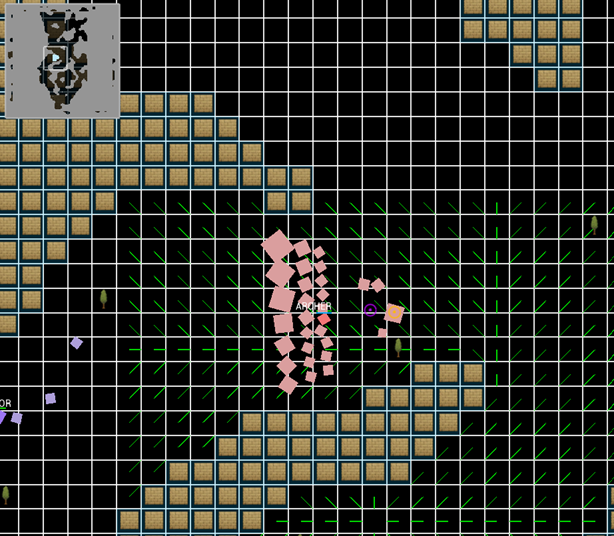
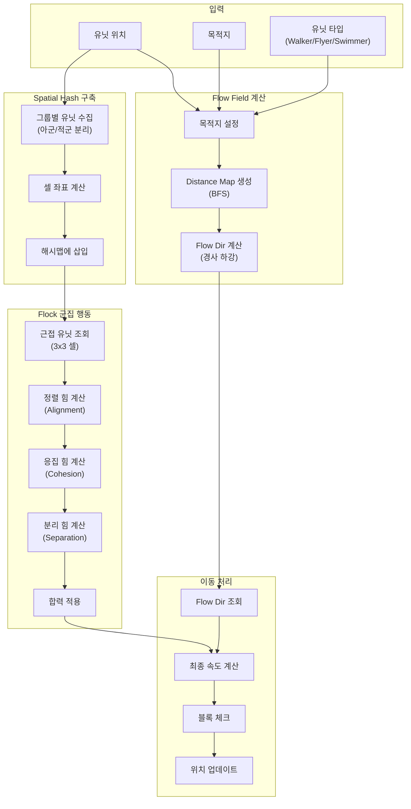
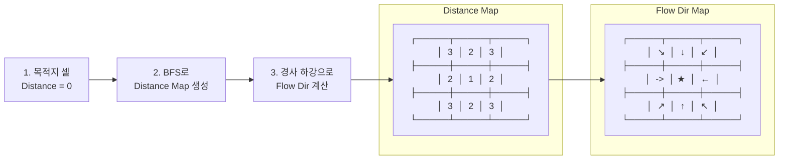
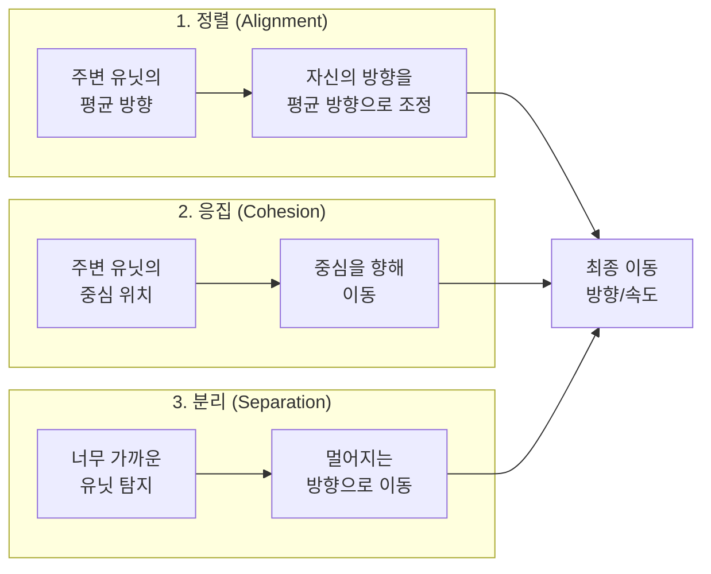

# 17. Grid 군집 길찾기 - Flow Field + Spatial Hash 기반 대규모 유닛 이동

작성자: 안명달 (mooondal@gmail.com)

## 개요

MMORPG에서 수백~수천 개의 유닛이 동시에 이동하고, 군집(Flock)을 이루며 협동 이동하는 시스템은 매우 복잡하다. 개별 A* 길찾기는 O(N²) 복잡도로 성능 문제가 발생하며, 군집 행동은 상호 간섭과 충돌 처리가 어렵다.

본 시스템은 Flow Field(흐름장) 길찾기, Spatial Hash 기반 근접 탐지, Flock 군집 행동을 결합하여 수천 개의 유닛을 O(N) 복잡도로 처리하는 고성능 군집 이동 시스템이다.

큰 맵을 쿼드트리화 하고, 레벨에 따라 해상도를 달리하여 A* 길차기를 한다. 마지막 단계에서는 Flow Field를 통해 군집 길찾기를 유도하는 방식이다.

### 실제 동작 화면



**구성 요소:**

| 요소 | 설명 |
|------|------|
| **좌측 상단 미니맵** | 전체 맵의 ASCII 레이아웃 (던전 구조) |
| **파란색 그리드** | 이동 가능한 바닥 영역 |
| **베이지색 타일** | 벽/장애물 영역 |
| **분홍색 유닛 군집** | Flow Field를 따라 이동 중인 다수의 유닛 (Flock 행동) |
| **초록색 화살표** | Flow Field 방향 벡터 (목적지를 향한 흐름) |
| **보라색 마커** | 시작점/출구 위치 |

**핵심 포인트:**
- 수십 개의 유닛이 **동일한 Flow Field를 공유**하며 자연스럽게 이동
- 각 유닛은 **개별 A* 계산 없이** O(1)로 방향 조회
- **Flock 행동**으로 서로 겹치지 않고 유기적으로 군집 형성

---

## 핵심 기술

### 1. Flow Field 길찾기
- **사전 계산된 방향 맵**: 목적지까지의 방향을 그리드에 미리 계산
- **O(1) 길찾기**: 각 유닛은 현재 위치의 방향만 조회
- **대규모 유닛 지원**: 수천 개 유닛이 동일한 Flow Field 공유

### 2. Spatial Hash 근접 탐지
- **O(1) 근접 유닛 조회**: 셀 기반 해시로 근접 유닛 즉시 조회
- **그룹별 격리**: 아군/적군 별도 해시로 불필요한 검사 제거
- **메모리 효율**: 동적 해시맵으로 유닛 분포에 따라 메모리 사용

### 3. Flock 군집 행동
- **3가지 힘**: 정렬(Alignment), 응집(Cohesion), 분리(Separation)
- **자연스러운 변동**: 시간/EntityId 기반 사인파로 유기적 움직임
- **충돌 회피**: 근접 유닛과의 충돌 자동 회피

### 4. MultiGrid 계층 충돌
- **유닛 타입별 Grid**: Walker(보행), Flyer(비행), Swimmer(수영) 별도 충돌 맵
- **LOD 기반 A***: 장거리는 저해상도, 근거리는 고해상도 길찾기
- **블록 탈출**: 블록된 셀에서 나선형 탐색으로 탈출

---

## 시스템 아키텍처



---

## Flow Field 길찾기

### 개념

**Flow Field**는 맵의 각 셀에 "목적지 방향"을 저장한 **방향 맵**이다. 유닛은 A* 같은 복잡한 계산 없이 **현재 셀의 방향만 따라가면** 목적지에 도달한다.

### Flow Field 생성 알고리즘



### 코드 구현

```cpp
// Grid.cpp - Flow Dir 계산
std::pair<GridFlowMode, GridFlowDir> Grid::CalcFlowDir(int64_t fromU, int64_t fromV, int64_t toU, int64_t toV)
{
    // 목적지 청크 계산
    const int64_t chunkU = toU >> GRID_FLOW_CHUNK_MAP_SIZE_BIT;
    const int64_t chunkV = toV >> GRID_FLOW_CHUNK_MAP_SIZE_BIT;
    
    // Flow Chunk 조회
    const FlowChunk* flowChunk = mFlowChunkBuilder->GetFlowChunk(chunkU, chunkV);
    if (!flowChunk)
        return std::make_pair(GRID_FLOW_MODE_INACESSIBLE, GRID_FLOW_NONE);
    
    // 청크 내 로컬 좌표 계산
    const int64_t localU = toU - (chunkU << GRID_FLOW_CHUNK_MAP_SIZE_BIT);
    const int64_t localV = toV - (chunkV << GRID_FLOW_CHUNK_MAP_SIZE_BIT);
    
    // Distance Map에서 목적지 거리 조회
    const uint16_t toDistance = flowChunk->GetDistance(static_cast<GridCol>(localU), static_cast<GridRow>(localV));
    if (toDistance >= GRID_FLOW_DISTANCE_LIMIT)
        return std::make_pair(GRID_FLOW_MODE_INACESSIBLE, GRID_FLOW_NONE);
    
    // 현재 위치 로컬 좌표
    const int64_t fromLocalU = fromU - (chunkU << GRID_FLOW_CHUNK_MAP_SIZE_BIT);
    const int64_t fromLocalV = fromV - (chunkV << GRID_FLOW_CHUNK_MAP_SIZE_BIT);
    
    // Flow Dir 조회 (경사 하강 방향)
    const GridFlowDir flowDir = flowChunk->GetFlowDir(
        static_cast<GridCol>(fromLocalU), 
        static_cast<GridRow>(fromLocalV)
    );
    
    return std::make_pair(GRID_FLOW_MODE_ACCESSIBLE, flowDir);
}
```

### Flow Dir 적용

```cpp
// PhysicsUtil.h - 유닛 이동
Scalar targetX, targetY;
MultiGrid& grid = RefMultiGrid();

// Flow Dir 조회 (O(1))
const auto [flowMode, flowDir] = grid.CalcFlowDirByPos(
    position.x, position.y,   // 현재 위치
    targetCenterX, targetCenterY,  // 목적지
    moverType                  // 유닛 타입 (Walker/Flyer/Swimmer)
);

if (flowMode == GRID_FLOW_MODE_ACCESSIBLE)
{
    // Flow Dir에 따라 목표 위치 설정
    targetX = position.x + FlowDirToVector(flowDir).x * CELL_SIZE;
    targetY = position.y + FlowDirToVector(flowDir).y * CELL_SIZE;
}
```

---

## Spatial Hash 근접 탐지

### 개념

**Spatial Hash**는 월드를 **동일 크기 셀**로 나누고, 각 셀에 속한 유닛을 **해시맵**에 저장한다. 근접 유닛 조회는 **O(1)**로 가능하며, 전체 유닛 검사(O(N²))를 피할 수 있다.

### Spatial Hash 구조

```
월드 공간:
┌─────────┬─────────┬─────────┬─────────┐
│  (0,0)  │  (1,0)  │  (2,0)  │  (3,0)  │
│  A, B   │    C    │         │    D    │
├─────────┼─────────┼─────────┼─────────┤
│  (0,1)  │  (1,1)  │  (2,1)  │  (3,1)  │
│    E    │  F, G   │    H    │         │
└─────────┴─────────┴─────────┴─────────┘

해시맵:
{
  (0,0): [A, B],
  (1,0): [C],
  (3,0): [D],
  (0,1): [E],
  (1,1): [F, G],
  (2,1): [H]
}
```

### 구현

```cpp
// DetectionSystemFlock.cpp - Spatial Hash 구축
void DetectionSystemFlock::Update()
{
    // ========== 1단계: 초기화 ==========
    const Scalar detectionRangeSq = MathUtil::Pow(DebugInfo::DETECTION_DISTANCE);
    
    // 셀 크기 = 탐지 거리
    mCellSize = DebugInfo::DETECTION_DISTANCE;
    if (mCellSize <= 0)
        mCellSize = 1;
    
    // 그룹별 Spatial Hash 초기화
    mGroupSpatialHash.clear();
    mGroupEntityBuffer.clear();
    
    // ========== 2단계: 모든 엔티티 수집 및 Spatial Hash에 삽입 ==========
    for (EntityIdp entityIdp : Data())
    {
        DetectionComponentFlock& t = GetComponent<DetectionComponentFlock>(entityIdp.first);
        t.Clear();
        
        const PositionComponent& p = GetComponent<PositionComponent>(entityIdp.first);
        
        // 피아 구분 키 생성 (같은 그룹 = 같은 무리)
        size_t groupKey = 0;
        if (const PcComponent* pc = TryGetComponent<PcComponent>(entityIdp))
        {
            // 플레이어: WorldUserId로 그룹 구분
            groupKey = static_cast<size_t>(static_cast<uint16_t>(pc->worldUserId));
        }
        else if (const NpcComponent* npc = TryGetComponent<NpcComponent>(entityIdp))
        {
            // NPC: SpawnerId로 그룹 구분
            groupKey = (static_cast<size_t>(static_cast<uint16_t>(npc->spawnerIdp.first)) << 16) |
                static_cast<uint16_t>(npc->spawnerIdp.second);
            groupKey |= (1ull << 32);
        }
        else
        {
            continue;
        }
        
        EntityIdSortElem elem{ entityIdp, p.x, p.y };
        
        // 그룹 엔티티 버퍼에 추가
        mGroupEntityBuffer[groupKey].push_back(elem);
        
        // 그룹별 Spatial Hash에 삽입
        const int32_t cx = ToCellCoord(p.x, mCellSize);
        const int32_t cy = ToCellCoord(p.y, mCellSize);
        const uint64_t cellKey = MakeCellKey(cx, cy);
        mGroupSpatialHash[groupKey][cellKey].push_back(elem);
    }
    
    // ========== 3단계: 근접 유닛 탐지 및 Flock 업데이트 ==========
    // (다음 섹션 참조)
}

// 헬퍼 함수
int32_t ToCellCoord(Scalar worldCoord, Scalar cellSize)
{
    return static_cast<int32_t>(worldCoord / cellSize);
}

uint64_t MakeCellKey(int32_t cx, int32_t cy)
{
    return (static_cast<uint64_t>(static_cast<uint32_t>(cx)) << 32) | 
           static_cast<uint64_t>(static_cast<uint32_t>(cy));
}
```

### 근접 유닛 조회

```cpp
// 3x3 셀 근접 유닛 조회
std::vector<EntityIdSortElem> nearbyEntities;

for (int32_t dy = -1; dy <= 1; ++dy)
{
    for (int32_t dx = -1; dx <= 1; ++dx)
    {
        const int32_t neighborCx = cx + dx;
        const int32_t neighborCy = cy + dy;
        const uint64_t neighborCellKey = MakeCellKey(neighborCx, neighborCy);
        
        // 해당 셀의 엔티티 조회
        auto it = mGroupSpatialHash[groupKey].find(neighborCellKey);
        if (it != mGroupSpatialHash[groupKey].end())
        {
            for (const EntityIdSortElem& elem : it->second)
            {
                // 거리 체크
                Scalar dx = elem.x - p.x;
                Scalar dy = elem.y - p.y;
                Scalar distSq = dx * dx + dy * dy;
                
                if (distSq <= detectionRangeSq)
                {
                    nearbyEntities.push_back(elem);
                }
            }
        }
    }
}
```

---

## Flock 군집 행동

### 3가지 힘



### 구현

```cpp
// FormationSystemFlock.cpp - Flock 군집 행동
void FormationSystemFlock::Update()
{
    const TimeStep stepNow = GetStepCountNow();
    
    for (EntityIdp entityIdp : Data())
    {
        PositionComponent& position0 = GetComponent<PositionComponent>(entityIdp.first);
        PhysicsComponent& physics0 = GetComponent<PhysicsComponent>(entityIdp.first);
        DetectionComponentFlock& t0 = GetComponent<DetectionComponentFlock>(entityIdp.first);
        
        // 근접 유닛 조회 (Spatial Hash에서 이미 계산됨)
        const Entity* nearbyEntity = GetEntity(t0.e);
        if (!nearbyEntity)
            continue;
        
        PositionComponent* position1 = TryGetComponent<PositionComponent>(*nearbyEntity);
        PhysicsComponent* physics1 = TryGetComponent<PhysicsComponent>(*nearbyEntity);
        
        if (!position1 || !physics1)
            continue;
        
        // ========== 자연스러운 변동 패턴 생성 ==========
        // EntityId와 시간을 조합하여 사인파 생성 (유닛마다 다른 주기)
        
        // 정렬 힘 패턴 (FORCE_1): 약 5초 주기
        const int64_t pattern1Step = static_cast<int64_t>(stepNow) << 8;
        const int64_t pattern1Entity = static_cast<int64_t>(entityIdp.first) << 10;
        const Angle pattern1Angle = static_cast<Angle>((pattern1Step + pattern1Entity) & 0xffff);
        const int64_t force1Variation = (700 + ((MathUtil::Sin(pattern1Angle) + 1024) >> 1));  // 700 ~ 1212 범위
        const int64_t dynamicForce1 = (DebugInfo::FLOCK_FORMATION_FORCE_1 * force1Variation) >> 10;
        
        // 응집 힘 패턴 (FORCE_2): 약 8초 주기, 90도 오프셋
        const int64_t pattern2Step = static_cast<int64_t>(stepNow) << 7;
        const int64_t pattern2Entity = static_cast<int64_t>(entityIdp.first) << 11;
        const Angle pattern2Angle = static_cast<Angle>((pattern2Step + pattern2Entity + 16384) & 0xffff);
        const int64_t force2Variation = (700 + ((MathUtil::Sin(pattern2Angle) + 1024) >> 1));
        const int64_t dynamicForce2 = (DebugInfo::FLOCK_FORMATION_FORCE_2 * force2Variation) >> 10;
        
        // 분리 힘 패턴 (FORCE_3): 약 6초 주기
        const int64_t pattern3Step = static_cast<int64_t>(stepNow) << 9;
        const int64_t pattern3Entity = static_cast<int64_t>(entityIdp.first) << 9;
        const Angle pattern3Angle = static_cast<Angle>((pattern3Step + pattern3Entity + 32768) & 0xffff);
        const int64_t force3Variation = (700 + ((MathUtil::Sin(pattern3Angle) + 1024) >> 1));
        const int64_t dynamicForce3 = (DebugInfo::FLOCK_FORMATION_FORCE_3 * force3Variation) >> 10;
        
        // ========== 1. 정렬 힘 (Alignment) ==========
        // 주변 유닛의 속도 방향으로 조정
        const Scalar alignmentForceX = (physics1->vx * dynamicForce1) >> 10;
        const Scalar alignmentForceY = (physics1->vy * dynamicForce1) >> 10;
        
        // ========== 2. 응집 힘 (Cohesion) ==========
        // 주변 유닛의 중심을 향해 이동
        const Scalar dx = position1->x - position0.x;
        const Scalar dy = position1->y - position0.y;
        const Scalar cohesionForceX = (dx * dynamicForce2) >> 10;
        const Scalar cohesionForceY = (dy * dynamicForce2) >> 10;
        
        // ========== 3. 분리 힘 (Separation) ==========
        // 너무 가까우면 멀어지기
        const Scalar separationForceX = (-dx * dynamicForce3) >> 10;
        const Scalar separationForceY = (-dy * dynamicForce3) >> 10;
        
        // ========== 합력 적용 ==========
        physics0.vx += alignmentForceX + cohesionForceX + separationForceX;
        physics0.vy += alignmentForceY + cohesionForceY + separationForceY;
        
        // 속도 제한
        const Scalar maxSpeed = DebugInfo::FLOCK_MAX_SPEED;
        const Scalar speedSq = physics0.vx * physics0.vx + physics0.vy * physics0.vy;
        if (speedSq > maxSpeed * maxSpeed)
        {
            const Scalar speed = MathUtil::Sqrt(speedSq);
            physics0.vx = (physics0.vx * maxSpeed) / speed;
            physics0.vy = (physics0.vy * maxSpeed) / speed;
        }
    }
}
```

---

## MultiGrid 계층 충돌

### 유닛 타입별 Grid

```cpp
// MultiGrid.h - 유닛 타입별 Grid 관리
enum class GridMoverType : uint8_t
{
    WALKER = 0,   // 보행 유닛 (일반 지형만 이동 가능)
    FLYER,        // 비행 유닛 (모든 지형 이동 가능)
    SWIMMER,      // 수영 유닛 (물 지형만 이동 가능)
    MAX
};

class MultiGrid
{
private:
    // 각 GridMoverType별로 별도의 Grid 관리
    std::array<std::unique_ptr<Grid>, static_cast<size_t>(GridMoverType::MAX)> mGrids;
    
    // 각 셀의 GridCellBlockType 정보 저장
    std::vector<GridCellBlockType> mBlockTypes;

public:
    // 유닛 타입별 블록 체크
    bool IsBlocked(GridCol c, GridRow r, GridMoverType moverType) const
    {
        return GetGrid(moverType).IsBlocked(c, r);
    }
    
    // Flow Dir 조회
    std::pair<GridFlowMode, GridFlowDir> CalcFlowDirByPos(
        Scalar fromX, Scalar fromY, 
        Scalar toX, Scalar toY, 
        GridMoverType moverType
    )
    {
        return GetGrid(moverType).CalcFlowDirByPos(fromX, fromY, toX, toY);
    }
};
```

### 블록 탈출 (나선형 탐색)

```cpp
// PhysicsUtil.h - 블록된 셀에서 탈출
bool EscapeFromBlockedCell(
    MultiGrid& grid,
    PositionComponent& position,
    GridMoverType moverType
)
{
    ColRowPair thisCell = grid.PickCell(position.x, position.y);
    
    // 현재 셀이 블록되어 있는지 체크
    if (grid.IsBlocked(thisCell.first, thisCell.second, moverType))
    {
        // 목표 좌표 결정
        Scalar targetX = physics.commandSlots[physics.activeLayerIndex].targetX;
        Scalar targetY = physics.commandSlots[physics.activeLayerIndex].targetY;
        
        // 목표 방향 계산
        const Scalar dx = targetX - position.x;
        const Scalar dy = targetY - position.y;
        
        // 주 이동 방향 결정
        GridCellDir flowDir = GRID_CELL_DIR_NONE;
        if (std::abs(dx) > std::abs(dy))
            flowDir = (dx > 0) ? GRID_CELL_DIR_6 : GRID_CELL_DIR_4;  // 좌우
        else
            flowDir = (dy > 0) ? GRID_CELL_DIR_2 : GRID_CELL_DIR_8;  // 상하
        
        // 목표 방향의 인접 셀 확인
        const ColRowPair nextCell = grid.GetNextCell(thisCell, flowDir, moverType);
        
        // 인접 셀이 블록되지 않았으면 해당 셀로 이동
        if (!grid.IsBlocked(nextCell.first, nextCell.second, moverType))
        {
            position.x = GridUtil::GetCenterX(nextCell.first);
            position.y = GridUtil::GetCenterY(nextCell.second);
            return true;
        }
        
        // 목표 방향이 막힌 경우: 나선형 탐색으로 가장 가까운 빈 셀 찾기
        const GridCellDir firstDir = static_cast<GridCellDir>(GetRandom(0, 3));
        const ColRowPair exitCell = grid.GetExitCell(thisCell.first, thisCell.second, firstDir, moverType);
        position.x = GridUtil::GetCenterX(exitCell.first);
        position.y = GridUtil::GetCenterY(exitCell.second);
        return true;
    }
    
    return false;  // 블록되지 않음
}
```

---

## 장점

| 장점 | 설명 |
|------|------|
| **O(N) 복잡도** | Flow Field + Spatial Hash로 개별 A* 대비 100배 이상 빠름 |
| **수천 유닛 지원** | 동일한 Flow Field를 공유하여 메모리/계산량 절감 |
| **자연스러운 군집** | 시간/EntityId 기반 사인파로 유기적 움직임 |
| **그룹별 격리** | Spatial Hash를 그룹별로 분리하여 불필요한 검사 제거 |
| **멀티 레이어 충돌** | 유닛 타입별 Grid로 보행/비행/수영 동시 지원 |
| **LOD 기반 A*** | 거리에 따라 해상도 조절하여 장거리 길찾기 최적화 |
| **블록 탈출** | 막힌 길에서 자동으로 탈출 경로 탐색 |

---

## 성능 분석

### 복잡도 비교

| 방식 | 시간 복잡도 | 공간 복잡도 | 1000유닛 비용 |
|------|-----------|-----------|--------------|
| **개별 A*** | O(N × M log M) | O(N × M) | ~1,000,000 |
| **Flow Field** | O(M) + O(N) | O(M) | ~10,000 |

- N: 유닛 수
- M: 그리드 셀 수

### 메모리 사용량

| 항목 | 크기 |
|------|------|
| **Flow Field** (128x128) | ~64KB (Distance + Dir) |
| **Spatial Hash** (1000유닛) | ~24KB (포인터 배열) |
| **MultiGrid** (3개 레이어) | ~192KB |
| **합계** | **~280KB** |

---

## 실전 시나리오

### 시나리오 1: 대규모 전투 (500 vs 500)

```
1. Flow Field 생성: 각 진영의 목표 지점(적 진영)에 대한 Flow Field 계산
2. Spatial Hash 구축: 아군/적군 별도 해시 (그룹별 격리)
3. Flock 업데이트: 각 유닛은 근접 아군과 군집 행동
4. 충돌 회피: 적과 충돌 시 분리 힘 증가
5. 이동 실행: Flow Dir 따라 이동 (O(N) 복잡도)
```

### 시나리오 2: 던전 탐험 (플레이어 + 50마리 소환수)

```
1. 플레이어가 목표 지점 클릭
2. Flow Field 생성: 목표 지점까지의 방향 맵 계산
3. 소환수들은 Flow Field 공유: 개별 길찾기 불필요
4. Flock 행동: 플레이어 주변에 군집하며 이동
5. 블록 회피: 좁은 통로에서 자동으로 대기/순서 이동
```

---

