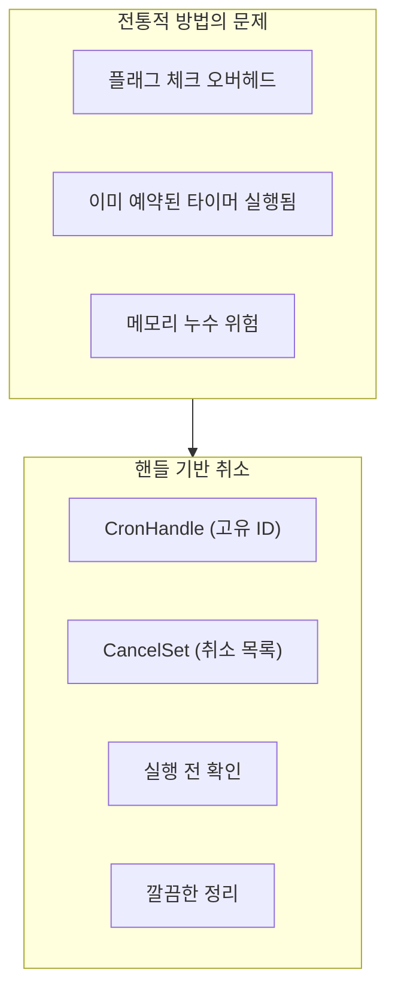
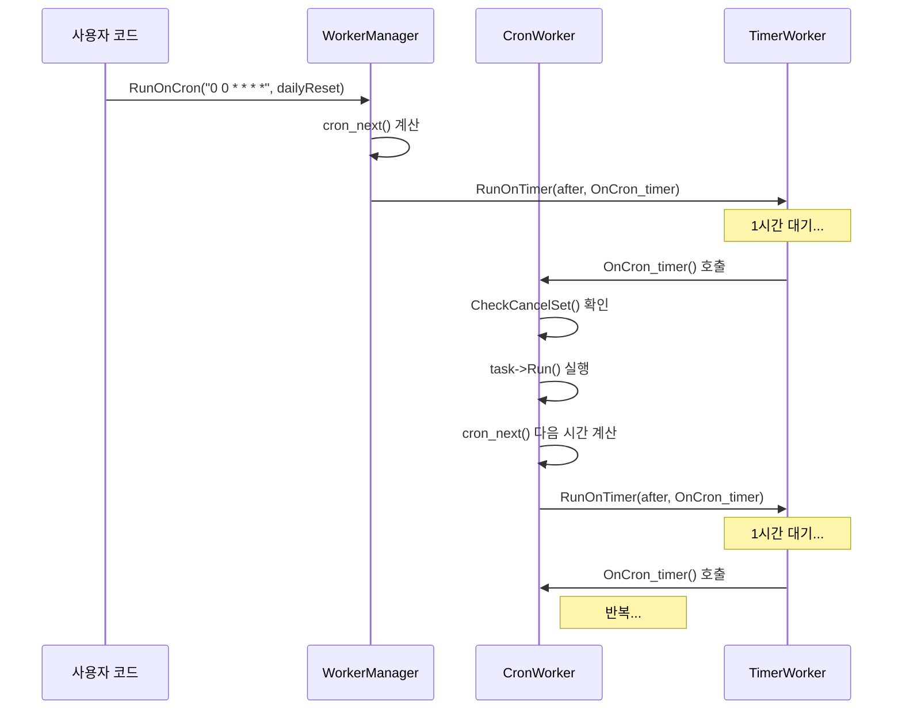

# 18. Cron을 활용한 스케줄 관리

작성자: 안명달 (mooondal@gmail.com)

## 개요

게임 서버에서 정기 이벤트, 일일 초기화, 주간 보상 등을 관리하려면 복잡한 시간 기반 스케줄링이 필요하다. 단순한 타이머로는 "매주 월요일 오전 9시", "매일 자정", "5분마다" 같은 복잡한 패턴을 표현하기 어렵다.

Unix Cron 표현식을 활용하여 복잡한 반복 스케줄을 한 줄로 정의하고, 서버 재시작 시에도 누락된 스케줄을 자동 감지하여 실행하는 스케줄 관리 시스템이다.

---

## 핵심 기능

### 1. Unix Cron 표현식
- **표준 Cron 문법**: "초 분 시 일 월 요일" 6자리 표현식
- **복잡한 패턴**: 범위, 간격, 리스트 등 조합 가능
- **가독성**: "0 0 * * *" -> "매일 자정"

### 2. 시간 초과 검사 (cron_cnt)
- **누락된 스케줄 감지**: 서버 재시작 시 실행되지 않은 스케줄 탐지
- **보상 처리**: 서버 다운 중 놓친 일일 보상 자동 지급

### 3. 이중 Cron 활용
- **시간 범위 이벤트**: 시작 Cron + 종료 Cron
- **예시**: 오전 9시 ~ 오후 6시 이벤트 (2개의 Cron으로 관리)

### 4. 자동 반복 실행
- **CronWorker**: 한 번 등록하면 자동 반복
- **취소 가능**: CronHandle로 스케줄 취소

---

## Unix Cron 표현식

### 기본 형식

```
┌───────────── 초 (0 - 59)
│ ┌─────────── 분 (0 - 59)
│ │ ┌───────── 시 (0 - 23)
│ │ │ ┌─────── 일 (1 - 31)
│ │ │ │ ┌───── 월 (1 - 12)
│ │ │ │ │ ┌─── 요일 (0 - 6) (일요일=0)
│ │ │ │ │ │
│ │ │ │ │ │
* * * * * *
```

### 특수 문자

| 문자 | 의미 | 예시 |
|------|------|------|
| `*` | 모든 값 | `* * * * * *` = 매초 |
| `*/N` | N 간격 | `*/5 * * * * *` = 5초마다 |
| `N-M` | N부터 M까지 | `0 9-17 * * * *` = 9시~17시 |
| `N,M,O` | N, M, O | `0 0 9,12,18 * * *` = 9시,12시,18시 |
| `N-M/O` | N~M 범위에서 O 간격 | `0 0-30/10 * * * *` = 0,10,20,30분 |

### 실용적인 예시

```cpp
// 매일 자정
const char* DAILY_RESET = "0 0 0 * * *";

// 매주 월요일 오전 9시
const char* WEEKLY_RESET = "0 0 9 * * 1";

// 5분마다
const char* EVERY_5_MIN = "0 */5 * * * *";

// 매시 정각
const char* HOURLY = "0 0 * * * *";

// 평일 오전 9시
const char* WEEKDAY_9AM = "0 0 9 * * 1-5";

// 매월 1일 자정
const char* MONTHLY = "0 0 0 1 * *";

// 크리스마스 자정
const char* CHRISTMAS = "0 0 0 25 12 *";

// 30초마다
const char* EVERY_30_SEC = "*/30 * * * * *";
```

---

## 핵심 API

### cron_next - 다음 실행 시간 계산

```cpp
// Cron.h
namespace cron
{
	// 다음 실행 시간 계산
	std::time_t cron_next(const cronexpr& cex, const std::time_t& date);
}
```

**사용 예시:**

```cpp
// Cron 표현식 파싱
cron::cronexpr dailyResetCron = cron::make_cron("0 0 0 * * *");  // 매일 자정

// 현재 시간
std::time_t now = std::time(nullptr);

// 다음 실행 시간 계산
std::time_t nextRun = cron::cron_next(dailyResetCron, now);

// 출력
std::tm* tm = std::localtime(&nextRun);
printf("다음 일일 초기화: %04d-%02d-%02d %02d:%02d:%02d\n",
	tm->tm_year + 1900, tm->tm_mon + 1, tm->tm_mday,
	tm->tm_hour, tm->tm_min, tm->tm_sec);
// 출력 예: "다음 일일 초기화: 2025-01-07 00:00:00"
```

---

## 시간 초과 검사 (cron_cnt)

### 개념

서버가 재시작되거나 다운된 경우, **놓친 스케줄을 감지**하여 보상 처리가 필요한다. `cron_cnt()` 함수는 **이전 시간과 현재 시간 사이에 Cron 스케줄이 몇 번 발생했는지** 계산한다.

### 구현

```cpp
// Cron.h
namespace cron
{
	// 이전 시간과 현재 시간 사이에 Cron이 몇 번 발생했는지 계산
	inline int cron_cnt(std::time_t prev, const cronexpr& cex, std::time_t next, int maxCnt)
	{
		int cnt = 0;
		for (int i = 0; i < maxCnt; ++i)
		{
			// 다음 실행 시간 계산
			prev = cron::cron_next(cex, prev);
			
			// 현재 시간보다 이전이면 카운트 증가
			if (prev <= next)
				++cnt;
			else
				break;
		}
		return cnt;
	}
}
```

### 사용 예시: 일일 보상 누락 체크

```cpp
// 서버 시작 시 마지막 일일 보상 시간 로드
std::time_t lastDailyRewardTime = LoadLastDailyRewardTime(userId);

// 현재 시간
std::time_t now = std::time(nullptr);

// 일일 보상 Cron (매일 자정)
cron::cronexpr dailyRewardCron = cron::make_cron("0 0 0 * * *");

// 놓친 일일 보상 횟수 계산 (최대 7일)
int missedDays = cron::cron_cnt(lastDailyRewardTime, dailyRewardCron, now, 7);

if (missedDays > 0)
{
	// 놓친 일일 보상 지급
	for (int i = 0; i < missedDays; ++i)
	{
		GiveDailyReward(userId);
	}
	
	// 마지막 보상 시간 업데이트
	SaveLastDailyRewardTime(userId, now);
	
	printf("놓친 일일 보상 %d일치 지급\n", missedDays);
}
```

**시나리오:**
- 마지막 로그인: 2025-01-01 23:00
- 현재 로그인: 2025-01-04 10:00
- 놓친 보상: 01-02 00:00, 01-03 00:00, 01-04 00:00 = **3일치**

---

## 이중 Cron 활용 - 시간 범위 이벤트

**시간 범위 이벤트 예시**: 매일 오전 9시 ~ 오후 6시에만 활성화

### Cron 2개 사용

```cpp
class EventScheduler
{
private:
	cron::cronexpr mEventStartCron;  // 시작 Cron
	cron::cronexpr mEventEndCron;    // 종료 Cron
	
	std::time_t mLastCheckTime;
	bool mIsEventActive;

public:
	EventScheduler()
	{
		// 매일 오전 9시 시작
		mEventStartCron = cron::make_cron("0 0 9 * * *");
		
		// 매일 오후 6시 종료
		mEventEndCron = cron::make_cron("0 0 18 * * *");
		
		mLastCheckTime = std::time(nullptr);
		mIsEventActive = false;
	}

	void Update()
	{
		std::time_t now = std::time(nullptr);
		
		// 시작 시간이 지났는지 확인
		int startCount = cron::cron_cnt(mLastCheckTime, mEventStartCron, now, 10);
		if (startCount > 0)
		{
			mIsEventActive = true;
			OnEventStart();
		}
		
		// 종료 시간이 지났는지 확인
		int endCount = cron::cron_cnt(mLastCheckTime, mEventEndCron, now, 10);
		if (endCount > 0)
		{
			mIsEventActive = false;
			OnEventEnd();
		}
		
		mLastCheckTime = now;
	}

	bool IsEventActive() const { return mIsEventActive; }

private:
	void OnEventStart()
	{
		printf("이벤트 시작! (오전 9시)\n");
		// 이벤트 활성화 로직
	}

	void OnEventEnd()
	{
		printf("이벤트 종료! (오후 6시)\n");
		// 이벤트 비활성화 로직
	}
};
```

**장점:**
- **명확한 구분**: 시작과 종료를 각각 관리
- **서버 재시작 대응**: 재시작 시 `cron_cnt()`로 현재 상태 복원
- **복잡한 패턴**: 주말 제외, 특정 날짜 제외 등 세밀한 제어

---

## 핸들 기반 취소 시스템

### 반복 스케줄 취소 문제

Cron 스케줄은 **자동으로 반복 실행**된다. 그런데 게임 플레이 중 특정 조건에서 스케줄을 **중단**해야 하는 경우가 있다:

- **이벤트 종료**: 기간 한정 이벤트가 조기 종료될 때
- **유저 상태 변경**: 유저가 특정 기능을 비활성화할 때
- **서버 종료**: 서버가 우아하게 종료(Graceful Shutdown)될 때

**전통적인 방법의 문제점:**
```cpp
// [비권장] 플래그 기반
class EventSystem {
    bool mIsEventRunning = true;
    
    void OnEventTick() {
        if (!mIsEventRunning) return;  // 매번 체크 필요
        // ... 이벤트 로직
    }
    
    void StopEvent() {
        mIsEventRunning = false;  // 플래그만 변경
        // [문제] 이미 스케줄된 타이머는 계속 실행됨!
        // [문제] 불필요한 콜백 호출 계속 발생
    }
};
```

### 해결책: CronHandle + CancelSet

**핵심 아이디어:** 각 Cron 스케줄에 **고유한 핸들(ID)**을 부여하고, 취소된 핸들을 **Set에 저장**하여 실행 전에 확인한다.



### 구현: CronHandle + CancelSet

```cpp
// CronWorker.h
class CronWorker
{
private:
    Lock mLock;
    std::set<CronHandle> mCancelSet;  // 취소된 핸들 집합
    
public:
    // Cron 스케줄 취소 (외부에서 호출)
    void CancelCron(CronHandle cronHandle)
    {
        WriteLock lock(mLock);
        mCancelSet.insert(cronHandle);  // 취소 목록에 추가
    }
    
    // 취소 여부 확인 (실행 전 체크)
    bool CheckCancelSet(CronHandle cronHandle)
    {
        WriteLock lock(mLock);
        auto it = mCancelSet.find(cronHandle);
        if (it != mCancelSet.end())
        {
            // 취소된 핸들 발견 -> Set에서 제거 (메모리 정리)
            mCancelSet.erase(it);
            return true;  // 취소됨
        }
        return false;  // 정상 실행
    }

private:
    // Cron 타이머 콜백 (자동 반복)
    void OnCron_timer(
        std::weak_ptr<CronWorker> cronWorkerWeakPtr,
        time_t prev,
        const cron::cronexpr& cex,
        WorkerTaskNode* task,
        CronHandle cronHandle
    )
    {
        // 실행 전에 취소 확인
        if (CheckCancelSet(cronHandle))
        {
            // 취소됨 -> task 정리 후 종료
            WorkerTaskUtil::Delete(task);
            return;  // 더 이상 재등록하지 않음
        }
        
        // 정상 실행
        task->Run();
        
        // 다음 실행 시간 계산
        time_t next = cron::cron_next(cex, prev);
        ClockMs after = std::chrono::milliseconds((next - prev) * 1000);
        
        // 다음 스케줄 재등록 (재귀)
        WorkerManager::RunOnTimer(
            after,
            cronWorkerWeakPtr,
            &CronWorker::OnCron_timer,
            cronWorkerWeakPtr, next, cex, task, cronHandle
        );
    }
};
```

### 장점

| 전통적 방법 | 핸들 기반 취소 |
|------------|--------------------------------|
| **플래그 체크**: 매 실행마다 확인 | **Set 조회**: 취소된 것만 확인 (O(log N)) |
| **타이머 계속 실행**: 불필요한 콜백 | **재등록 중단**: 완전히 멈춤 |
| **메모리 누수**: 플래그만 변경 | **자동 정리**: task 삭제, Set에서 제거 |
| **복잡한 관리**: 여러 플래그 필요 | **단일 핸들**: 하나의 ID로 관리 |

### 실행 흐름 비교

**전통적 방법:**
```
실행 -> 플래그 체크 -> 실행 -> 플래그 체크 -> 실행 -> 플래그 체크 (계속 반복)
       OK          OK          OK          취소됨 (하지만 타이머는 계속 실행)
```

**핸들 기반 취소:**
```
실행 -> 정상 -> 재등록
실행 -> 정상 -> 재등록
실행 -> CancelSet 확인 -> 취소됨! -> task 삭제 -> 재등록 안 함 -> 완전 종료
```

### 동시성 안전성

```cpp
// Thread 1: Cron 실행
void OnCron_timer(...) {
    WriteLock lock(mLock);  // 락 획득
    if (CheckCancelSet(cronHandle)) {
        // 취소 확인 및 정리
    }
    // 락 해제
}

// Thread 2: 사용자가 취소 요청
void CancelCron(CronHandle handle) {
    WriteLock lock(mLock);  // 락 획득
    mCancelSet.insert(handle);
    // 락 해제
}

// Lock으로 동시성 보장
// 취소 시점과 실행 시점의 레이스 컨디션 방지
```

### 메모리 효율성

```cpp
// 취소 시: Set에 핸들만 추가 (8바이트)
void CancelCron(CronHandle handle) {
    mCancelSet.insert(handle);  // 8바이트만 사용
}

// 실행 시: Set에서 제거 (자동 정리)
bool CheckCancelSet(CronHandle handle) {
    auto it = mCancelSet.find(handle);
    if (it != mCancelSet.end()) {
        mCancelSet.erase(it);  // 메모리 반환
        return true;
    }
    return false;
}

// 장기 실행 서버에서도 메모리 누수 없음
// 취소된 핸들은 다음 실행 시 자동 정리
```

### 실전 사용 예시

```cpp
// 예시 1: 이벤트 시스템
class EventSystem {
    CronHandle mEventHandle;
    
    void StartEvent() {
        // 10초마다 이벤트 보상
        cron::cronexpr cron = cron::make_cron("*/10 * * * * *");
        mEventHandle = WorkerManager::RunOnCron(
            tClock.GetGlobalNow(),
            cron,
            gEventWorker,
            this,
            &EventSystem::OnEventReward
        );
        printf("이벤트 시작! (핸들: %llu)\n", mEventHandle);
    }
    
    void StopEvent() {
        // 핸들로 즉시 취소
        WorkerManager::CancelCron(mEventHandle);
        printf("이벤트 중단! (핸들: %llu)\n", mEventHandle);
        // 더 이상 OnEventReward 호출 안 됨
        // 타이머도 재등록 안 됨
        // 메모리도 자동 정리
    }
};

// 예시 2: 다중 스케줄 관리
class MultiScheduler {
    std::vector<CronHandle> mHandles;
    
    void StartMultipleSchedules() {
        // 5분마다
        mHandles.push_back(WorkerManager::RunOnCron(...));
        
        // 1시간마다
        mHandles.push_back(WorkerManager::RunOnCron(...));
        
        // 매일 자정
        mHandles.push_back(WorkerManager::RunOnCron(...));
        
        printf("3개 스케줄 시작\n");
    }
    
    void StopAll() {
        // 모든 스케줄 한 번에 취소
        for (CronHandle handle : mHandles) {
            WorkerManager::CancelCron(handle);
        }
        mHandles.clear();
        printf("모든 스케줄 중단\n");
    }
};

// 예시 3: 조건부 취소
class ConditionalScheduler {
    CronHandle mHandle;
    int mExecuteCount = 0;
    
    void OnSchedule() {
        mExecuteCount++;
        printf("실행 횟수: %d\n", mExecuteCount);
        
        // 10번 실행 후 자동 취소
        if (mExecuteCount >= 10) {
            WorkerManager::CancelCron(mHandle);
            printf("10번 실행 완료, 자동 취소\n");
        }
    }
};
```

### 핸들 생성 방식 (추정)

```cpp
// CronHandle은 고유 ID (추정 구현)
using CronHandle = uint64_t;

class CronWorker {
    std::atomic<CronHandle> mNextHandle{1};
    
    CronHandle GenerateHandle() {
        return mNextHandle.fetch_add(1);  // atomic 증가
    }
};

// 고유성 보장
// 스레드 안전
// 단순하고 효율적
```

---

## CronWorker - 자동 반복 실행

### 개념

**CronWorker**는 한 번 등록하면 **자동으로 반복 실행**하고, 다음 스케줄을 계산하여 **TimerWorker에 재등록**하는 시스템이다. 위에서 설명한 **핸들 기반 취소 시스템**이 핵심이다.

### 구현

```cpp
// CronWorker.h
class CronWorker
{
private:
	Lock mLock;
	std::set<CronHandle> mCancelSet;  // 취소된 핸들 집합

public:
	// Cron 스케줄 취소
	void CancelCron(CronHandle cronHandle);
	
	// 취소 여부 확인
	bool CheckCancelSet(CronHandle cronHandle);

private:
	// Cron 타이머 콜백
	void OnCron_timer(
		std::weak_ptr<CronWorker> cronWorkerWeakPtr,
		time_t prev,
		const cron::cronexpr& cex,
		WorkerTaskNode* task,
		CronHandle cronHandle
	);
};
```

### 실행 흐름



### 사용 예시

```cpp
// WorkerManager.h
class WorkerManager
{
public:
	// Cron 스케줄로 실행
	template<typename _Worker, typename _Owner, typename _Function, typename... _Args>
	static CronHandle RunOnCron(
		ClockPoint now,
		const cron::cronexpr& cex,
		std::shared_ptr<_Worker> workerPtr,
		_Owner* owner,
		_Function&& function,
		_Args&&... args
	);

	// Cron 취소
	static void CancelCron(CronHandle cronHandle);
};
```

**실제 사용:**

```cpp
// 매일 자정 일일 초기화
class GameServer
{
private:
	CronHandle mDailyResetHandle;

public:
	void Initialize()
	{
		// 매일 자정 (00:00:00) 실행
		cron::cronexpr dailyResetCron = cron::make_cron("0 0 0 * * *");
		
		mDailyResetHandle = WorkerManager::RunOnCron(
			tClock.GetGlobalNow(),
			dailyResetCron,
			gGameWorker,
			this,
			&GameServer::OnDailyReset
		);
	}

	void Shutdown()
	{
		// Cron 취소
		WorkerManager::CancelCron(mDailyResetHandle);
	}

	void OnDailyReset()
	{
		printf("일일 초기화 실행!\n");
		
		// 모든 유저 일일 퀘스트 초기화
		for (auto& user : mUsers)
		{
			user->ResetDailyQuests();
		}
	}
};
```

---

## 실전 시나리오

### 시나리오 1: 주간 랭킹 보상

```cpp
class RankingSystem
{
private:
	CronHandle mWeeklyRewardHandle;

public:
	void Initialize()
	{
		// 매주 월요일 오전 9시
		cron::cronexpr weeklyRewardCron = cron::make_cron("0 0 9 * * 1");
		
		mWeeklyRewardHandle = WorkerManager::RunOnCron(
			tClock.GetGlobalNow(),
			weeklyRewardCron,
			gRankingWorker,
			this,
			&RankingSystem::OnWeeklyReward
		);
	}

	void OnWeeklyReward()
	{
		printf("주간 랭킹 보상 지급 시작\n");
		
		// 상위 100명에게 보상
		auto topPlayers = GetTopPlayers(100);
		for (int rank = 0; rank < topPlayers.size(); ++rank)
		{
			GiveRankingReward(topPlayers[rank], rank + 1);
		}
		
		// 랭킹 초기화
		ResetWeeklyRanking();
	}
};
```

### 시나리오 2: 제한 시간 이벤트 (오전 9시 ~ 오후 6시)

```cpp
class TimeEventSystem
{
private:
	std::time_t mLastCheckTime;
	bool mIsEventActive;

public:
	void OnServerStart()
	{
		mLastCheckTime = LoadLastCheckTime();
		std::time_t now = std::time(nullptr);
		
		// 시작/종료 Cron
		cron::cronexpr startCron = cron::make_cron("0 0 9 * * *");   // 오전 9시
		cron::cronexpr endCron = cron::make_cron("0 0 18 * * *");    // 오후 6시
		
		// 서버 다운 중 놓친 시작/종료 이벤트 확인
		int startCount = cron::cron_cnt(mLastCheckTime, startCron, now, 10);
		int endCount = cron::cron_cnt(mLastCheckTime, endCron, now, 10);
		
		// 가장 최근 이벤트 반영
		if (startCount > 0 && endCount > 0)
		{
			// 둘 다 발생: 시작이 종료보다 나중이면 활성화
			std::time_t lastStart = cron::cron_next(startCron, mLastCheckTime);
			std::time_t lastEnd = cron::cron_next(endCron, mLastCheckTime);
			mIsEventActive = (lastStart > lastEnd);
		}
		else if (startCount > 0)
		{
			mIsEventActive = true;
		}
		else if (endCount > 0)
		{
			mIsEventActive = false;
		}
		
		printf("이벤트 상태: %s\n", mIsEventActive ? "활성" : "비활성");
	}

	void Update()
	{
		std::time_t now = std::time(nullptr);
		
		cron::cronexpr startCron = cron::make_cron("0 0 9 * * *");
		cron::cronexpr endCron = cron::make_cron("0 0 18 * * *");
		
		// 매 프레임 체크 (또는 주기적으로)
		int startCount = cron::cron_cnt(mLastCheckTime, startCron, now, 1);
		int endCount = cron::cron_cnt(mLastCheckTime, endCron, now, 1);
		
		if (startCount > 0)
		{
			mIsEventActive = true;
			OnEventStart();
		}
		
		if (endCount > 0)
		{
			mIsEventActive = false;
			OnEventEnd();
		}
		
		mLastCheckTime = now;
		SaveLastCheckTime(mLastCheckTime);
	}
};
```

### 시나리오 3: 5분마다 자동 저장

```cpp
class AutoSaveSystem
{
public:
	void Initialize()
	{
		// 5분마다 (00, 05, 10, ... 분)
		cron::cronexpr autoSaveCron = cron::make_cron("0 */5 * * * *");
		
		WorkerManager::RunOnCron(
			tClock.GetGlobalNow(),
			autoSaveCron,
			gSaveWorker,
			this,
			&AutoSaveSystem::OnAutoSave
		);
	}

	void OnAutoSave()
	{
		printf("자동 저장 실행...\n");
		
		// 모든 유저 데이터 저장
		for (auto& user : mUsers)
		{
			user->SaveToDB();
		}
		
		printf("자동 저장 완료!\n");
	}
};
```

---

## 장점

| 장점 | 설명 |
|------|------|
| **표준 문법** | Unix Cron 표현식으로 복잡한 스케줄 한 줄 정의 |
| **누락 감지** | `cron_cnt()`로 서버 재시작 시 놓친 스케줄 자동 감지 |
| **이중 Cron** | 시작/종료를 각각 관리하여 시간 범위 이벤트 구현 |
| **자동 반복** | CronWorker가 다음 스케줄 자동 재등록 |
| **핸들 기반 취소** | CronHandle + CancelSet, 메모리 자동 정리, 동시성 안전 |
| **정확성** | 시스템 시간 기반으로 정확한 스케줄 보장 |
| **확장 용이** | 새로운 스케줄 추가 시 Cron 표현식만 등록 |

---

## 구현 시 고려사항

### 1. 서버 시간 vs 클라이언트 시간
- **권장**: 서버 시간 기준 (UTC 또는 KST)
- **클라이언트 시간**: 시간대가 다르면 문제 발생

### 2. 시간 동기화
- **NTP 서버**: 여러 서버 간 시간 동기화 필수
- **시간 점프**: 시스템 시간 변경 시 예외 처리

### 3. 성능
- **cron_cnt() 최적화**: `maxCnt` 파라미터로 탐색 범위 제한
- **캐싱**: 다음 실행 시간 미리 계산

### 4. 로깅
- **스케줄 실행 로그**: 언제 실행되었는지 기록
- **누락 감지 로그**: 몇 번 놓쳤는지 기록

### 5. 테스트
- **시간 모킹**: 테스트 시 시간을 빠르게 진행
- **경계 조건**: 자정, 월말, 윤년 등 테스트

---
