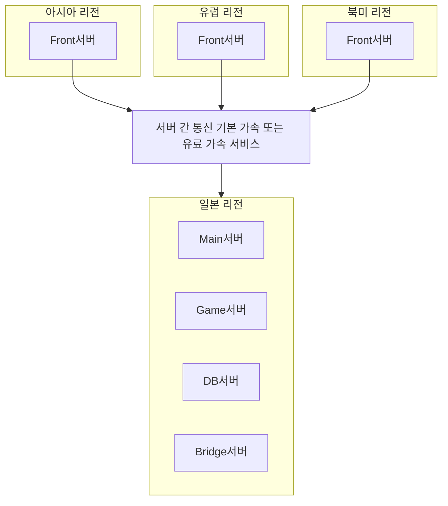

# 23. Front서버 분산을 통한 글로벌 서비스 대비

작성자: 안명달 (mooondal@gmail.com)

> **목차로 돌아가기**: [tech.md](tech.md)

---

## 개요

클라이언트가 접속하는 Front서버만 각 리전에 배포하고, 실제 게임 서버는 일본 등 글로벌 서비스의 중심이 될 수 있는 리전에 배포하여 저비용 고효율 글로벌 서비스를 제공하기 위한 설계이다

구글클라우드는 기본적으로 서버간 통신이 빠르고, 텐센트의 경우 유료 고속화 서비스를 제공한다. 

### 핵심 아이디어

-> **클라이언트는 가까운 Front서버와 통신 + 서버 간 통신은 가속**

---

[목차로 돌아가기](tech.md)
