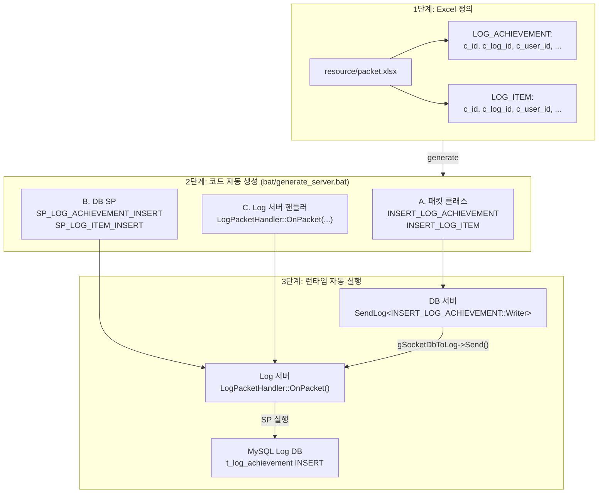

# 26. 로그 시스템 - Excel 정의에서 DB 저장까지 자동화

작성자: 안명달 (mooondal@gmail.com)

> **목차로 돌아가기**: [tech.md](tech.md)

---

## 개요

Excel에 로그를 정의하면 패킷, SP, 핸들러가 자동 생성되고, 한 줄 코드로 로그 서버를 거쳐 DB에 저장되는 자동화된 로그 시스템이다.

여러 로그에서 **LogId**가 동일한 경우 관련된 하나의 액션에서 생성된 로그가 되도록 한다.

### 사용 예시

```cpp
// 1. LogId 생성 (관련 액션 추적용)
LogId logId = UuidUtil::GenerateLogId();

// 2. 업적 달성 로그
DbSocketUtil::SendLog<INSERT_LOG_ACHIEVEMENT::Writer> wp(
    UuidUtil::GenerateUuid(),      // 로그 고유 ID
    logId,                          // 관련 액션 추적용 LogId    userId,                         // 사용자 ID
    achievementSid,                 // 업적 Sid
    achievementStepSid,             // 업적 단계 Sid
    tClock.GetGlobalNowTt(),        // 생성 시간
    tClock.GetGlobalNowTt()         // 로그 시간
);

// 3. 보상 아이템 로그 (같은 LogId 사용)
DbSocketUtil::SendLog<INSERT_LOG_ITEM::Writer> wp2(
    UuidUtil::GenerateUuid(),      // 로그 고유 ID
    logId,                          // 위와 동일한 LogId로 연관성 표시
    userId,                         // 사용자 ID
    itemSid,                        // 아이템 Sid
    itemCount,                      // 아이템 개수
    tClock.GetGlobalNowTt(),
    tClock.GetGlobalNowTt()
);

// 4. 자동으로 Log 서버 -> DB 저장
// 나중에 DB 쿼리로 같은 LogId를 가진 로그를 조회하면
// "어떤 업적을 달성했고, 어떤 보상을 받았는지" 추적 가능!
```

**DB 조회 예시:**

```sql
-- LogId로 관련 액션 추적
SELECT 
    la.c_achievement_sid AS achievement,
    li.c_item_sid AS reward_item,
    li.c_item_count AS reward_count,
    la.c_date_created AS when_achieved
FROM t_log_achievement la
JOIN t_log_item li ON la.c_log_id = li.c_log_id  -- LogId로 조인WHERE la.c_user_id = ?
ORDER BY la.c_date_created DESC
LIMIT 10;

-- 결과:
-- achievement | reward_item | reward_count | when_achieved
-- 1001        | 5001        | 100          | 2025-01-06 10:23:45
-- 1002        | 5002        | 50           | 2025-01-06 10:25:12
-- (어떤 업적을 달성하고 어떤 보상을 받았는지 명확히 추적)
```

---

## 전체 흐름: 3단계 자동화



---

## LogId: 관련 액션 추적의 핵심

### LogId란?

**LogId는 Uuid 타입으로, 여러 로그를 하나의 논리적 흐름으로 연결하기 위한 고유 식별자이다.**

```cpp
using LogId = Uuid;  // 128비트 분산 고유 ID

// Uuid 구조 (64비트 타임스탬프 + 16비트 메타데이터)
struct Uuid
{
    int64_t mTime;     // 로컬 타임스탬프 (밀리초)
    uint8_t mAppId;    // 앱 ID
    uint8_t mThreadId; // 스레드 ID
    uint16_t mSeq;     // 시퀀스 번호
};
```

### LogId 생성

```cpp
namespace UuidUtil
{
    LogId GenerateLogId()
    {
        return GenerateUuid();  // Uuid와 동일한 방식
    }

    Uuid GenerateUuid()
    {
        // 시간 조작의 영향을 받지 않도록 Local 시간 사용
        Uuid uuid(
            tClock.GetLocalNowMs(),             // 로컬 타임스탬프
            static_cast<uint8_t>(gMyAppId),     // 앱 ID
            static_cast<uint8_t>(tThreadId),    // 스레드 ID
            ++tUuidSeq                          // 시퀀스 (스레드별 증가)
        );
        return uuid;
    }
}
```

### LogId 활용 패턴

#### 패턴 1: 업적 달성 + 보상 지급

```cpp
void OnAchievementComplete(UserId userId, AchievementSid achievementSid)
{
    // 하나의 LogId로 전체 흐름 추적
    LogId logId = UuidUtil::GenerateLogId();
    
    // 1. 업적 달성 로그
    DbSocketUtil::SendLog<INSERT_LOG_ACHIEVEMENT::Writer> wpAchievement(
        UuidUtil::GenerateUuid(),
        logId,  //        userId,
        achievementSid,
        achievementStepSid,
        tClock.GetGlobalNowTt(),
        tClock.GetGlobalNowTt()
    );
    
    // 2. 보상 골드 로그
    DbSocketUtil::SendLog<INSERT_LOG_USER::Writer> wpGold(
        UuidUtil::GenerateUuid(),
        logId,  // 동일한 LogId
        userId,
        L"GOLD_REWARD",
        1000,  // 골드 1000개
        tClock.GetGlobalNowTt(),
        tClock.GetGlobalNowTt()
    );
    
    // 3. 보상 아이템 로그
    DbSocketUtil::SendLog<INSERT_LOG_ITEM::Writer> wpItem(
        UuidUtil::GenerateUuid(),
        logId,  // 동일한 LogId
        userId,
        itemSid,
        itemCount,
        tClock.GetGlobalNowTt(),
        tClock.GetGlobalNowTt()
    );
}

// 분석: 같은 LogId를 가진 로그를 조회하면
// "누가, 어떤 업적을 달성하고, 무슨 보상을 받았는지" 완전 추적!
```

#### 패턴 2: 퀘스트 완료 + 보상 + 다음 퀘스트 시작

```cpp
void OnQuestComplete(UserId userId, QuestSid questSid)
{
    LogId logId = UuidUtil::GenerateLogId();
    
    // 1. 퀘스트 완료 로그
    DbSocketUtil::SendLog<INSERT_LOG_QUEST::Writer> wpComplete(
        UuidUtil::GenerateUuid(), logId, userId, questSid, L"COMPLETE", ...
    );
    
    // 2. 경험치 획득 로그
    DbSocketUtil::SendLog<INSERT_LOG_USER::Writer> wpExp(
        UuidUtil::GenerateUuid(), logId, userId, L"EXP_GAIN", 500, ...
    );
    
    // 3. 다음 퀘스트 시작 로그
    QuestSid nextQuestSid = GetNextQuest(questSid);
    DbSocketUtil::SendLog<INSERT_LOG_QUEST::Writer> wpNext(
        UuidUtil::GenerateUuid(), logId, userId, nextQuestSid, L"START", ...
    );
}

// 분석: 퀘스트 진행 흐름을 LogId로 추적
// "A 퀘스트 완료 -> 경험치 500 획득 -> B 퀘스트 시작"
```

#### 패턴 3: 메일 발송 + 아이템 첨부 + 수령

```cpp
// 메일 발송 시
void SendMail(UserId userId, MailSid mailSid)
{
    LogId logId = UuidUtil::GenerateLogId();
    
    // 1. 메일 발송 로그
    DbSocketUtil::SendLog<INSERT_LOG_MAIL::Writer> wpSend(
        UuidUtil::GenerateUuid(), logId, userId, mailSid, L"SEND", ...
    );
    
    // 2. 첨부 아이템 로그
    DbSocketUtil::SendLog<INSERT_LOG_ITEM::Writer> wpAttach(
        UuidUtil::GenerateUuid(), logId, userId, itemSid, itemCount, ...
    );
}

// 메일 수령 시
void ReceiveMail(UserId userId, MailId mailId)
{
    // 메일의 원래 LogId를 조회 (DB에서 가져옴)
    LogId originalLogId = GetMailLogId(mailId);
    
    // 3. 메일 수령 로그 (원래 LogId 사용)
    DbSocketUtil::SendLog<INSERT_LOG_MAIL::Writer> wpReceive(
        UuidUtil::GenerateUuid(), originalLogId, userId, mailId, L"RECEIVE", ...
    );
}

// 분석: 메일의 전체 생애주기 추적
// "메일 발송 -> 아이템 첨부 -> 수령" 모두 같은 LogId
```

---

## 1단계: Excel에서 로그 정의

### resource/packet.xlsx

**"LOG_"로 시작하는 패킷을 정의하면 자동으로 로그 시스템에 등록된다.**

| 패킷명 | 필드 | 타입 | 설명 |
|--------|------|------|------|
| **LOG_ACHIEVEMENT** | c_id | Uuid | 로그 고유 ID |
| | c_log_id | **LogId** | **관련 액션 추적용** |
| | c_user_id | UserId | 사용자 ID |
| | c_achievement_sid | AchievementSid | 업적 Sid |
| | c_achievement_step_sid | AchievementStepSid | 업적 단계 Sid |
| | c_date_created | time_t | 생성 시간 |
| | c_date_log | time_t | 로그 시간 |

| 패킷명 | 필드 | 타입 | 설명 |
|--------|------|------|------|
| **LOG_ITEM** | c_id | Uuid | 로그 고유 ID |
| | c_log_id | **LogId** | **관련 액션 추적용** |
| | c_user_id | UserId | 사용자 ID |
| | c_item_sid | ItemSid | 아이템 Sid |
| | c_item_count | int64_t | 아이템 개수 |
| | c_date_created | time_t | 생성 시간 |
| | c_date_log | time_t | 로그 시간 |

**기타 로그 타입:**
- `LOG_USER`: 사용자 행동 (로그인, 골드 변화 등)
- `LOG_QUEST`: 퀘스트 진행
- `LOG_MAIL`: 메일 발송/수령
- `LOG_GAME`: 게임 플레이
- `LOG_MISSION`: 미션 완료

**필드 명명 규칙:**
- `c_id`: 로그 고유 ID (각 로그마다 다름)
- `c_log_id`: 관련 액션 추적 ID (같은 흐름의 로그는 동일)- `c_user_id`: 사용자 ID
- `c_*_sid`: Static Data Sid
- `c_date_created`: 엔티티 생성 시간
- `c_date_log`: 로그 기록 시간

---

## 2단계: 코드 자동 생성

### bat/generate_server.bat 실행

```batch
@echo off
cd setup
call npm run build
call node app.js
cd ..
```

### Setup 프로젝트 자동 생성 항목

**A. 패킷 클래스 생성**

```typescript
// setup/Tool/setup_packet_generation.ts

// LOG_로 시작하는 패킷을 찾아서 INSERT_LOG_XXX 패킷 생성
for (const packetName in json[scopeName]) {
    if (/^LOG_/.test(packetName) && !/_ALL$/.test(packetName)) {
        // INSERT_LOG_ACHIEVEMENT 패킷 클래스 생성
        // -> client/Client/Source/Packet/.../PACKET_LOG.h
    }
}
```

**생성된 패킷:**

```cpp
// PACKET_LOG.h (자동 생성)

class INSERT_LOG_ACHIEVEMENT : public BasePacket
{
private:
    Uuid mC_id;
    LogId mC_log_id;               // LogId 필드
    UserId mC_user_id;
    AchievementSid mC_achievement_sid;
    AchievementStepSid mC_achievement_step_sid;
    time_t mC_date_created;
    time_t mC_date_log;

public:
    // Getter
    Uuid Get_c_id() const { return mC_id; }
    LogId Get_c_log_id() const { return mC_log_id; }  //    UserId Get_c_user_id() const { return mC_user_id; }
    // ...

    // Writer (패킷 생성)
    class Writer : public INSERT_LOG_ACHIEVEMENT
    {
    public:
        Writer(
            PacketDir packetDir,
            SendBufferPtr sendBuffer,
            Uuid c_id,
            LogId c_log_id,        //            UserId c_user_id,
            AchievementSid c_achievement_sid,
            AchievementStepSid c_achievement_step_sid,
            time_t c_date_created,
            time_t c_date_log
        );
    };
};
```

**B. DB SP(Stored Procedure) 생성**

```sql
-- resource/db/log/SP_LOG_ACHIEVEMENT_INSERT.sql (자동 생성)

DELIMITER $$

CREATE PROCEDURE SP_LOG_ACHIEVEMENT_INSERT(
    IN p_c_id BINARY(16),
    IN p_c_log_id BINARY(16),
    IN p_c_user_id BINARY(16),
    IN p_c_achievement_sid BIGINT,
    IN p_c_achievement_step_sid BIGINT,
    IN p_c_date_created TIMESTAMP,
    IN p_c_date_log TIMESTAMP
)
BEGIN
    INSERT INTO t_log_achievement (
        c_id,
        c_log_id,
        c_user_id,
        c_achievement_sid,
        c_achievement_step_sid,
        c_date_created,
        c_date_log
    )
    VALUES (
        p_c_id,
        p_c_log_id,
        p_c_user_id,
        p_c_achievement_sid,
        p_c_achievement_step_sid,
        p_c_date_created,
        p_c_date_log
    );
END$$

DELIMITER ;
```

**C. Log 서버 핸들러 생성**

```cpp
// server/logServer/.../AutoGenerated/DefineOnLogPacket.hpp (자동 생성)

HandleResult LogPacketHandler::OnPacket(
    INSERT_LOG_ACHIEVEMENT& rp,
    MAYBE_UNUSED LogPacketWorkerPtr worker
)
{
    LogDbSession dbSession(CommitType::AUTO);

    // SP 호출 준비
    SP_LOG_ACHIEVEMENT_INSERT sp(
        dbSession,
        rp.Get_c_id(),
        rp.Get_c_log_id(),                    // LogId 전달
        rp.Get_c_user_id(),
        rp.Get_c_achievement_sid(),
        rp.Get_c_achievement_step_sid(),
        TimeUtil::TS_FROM_TT(rp.Get_c_date_created()),
        TimeUtil::TS_FROM_TT(rp.Get_c_date_log())
    );

    // SP 실행 (DB INSERT)
    DbUtil::ExecuteSpWithoutResult(sp);

    return HandleResult::OK;
}
```

**자동 생성 요약:**

```
Excel (LOG_ACHIEVEMENT 정의)
    ↓
[Setup 프로젝트]
    ↓
├─ INSERT_LOG_ACHIEVEMENT 패킷 클래스
├─ SP_LOG_ACHIEVEMENT_INSERT.sql
└─ LogPacketHandler::OnPacket(...) 핸들러

-> 개발자는 코드를 하나도 작성하지 않음!
```

---

## 3단계: 런타임 로그 전송 및 저장

### A. DB 서버에서 로그 전송

```cpp
// DbSocketUtil::SendLog 템플릿 클래스

template<typename _Packet>
class SendLog : public _Packet
{
public:
    template<typename... _Args>
    explicit SendLog(_Args&&... args)
        :
        _Packet(NOTIFY, SendBuffer::Pop(__FUNCTIONW__), std::forward<_Args>(args)...)
    {
    }

    virtual ~SendLog()
    {
        // 소멸자에서 자동 전송
        if (gSocketDbToLog)
        {
            gSocketDbToLog->Send(*this);
        }
    }
};
```

**사용 예시:**

```cpp
// Transactor에서 로그 전송
void Transactor_MD_REQ_AUTH_TICKET::OnLog()
{
    LogId logId = UuidUtil::GenerateLogId();
    
    // 생성자 호출 -> 소멸자에서 자동 전송
    DbSocketUtil::SendLog<INSERT_LOG_ACHIEVEMENT::Writer> wp(
        UuidUtil::GenerateUuid(),      // c_id
        logId,                          // c_log_id        userId,                         // c_user_id
        achievementSid,                 // c_achievement_sid
        achievementStepSid,             // c_achievement_step_sid
        tClock.GetGlobalNowTt(),        // c_date_created
        tClock.GetGlobalNowTt()         // c_date_log
    );
    // wp가 스코프를 벗어나면 자동으로 gSocketDbToLog->Send(*this) 호출
}
```

### B. Log 서버에서 수신 및 처리

```cpp
// SocketLogFromDb::OnDispatchPacket()

bool SocketLogFromDb::OnDispatchPacket(NetworkPacket& rp)
{
    DispatchPacket(rp);
    return true;
}

void SocketLogFromDb::DispatchPacket(NetworkPacket& rp)
{
    // 패킷 타입에 맞는 Worker 선택
    if (LogPacketWorkerPtr worker = gLogPacketHandler->GetLogPacketWorker(rp))
        PacketUtil::DispatchPacketOnWorker(
            worker, this,
            &SocketLogFromDb::DispatchPacket_async,
            rp, worker
        );
    else
        DispatchPacketToHandler(rp, worker);
}

void SocketLogFromDb::DispatchPacketToHandler(
    NetworkPacket& rp,
    LogPacketWorkerPtr worker
)
{
    // 자동 생성된 핸들러 호출
    if (DispatchPacketDL(mSocket, gLogPacketHandler.get(), rp, worker)
        != HandleResult::NOT_EXISTS)
        return;
}
```

### C. LogPacketHandler 실행

```cpp
// 자동 생성된 핸들러 (DefineOnLogPacket.hpp)

HandleResult LogPacketHandler::OnPacket(
    INSERT_LOG_ACHIEVEMENT& rp,
    LogPacketWorkerPtr worker
)
{
    // 1. DB 세션 시작 (AUTO 커밋)
    LogDbSession dbSession(CommitType::AUTO);

    // 2. SP 준비
    SP_LOG_ACHIEVEMENT_INSERT sp(
        dbSession,
        rp.Get_c_id(),
        rp.Get_c_log_id(),              // LogId
        rp.Get_c_user_id(),
        rp.Get_c_achievement_sid(),
        rp.Get_c_achievement_step_sid(),
        TimeUtil::TS_FROM_TT(rp.Get_c_date_created()),
        TimeUtil::TS_FROM_TT(rp.Get_c_date_log())
    );

    // 3. SP 실행 (t_log_achievement 테이블에 INSERT)
    DbUtil::ExecuteSpWithoutResult(sp);

    return HandleResult::OK;
}
```

### D. DB 저장

```sql
-- MySQL Log DB: t_log_achievement 테이블

INSERT INTO t_log_achievement (
    c_id,
    c_log_id,                -- LogId (관련 액션 추적)
    c_user_id,
    c_achievement_sid,
    c_achievement_step_sid,
    c_date_created,
    c_date_log
)
VALUES (
    UUID_TO_BIN(?),
    UUID_TO_BIN(?),          --    UUID_TO_BIN(?),
    ?,
    ?,
    ?,
    ?
);
```

---

## LogId 활용: 실전 분석 쿼리

### 쿼리 1: 업적 달성 및 보상 추적

```sql
-- 사용자의 최근 업적 달성과 받은 보상 조회
SELECT 
    la.c_achievement_sid AS achievement,
    la.c_date_created AS achieved_at,
    li.c_item_sid AS reward_item,
    li.c_item_count AS reward_count,
    lu.c_value AS gold_reward
FROM t_log_achievement la
LEFT JOIN t_log_item li
    ON la.c_log_id = li.c_log_id           -- LogId로 조인
LEFT JOIN t_log_user lu
    ON la.c_log_id = lu.c_log_id           -- LogId로 조인
    AND lu.c_action = 'GOLD_REWARD'
WHERE la.c_user_id = UUID_TO_BIN(?)
ORDER BY la.c_date_created DESC
LIMIT 10;

-- 결과:
-- achievement | achieved_at         | reward_item | reward_count | gold_reward
-- 1001        | 2025-01-06 10:23:45 | 5001        | 100          | 1000
-- 1002        | 2025-01-06 10:25:12 | 5002        | 50           | NULL
-- (어떤 업적을 달성하고 무슨 보상을 받았는지 한눈에 파악)
```

### 쿼리 2: 퀘스트 진행 흐름 추적

```sql
-- 하나의 LogId로 묶인 퀘스트 진행 흐름 추적
SELECT 
    lq.c_quest_sid AS quest_sid,
    lq.c_action AS action,
    lq.c_date_created AS when_happened,
    lu.c_action AS user_action,
    lu.c_value AS exp_gained
FROM t_log_quest lq
LEFT JOIN t_log_user lu
    ON lq.c_log_id = lu.c_log_id           -- LogId로 조인
WHERE lq.c_user_id = UUID_TO_BIN(?)
    AND lq.c_log_id = UUID_TO_BIN(?)       -- 특정 LogId
ORDER BY lq.c_date_created ASC;

-- 결과:
-- quest_sid | action   | when_happened       | user_action | exp_gained
-- 2001      | COMPLETE | 2025-01-06 10:30:00 | EXP_GAIN    | 500
-- 2002      | START    | 2025-01-06 10:30:01 | NULL        | NULL
-- (퀘스트 A 완료 -> 경험치 500 획득 -> 퀘스트 B 시작 흐름 파악)
```

### 쿼리 3: 메일의 전체 생애주기 추적

```sql
-- 메일 발송부터 수령까지 전체 추적
SELECT 
    lm.c_mail_id AS mail_id,
    lm.c_action AS action,
    lm.c_date_created AS when_happened,
    li.c_item_sid AS attached_item,
    li.c_item_count AS item_count
FROM t_log_mail lm
LEFT JOIN t_log_item li
    ON lm.c_log_id = li.c_log_id           -- LogId로 조인
WHERE lm.c_user_id = UUID_TO_BIN(?)
    AND lm.c_log_id = UUID_TO_BIN(?)       -- 특정 LogId
ORDER BY lm.c_date_created ASC;

-- 결과:
-- mail_id  | action  | when_happened       | attached_item | item_count
-- 30001    | SEND    | 2025-01-06 10:40:00 | 5001          | 10
-- 30001    | RECEIVE | 2025-01-06 11:00:00 | NULL          | NULL
-- (메일 발송 -> 아이템 첨부 -> 수령 전체 흐름)
```

### 쿼리 4: LogId별 로그 개수 집계

```sql
-- 어떤 액션이 가장 많은 로그를 남기는지 분석
SELECT 
    c_log_id,
    COUNT(*) AS log_count,
    GROUP_CONCAT(DISTINCT table_name) AS tables
FROM (
    SELECT c_log_id, 'achievement' AS table_name FROM t_log_achievement
    UNION ALL
    SELECT c_log_id, 'item' FROM t_log_item
    UNION ALL
    SELECT c_log_id, 'user' FROM t_log_user
    UNION ALL
    SELECT c_log_id, 'quest' FROM t_log_quest
    UNION ALL
    SELECT c_log_id, 'mail' FROM t_log_mail
) AS all_logs
GROUP BY c_log_id
HAVING log_count > 1  -- 2개 이상 연관된 로그만
ORDER BY log_count DESC
LIMIT 10;

-- 결과:
-- c_log_id                           | log_count | tables
-- 0x01234567890ABCDEF0123456789ABCDE | 5         | achievement,item,user
-- 0x0FEDCBA9876543210FEDCBA987654321 | 3         | quest,user
-- (어떤 LogId가 가장 많은 액션을 추적하는지 파악)
```

---

## 시스템 아키텍처 상세

### Log 서버 초기화

```cpp
// LogServerApp.cpp

LogServerApp::LogServerApp(AppArg appArg)
    : AppBase(AppType::LOG_SERVER, appArg)
{
    // 1. DB 환경 초기화
    gDbEnv = std::make_shared<DbEnv>();
    
    // 2. Log DB 연결 풀 생성
    gLogDbConnPool = std::make_shared<LogDbConnPool>(
        gDbEnv->GetHandle(),
        gWorkerThreadCount
    );
    
    // 3. Log 패킷 핸들러 생성 (자동 생성된 핸들러 등록)
    gLogPacketHandler = std::make_shared<LogPacketHandler>();
    
    // 4. Main 서버와 연결
    gSocketLogToMain = std::make_shared<SocketLogToMain>();
    gSocketLogToMain->Connect(...);
    
    // 5. DB 서버로부터 로그 수신 대기
    mSocketLogFromDbListener = std::make_shared<SocketLogFromDb>();
    mSocketLogFromDbListener->Listen("0.0.0.0", PORT_DL, ...);
}
```

### LogDbConnPool: Log DB 연결 관리

```cpp
// LogDbConnPool.cpp

LogDbConnPool::LogDbConnPool(SQLHENV env, int dbPoolSize)
{
    // Config에서 LOG DB 설정 찾기
    for (const DbConfigData& dbConfigData : gAppConfigManager->GetDbConfigList())
    {
        if (DbType::LOG != dbConfigData.mDbType)
            continue;
        
        // 연결 문자열 생성
        auto [connStr, connStrLen] = StringUtil::FormatStr(
            L"Driver={MySQL ODBC 8.0 Unicode Driver};"
            L"Server={};Port={};Database={};UID={};PWD={};OPTION=3;",
            dbConfigData.mDbIp,
            dbConfigData.mDbPort,
            dbConfigData.mDbName,
            dbConfigData.mDbUser,
            dbConfigData.mDbPwd
        );
        
        // 연결 풀 생성
        mPool = std::make_shared<DbConnectionPool>(env);
        mPool->CreateConnection(*connStr, dbPoolSize);
        
        break;  // LOG DB는 1개만 사용
    }
    
    // Keep-Alive 타이머 등록
    WorkerManager::RunOnTimer(
        DbConnection::CHECK_KEEP_ALIVE_INTERVAL,
        gTimerWorker->GetTimerWorker(),
        this, &LogDbConnPool::KeepAlive_timer
    );
}
```

### Worker 할당

```cpp
// LogPacketHandler.cpp

LogPacketWorkerPtr LogPacketHandler::GetLogPacketWorker(NetworkPacket& rp)
{
    // 패킷 타입별 Worker 매핑 (자동 생성)
    static std::unordered_map<PacketType, LogPacketWorkerPtr*> map{
        // #include ".../GetLogPacketWorker.hpp"
        {PacketType::INSERT_LOG_ACHIEVEMENT, &mLogPacketWorker_LOG_ACHIEVEMENT},
        {PacketType::INSERT_LOG_ITEM, &mLogPacketWorker_LOG_ITEM},
        {PacketType::INSERT_LOG_USER, &mLogPacketWorker_LOG_USER},
        // ...
    };
    
    const PacketType packetType = rp.GetPacketType();
    
    auto it = map.find(packetType);
    if (it == map.end())
        return nullptr;
    
    LogPacketWorkerPtr& worker = *it->second;
    return worker;
}
```

---

## 장점

| 장점 | 설명 |
|------|------|
| **자동화** | Excel 정의 -> 패킷/SP/핸들러 자동 생성 |
| **LogId 추적** | 하나의 LogId로 여러 로그 연결하여 흐름 분석 |
| **한 줄 코드** | `SendLog<INSERT_LOG_XXX::Writer> wp(...)` 한 줄로 DB 저장 |
| **비동기 전송** | 로그 전송이 게임 로직을 블록하지 않음 |
| **전용 서버** | Log 서버가 DB 부하 분산 |
| **Worker 분산** | 패킷 타입별 Worker 할당으로 병렬 처리 |
| **타입 안전성** | 컴파일 타임에 타입 체크 |
| **확장 용이** | 새 로그 타입 추가: Excel에만 정의하면 끝 |
| **분석 편의** | LogId로 JOIN하여 관련 로그 한 번에 조회 |
| **디버깅** | LogId로 사용자 행동 흐름 완전 추적 |

---

## 실전 시나리오

### 시나리오 1: 업적 시스템 로그 추가

```
[요구사항]
- 새로운 로그 타입 추가: LOG_ACHIEVEMENT_PROGRESS (업적 진행도)

[작업 과정]
1. resource/packet.xlsx 열기
2. 새 시트 "LOG_ACHIEVEMENT_PROGRESS" 추가:
   - c_id (Uuid)
   - c_log_id (LogId)    - c_user_id (UserId)
   - c_achievement_sid (AchievementSid)
   - c_progress (int64_t)  // 진행도
   - c_date_created (time_t)
   - c_date_log (time_t)

3. bat/generate_server.bat 실행
   -> 자동 생성:
     - INSERT_LOG_ACHIEVEMENT_PROGRESS 패킷
     - SP_LOG_ACHIEVEMENT_PROGRESS_INSERT
     - LogPacketHandler::OnPacket(INSERT_LOG_ACHIEVEMENT_PROGRESS&)

4. 코드에서 사용:
   LogId logId = UuidUtil::GenerateLogId();
   
   DbSocketUtil::SendLog<INSERT_LOG_ACHIEVEMENT_PROGRESS::Writer> wp(
       UuidUtil::GenerateUuid(), logId, userId, achievementSid, progress, ...
   );

5. 완료! (개발자가 작성한 코드: 3줄)
```

### 시나리오 2: LogId로 사용자 행동 분석

```sql
-- 문제: 사용자가 "골드 부족" 불만 제기
-- 해결: LogId로 골드 획득/소비 흐름 추적

-- 1. 최근 골드 관련 로그 조회
SELECT 
    c_log_id,
    c_action,
    c_value AS gold_change,
    c_date_created
FROM t_log_user
WHERE c_user_id = UUID_TO_BIN(?)
    AND c_action IN ('GOLD_GAIN', 'GOLD_SPEND')
ORDER BY c_date_created DESC
LIMIT 20;

-- 2. 특정 LogId의 전체 흐름 추적
SELECT 
    'achievement' AS source,
    la.c_achievement_sid AS detail,
    la.c_date_created AS when_happened
FROM t_log_achievement la
WHERE la.c_log_id = UUID_TO_BIN(?)
UNION ALL
SELECT 
    'user' AS source,
    lu.c_action AS detail,
    lu.c_date_created
FROM t_log_user lu
WHERE lu.c_log_id = UUID_TO_BIN(?)
UNION ALL
SELECT 
    'item' AS source,
    li.c_item_sid AS detail,
    li.c_date_created
FROM t_log_item li
WHERE li.c_log_id = UUID_TO_BIN(?)
ORDER BY when_happened ASC;

-- 결과:
-- source      | detail            | when_happened
-- achievement | 1001              | 2025-01-06 10:00:00
-- user        | GOLD_GAIN (1000)  | 2025-01-06 10:00:01
-- item        | 5001 (x100)       | 2025-01-06 10:00:02
-- (업적 달성 -> 골드 1000 획득 -> 아이템 100개 획득 흐름 확인)

-- 결론: 골드는 정상 지급됨. 사용자의 오해였음.
```

### 시나리오 3: 실시간 로그 모니터링

```sql
-- 최근 1분간 로그 통계
SELECT 
    table_name,
    COUNT(*) AS log_count
FROM (
    SELECT 'achievement' AS table_name FROM t_log_achievement
    WHERE c_date_log >= NOW() - INTERVAL 1 MINUTE
    UNION ALL
    SELECT 'item' FROM t_log_item
    WHERE c_date_log >= NOW() - INTERVAL 1 MINUTE
    UNION ALL
    SELECT 'user' FROM t_log_user
    WHERE c_date_log >= NOW() - INTERVAL 1 MINUTE
) AS recent_logs
GROUP BY table_name;

-- 결과:
-- table_name  | log_count
-- achievement | 150
-- item        | 320
-- user        | 890
-- (초당 로그 수: achievement 2.5/s, item 5.3/s, user 14.8/s)
```

---

## 관련 시스템

| 시스템 | 관계 |
|--------|------|
| **Setup 프로젝트** | 패킷/SP/핸들러 자동 생성 |
| **UuidUtil** | LogId 생성 |
| **Worker System** | 패킷별 Worker 할당 |
| **DbConnectionPool** | Log DB 연결 관리 |
| **SocketDbToLog** | DB 서버 -> Log 서버 통신 |
| **PacketUtil** | 패킷 디스패치 |

---

## 결론

**로그 시스템은 Excel 정의에서 DB 저장까지 자동화**되어 있으며, **LogId를 통해 관련 액션을 추적**할 수 있다.

**핵심:**
- Excel에 `LOG_XXX` 정의 -> 자동 생성
- `LogId`로 여러 로그 연결 -> 흐름 분석- `SendLog<INSERT_LOG_XXX::Writer> wp(...)` 한 줄로 DB 저장
- Log 서버가 비동기 처리 -> 게임 로직 영향 없음

**효과:**
- 새 로그 타입 추가: 5분 (Excel 정의만)
- 개발자 코드: 3줄 (`LogId` 생성 + `SendLog` 호출)
- 분석 편의: `LogId`로 JOIN하여 관련 로그 한 번에 조회
- 디버깅: 사용자 행동 흐름 완전 추적

---

[목차로 돌아가기](tech.md)
