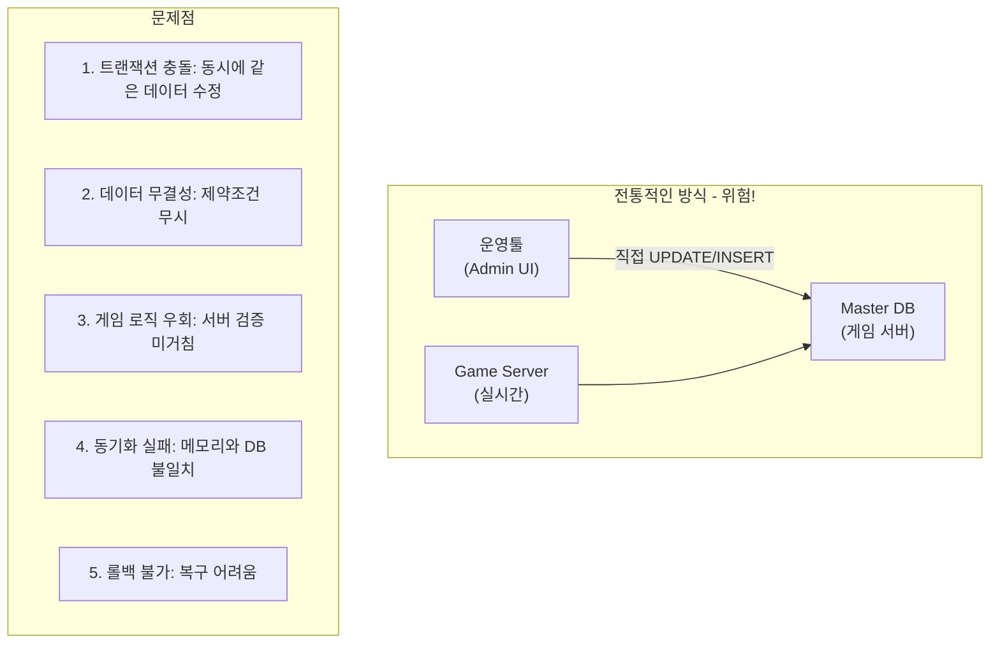
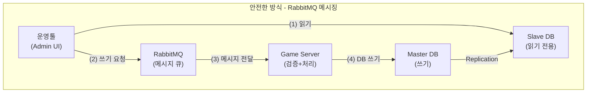
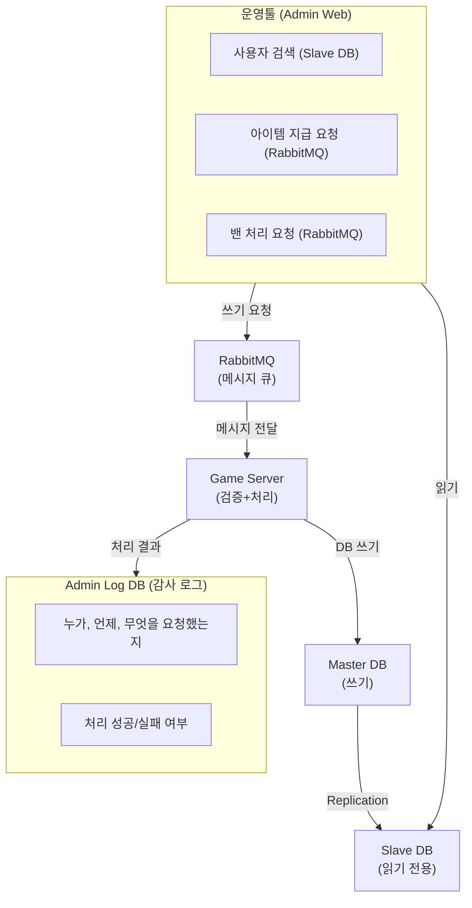
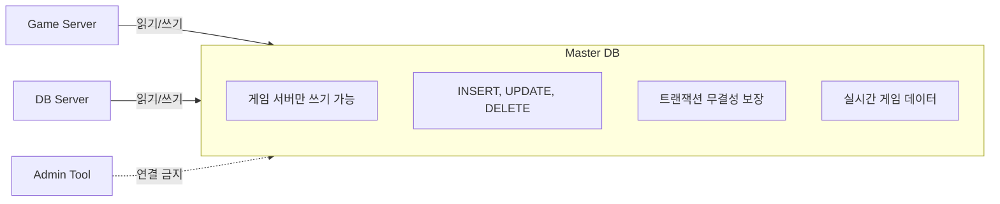
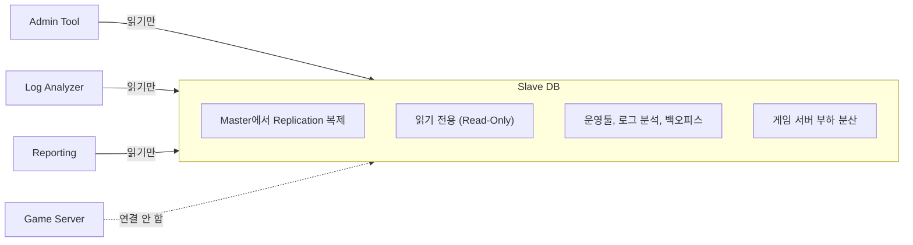
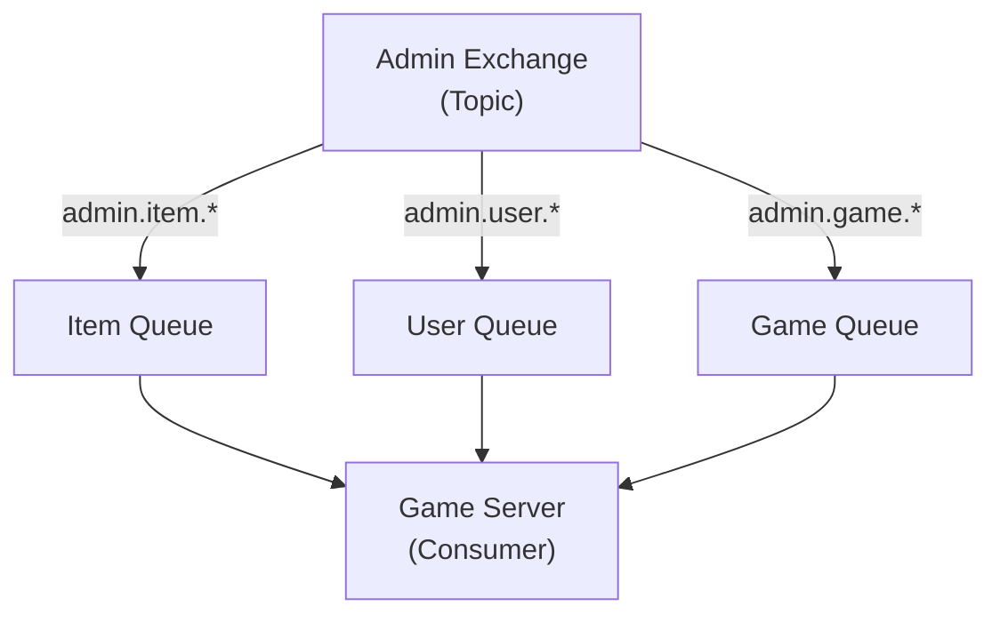

# 27. RabbitMQ 기반 운영툴 안전 연동 시스템

작성자: 안명달 (mooondal@gmail.com)

> **목차로 돌아가기**: [tech.md](tech.md)

---

## 개요

운영툴이 DB에 직접 쓰는 것을 방지하고, RabbitMQ 메시지 큐를 통해 게임 서버에 안전하게 쓰기 요청을 전달하는 Master-Slave DB 분리 기반 운영툴 연동 아키텍처이다.
관련된 큰 사고가 발생하지 않아, 항상 도움이 되었던 설계라고 생각한다.

### 문제점: 운영툴의 직접 DB 쓰기



### 해결: RabbitMQ 기반 분리 아키텍처



**장점:**
1. **읽기/쓰기 분리**: Slave에서 읽고, Master는 서버만 쓰기
2. **검증 보장**: 모든 쓰기는 게임 서버 로직 거침
3. **동기화 보장**: 서버 메모리와 DB 항상 일치
4. **비동기 처리**: 운영툴은 즉시 응답, 서버가 나중에 처리
5. **감사 추적**: 모든 쓰기 요청이 메시지로 기록

---

## 시스템 아키텍처

### 전체 구성도



---

## Master-Slave DB 분리

### Master DB (쓰기 전용)



### Slave DB (읽기 전용)



### Replication 설정 (MySQL)

```sql
-- Master DB 설정 (my.cnf)
[mysqld]
server-id = 1
log-bin = mysql-bin
binlog-format = ROW
binlog-do-db = game_user_db
binlog-do-db = game_main_db
binlog-do-db = game_static_db

-- Replication 사용자 생성
CREATE USER 'repl'@'slave_ip' IDENTIFIED BY 'repl_password';
GRANT REPLICATION SLAVE ON *.* TO 'repl'@'slave_ip';
FLUSH PRIVILEGES;

-- Master 상태 확인
SHOW MASTER STATUS;
-- File: mysql-bin.000001, Position: 12345
```

```sql
-- Slave DB 설정 (my.cnf)
[mysqld]
server-id = 2
read-only = 1  -- 읽기 전용relay-log = relay-bin
replicate-do-db = game_user_db
replicate-do-db = game_main_db
replicate-do-db = game_static_db

-- Master 연결 설정
CHANGE MASTER TO
    MASTER_HOST='master_ip',
    MASTER_USER='repl',
    MASTER_PASSWORD='repl_password',
    MASTER_LOG_FILE='mysql-bin.000001',
    MASTER_LOG_POS=12345;

START SLAVE;

-- Slave 상태 확인
SHOW SLAVE STATUS\G;
-- Slave_IO_Running: Yes
-- Slave_SQL_Running: Yes
-- Seconds_Behind_Master: 0
```

---

## RabbitMQ 메시지 큐

### Exchange 및 Queue 구조



### Exchange 설정

```javascript
// RabbitMQ 초기화 (Node.js 예시)

const amqp = require('amqplib');

async function setupRabbitMQ() {
    const connection = await amqp.connect('amqp://localhost');
    const channel = await connection.createChannel();
    
    // Exchange 생성 (Topic 타입)
    await channel.assertExchange('admin_exchange', 'topic', {
        durable: true  // 재시작 시에도 유지
    });
    
    // Queue 생성
    await channel.assertQueue('admin_item_queue', {
        durable: true,
        arguments: {
            'x-message-ttl': 3600000,  // 1시간 후 자동 삭제
            'x-max-length': 10000       // 최대 10000개 메시지
        }
    });
    
    await channel.assertQueue('admin_user_queue', { durable: true });
    await channel.assertQueue('admin_game_queue', { durable: true });
    
    // Binding (Routing Key)
    await channel.bindQueue('admin_item_queue', 'admin_exchange', 'admin.item.*');
    await channel.bindQueue('admin_user_queue', 'admin_exchange', 'admin.user.*');
    await channel.bindQueue('admin_game_queue', 'admin_exchange', 'admin.game.*');
    
    console.log('RabbitMQ setup complete');
}
```

### Routing Key 규칙

| Routing Key | 용도 | 예시 |
|-------------|------|------|
| `admin.item.give` | 아이템 지급 | 보상 아이템 지급 |
| `admin.item.delete` | 아이템 삭제 | 버그 아이템 회수 |
| `admin.user.ban` | 사용자 밴 | 어뷰징 유저 차단 |
| `admin.user.unban` | 사용자 언밴 | 밴 해제 |
| `admin.user.kick` | 강제 퇴장 | 긴급 퇴장 |
| `admin.game.maintenance` | 점검 공지 | 점검 예고 메시지 |
| `admin.game.notice` | 공지사항 | 전체 공지 전송 |

---

## 운영툴 구현

### 1. 읽기: Slave DB 조회

```typescript
// admin-tool/src/services/user.service.ts

import { Pool } from 'mysql2/promise';

class UserService {
    private slaveDb: Pool;
    
    constructor() {
        // Slave DB 연결 (읽기 전용)
        this.slaveDb = mysql.createPool({
            host: process.env.SLAVE_DB_HOST,
            port: 3306,
            user: process.env.SLAVE_DB_USER,
            password: process.env.SLAVE_DB_PASSWORD,
            database: 'game_user_db',
            // 읽기 전용 확인
            flags: ['-MULTI_STATEMENTS'],
            connectionLimit: 10
        });
    }
    
    // 사용자 검색 (Slave DB에서)
    async findUser(userId: string) {
        const [rows] = await this.slaveDb.execute(
            'SELECT * FROM t_user WHERE c_user_id = ?',
            [userId]
        );
        
        return rows[0];
    }
    
    // 사용자 아이템 목록 조회 (Slave DB에서)
    async getUserItems(userId: string) {
        const [rows] = await this.slaveDb.execute(
            'SELECT * FROM t_user_item WHERE c_user_id = ? ORDER BY c_date_created DESC',
            [userId]
        );
        
        return rows;
    }
    
    // 사용자 통계 조회 (Slave DB에서)
    async getUserStats(userId: string) {
        const [rows] = await this.slaveDb.execute(`
            SELECT 
                u.c_level,
                u.c_exp,
                u.c_gold,
                COUNT(i.c_id) AS item_count,
                MAX(l.c_date_login) AS last_login
            FROM t_user u
            LEFT JOIN t_user_item i ON u.c_user_id = i.c_user_id
            LEFT JOIN t_user_login_log l ON u.c_user_id = l.c_user_id
            WHERE u.c_user_id = ?
            GROUP BY u.c_user_id
        `, [userId]);
        
        return rows[0];
    }
}
```

### 2. 쓰기: RabbitMQ 메시지 전송

```typescript
// admin-tool/src/services/admin-command.service.ts

import amqp, { Channel, Connection } from 'amqplib';
import { v4 as uuidv4 } from 'uuid';

class AdminCommandService {
    private connection: Connection;
    private channel: Channel;
    private readonly EXCHANGE = 'admin_exchange';
    
    async connect() {
        this.connection = await amqp.connect('amqp://localhost');
        this.channel = await this.connection.createChannel();
        await this.channel.assertExchange(this.EXCHANGE, 'topic', { durable: true });
    }
    
    // 아이템 지급 요청
    async giveItem(adminId: string, userId: string, itemSid: number, itemCount: number, reason: string) {
        const requestId = uuidv4();
        
        const message = {
            request_id: requestId,
            admin_id: adminId,
            user_id: userId,
            item_sid: itemSid,
            item_count: itemCount,
            reason: reason,
            timestamp: new Date().toISOString()
        };
        
        // RabbitMQ로 전송
        this.channel.publish(
            this.EXCHANGE,
            'admin.item.give',  // Routing Key
            Buffer.from(JSON.stringify(message)),
            {
                persistent: true,      // 디스크에 저장 (재시작 시에도 유지)
                contentType: 'application/json',
                messageId: requestId,
                timestamp: Date.now()
            }
        );
        
        console.log(`[Admin] Item give request sent: ${requestId}`);
        
        // 감사 로그 기록
        await this.logAdminAction(adminId, 'GIVE_ITEM', message);
        
        return { request_id: requestId, status: 'pending' };
    }
    
    // 사용자 밴 요청
    async banUser(adminId: string, userId: string, reason: string, duration: number) {
        const requestId = uuidv4();
        
        const message = {
            request_id: requestId,
            admin_id: adminId,
            user_id: userId,
            reason: reason,
            duration: duration,  // 초 단위
            timestamp: new Date().toISOString()
        };
        
        this.channel.publish(
            this.EXCHANGE,
            'admin.user.ban',
            Buffer.from(JSON.stringify(message)),
            { persistent: true, contentType: 'application/json' }
        );
        
        console.log(`[Admin] User ban request sent: ${requestId}`);
        
        await this.logAdminAction(adminId, 'BAN_USER', message);
        
        return { request_id: requestId, status: 'pending' };
    }
    
    // 감사 로그 기록 (별도 DB)
    private async logAdminAction(adminId: string, action: string, data: any) {
        // Admin Log DB에 기록 (Master-Slave와 별개)
        await adminLogDb.execute(`
            INSERT INTO t_admin_action_log (
                c_admin_id, c_action, c_data, c_date_created
            ) VALUES (?, ?, ?, NOW())
        `, [adminId, action, JSON.stringify(data)]);
    }
}
```

### 3. 운영툴 API (Express)

```typescript
// admin-tool/src/routes/admin.routes.ts

import express from 'express';
import { AdminCommandService } from '../services/admin-command.service';
import { UserService } from '../services/user.service';

const router = express.Router();
const adminCommandService = new AdminCommandService();
const userService = new UserService();

// 사용자 검색 (Slave DB에서)
router.get('/users/:userId', async (req, res) => {
    try {
        const user = await userService.findUser(req.params.userId);
        if (!user) {
            return res.status(404).json({ error: 'User not found' });
        }
        res.json(user);
    } catch (error) {
        res.status(500).json({ error: error.message });
    }
});

// 아이템 지급 (RabbitMQ로)
router.post('/items/give', async (req, res) => {
    try {
        const { adminId, userId, itemSid, itemCount, reason } = req.body;
        
        // 1. 사용자 존재 확인 (Slave DB에서)
        const user = await userService.findUser(userId);
        if (!user) {
            return res.status(404).json({ error: 'User not found' });
        }
        
        // 2. 아이템 지급 요청 (RabbitMQ로)
        const result = await adminCommandService.giveItem(
            adminId, userId, itemSid, itemCount, reason
        );
        
        res.json({
            message: 'Item give request sent',
            request_id: result.request_id,
            status: 'pending',
            note: 'The request will be processed by the game server asynchronously'
        });
    } catch (error) {
        res.status(500).json({ error: error.message });
    }
});

// 사용자 밴 (RabbitMQ로)
router.post('/users/ban', async (req, res) => {
    try {
        const { adminId, userId, reason, duration } = req.body;
        
        const result = await adminCommandService.banUser(
            adminId, userId, reason, duration
        );
        
        res.json({
            message: 'User ban request sent',
            request_id: result.request_id,
            status: 'pending'
        });
    } catch (error) {
        res.status(500).json({ error: error.message });
    }
});
```

---

## 게임 서버 구현

### RabbitMQ Consumer (C++)

```cpp
// server/serverEngine/ServerEngine/RabbitMQ/RabbitMQConsumer.h

#pragma once

#include <amqpcpp.h>
#include <amqpcpp/libuv.h>
#include <functional>

class RabbitMQConsumer
{
private:
    std::unique_ptr<AMQP::TcpConnection> mConnection;
    std::unique_ptr<AMQP::TcpChannel> mChannel;
    std::string mQueueName;
    
public:
    using MessageHandler = std::function<void(const std::string& message)>;
    
    RabbitMQConsumer(const std::string& queueName);
    
    void Connect(const std::string& host, uint16_t port);
    void StartConsuming(MessageHandler handler);
    void Stop();
};
```

```cpp
// server/serverEngine/ServerEngine/RabbitMQ/RabbitMQConsumer.cpp

#include "RabbitMQConsumer.h"
#include "json.hpp"

using json = nlohmann::json;

RabbitMQConsumer::RabbitMQConsumer(const std::string& queueName)
    : mQueueName(queueName)
{
}

void RabbitMQConsumer::Connect(const std::string& host, uint16_t port)
{
    // libuv 이벤트 루프 생성
    auto loop = uv_default_loop();
    
    // AMQP 연결
    AMQP::LibUvHandler handler(loop);
    mConnection = std::make_unique<AMQP::TcpConnection>(&handler, AMQP::Address(host, port, "guest", "guest"));
    
    // 채널 생성
    mChannel = std::make_unique<AMQP::TcpChannel>(mConnection.get());
    
    // Exchange 선언
    mChannel->declareExchange("admin_exchange", AMQP::topic, AMQP::durable);
    
    // Queue 선언
    mChannel->declareQueue(mQueueName, AMQP::durable);
}

void RabbitMQConsumer::StartConsuming(MessageHandler handler)
{
    // 메시지 소비 시작
    mChannel->consume(mQueueName)
        .onReceived([this, handler](const AMQP::Message& message, uint64_t deliveryTag, bool redelivered)
        {
            // 메시지 본문 추출
            std::string body(message.body(), message.bodySize());
            
            try
            {
                // 핸들러 호출 (Worker 스레드로 디스패치)
                handler(body);
                
                // ACK (정상 처리 완료)
                mChannel->ack(deliveryTag);
            }
            catch (const std::exception& e)
            {
                // 처리 실패 시 NACK (재시도)
                _DEBUG_LOG(RED, L"[RabbitMQ] Message processing failed: {}", e.what());
                mChannel->reject(deliveryTag, true);  // requeue = true
            }
        });
}
```

### Admin Command Handler (C++)

```cpp
// server/mainServer/MainServer/AdminCommandHandler/AdminCommandHandler.h

#pragma once

#include "json.hpp"

class AdminCommandHandler
{
public:
    // 아이템 지급
    void HandleGiveItem(const nlohmann::json& message);
    
    // 사용자 밴
    void HandleBanUser(const nlohmann::json& message);
    
    // 사용자 언밴
    void HandleUnbanUser(const nlohmann::json& message);
    
    // 공지사항 전송
    void HandleSendNotice(const nlohmann::json& message);
    
private:
    // 처리 결과 로깅
    void LogCommandResult(const std::string& requestId, const std::string& action, bool success, const std::string& reason);
};

inline std::shared_ptr<AdminCommandHandler> gAdminCommandHandler = nullptr;
```

```cpp
// server/mainServer/MainServer/AdminCommandHandler/AdminCommandHandler.cpp

#include "AdminCommandHandler.h"
#include "ServerEngine/Util/UuidUtil/UuidUtil.h"
#include "DbServer/Util/DbSocketUtil/DbSocketUtil.h"

void AdminCommandHandler::HandleGiveItem(const nlohmann::json& message)
{
    try
    {
        // 메시지 파싱
        std::string requestId = message["request_id"];
        std::string adminId = message["admin_id"];
        std::string userId = message["user_id"];
        int64_t itemSid = message["item_sid"];
        int64_t itemCount = message["item_count"];
        std::string reason = message["reason"];
        
        _DEBUG_LOG(GREEN, L"[Admin] Give item: {} x{} to user {}", itemSid, itemCount, userId.c_str());
        
        // 1. 사용자 존재 확인
        // (DB 서버에 요청하여 확인)
        
        // 2. 아이템 지급 (DB 서버로 요청)
        // SocketUtil::Request<...> 사용
        
        // 3. 로그 기록
        LogId logId = UuidUtil::GenerateLogId();
        DbSocketUtil::SendLog<INSERT_LOG_ITEM::Writer> wp(
            UuidUtil::GenerateUuid(),
            logId,
            UuidUtil::ParseUuid(userId),
            itemSid,
            itemCount,
            tClock.GetGlobalNowTt(),
            tClock.GetGlobalNowTt()
        );
        
        // 4. 처리 결과 로깅
        LogCommandResult(requestId, "GIVE_ITEM", true, "Success");
        
        _DEBUG_LOG(GREEN, L"[Admin] Item given successfully: {}", requestId.c_str());
    }
    catch (const std::exception& e)
    {
        _DEBUG_LOG(RED, L"[Admin] Failed to give item: {}", e.what());
        LogCommandResult(message["request_id"], "GIVE_ITEM", false, e.what());
        throw;
    }
}

void AdminCommandHandler::HandleBanUser(const nlohmann::json& message)
{
    try
    {
        std::string requestId = message["request_id"];
        std::string adminId = message["admin_id"];
        std::string userId = message["user_id"];
        std::string reason = message["reason"];
        int64_t duration = message["duration"];
        
        _DEBUG_LOG(YELLOW, L"[Admin] Ban user: {} for {} seconds, reason: {}",
            userId.c_str(), duration, reason.c_str());
        
        // 1. 사용자 밴 처리 (DB 업데이트)
        time_t banUntil = tClock.GetGlobalNowTt() + duration;
        // UPDATE t_user SET c_ban_until = ? WHERE c_user_id = ?
        
        // 2. 현재 로그인 중이면 강제 퇴장
        // (Main 서버에서 해당 유저 소켓 찾아서 Disconnect)
        
        // 3. 로그 기록
        LogId logId = UuidUtil::GenerateLogId();
        DbSocketUtil::SendLog<INSERT_LOG_USER::Writer> wp(
            UuidUtil::GenerateUuid(),
            logId,
            UuidUtil::ParseUuid(userId),
            L"BAN",
            duration,
            tClock.GetGlobalNowTt(),
            tClock.GetGlobalNowTt()
        );
        
        LogCommandResult(requestId, "BAN_USER", true, "Success");
        
        _DEBUG_LOG(GREEN, L"[Admin] User banned successfully: {}", requestId.c_str());
    }
    catch (const std::exception& e)
    {
        _DEBUG_LOG(RED, L"[Admin] Failed to ban user: {}", e.what());
        LogCommandResult(message["request_id"], "BAN_USER", false, e.what());
        throw;
    }
}

void AdminCommandHandler::LogCommandResult(
    const std::string& requestId,
    const std::string& action,
    bool success,
    const std::string& reason)
{
    // Admin Log DB에 기록
    // (별도 Log DB 또는 Admin Log 테이블)
    _DEBUG_LOG(CYAN, L"[Admin] Command result: {} - {} - {}",
        requestId.c_str(),
        success ? L"SUCCESS" : L"FAILED",
        reason.c_str());
}
```

### Main Server 초기화

```cpp
// server/mainServer/MainServer/App/MainServerApp.cpp

#include "ServerEngine/RabbitMQ/RabbitMQConsumer.h"
#include "MainServer/AdminCommandHandler/AdminCommandHandler.h"

MainServerApp::MainServerApp(AppArg appArg)
    : AppBase(AppType::MAIN_SERVER, appArg)
{
    // ... 기존 초기화 ...
    
    // Admin Command Handler 생성
    gAdminCommandHandler = std::make_shared<AdminCommandHandler>();
    
    // RabbitMQ Consumer 시작
    mRabbitMQConsumer = std::make_shared<RabbitMQConsumer>("admin_item_queue");
    mRabbitMQConsumer->Connect("localhost", 5672);
    mRabbitMQConsumer->StartConsuming([](const std::string& message)
    {
        // JSON 파싱
        nlohmann::json j = nlohmann::json::parse(message);
        
        // Routing Key에 따라 핸들러 호출
        std::string action = j["action"];  // 또는 메시지 타입 필드
        
        if (action == "give_item")
        {
            gAdminCommandHandler->HandleGiveItem(j);
        }
        else if (action == "ban_user")
        {
            gAdminCommandHandler->HandleBanUser(j);
        }
        // ...
    });
}
```

---

## 실전 시나리오

### 시나리오 1: 아이템 지급

```
[운영자 액션]
1. 운영툴 로그인
2. 사용자 검색 (Slave DB에서)
   -> "홍길동" 검색 -> user_id: "abc123"
3. 아이템 지급 버튼 클릭
   - 아이템: "전설 무기 상자" (itemSid: 5001)
   - 개수: 1
   - 사유: "이벤트 보상"
4. 요청 전송 (RabbitMQ)

[시스템 처리]
1. Admin Tool -> RabbitMQ
   - Exchange: admin_exchange
   - Routing Key: admin.item.give
   - Message: { request_id, user_id, item_sid, item_count, reason }

2. RabbitMQ -> Game Server
   - Consumer가 메시지 수신
   - AdminCommandHandler::HandleGiveItem() 호출

3. Game Server -> Master DB
   - t_user_item 테이블에 INSERT
   - 사용자가 로그인 중이면 실시간 반영

4. 로그 기록
   - t_log_item에 지급 기록
   - t_admin_action_log에 운영자 액션 기록

5. 결과
   - 사용자가 로그인 중 -> 즉시 인벤토리에 아이템 추가
   - 사용자가 오프라인 -> 다음 로그인 시 아이템 수령
```

### 시나리오 2: 어뷰징 유저 밴

```
[운영자 액션]
1. 어뷰징 리포트 확인 (Slave DB에서)
   -> user_id: "xyz789" (골드 복사 버그 악용)
2. 사용자 상세 조회 (Slave DB)
   - 최근 골드 획득 이력
   - 최근 거래 이력
3. 밴 처리 결정
   - 기간: 7일 (604800초)
   - 사유: "골드 복사 버그 악용"
4. 밴 요청 전송 (RabbitMQ)

[시스템 처리]
1. Admin Tool -> RabbitMQ
   - Routing Key: admin.user.ban
   - Message: { request_id, user_id, reason, duration }

2. Game Server -> Master DB
   - UPDATE t_user SET c_ban_until = NOW() + 604800 WHERE c_user_id = ?

3. Game Server -> 강제 퇴장
   - 해당 유저가 로그인 중이면 즉시 Disconnect
   - "귀하는 7일간 정지됨. 사유: 골드 복사 버그 악용" 메시지 전송

4. 로그 기록
   - t_log_user에 밴 기록
   - t_admin_action_log에 운영자 액션 기록

5. 이후 로그인 시도
   - 밴 기간 확인 후 "정지된 계정이다" 에러 반환
```

### 시나리오 3: 긴급 점검 공지

```
[운영자 액션]
1. 긴급 점검 결정 (30분 후 점검 예정)
2. 전체 공지 작성
   - 제목: "긴급 점검 안내"
   - 내용: "30분 후 서버 점검이 진행된다"
3. 공지 전송 (RabbitMQ)

[시스템 처리]
1. Admin Tool -> RabbitMQ
   - Routing Key: admin.game.notice
   - Message: { request_id, title, content, is_urgent: true }

2. Game Server -> 전체 유저에게 공지
   - 현재 로그인한 모든 유저에게 NOTIFY_SYSTEM_MESSAGE 패킷 전송
   - 팝업으로 공지 표시

3. 로그 기록
   - t_admin_action_log에 공지 전송 기록
```

---

## 장점

| 장점 | 설명 |
|------|------|
| **트랜잭션 안전성** | 게임 서버만 DB에 쓰기 -> 충돌 없음 |
| **데이터 무결성** | 모든 쓰기는 서버 검증 로직 거침 |
| **동기화 보장** | 서버 메모리와 DB 항상 일치 |
| **읽기 부하 분산** | Slave DB로 운영툴 조회 -> Master 부하 감소 |
| **비동기 처리** | 운영툴 즉시 응답 -> 서버가 나중에 처리 |
| **감사 추적** | 모든 요청이 메시지로 기록 -> 누가, 언제, 무엇을 했는지 추적 |
| **재시도 보장** | RabbitMQ가 메시지 영속성 보장 -> 서버 재시작해도 처리됨 |
| **확장 가능** | 게임 서버 인스턴스 늘려도 동일하게 작동 |
| **롤백 가능** | 잘못된 요청도 로그에 남아 있어 추적 및 복구 가능 |

---

## 성능 최적화

### 1. Slave Replication 지연 모니터링

```sql
-- Slave 상태 확인
SHOW SLAVE STATUS\G;

-- Seconds_Behind_Master: 0  (이상적)
-- Seconds_Behind_Master: 5  (약간 지연, 허용 가능)
-- Seconds_Behind_Master: 60 (심각한 지연, 조사 필요)
```

**지연 발생 시 대응:**
- Slave 하드웨어 업그레이드 (CPU, 메모리, 디스크)
- Master의 binlog 설정 최적화
- Slave 수 증가 (부하 분산)

### 2. RabbitMQ 큐 크기 모니터링

```bash
# 큐 상태 확인
rabbitmqctl list_queues name messages consumers

# 결과:
# admin_item_queue  0  1     (정상)
# admin_user_queue  500 1    (지연 발생, 처리 속도 < 유입 속도)
```

**큐 크기 증가 시 대응:**
- Game Server Consumer 수 증가
- Worker 스레드 추가
- 메시지 처리 로직 최적화

### 3. Message TTL 설정

```javascript
// 메시지가 1시간 동안 처리되지 않으면 자동 삭제
await channel.assertQueue('admin_item_queue', {
    arguments: {
        'x-message-ttl': 3600000  // 1시간
    }
});
```

---

## 보안 고려사항

### 1. Admin 인증 및 권한 관리

```typescript
// admin-tool/src/middleware/auth.middleware.ts

export function requireAdmin(req, res, next) {
    const token = req.headers.authorization;
    
    // JWT 토큰 검증
    const decoded = jwt.verify(token, SECRET_KEY);
    
    // Admin 권한 확인
    if (decoded.role !== 'ADMIN') {
        return res.status(403).json({ error: 'Forbidden' });
    }
    
    // Admin 레벨 확인 (SUPER_ADMIN, ADMIN, SUPPORT)
    if (decoded.admin_level < REQUIRED_LEVEL) {
        return res.status(403).json({ error: 'Insufficient permission' });
    }
    
    req.admin = decoded;
    next();
}
```

### 2. 감사 로그 필수

```sql
-- t_admin_action_log 테이블

CREATE TABLE t_admin_action_log (
    c_id BINARY(16) PRIMARY KEY,
    c_admin_id VARCHAR(50) NOT NULL,
    c_action VARCHAR(50) NOT NULL,
    c_target_user_id BINARY(16),
    c_data JSON,
    c_ip_address VARCHAR(50),
    c_success BOOLEAN,
    c_error_message TEXT,
    c_date_created TIMESTAMP DEFAULT CURRENT_TIMESTAMP,
    INDEX idx_admin_id (c_admin_id),
    INDEX idx_date (c_date_created)
);

-- 모든 Admin 액션 기록
INSERT INTO t_admin_action_log (
    c_id, c_admin_id, c_action, c_target_user_id, c_data, c_ip_address, c_success
) VALUES (?, ?, ?, ?, ?, ?, ?);
```

### 3. IP 화이트리스트

```typescript
// admin-tool/src/middleware/ip-whitelist.middleware.ts

const ALLOWED_IPS = [
    '10.0.0.0/8',     // 내부 네트워크
    '203.0.113.5',    // 운영팀 사무실 IP
];

export function checkIpWhitelist(req, res, next) {
    const clientIp = req.ip;
    
    if (!isIpInWhitelist(clientIp, ALLOWED_IPS)) {
        return res.status(403).json({ error: 'IP not allowed' });
    }
    
    next();
}
```

---

## 관련 기술

| 기술 | 역할 |
|------|------|
| **RabbitMQ** | 메시지 큐 (운영툴 -> 게임 서버) |
| **MySQL Replication** | Master-Slave 복제 (읽기/쓰기 분리) |
| **AMQP** | 메시지 프로토콜 |
| **JSON** | 메시지 포맷 |
| **UUID** | 요청 ID 생성 |
| **JWT** | Admin 인증 |
| **Express.js** | Admin Tool API |
| **libuv** | 비동기 I/O (C++) |

---

## 결론

**RabbitMQ 기반 운영툴 연동 시스템**은 **Master-Slave DB 분리**와 **메시지 큐**를 활용하여 **안전하고 확장 가능한 운영툴 아키텍처**를 제공한다.

**핵심:**
- Slave DB에서 읽기 (부하 분산)
- RabbitMQ로 쓰기 요청 (비동기)
- 게임 서버만 Master DB 쓰기 (안전성)
- 모든 액션 감사 로그 (추적)

**효과:**
- 트랜잭션 충돌 방지- 데이터 무결성 보장- 서버 메모리-DB 동기화- 운영자 실수 방지 (검증 로직)- 감사 추적 가능
---

[목차로 돌아가기](tech.md)
