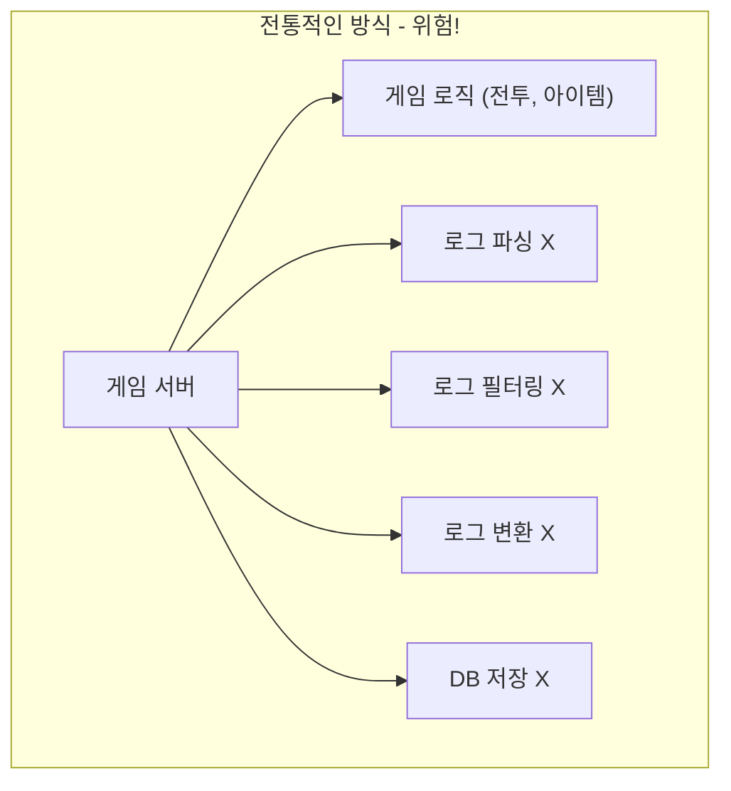
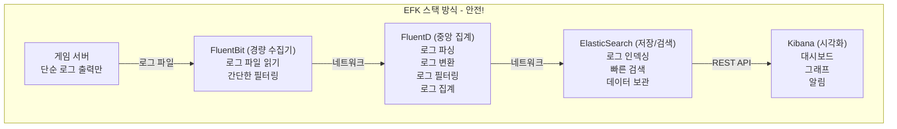
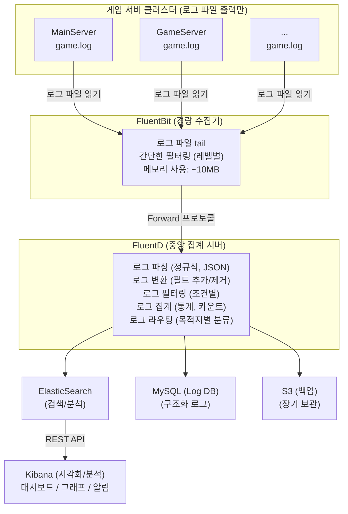

# 28. EFK 스택 기반 로그 수집 및 분석 시스템

작성자: 안명달 (mooondal@gmail.com)

> **목차로 돌아가기**: [tech.md](tech.md)

---

## 개요

FluentBit + FluentD + ElasticSearch + Kibana (EFK 스택)을 활용하여 로그 가공 로직을 게임 서버와 분리한 로그 분석 시스템이다.
로그 처리에 에러가 발생하더라도 게임서버에 영향을 주지 않는다는 점과 텔레그램 알림 전송과 같은 부분에도 유연하게 적용할 수 있는 점이 장점이다.

### 특징: 로그 가공 분리

#### 전통적인 방식 - 위험!



**문제점:**
1. 로그 가공 로직이 게임 성능에 영향
2. 로그 형식 변경 시 게임 서버 재배포 필요
3. 로그 처리 버그가 게임 로직에 영향
4. 로그 처리 부하가 게임 서버 과부하 유발

#### EFK 스택 방식 - 안전!



**장점:**
1. 게임 서버는 로그만 출력 -> 성능 영향 최소화
2. 로그 파싱/변환 로직 변경 -> 게임 서버 재배포 불필요
3. 로그 처리 버그 -> 게임 로직에 영향 없음
4. 로그 처리 부하 -> 별도 서버에서 처리
5. 실시간 모니터링 -> Kibana 대시보드

---

## 시스템 아키텍처

### 전체 구성도



---

## 게임 서버: 단순 로그 출력

### 로그 파일 포맷

**게임 서버는 단순히 로그를 파일에 출력만 한다. 파싱이나 변환은 하지 않는다.**

```
[로그 파일: game_main_001.log]

2025-01-06 10:23:45.123 [INFO] [MainServer] Server started, app_id=1
2025-01-06 10:23:46.456 [INFO] [MainServer] Connected to DB, connection_count=10
2025-01-06 10:24:00.789 [INFO] [UserLogin] User logged in, user_id=abc123, ip=203.0.113.5
2025-01-06 10:24:05.012 [WARN] [DbQuery] Slow query detected, query_time=2.5s, sql=SELECT * FROM t_user
2025-01-06 10:24:10.345 [ERROR] [Network] Connection timeout, remote_ip=198.51.100.10, error=timeout
2025-01-06 10:24:15.678 [INFO] [ItemGive] Item given, user_id=abc123, item_sid=5001, item_count=10
```

**형식:**
```
TIMESTAMP [LEVEL] [CATEGORY] MESSAGE, key1=value1, key2=value2, ...
```

### C++ 로그 출력 코드

```cpp
// server/serverEngine/ServerEngine/Log/LogWriter/LogWriterFile.cpp

void LogWriterFile::WriteToFile(Log* log)
{
    if (nullptr == log)
        return;
    
    while (nullptr != log)
    {
        // 로그 파일에 단순 텍스트로 출력
        // 파싱이나 변환은 하지 않음!
        std::wstring logText = std::format(
            L"{} [{}] [{}] {}\n",
            TimeUtil::GetCurrentTimeString(),     // 2025-01-06 10:23:45.123
            GetLogLevelString(log->GetLevel()),   // INFO, WARN, ERROR
            log->GetCategory(),                   // MainServer, UserLogin
            log->GetMessage()                     // 실제 메시지
        );
        
        // 파일에 쓰기 (단순 append)
        mTextFile->WriteToFile(logText);
        
        log = log->GetNext();
    }
}
```

**핵심: 게임 서버는 로그를 "그냥 출력"만 한다. 어떤 가공도 하지 않는다!**

---

## FluentBit: 경량 로그 수집기

### 역할

**각 게임 서버에 설치되어 로그 파일을 실시간으로 읽어서 FluentD로 전송한다.**

- **메모리 사용: ~10MB** (매우 경량!)
- **CPU 사용: < 1%**
- **게임 서버 성능에 영향 없음**

### 설치 (Windows)

```powershell
# FluentBit 설치
choco install fluent-bit

# 또는 직접 다운로드
# https://fluentbit.io/download/
```

### 설정 파일 (fluent-bit.conf)

```ini
[SERVICE]
    Flush        5
    Daemon       Off
    Log_Level    info

# 입력: 로그 파일 읽기 (tail)
[INPUT]
    Name         tail
    Path         C:/dev/nearest3/Build/Debug/16_main/*.log
    Tag          game.main
    Read_from_Head  False
    Refresh_Interval 5

[INPUT]
    Name         tail
    Path         C:/dev/nearest3/Build/Debug/17_game/*.log
    Tag          game.game
    Read_from_Head  False

[INPUT]
    Name         tail
    Path         C:/dev/nearest3/Build/Debug/18_db/*.log
    Tag          game.db
    Read_from_Head  False

# 필터: 간단한 전처리 (선택적)
[FILTER]
    Name         grep
    Match        game.*
    Exclude      log_level DEBUG   # DEBUG 레벨 제외

# 출력: FluentD로 전송
[OUTPUT]
    Name         forward
    Match        game.*
    Host         fluentd.game-server.com
    Port         24224
    Retry_Limit  5
```

**동작:**
1. 로그 파일을 실시간으로 tail (새 줄 감지)
2. 간단한 필터링 (DEBUG 레벨 제외 등)
3. FluentD로 전송 (Forward 프로토콜)

**게임 서버에 영향 없음:**
- 로그 파일을 읽기만 함 (쓰기 없음)
- 비동기로 동작 (게임 서버 블록 안 함)
- 메모리 10MB, CPU 1% 미만

---

## FluentD: 중앙 로그 집계 및 가공

### 역할

**모든 게임 서버의 로그를 받아서 파싱, 변환, 필터링, 집계를 수행한다.**

- **로그 파싱**: 정규식으로 구조화
- **로그 변환**: 필드 추가/제거/변경
- **로그 필터링**: 조건에 맞는 로그만 선택
- **로그 집계**: 통계, 카운트
- **로그 라우팅**: 목적지별로 분류 (ElasticSearch, MySQL, S3)

### 설치 (Docker)

```yaml
# docker-compose.yml

version: '3'
services:
  fluentd:
    image: fluent/fluentd:v1.16-1
    ports:
      - "24224:24224"
      - "24224:24224/udp"
    volumes:
      - ./fluentd/conf:/fluentd/etc
      - ./fluentd/log:/fluentd/log
    environment:
      - FLUENTD_CONF=fluent.conf
```

### 설정 파일 (fluent.conf)

```ruby
# 입력: FluentBit으로부터 수신
<source>
  @type forward
  port 24224
  bind 0.0.0.0
</source>

# 필터: 로그 파싱 (정규식)
<filter game.**>
  @type parser
  key_name message
  reserve_data true
  <parse>
    @type regexp
    expression /^(?<timestamp>[\d\-: .]+) \[(?<level>\w+)\] \[(?<category>\w+)\] (?<message>.*)$/
  </parse>
</filter>

# 필터: key=value 파싱
<filter game.**>
  @type parser
  key_name message
  reserve_data true
  <parse>
    @type regexp
    expression /user_id=(?<user_id>[^,\s]+)|item_sid=(?<item_sid>\d+)|item_count=(?<item_count>\d+)|query_time=(?<query_time>[\d.]+)s/
  </parse>
</filter>

# 필터: 필드 추가
<filter game.**>
  @type record_transformer
  <record>
    server_type ${tag_parts[1]}   # game.main -> main
    hostname "#{Socket.gethostname}"
    environment production
  </record>
</filter>

# 필터: 느린 쿼리만 선택
<filter game.**>
  @type grep
  <regexp>
    key query_time
    pattern /^([3-9]|[1-9]\d+)\./  # 3초 이상
  </regexp>
</filter>

# 출력 1: ElasticSearch (모든 로그)
<match game.**>
  @type elasticsearch
  host elasticsearch.game-server.com
  port 9200
  logstash_format true
  logstash_prefix game-logs
  include_tag_key true
  tag_key @log_type
  flush_interval 5s
</match>

# 출력 2: MySQL (중요 로그만)
<match game.** >
  @type sql
  host mysql.game-server.com
  port 3306
  database game_log_db
  adapter mysql2
  username root
  password password
  
  <table>
    table t_log_slow_query
    column_mapping 'timestamp:c_timestamp,category:c_category,query_time:c_query_time,sql:c_sql'
  </table>
</match>

# 출력 3: S3 (장기 보관)
<match game.**>
  @type s3
  aws_key_id YOUR_AWS_KEY
  aws_sec_key YOUR_AWS_SECRET
  s3_bucket game-logs
  s3_region ap-northeast-2
  path logs/%Y/%m/%d/
  time_slice_format %Y%m%d-%H
  <buffer>
    @type file
    path /var/log/fluent/s3
    timekey 3600      # 1시간마다
    timekey_wait 10m
    chunk_limit_size 256m
  </buffer>
</match>
```

### 로그 파싱 예시

**입력 (게임 서버 로그):**
```
2025-01-06 10:24:15.678 [INFO] [ItemGive] Item given, user_id=abc123, item_sid=5001, item_count=10
```

**FluentD 파싱 후:**
```json
{
  "timestamp": "2025-01-06 10:24:15.678",
  "level": "INFO",
  "category": "ItemGive",
  "message": "Item given, user_id=abc123, item_sid=5001, item_count=10",
  "user_id": "abc123",
  "item_sid": 5001,
  "item_count": 10,
  "server_type": "main",
  "hostname": "game-server-01",
  "environment": "production",
  "@log_type": "game.main"
}
```

**핵심: 복잡한 파싱 로직이 게임 서버가 아닌 FluentD에서 실행된다!**

---

## ElasticSearch: 로그 저장 및 검색

### 역할

**파싱된 로그를 인덱싱하여 빠른 검색을 제공한다.**

- **전문 검색**: 키워드로 로그 검색
- **집계 쿼리**: 통계, 카운트, 평균 계산
- **시계열 데이터**: 시간별 로그 분석
- **확장 가능**: 샤딩으로 수평 확장

### 설치 (Docker)

```yaml
# docker-compose.yml

services:
  elasticsearch:
    image: docker.elastic.co/elasticsearch/elasticsearch:8.11.0
    environment:
      - discovery.type=single-node
      - "ES_JAVA_OPTS=-Xms2g -Xmx2g"
      - xpack.security.enabled=false
    ports:
      - "9200:9200"
      - "9300:9300"
    volumes:
      - esdata:/usr/share/elasticsearch/data

volumes:
  esdata:
```

### 인덱스 템플릿

```json
PUT _index_template/game-logs
{
  "index_patterns": ["game-logs-*"],
  "template": {
    "mappings": {
      "properties": {
        "timestamp": { "type": "date" },
        "level": { "type": "keyword" },
        "category": { "type": "keyword" },
        "message": { "type": "text" },
        "user_id": { "type": "keyword" },
        "item_sid": { "type": "long" },
        "item_count": { "type": "long" },
        "query_time": { "type": "float" },
        "server_type": { "type": "keyword" },
        "hostname": { "type": "keyword" }
      }
    },
    "settings": {
      "number_of_shards": 3,
      "number_of_replicas": 1,
      "index.lifecycle.name": "game-logs-policy",
      "index.lifecycle.rollover_alias": "game-logs"
    }
  }
}
```

### 검색 쿼리 예시

**1. 특정 사용자의 로그 검색:**

```json
GET game-logs-*/_search
{
  "query": {
    "term": {
      "user_id": "abc123"
    }
  },
  "sort": [
    { "timestamp": "desc" }
  ],
  "size": 100
}
```

**2. 느린 쿼리 통계:**

```json
GET game-logs-*/_search
{
  "query": {
    "range": {
      "query_time": {
        "gte": 3.0
      }
    }
  },
  "aggs": {
    "slow_queries_per_hour": {
      "date_histogram": {
        "field": "timestamp",
        "interval": "hour"
      }
    },
    "avg_query_time": {
      "avg": {
        "field": "query_time"
      }
    }
  }
}
```

**3. 에러 로그 통계 (최근 1시간):**

```json
GET game-logs-*/_search
{
  "query": {
    "bool": {
      "must": [
        { "term": { "level": "ERROR" } },
        {
          "range": {
            "timestamp": {
              "gte": "now-1h"
            }
          }
        }
      ]
    }
  },
  "aggs": {
    "errors_by_category": {
      "terms": {
        "field": "category",
        "size": 10
      }
    }
  }
}
```

---

## Kibana: 로그 시각화 및 대시보드

### 역할

**ElasticSearch의 데이터를 시각화하여 직관적인 대시보드를 제공한다.**

- **대시보드**: 실시간 모니터링
- **그래프**: 시계열, 파이 차트, 히트맵
- **알림**: 이상 징후 자동 알림
- **Discover**: 로그 탐색 및 검색

### 설치 (Docker)

```yaml
# docker-compose.yml

services:
  kibana:
    image: docker.elastic.co/kibana/kibana:8.11.0
    ports:
      - "5601:5601"
    environment:
      - ELASTICSEARCH_HOSTS=http://elasticsearch:9200
    depends_on:
      - elasticsearch
```

### 대시보드 구성

#### 1. 서버 상태 대시보드

```
┌─────────────────────────────────────────────────────────┐
│              게임 서버 상태 대시보드                     │
├─────────────────────────────────────────────────────────┤
│                                                          │
│  ┌────────────┐  ┌────────────┐  ┌────────────┐        │
│  │ 총 로그 수 │  │  에러 수   │  │  경고 수   │        │
│  │  1,234,567 │  │     123    │  │     456    │        │
│  └────────────┘  └────────────┘  └────────────┘        │
│                                                          │
│  ┌──────────────────────────────────────────────┐      │
│  │        시간별 로그 레벨 분포                  │      │
│  │  [Line Chart]                                 │      │
│  │   INFO  ────────────────────                 │      │
│  │   WARN  ─────────                             │      │
│  │   ERROR ───                                   │      │
│  └──────────────────────────────────────────────┘      │
│                                                          │
│  ┌──────────────────────────────────────────────┐      │
│  │        서버별 에러 로그 분포                  │      │
│  │  [Bar Chart]                                  │      │
│  │  MainServer   ████████ 50                     │      │
│  │  GameServer   ██████ 30                       │      │
│  │  DbServer     ████ 20                         │      │
│  └──────────────────────────────────────────────┘      │
│                                                          │
└─────────────────────────────────────────────────────────┘
```

#### 2. 사용자 행동 대시보드

```
┌─────────────────────────────────────────────────────────┐
│              사용자 행동 분석                            │
├─────────────────────────────────────────────────────────┤
│                                                          │
│  ┌────────────┐  ┌────────────┐  ┌────────────┐        │
│  │ 접속 유저  │  │ 신규 유저  │  │ 로그아웃   │        │
│  │   10,234   │  │     567    │  │   1,234    │        │
│  └────────────┘  └────────────┘  └────────────┘        │
│                                                          │
│  ┌──────────────────────────────────────────────┐      │
│  │        시간별 아이템 지급 통계                │      │
│  │  [Area Chart]                                 │      │
│  │  아이템 지급 수 ▁▂▃▅▆▇█▇▆▅▃▂▁              │      │
│  └──────────────────────────────────────────────┘      │
│                                                          │
│  ┌──────────────────────────────────────────────┐      │
│  │        인기 아이템 TOP 10                     │      │
│  │  [Pie Chart]                                  │      │
│  │  전설 무기 상자: 30%                          │      │
│  │  골드 팩: 25%                                 │      │
│  │  경험치 물약: 15%                             │      │
│  └──────────────────────────────────────────────┘      │
│                                                          │
└─────────────────────────────────────────────────────────┘
```

#### 3. 성능 모니터링 대시보드

```
┌─────────────────────────────────────────────────────────┐
│              성능 모니터링                               │
├─────────────────────────────────────────────────────────┤
│                                                          │
│  ┌──────────────────────────────────────────────┐      │
│  │        DB 쿼리 시간 분포                      │      │
│  │  [Histogram]                                  │      │
│  │  < 1s  ████████████████████ 90%              │      │
│  │  1-3s  ████ 7%                                │      │
│  │  > 3s  █ 3% [주의] (느린 쿼리)                │      │
│  └──────────────────────────────────────────────┘      │
│                                                          │
│  ┌──────────────────────────────────────────────┐      │
│  │        느린 쿼리 TOP 10                       │      │
│  │  [Table]                                      │      │
│  │  시간    │ 쿼리                 │ 서버        │      │
│  │  10:23  │ SELECT * FROM ...   │ DbServer    │      │
│  │  10:24  │ UPDATE t_user ...   │ DbServer    │      │
│  └──────────────────────────────────────────────┘      │
│                                                          │
└─────────────────────────────────────────────────────────┘
```

### 알림 설정

```json
POST _watcher/watch/slow_query_alert
{
  "trigger": {
    "schedule": {
      "interval": "5m"
    }
  },
  "input": {
    "search": {
      "request": {
        "indices": ["game-logs-*"],
        "body": {
          "query": {
            "bool": {
              "must": [
                { "range": { "query_time": { "gte": 5.0 } } },
                { "range": { "timestamp": { "gte": "now-5m" } } }
              ]
            }
          }
        }
      }
    }
  },
  "condition": {
    "compare": {
      "ctx.payload.hits.total": {
        "gte": 10
      }
    }
  },
  "actions": {
    "send_email": {
      "email": {
        "to": "ops@game-server.com",
        "subject": "[경고] 느린 쿼리 10개 이상 감지",
        "body": "최근 5분간 5초 이상 소요된 쿼리가 {{ctx.payload.hits.total}}개 감지됨."
      }
    },
    "send_slack": {
      "webhook": {
        "url": "https://hooks.slack.com/services/...",
        "body": "{\"text\": \"[경고] 느린 쿼리 알림: {{ctx.payload.hits.total}}개\"}"
      }
    }
  }
}
```

---

## 안정성: 게임 서버 부하 분리

### 게임 서버에 영향 없는 이유

#### 1. 로그 출력만 수행

```cpp
// 게임 서버 코드 (간단!)

_DEBUG_LOG(INFO, L"User logged in, user_id={}, ip={}",
    userId, ipAddress);

// 끝! 파싱도, 변환도, 전송도 하지 않음!
```

**영향:**
- CPU: 로그 문자열 포맷팅만 (< 0.1ms)
- 메모리: 로그 버퍼만 (수 MB)
- 디스크: 파일 쓰기만 (비동기)

#### 2. FluentBit은 로그 파일만 읽기

```
FluentBit
    ↓ (로그 파일 읽기)
game.log

[게임 서버]
- FluentBit와 독립적으로 동작
- FluentBit이 죽어도 게임 서버는 정상 동작
- 로그 파일만 계속 쌓임
```

#### 3. 로그 처리 로직 변경 시 게임 서버 재배포 불필요

**시나리오: 로그 형식 변경**

```
[기존 로그]
Item given, user_id=abc123, item_sid=5001

[새 로그 형식]
Item given, user_id=abc123, item_id=uuid-xxx, item_sid=5001

[변경 작업]
1. FluentD 설정 파일만 수정 (정규식 업데이트)
2. FluentD 재시작
3. 끝!

게임 서버:
- 재배포 불필요
- 재시작 불필요
- 다운타임 없음
```

#### 4. 로그 처리 부하는 별도 서버에서

```
[게임 서버]
CPU: 게임 로직 99.9%, 로그 출력 0.1%
메모리: 게임 데이터 95%, 로그 버퍼 5%

[FluentD 서버]
CPU: 로그 파싱 50%, 로그 변환 30%, 로그 전송 20%
메모리: 로그 버퍼 100%

-> 게임 서버와 로그 처리 서버의 부하가 완전 분리!
```

#### 5. 로그 처리 버그가 게임 로직에 영향 없음

```
[시나리오: FluentD 정규식 버그]

FluentD:
- 정규식 에러로 파싱 실패
- 일부 로그가 ElasticSearch에 저장 안 됨

게임 서버:
- 정상 동작
- 로그는 계속 파일에 기록
- 사용자 게임 플레이 영향 없음

복구:
- FluentD 정규식 수정
- 로그 파일을 다시 읽어서 재처리 가능
```

---

## 실전 시나리오

### 시나리오 1: 느린 쿼리 탐지 및 최적화

```
[문제 발생]
1. Kibana 대시보드에서 "느린 쿼리" 알림 발생
   - 10:24:05 SELECT * FROM t_user WHERE c_name LIKE '%홍길동%' (5.2s)

[분석]
2. Kibana에서 해당 쿼리 검색
   - 최근 1시간 동안 50회 발생
   - 평균 실행 시간: 4.8s

3. ElasticSearch 집계 쿼리로 패턴 분석
   - LIKE '%...%' 패턴이 인덱스를 사용하지 못함

[해결]
4. DB 인덱스 추가
   - ALTER TABLE t_user ADD FULLTEXT INDEX ft_name (c_name)

5. 쿼리 수정
   - SELECT * FROM t_user WHERE MATCH(c_name) AGAINST('홍길동')

[검증]
6. Kibana에서 개선 확인
   - 쿼리 시간: 5.2s -> 0.3s (17배 개선)
   - 알림 중지
```

### 시나리오 2: 어뷰징 유저 탐지

```
[ElasticSearch 쿼리로 의심 유저 검색]

GET game-logs-*/_search
{
  "query": {
    "bool": {
      "must": [
        { "term": { "category": "ItemGive" } },
        {
          "range": {
            "timestamp": {
              "gte": "now-1h"
            }
          }
        }
      ]
    }
  },
  "aggs": {
    "items_per_user": {
      "terms": {
        "field": "user_id",
        "size": 100,
        "order": { "_count": "desc" }
      }
    }
  }
}

[결과]
user_id: xyz789
- 1시간 동안 아이템 획득 1000회 [주의]
- 평균 유저: 10회

[조치]
1. Kibana에서 해당 유저의 전체 로그 확인
2. 골드 복사 버그 악용 확인
3. 운영툴에서 밴 처리 (RabbitMQ 활용)
4. 로그를 증거로 저장
```

### 시나리오 3: 신규 기능 모니터링

```
[신규 기능: 랭킹 시스템 배포]

1. 게임 서버에서 랭킹 관련 로그 출력
   - "RankingUpdate, user_id={}, new_rank={}, old_rank={}"

2. FluentD 설정 업데이트 (게임 서버 재배포 없이!)
   - 랭킹 관련 필드 파싱 추가

3. Kibana 대시보드 생성
   - "랭킹 업데이트 빈도"
   - "순위 변화 통계"
   - "랭킹 시스템 에러율"

4. 실시간 모니터링
   - 랭킹 업데이트 지연 탐지
   - 동시 접속자 수와 랭킹 업데이트 상관관계 분석

5. 문제 발견 시 즉시 대응
   - Slack 알림 자동 전송
   - 로그 분석으로 원인 파악
```

---

## 장점

| 장점 | 설명 |
|------|------|
| **게임 로직 분리** | 로그 가공이 게임 서버에 영향 없음 |
| **성능 영향 최소** | 로그 출력만 (CPU < 0.1%, 메모리 < 5%) |
| **재배포 불필요** | 로그 형식 변경 시 게임 서버 재배포 없음 |
| **유연한 변경** | FluentD 설정만 수정하면 즉시 반영 |
| **실시간 분석** | Kibana 대시보드로 실시간 모니터링 |
| **빠른 검색** | ElasticSearch 전문 검색 (수백만 로그 1초 내) |
| **장기 보관** | S3에 백업하여 비용 절감 |
| **알림 자동화** | 이상 징후 자동 감지 및 알림 |
| **확장 가능** | 샤딩으로 수평 확장 |
| **버그 격리** | 로그 처리 버그가 게임에 영향 없음 |

---

## 성능 비교

| 구분 | 전통적 방식 | EFK 스택 |
|------|------------|----------|
| **게임 서버 CPU** | 5% (로그 파싱/변환 포함) | 0.1% (로그 출력만) |
| **게임 서버 메모리** | 500MB (로그 버퍼) | 50MB (파일 버퍼만) |
| **로그 형식 변경** | 재배포 필요 | 설정 변경만 |
| **로그 검색 속도** | 느림 (DB LIKE 쿼리) | 빠름 (ElasticSearch 인덱스) |
| **실시간 대시보드** | 별도 개발 필요 | Kibana 기본 제공 |
| **장기 보관 비용** | 높음 (DB 스토리지) | 낮음 (S3 Glacier) |

---

## 비용 분석 (AWS 기준)

### 인프라 비용 (월)

| 항목 | 사양 | 비용 |
|------|------|------|
| **FluentD** (EC2 m5.large) | 2 vCPU, 8GB RAM | $70 |
| **ElasticSearch** (3노드, m5.xlarge) | 4 vCPU, 16GB RAM × 3 | $600 |
| **Kibana** (EC2 t3.medium) | 2 vCPU, 4GB RAM | $30 |
| **S3 백업** (100GB/일) | 3TB/월 | $70 (Standard) -> $10 (Glacier) |
| **네트워크** (로그 전송) | 10GB/일 | $30 |

**총 비용: $800/월** (S3 Glacier 사용 시 $750/월)

### 예상 효과

**장애 탐지 시간 단축 예상:**
```
[기존]
- 느린 쿼리 탐지: 사용자 불만 후 확인
- 영향받은 사용자: 다수

[EFK 스택]
- 느린 쿼리 탐지: Kibana 알림으로 빠른 감지
- 영향받은 사용자: 최소화 예상

-> 장애 조기 발견으로 손실 최소화 예상
```

---

## 관련 기술

| 기술 | 역할 |
|------|------|
| **FluentBit** | 경량 로그 수집기 (게임 서버) |
| **FluentD** | 중앙 로그 집계 및 가공 |
| **ElasticSearch** | 로그 저장 및 검색 엔진 |
| **Kibana** | 로그 시각화 및 대시보드 |
| **Logstash** | 대안 로그 수집기 (FluentD와 유사) |
| **S3** | 장기 로그 백업 |
| **Docker** | 컨테이너 배포 |

---

## 결론

**EFK 스택은 로그 가공 로직을 게임 서버와 분리**하여 **안정성과 유연성을 확보**한다.

**핵심:**
- 게임 서버: 단순 로그 출력만 (성능 영향 최소)
- FluentBit: 로그 파일 읽기 (경량)
- FluentD: 로그 파싱/변환/필터링 (별도 서버)
- ElasticSearch: 로그 저장 및 빠른 검색
- Kibana: 실시간 대시보드 및 알림

**효과:**
- 게임 서버 재배포 없이 로그 처리 변경
- 로그 처리 버그가 게임에 영향 없음
- 실시간 모니터링 및 자동 알림
- 빠른 장애 탐지 및 대응 (5분 vs 1시간)

---

[목차로 돌아가기](tech.md)
