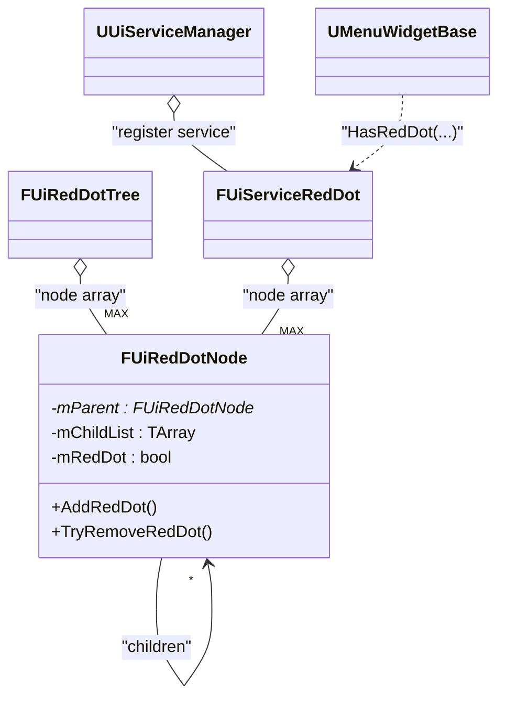

# 31. FUiRedDotTree - 레드닷(Red Dot) 트리 기반 UI 알림 시스템

작성자: 안명달 (mooondal@gmail.com)

## 1. 개요

게임 UI에서 “읽지 않은 우편”, “새 퀘스트”, “인벤토리 새 아이템”처럼 **확인 필요 상태**를 표시할 때 흔히 “레드닷(Red Dot)”을 사용한다.
문제는 레드닷이 단순히 “한 버튼”에만 붙는 게 아니라,
하위 메뉴(leaf)에 레드닷이 있으면 상위 메뉴(parent)에도 레드닷이 떠야 하는 **계층 전파**가 필요하다는 점이다.

`FUiRedDotTree`는 이 전파를 “트리(부모-자식) 구조”로 모델링한 구현이다.
그 동안 프로젝트에서 레드닷에관한 노가다 처리가 많은 편이었는데, 자동화를 도모한다. 

---

## 2. 구조: RedDotType::MAX 크기의 노드 배열 + 하드코딩 트리

### 2.1 노드 저장 방식
`FUiRedDotTree`는 `RedDotType::MAX` 크기의 배열을 만들고, 각 타입에 대응하는 노드를 고정으로 보관한다.

```14:33:client/Client/Source/Client/Private/UiService/RedDot/Internal/UiRedDotTree.h
class FUiRedDotTree
{
private:	
	using RedDotNodeArray = std::array<FUiRedDotNode*, static_cast<size_t>(RedDotType::MAX)>;

	RedDotNodeArray mRedDotNodeArray;
	
public:
	DISABLE_COPY(FUiRedDotTree);
	explicit FUiRedDotTree();
	~FUiRedDotTree();
	// ...
};
```

### 2.2 트리(부모-자식) 연결 방식
현재는 생성자에서 `AttachChildToParent(child, parent)`를 “직접 나열”하는 방식이다.

```16:27:client/Client/Source/Client/Private/UiService/RedDot/Internal/UiRedDotTree.cpp
FUiRedDotTree::FUiRedDotTree()
{
	// ...
	AttachChildToParent(RedDotType::MAIL, RedDotType::MENU);
	AttachChildToParent(RedDotType::MISSION, RedDotType::MENU);
	AttachChildToParent(RedDotType::ACHIEVEMENT, RedDotType::MENU);
	AttachChildToParent(RedDotType::RANKING, RedDotType::MENU);
}
```

## 2.x 클래스 다이어그램 (구조 이해용)



---

## 3. 핵심 알고리즘: leaf에서 parent로 상태 전파

노드는 자신의 레드닷 상태(`mRedDot`)와 자식 목록을 갖고 있다.

```15:30:client/Client/Source/Client/Private/UiService/RedDot/Internal/UiRedDotNode.h
struct FUiRedDotNode
{
	using ChildList = TArray<FUiRedDotNode*>;
	ChildList mChildList;

	FUiRedDotNode* mParent = nullptr;

	bool mRedDot = false;
	// ...
};
```

### 3.1 Add: leaf를 켜면 부모도 재귀적으로 켜진다

```13:22:client/Client/Source/Client/Private/UiService/RedDot/Internal/UiRedDotNode.cpp
void FUiRedDotNode::AddRedDot()
{
	if (true == mRedDot)
		return;

	mRedDot = true;

	if (nullptr != mParent)
		mParent->AddRedDot();
}
```

### 3.2 Remove: leaf를 끄면 “자식 중 남아있는 레드닷이 있는지” 확인 후 부모로 전파

```24:35:client/Client/Source/Client/Private/UiService/RedDot/Internal/UiRedDotNode.cpp
void FUiRedDotNode::TryRemoveRedDot()
{
	if (false == mRedDot)
		return;

	mRedDot = false;
	if (true == HasRedDot())
		mRedDot = true;

	if (nullptr != mParent)
		mParent->TryRemoveRedDot();
}
```

> 이런 구현은 “부모는 자식들의 OR”라는 전파 규칙을 코드로 고정한 형태이다.

---

## 4. 실전 사용 흐름(현재 코드 기준)

### 4.1 이벤트 기반 갱신(ADD/REMOVE)
예를 들어 인벤토리 서비스는 “레드닷 대상 아이템이 생김/사라짐”에 따라 이벤트를 브로드캐스트한다.

```136:149:client/Client/Source/Client/Private/UiService/Inventory/UiServiceInventory.cpp
if (true == hasRedDot)
{
	UUiServiceManager::Get(this)->BroadcastUiEvent<UUiEvent_RED_DOT_ADD>(RedDotType::INVENTORY);
}
```

그리고 인벤토리를 닫을 때 제거 이벤트를 날립니다.

```224:229:client/Client/Source/Client/Private/UiService/Inventory/UiServiceInventory.cpp
mRedDotItemSet.Empty(0);
UUiServiceManager::Get(this)->BroadcastUiEvent<UUiEvent_RED_DOT_REMOVE>(RedDotType::INVENTORY);
```

### 4.2 위젯 렌더링(HasRedDot로 가시성 갱신)
메뉴 위젯은 `HasRedDot(RedDotType::XXX)`를 조회해 버튼의 레드닷 표시를 갱신한다.

```83:97:client/Client/Source/Client/Private/Widget/Menu/MenuWidgetBase.cpp
void UMenuWidgetBase::OnUiEvent(UUiEvent_RED_DOT_UPDATED& uiEvent)
{
	auto redDot = UUiServiceManager::Get(this)->GetService<FUiServiceRedDot>();

	mMenuButtonInventory->SetRedDotVisible(redDot->HasRedDot(RedDotType::INVENTORY));
	// ...
	mMenuButton->SetRedDotVisible(redDot->HasRedDot(RedDotType::MENU));
}
```

---

## 5. 관리도구가 없으면 “노가다 구현이 까다로운” 이유

레드닷 트리는 “기능 구현”보다 “유지보수”가 더 어려운 타입이다. 이유는 대부분 **데이터(메뉴 구조)**가 늘어날수록 사람이 실수하기 쉬운 형태로 커지기 때문이다.

### 5.1 하드코딩 트리의 확장 비용
새 레드닷 1개를 추가한다고 하면 보통 아래를 모두 건드린다.
- `RedDotType`에 새 항목 추가(그리고 `MAX` 관리)
- “트리 구조”에 연결 추가(`AttachChildToParent`)
- 레드닷을 켜고/끄는 이벤트 발행 위치 추가(서비스/패킷/응답 등)
- UI 위젯에서 해당 타입을 읽어 표시 갱신(버튼/탭/배지)

이 중 하나만 빠져도 **컴파일은 되는데 UI가 조용히 틀리는** 유형의 버그가 된다.

### 5.2 중복 정의가 생기기 쉬움(실제 사례)
현재 코드에는 `FUiRedDotTree`가 따로 존재하지만,
실제 서비스(`FUiServiceRedDot`)도 동일한 `RedDotNodeArray + AttachChildToParent`를 별도로 가지고 있다.

```17:28:client/Client/Source/Client/Private/UiService/RedDot/UiServiceRedDot.cpp
FUiServiceRedDot::FUiServiceRedDot()
{
	// ...
	AttachChildToParent(RedDotType::MAIL, RedDotType::MENU);
	AttachChildToParent(RedDotType::MISSION, RedDotType::MENU);
	AttachChildToParent(RedDotType::ACHIEVEMENT, RedDotType::MENU);
	AttachChildToParent(RedDotType::RANKING, RedDotType::MENU);
}
```

관리도구(또는 단일 데이터 소스)가 없으면 이런 중복이 자연스럽게 생기고,
이후 구조 변경 시 “둘 중 하나만 수정” 같은 휴먼 에러가 발생한다.

### 5.3 검증이 어렵다(도구가 없으면 테스트도 노가다)
레드닷 트리는 다음 같은 오류가 쉽게 들어갑니다.
- 연결 누락: leaf는 켜지는데 parent가 안 켜짐
- 잘못된 parent 연결: 엉뚱한 메뉴에 뱃지가 뜸
- 사이클/자가 참조(방어 코드 없으면 재귀 위험)
- “어떤 이벤트가 어떤 레드닷을 켜야 하는지” 추적 난이도 증가

이걸 수동으로 검증하려면, 결국 UI를 열고 행동을 반복하는 **노가다 테스트**가 된다.

---

## 6. 관리도구가 있다면 무엇이 달라지나(개선 아이디어)

레드닷은 본질적으로 “데이터”이다. 관리도구가 있으면 아래가 가능해집니다.
- 트리 구조를 에디터에서 관리(드래그/드롭)하고 코드/리소스 자동 생성
- 유효성 검사(누락/중복/사이클/도달 불가 노드) 자동 체크
- “이벤트 -> 레드닷 타입” 매핑을 테이블로 관리하고 변경 영향 범위 추적
- 테스트 시뮬레이터: 특정 leaf를 켰을 때 켜져야 하는 parent 목록을 자동 출력


