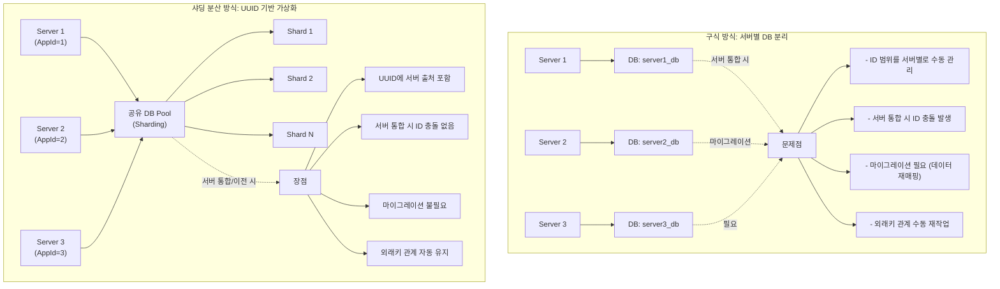
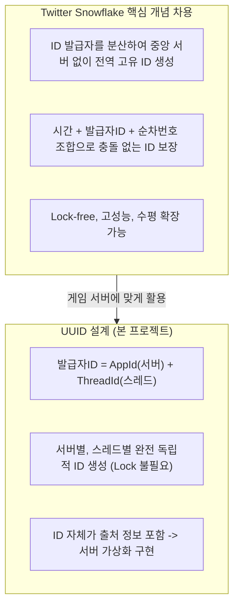
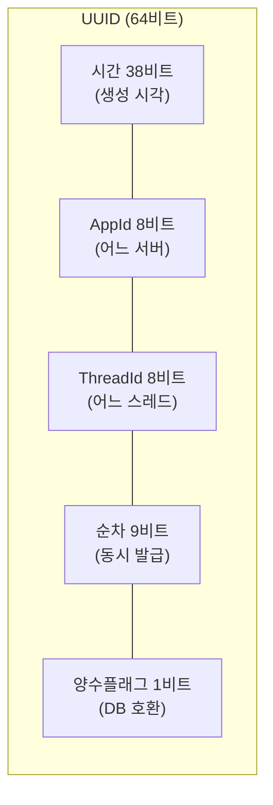

# 33. UUID - 게임 서버 별 DB 가상화를 위한 분산 고유 식별자

작성자: 안명달 (mooondal@gmail.com)

MMORPG와 같이 큰 규모의 DB를 사용하면서 샤딩구조를가지는 DB를 개발해볼 기회가 없었다.
대규모 MORPG라면 샤딩구조가 많이 활용될 것이지만, 대뮤고 MORPG 프로젝트에 참여해본 경험이 없다.
MMORPG에도 샤딩구조를 활용하면 세련된 개발이 가능하다고 생각하고, 작은 크기(64bit)의 UUID를 생성하는 알고리즘이 제작 편의에 큰 도움이 될것이라고 생각한다.
**Twitter Snowflake의 핵심 개념인 "ID 발급자 분산"을 차용한 64비트 분산 고유 식별자**를 흉내내어 고안했다.
중앙 집중식 ID 발급 서버 없이 **각 서버/스레드가 독립적으로 전역 고유 ID를 생성**할 수 있어, 이를 활용하여 서버와 DB 구조를 설계함으로써 **게임 서버 구분을 가상화**하고 MMORPG서버 서비스 중 - 서버 통합이나 서버 이전에 별도의 마이그레이션이 필요 없도록하는 것을 목표로 한다.

### 구식 방식 vs 샤딩 분산 방식



| 비교 항목 | 구식 방식 (서버별 DB) | 샤딩 분산 방식 (UUID) |
|----------|---------------------|---------------------|
| **DB 구조** | `server1_db`, `server2_db` (물리적 분리) | 샤딩 Pool (논리적 분산) |
| **ID 생성** | 서버별 수동 범위 관리 (예: 1~10000, 10001~20000) | UUID로 자동 고유성 보장 (AppId 포함) |
| **서버 통합** | ID 충돌 발생 -> **대규모 마이그레이션 필요** | ID 충돌 없음 -> **마이그레이션 불필요** |
| **서버 이전** | ID 재매핑 필요 (외래키 재작업) | ID 유지 (외래키 자동 유지) |
| **샤드 재배치** | 복잡한 데이터 재분배 작업 | UUID 기반 자동 추적 |
| **다운타임** | 수 시간 ~ 수일 | 0분 (무중단 가능) |

### 핵심: "물리적 서버 != 논리적 서버"

```cpp
// 구식 방식 (물리적 서버 단위 DB)
// Server 1: itemId = 1~10000 (server1_db.item 테이블)
// Server 2: itemId = 10001~20000 (server2_db.item 테이블)
// -> 서버 통합 시 server1_db와 server2_db를 하나로 합치면 ID 충돌!

// UUID 방식 (논리적 서버 가상화)
// Server 1: itemId = {AppId:1, Time:X, Thread:Y, Seq:Z}
// Server 2: itemId = {AppId:2, Time:X, Thread:Y, Seq:Z}
// -> 서버 통합 시 그냥 데이터 병합, AppId가 다르므로 충돌 없음!
```

**서버 가상화 = 서버 구분이 물리적(DB 분리)이 아닌 논리적(UUID AppId)**

## 핵심 아이디어



| 특징 | 설명 |
|------|------|
| **ID 발급자 분산** | 중앙 ID 서버 없이 각 서버/스레드가 독립적으로 고유 ID 생성 |
| **서버 가상화 핵심** | 물리적 서버 != 논리적 서버 (UUID AppId로 구분) |
| **마이그레이션 불필요** | 서버 통합/이전 시 데이터 재매핑 작업 0분 |
| **DB 샤딩 분산** | 구식 서버별 DB 방식 대신 샤딩 Pool 사용 |
| **무중단 서버 재편성** | 설정 파일 변경만으로 서버 통합/분리 가능 |
| **외래키 자동 유지** | UUID 변경 없으므로 item, inventory 등 모든 관계 자동 유지 |

## 비트 구조



**각 필드 설명:**
- **시간 (38비트)**: ID 생성 시각 저장 (밀리초 단위)
- **AppId (8비트)**: 어떤 서버에서 생성했는지 (최대 256개 서버 지원)
- **ThreadId (8비트)**: 어떤 스레드에서 생성했는지 (서버당 최대 256개 스레드)
- **순차 (9비트)**: 같은 밀리초 내에 동시 발급 가능 (밀리초당 최대 512개)
- **양수 플래그 (1비트)**: DB의 BIGINT가 음수를 지원하므로 항상 양수로 보장

> **발급자ID** = AppId + ThreadId -> Lock 없이 스레드별 독립 생성

## 서버 가상화의 효과

### 운영 측면
- **무중단 서버 통합**: 다운타임 0분 (구식 방식: 8시간 이상)
- **무중단 서버 이전**: 유저 데이터 이동 시 ID 재매핑 불필요
- **유연한 서버 재편성**: 설정 파일 변경만으로 서버 구조 변경 가능
- **스케일 아웃/인**: 서버 추가/제거 시 마이그레이션 작업 없음

### 개발 측면
- **외래키 자동 유지**: item, inventory, quest 등 모든 관계 자동 보존
- **로그 추적 용이**: UUID의 AppId로 데이터 출처 역추적
- **디버깅**: ID만으로 생성 시점, 서버, 스레드 정보 확인

### DB 측면
- **샤딩 유연성**: 샤드 재배치 시 UUID 유지로 조인 쿼리 영향 없음
- **글로벌 고유성**: 서버 간, 샤드 간 ID 충돌 방지
- **백업 복원 안전**: 어떤 서버로 복원해도 ID 충돌 없음

## 실전 시나리오: 마이그레이션 없는 서버 통합/이전

### 시나리오 1: 서버 통합 (서울1 + 서울2 -> 통합서버)

#### 구식 방식 (서버별 DB)
```sql
-- Before: 서버별 독립 DB
server1_db.user (userId: 1~5000, 중복 가능)
server2_db.user (userId: 1~5000, 중복 가능)  -- ID 충돌!

-- 통합 작업 (다운타임: 8시간 이상)
1. 서버 점검 공지
2. 모든 유저 접속 차단
3. userId 재매핑 (server2의 모든 ID에 +10000 추가)
4. 외래키 수동 업데이트 (item, inventory, quest 등)
5. 데이터 병합 및 검증
6. 서버 재시작
```

#### UUID 방식 (샤딩 분산 DB)
```sql
-- Before: 샤딩된 공유 DB Pool
shard_user.user (userId: UUID, AppId 포함)
  - Server 1 유저: userId = {AppId:1, ...}
  - Server 2 유저: userId = {AppId:2, ...}

-- 통합 작업 (다운타임: 0분)
1. 설정 파일에서 "Server 2 -> Server 1 리다이렉트" 추가
2. 재시작 없이 즉시 적용
3. UUID는 이미 고유하므로 ID 충돌 없음
4. 외래키 관계 자동 유지
마이그레이션 불필요!
```

### 시나리오 2: 서버 이전 (유저 A를 서울 -> 부산 서버로 이동)

#### 구식 방식
```sql
-- 유저 A (userId = 1234)를 다른 서버로 이동
1. 부산 서버 DB에 userId = 1234가 이미 존재하는지 확인
2. 충돌 시 새로운 ID 할당 (예: 99234)
3. 모든 외래키 관계 수동 업데이트:
   - item 테이블: ownerId = 1234 -> 99234
   - inventory: userId = 1234 -> 99234
   - quest_progress: userId = 1234 -> 99234
   - friend_list: userId/friendId 양쪽 업데이트
4. 로그 테이블의 히스토리 추적 불가 (ID 변경됨)
```

#### UUID 방식
```sql
-- 유저 A (userId = UUID{AppId:1, Time:X})를 다른 서버로 이동
1. 유저 데이터 그대로 복사 (UUID 유지)
2. 끝!
UUID는 전역 고유이므로 충돌 없음
외래키 관계 자동 유지 (ID 변경 없음)
로그 추적 가능 (AppId=1로 원본 서버 추적)
```

### 시나리오 3: DB 샤딩 재배치 (부하 분산)

#### 구식 방식
```sql
-- Shard 1이 과부하, Shard 2로 일부 유저 이동
1. 이동할 유저 선정 (예: userId 1000~2000)
2. 다른 Shard에 같은 ID 없는지 전수 조사
3. 충돌 시 ID 재매핑
4. 외래키 재작업
5. 샤드 간 조인 쿼리 수동 조정
```

#### UUID 방식
```sql
-- Shard 1 -> Shard 2로 유저 이동
1. userId의 AppId 기반으로 자동 샤드 할당
2. 데이터 복사 (UUID 유지)
3. 끝!
UUID 자체가 출처 정보 포함
샤드 간 조인 시 UUID로 원본 추적 가능
재배치 후에도 ID 유효성 보장
```

## 서버 가상화 개념

| 개념 | 설명 |
|------|------|
| **물리적 서버** | 실제 하드웨어/프로세스 (예: Seoul-1 서버 머신) |
| **논리적 서버** | UUID AppId로 구분되는 가상 서버 (예: AppId=1, 2, 3...) |
| **가상화의 의미** | 물리적 서버와 논리적 서버를 분리하여, **서버 통합/이전이 단순히 AppId 매핑 변경**으로 해결됨 |

```cpp
// 서버 가상화 예시
// 물리적 서버 A (Seoul-1): AppId = 1, 2, 3
// 물리적 서버 B (Seoul-2): AppId = 4, 5, 6

// 서버 통합 -> AppId = 1~6을 하나의 물리적 서버로 통합
// -> UUID는 변경 없음
// -> DB 데이터 그대로 사용
// -> 마이그레이션 불필요!

// 서버 이전 -> AppId = 2의 유저들을 다른 물리적 서버로 이동
// -> UUID는 변경 없음
// -> 외래키 관계 유지
// -> 로그 추적 가능 (AppId = 2로 원본 서버 추적)
```

**핵심:** UUID 덕분에 "서버"가 물리적 개념이 아닌 논리적 개념이 되어, 서버 재편성이 자유롭고 마이그레이션이 불필요한다.

---

