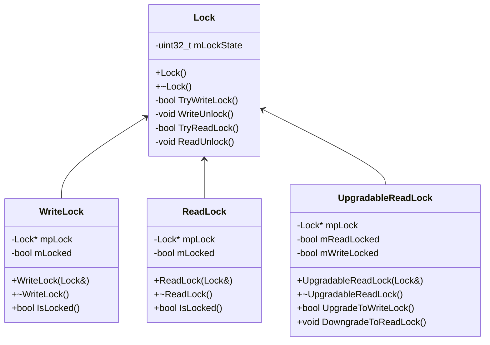

# 35. Read -> Write 락으로 업그레이드가 가능한 RWLock 클래스 (보류)

작성자: 안명달 (mooondal@gmail.com)

## 개요

기본 구현은 멀티스레드 환경에서 다중 읽기와 단일 쓰기를 지원하는 Reader-Writer Lock 시스템이다. 
Windows API의 SRWLock 구현과 동일하다고 보면 된다.

이 구현의 경우, 동일 Thread에서 Read Lock -> Write Lock을 하면 무한 대기 상태가 되는 문제가 있다.
동일 스레드에서의 Read Lock -> Write Lock 업그레이드를 지원하는 아이디어의 도입을 검토한다.

## 클래스 구조



## Lock State 비트 구조

```cpp
// mLockState (32비트)
// [31]      : Write Lock Flag (1비트)
// [30:16]   : Thread ID (15비트)
// [15:0]    : Read Count (16비트)

// 예시:
// 0x00000000 : 락 없음
// 0x80001234 : Write Lock (Thread 0x1234)
// 0x00000003 : Read Lock 3개
// 0x00001234 : Thread 0x1234가 Read Lock 1개 보유
```

## RW락 특성

| 특성 | 설명 |
|------|------|
| **다중 읽기** | 여러 스레드가 동시에 Read Lock 획득 가능 |
| **단일 쓰기** | Write Lock은 단 하나의 스레드만 획득 가능 |
| **재진입 가능** | 동일 스레드에서 Read Lock 중복 획득 가능 |
| **스핀락 방식** | 락 대기 시 busy-wait (짧은 임계 영역용) |
| **업그레이드 지원** | Read Lock -> Write Lock 업그레이드 가능 |

## 기본 사용법

```cpp
Lock lock;

// 읽기 전용
{
    ReadLock r(lock);
    // 읽기 작업 (다중 스레드 동시 접근 가능)
}

// 쓰기 전용
{
    WriteLock w(lock);
    // 쓰기 작업 (단일 스레드만 접근)
}

// 업그레이드 가능한 락
{
    UpgradableReadLock ur(lock);
    // 읽기 작업
    
    if (needModify) {
        ur.UpgradeToWriteLock();
        // 쓰기 작업
        ur.DowngradeToReadLock();
    }
}

---

## Read -> Write 락 업그레이드 구현

### 현재 구현: UpgradableReadLock

```cpp
class UpgradableReadLock {
    Lock* mpLock;
    bool mReadLocked = false;
    bool mWriteLocked = false;
    
public:
    UpgradableReadLock(Lock& lock) : mpLock(&lock) {
        mpLock->TryReadLock();
        mReadLocked = true;
    }
    
    bool UpgradeToWriteLock() {
        if (mWriteLocked) return true;
        
        // 1. 자신의 Read Lock 해제
        if (mReadLocked) {
            mpLock->ReadUnlock();
            mReadLocked = false;
        }
        
        // 2. 다른 모든 Read Lock이 해제될 때까지 대기
        while (true) {
            uint32_t state = mpLock->mLockState.load();
            uint32_t readCount = state & READ_COUNT_MASK;
            
            if (readCount == 0) {
                // 모든 Read Lock 해제됨 -> Write Lock 시도
                if (mpLock->TryWriteLock()) {
                    mWriteLocked = true;
                    return true;
                }
            }
            
            // Busy-wait (spin)
            _mm_pause();
        }
    }
    
    void DowngradeToReadLock() {
        if (!mWriteLocked) return;
        
        // 1. Write Lock 해제
        mpLock->WriteUnlock();
        mWriteLocked = false;
        
        // 2. Read Lock 재획득
        mpLock->TryReadLock();
        mReadLocked = true;
    }
};
```

### 동작 원리

1. **Read Lock 획득**: 초기 상태
2. **업그레이드 요청**:
   - 자신의 Read Lock 해제
   - 다른 모든 Read Lock이 해제될 때까지 Busy-wait
   - Read Count = 0이 되면 Write Lock 획득
3. **다운그레이드 요청**:
   - Write Lock 해제
   - Read Lock 재획득

### 성능 문제 및 고민

**문제점:**
- **Busy-wait**: 다른 Read Lock 해제 대기 중 CPU 점유
- **공정성 부족**: 업그레이드 대기 중 새로운 Read Lock 획득 가능
- **우선순위 역전**: 업그레이드 대기 스레드보다 새 Read Lock이 먼저 획득됨

**고민 중인 개선 방안:**

1. **Upgrade Intent Flag 도입**
```cpp
// Lock State에 업그레이드 의도 플래그 추가
// [31]   : Write Lock Flag
// [30]   : Upgrade Intent Flag (새로운 Read Lock 차단)
// [29:16]: Thread ID
// [15:0] : Read Count
```

2. **조건부 대기 전환**
```cpp
// 일정 시간 spin 후 조건 변수로 전환
if (spinCount > MAX_SPIN_COUNT) {
    // Busy-wait -> 조건 변수 대기
    std::unique_lock<std::mutex> ul(mUpgradeMutex);
    mUpgradeCV.wait(ul, [this]{ return CanUpgrade(); });
}
```

3. **읽기 우선순위 조정**
```cpp
// 업그레이드 대기 중에는 새 Read Lock 차단
bool TryReadLock() {
    uint32_t state = mLockState.load();
    if (state & UPGRADE_INTENT_FLAG) {
        return false;  // 업그레이드 대기 중 -> 새 Read Lock 차단
    }
    // ... 기존 로직
}
```

보류, 성능 문제로 도입 고민 예정...