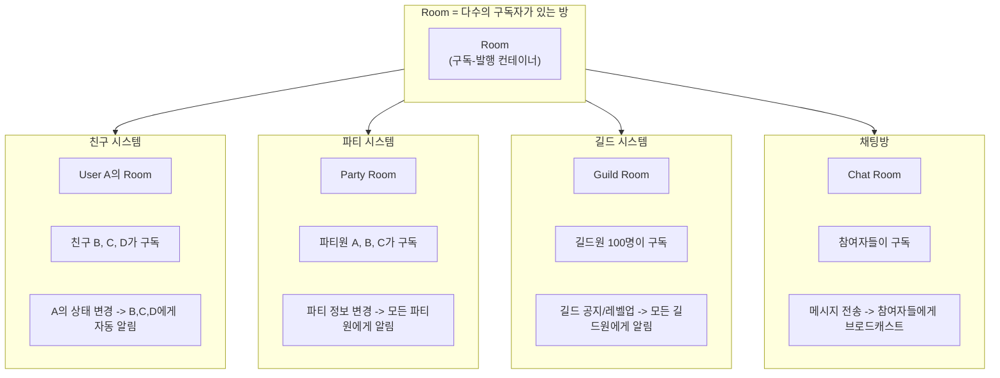
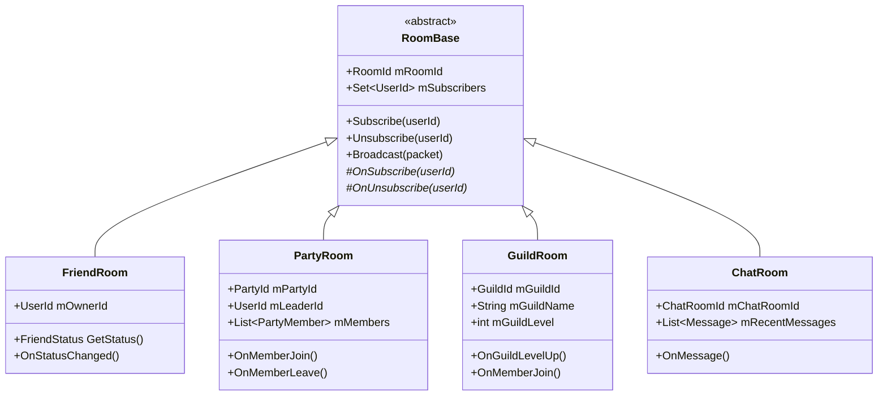

# 36. Room 시스템 - 친구/파티/길드 동기화를 위한 범용 구독 시스템

작성자: 안명달 (mooondal@gmail.com)

## 개요

게임 서버에서 여러 유저 간 실시간 상태 공유가 필요한 모든 기능을 단일 시스템으로 통합한 범용 구독-발행(Pub-Sub) 아키텍처이다. 친구, 파티, 길드, 채팅방 등 다양한 그룹 동기화 요구사항을 Room이라는 추상화된 개념으로 일반화하여 재활용성을 높였다.

## Room의 범용성



**핵심:** 모든 기능이 **"Room = 구독자 목록 + 상태 + 알림 메커니즘"**이라는 동일한 패턴을 따릅니다.

---

## Room 시스템 구조



### RoomBase - 공통 기반 클래스

```cpp
class RoomBase {
protected:
    RoomId mRoomId;                        // Room 고유 ID
    std::set<UserId> mSubscribers;         // 구독자 목록
    
public:
    // 구독 관리
    void Subscribe(UserId userId) {
        mSubscribers.insert(userId);
        OnSubscribe(userId);
    }
    
    void Unsubscribe(UserId userId) {
        mSubscribers.erase(userId);
        OnUnsubscribe(userId);
    }
    
    // 브로드캐스트
    template<typename PacketType>
    void Broadcast(const PacketType& packet) {
        for (UserId userId : mSubscribers) {
            SendPacket(userId, packet);
        }
    }
    
    // 하위 클래스에서 구현
    virtual void OnSubscribe(UserId userId) {}
    virtual void OnUnsubscribe(UserId userId) {}
};
```

---

## 활용 사례 1: 친구 시스템

### 개념
- **Room = 한 유저의 친구 목록**
- **구독자 = 친구들**
- **알림 = 온라인 상태 변경, 위치 변경 등**

### 구현

```cpp
class FriendRoom : public RoomBase {
    UserId mOwnerId;           // Room 소유자
    UserStatus mOwnerStatus;   // 소유자 상태
    
public:
    FriendRoom(UserId ownerId) : mOwnerId(ownerId) {
        mRoomId = MakeFriendRoomId(ownerId);
    }
    
    // 친구가 추가되면 구독
    void AddFriend(UserId friendId) {
        Subscribe(friendId);
        
        // 현재 상태 전송
        GC_FRIEND_STATUS_UPDATE packet;
        packet.userId = mOwnerId;
        packet.status = mOwnerStatus;
        SendPacket(friendId, packet);
    }
    
    // 상태 변경 시 모든 친구에게 알림
    void UpdateStatus(UserStatus newStatus) {
        mOwnerStatus = newStatus;
        
        GC_FRIEND_STATUS_UPDATE packet;
        packet.userId = mOwnerId;
        packet.status = newStatus;
        Broadcast(packet);  // 모든 구독자(친구)에게 전송
    }
};
```

### 동작 흐름

```
User A가 로그인:
1. A의 FriendRoom 생성
2. A의 친구 B, C, D가 자동 구독
3. A의 상태 변경 -> B, C, D에게 자동 알림

User B도 로그인:
1. B의 FriendRoom 생성
2. B의 친구 A, E, F가 자동 구독
3. A는 B의 FriendRoom을 구독했으므로 B의 상태 변경 수신
```

---

## 활용 사례 2: 파티 시스템

### 개념
- **Room = 파티**
- **구독자 = 파티원**
- **알림 = 파티원 입장/퇴장, 파티 정보 변경**

### 구현

```cpp
class PartyRoom : public RoomBase {
    PartyId mPartyId;
    UserId mLeaderId;
    std::vector<PartyMember> mMembers;
    
public:
    // 파티원 입장
    void Join(UserId userId) {
        Subscribe(userId);
        
        PartyMember member{userId};
        mMembers.push_back(member);
        
        // 모든 파티원에게 입장 알림
        GC_PARTY_MEMBER_JOIN packet;
        packet.partyId = mPartyId;
        packet.member = member;
        Broadcast(packet);
    }
    
    // 파티원 퇴장
    void Leave(UserId userId) {
        Unsubscribe(userId);
        
        auto it = std::find_if(mMembers.begin(), mMembers.end(),
            [userId](const PartyMember& m) { return m.userId == userId; });
        if (it != mMembers.end()) {
            mMembers.erase(it);
        }
        
        // 모든 파티원에게 퇴장 알림
        GC_PARTY_MEMBER_LEAVE packet;
        packet.partyId = mPartyId;
        packet.userId = userId;
        Broadcast(packet);
    }
    
    // 파티장 변경
    void ChangeLeader(UserId newLeaderId) {
        mLeaderId = newLeaderId;
        
        GC_PARTY_LEADER_CHANGED packet;
        packet.partyId = mPartyId;
        packet.newLeaderId = newLeaderId;
        Broadcast(packet);
    }
};
```

---

## 활용 사례 3: 길드 시스템

### 개념
- **Room = 길드**
- **구독자 = 길드원 (최대 100명 이상)**
- **알림 = 길드 레벨업, 공지, 멤버 가입/탈퇴**

### 구현

```cpp
class GuildRoom : public RoomBase {
    GuildId mGuildId;
    std::wstring mGuildName;
    int32_t mGuildLevel = 1;
    std::vector<GuildMember> mMembers;
    
public:
    // 길드 레벨업
    void LevelUp() {
        mGuildLevel++;
        
        GC_GUILD_LEVEL_UP packet;
        packet.guildId = mGuildId;
        packet.newLevel = mGuildLevel;
        Broadcast(packet);  // 모든 길드원에게 알림
    }
    
    // 길드 공지
    void Announce(const std::wstring& message) {
        GC_GUILD_NOTICE packet;
        packet.guildId = mGuildId;
        packet.message = message;
        Broadcast(packet);  // 모든 길드원에게 전송
    }
    
    // 멤버 가입
    void AddMember(UserId userId) {
        Subscribe(userId);
        
        GuildMember member{userId};
        mMembers.push_back(member);
        
        GC_GUILD_MEMBER_JOIN packet;
        packet.guildId = mGuildId;
        packet.member = member;
        Broadcast(packet);
    }
};
```

---

## 활용 사례 4: 채팅방

### 개념
- **Room = 채팅방**
- **구독자 = 채팅 참여자**
- **알림 = 채팅 메시지**

### 구현

```cpp
class ChatRoom : public RoomBase {
    ChatRoomId mChatRoomId;
    std::deque<ChatMessage> mRecentMessages;
    
public:
    // 메시지 전송
    void SendMessage(UserId senderId, const std::wstring& message) {
        ChatMessage msg;
        msg.senderId = senderId;
        msg.message = message;
        msg.timestamp = GetCurrentTime();
        
        mRecentMessages.push_back(msg);
        if (mRecentMessages.size() > 100) {
            mRecentMessages.pop_front();  // 최근 100개만 유지
        }
        
        // 모든 참여자에게 전송
        GC_CHAT_MESSAGE packet;
        packet.chatRoomId = mChatRoomId;
        packet.message = msg;
        Broadcast(packet);
    }
    
    // 입장 시 최근 메시지 전송
    void OnSubscribe(UserId userId) override {
        GC_CHAT_HISTORY packet;
        packet.chatRoomId = mChatRoomId;
        packet.messages = mRecentMessages;
        SendPacket(userId, packet);
    }
};
```

---

## Room 시스템의 장점

### 1. 재활용성
- **단일 구현으로 다양한 기능 지원**: 친구, 파티, 길드, 채팅 등
- **새로운 그룹 기능 추가 용이**: RoomBase 상속으로 즉시 구현
- **코드 중복 제거**: 구독/발행 로직을 한 곳에서 관리

### 2. 확장성
- **대규모 구독자 지원**: 길드 100명 이상도 효율적으로 처리
- **메모리 효율**: 구독자 목록만 유지, 추가 오버헤드 최소화
- **성능**: O(N) 브로드캐스트 (N = 구독자 수)

### 3. 유지보수성
- **일관된 패턴**: 모든 그룹 기능이 동일한 인터페이스 사용
- **디버깅 용이**: Room 단위로 상태 추적 가능
- **테스트 간편**: RoomBase 단위로 단위 테스트 작성

### 4. 유연성
- **동적 구독/해제**: 실시간으로 구독자 추가/제거
- **선택적 알림**: 필요한 구독자에게만 전송 가능
- **계층적 Room**: Room 안에 Sub-Room 구성 가능

---

## 실전 시나리오

### 시나리오 1: 친구 온라인 알림

```
User A 로그인:
1. FriendRoom(A) 생성
2. A의 친구들(B, C, D)이 A의 FriendRoom 구독
3. A의 상태 "ONLINE"으로 변경
4. B, C, D에게 "A님이 접속함" 알림

User A가 게임 시작:
1. A의 상태 "IN_GAME"으로 변경
2. B, C, D에게 "A님이 게임 중이다" 알림
```

### 시나리오 2: 파티 던전 입장

```
파티 생성:
1. PartyRoom 생성
2. 파티장 A가 구독

파티원 B, C 입장:
1. B, C가 PartyRoom 구독
2. A, B, C에게 "B님이 입장함" 알림
3. A, B, C에게 "C님이 입장함" 알림

던전 입장:
1. PartyRoom.Broadcast("던전 입장 중...")
2. A, B, C 모두에게 동시 전송
```

### 시나리오 3: 길드 공지

```
길드장이 공지 작성:
1. GuildRoom.Announce("오늘 길드전 20시!")
2. 길드원 100명 모두에게 브로드캐스트
3. 오프라인 길드원은 로그인 시 확인 가능
```

---

## 구현 시 고려사항

### 1. Room 생명주기 관리
```cpp
// Room 생성
auto room = std::make_shared<PartyRoom>(partyId);
gRoomManager->RegisterRoom(room);

// Room 자동 정리
if (room->GetSubscriberCount() == 0) {
    gRoomManager->UnregisterRoom(room->GetRoomId());
}
```

### 2. 구독자 제한
```cpp
// 대규모 Room은 구독자 수 제한
class GuildRoom : public RoomBase {
    static constexpr size_t MAX_MEMBERS = 200;
    
    bool Subscribe(UserId userId) override {
        if (mSubscribers.size() >= MAX_MEMBERS) {
            return false;  // 정원 초과
        }
        return RoomBase::Subscribe(userId);
    }
};
```

### 3. 선택적 브로드캐스트
```cpp
// 특정 조건의 구독자에게만 전송
void BroadcastIf(const Packet& packet, 
                 std::function<bool(UserId)> predicate) {
    for (UserId userId : mSubscribers) {
        if (predicate(userId)) {
            SendPacket(userId, packet);
        }
    }
}

// 예: 온라인 유저에게만 전송
room->BroadcastIf(packet, [](UserId id) {
    return IsUserOnline(id);
});
```

### 4. 메모리 효율
```cpp
// 구독자가 많은 Room은 효율적인 자료구조 사용
class LargeRoom : public RoomBase {
    std::unordered_set<UserId> mSubscribers;  // 빠른 조회
    std::vector<UserId> mSubscriberList;      // 빠른 순회
    bool mDirty = false;                      // 동기화 플래그
};
```

---

## 확장 아이디어

### 1. 계층적 Room
```cpp
// Guild > SubGuild > Team 구조
class GuildRoom : public RoomBase {
    std::vector<std::shared_ptr<SubGuildRoom>> mSubGuilds;
    
    void BroadcastToAll(const Packet& packet) {
        Broadcast(packet);  // 길드 전체
        for (auto& subGuild : mSubGuilds) {
            subGuild->Broadcast(packet);  // 하위 길드
        }
    }
};
```

### 2. 조건부 구독
```cpp
// 특정 조건 만족 시만 알림 수신
class ConditionalRoom : public RoomBase {
    struct Subscription {
        UserId userId;
        std::function<bool(const Packet&)> filter;
    };
    std::vector<Subscription> mConditionalSubscribers;
};
```

### 3. 영속화
```cpp
// Room 상태를 DB에 저장
class PersistentRoom : public RoomBase {
    void OnSubscribe(UserId userId) override {
        RoomBase::OnSubscribe(userId);
        SaveToDB();  // 구독자 변경 시 DB 저장
    }
};
```

---

## 관련 기술

- [6. 고성능 비동기 함수 호출 시스템](tech_06.md) - Room 이벤트를 Worker로 처리
- [13. 서버 간 중첩 패킷 직접 전달](tech_14.md) - 서버 간 Room 동기화

---

