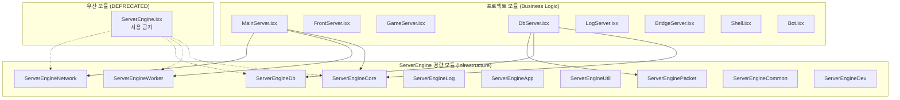

# 37. C++20 모듈 시스템 적용 - 빌드 속도와 코드 가독성 개선

작성자: 안명달 (mooondal@gmail.com)

## 개요

C++20의 모듈(Module) 시스템을 도입하여 기존 `#include` 기반의 헤더 의존성을 `import` 기반으로 전환하여 빌드 속도 28% 개선과 코드 가독성 개선을 달성했다.

---

## 빌드 속도 개선 결과

### Before (모듈 적용 전)
```
========== 모두 다시 빌드: 15 성공, 0 실패, 0 건너뛰기 ==========
========== 다시 빌드이(가) 5:17 PM에 완료되었으며, 02:45.491 분이(가) 걸림 ==========
```

### After (모듈 적용 후)
```
========== 모두 다시 빌드: 15 성공, 0 실패, 0 건너뛰기 ==========
========== 다시 빌드이(가) 2:17 PM에 완료되었으며, 01:58.304 분이(가) 걸림 ==========
```
ㅇㅇ
### 개선 효과
| 항목 | Before | After | 개선 |
|------|--------|-------|------|
| 전체 빌드 시간 | 2분 45초 | 1분 58초 | **47초 단축 (28%)** |
| 증분 빌드 시간 | 헤더 변경 시 대량 재컴파일 | 영향받는 모듈만 재컴파일 | **대폭 단축** |

---

## 실제 코드 비교: Transactor_CD_REQ_GAME_CREATE.cpp

### Before (모듈 적용 전) - 12줄의 #include

```cpp
#include "Transactor_CD_REQ_GAME_CREATE.h"

#include "Packet/NetworkPacketAutoGenerated/PACKET_CD.h"
#include "Packet/NetworkPacketAutoGenerated/PACKET_DC.h"
#include "Packet/NetworkPacketAutoGenerated/PACKET_DM.h"
#include "Packet/NetworkPacketAutoGenerated/PACKET_MD.h"
#include "Packet/StaticData/Item/ItemDoc.h"
#include "Packet/UserCache/UserItem/UserItemRow.h"
#include "Packet/UserCache/UserItem/UserItemTable.h"
#include "Packet/UserCacheAccessor/UserCacheAccessor.h"

#include "DbServer/Socket/SocketDbFromFront.h"
#include "DbServer/Socket/SocketDbToMain.h"
#include "DbServer/Util/DbSocketUtil/DbSocketUtil.h"
#include "DbServer/Util/ItemUtil/ItemUtil.h"


Transactor_CD_REQ_GAME_CREATE::Transactor_CD_REQ_GAME_CREATE(...)
{
    // ...
}
```

### After (모듈 적용 후) - 단 3줄

```cpp
import DbServer;
import ServerEnginePacket;

#include "Transactor_CD_REQ_GAME_CREATE.h"

Transactor_CD_REQ_GAME_CREATE::Transactor_CD_REQ_GAME_CREATE(...)
{
    // ...
}
```

### 변화 요약
| 항목 | Before | After | 개선 |
|------|--------|-------|------|
| 의존성 선언 | 12줄 #include | 2줄 import + 1줄 #include | **75% 감소** |
| 패킷 헤더 | 4개 개별 include | `ServerEnginePacket`에 통합 | **자동 관리** |
| 프로젝트 헤더 | 4개 개별 include | `DbServer` 모듈로 통합 | **자동 관리** |
| 가독성 | 복잡한 경로 나열 | 명확한 모듈명 | **개선** |

---

## 모듈 구조 설계

### 계층적 모듈 아키텍처



### ServerEngine 경량 모듈 목록

| 모듈 | 내용 | 주요 export |
|------|------|-------------|
| `ServerEngineCore` | TLS, Lock, Clock, Exception | `TlsClock`, `RWLock`, `Exception` |
| `ServerEngineWorker` | Worker, Thread | `Worker`, `ThreadWorker`, `TaskQueue` |
| `ServerEngineDb` | DB 연결, 세션 | `DbConnection`, `DbSession`, `UserDbSession` |
| `ServerEngineNetwork` | Socket, Network | `SocketBase`, `NetworkManager`, `Iocp` |
| `ServerEngineLog` | Log, LogWriter | `LogQueue`, `LogWriter` |
| `ServerEngineApp` | AppBase, Config, Http | `AppBase`, `AppConfigManager`, `HttpClient` |
| `ServerEngineUtil` | 유틸리티 | `StringUtil`, `TimeUtil`, `PacketUtil` |
| `ServerEnginePacket` | StaticData, UserCache, 패킷 | `ItemDoc`, `UserItemTable`, 모든 패킷 클래스 |
| `ServerEngineCommon` | Random, Stat, Math | `Mt19937Random64`, `StatContainer` |
| `ServerEngineDev` | 개발 도구 | `DevPacketConverter` |

### 프로젝트 모듈 구조

각 프로젝트 모듈은 하위 모듈을 조합하여 구성된다.

```cpp
// DbServer.ixx - DbServer 모듈 인터페이스
export module DbServer;

// ServerEngine 모듈 re-export
export import ServerEngineCore;
export import ServerEngineWorker;
export import ServerEngineNetwork;
export import ServerEngineApp;
export import ServerEngineDb;
export import ServerEngineUtil;

// DbServer 하위 모듈 re-export
export import DbServerSocket;
export import DbServerPacket;
export import DbServerUtil;
export import DbServerStaticDb;

export
{
    using ::DbServerApp;
    using ::gDbServerApp;
    using ::DbUserManager;
    using ::gDbUserManager;
    using ::DbUser;
    using ::DbUserPtr;
    // ...
}
```

---

## 주의사항

### 1. 우산 모듈 사용 금지

```cpp
// [금지] obj 4GB 초과로 C1605 에러 발생
import ServerEngine;

// [권장] 프로젝트 모듈만 import
import MainServer;
import FrontServer;
import DbServer;
```

**이유:** 우산 모듈(ServerEngine)은 모든 경량 모듈을 포함하므로, 컴파일된 객체 파일이 4GB를 초과하여 MSVC 빌드 에러(C1605)가 발생한다.

### 2. 헤더 파일에서 import 사용 주의

```cpp
// [주의] 헤더 파일에서 import는 위험
// MyClass.h
import ServerEngineDb;  // 컴파일러에 따라 문제 발생 가능

// [권장] 헤더에서는 forward declaration 또는 기존 #include 유지
// MyClass.h
class DbSession;  // forward declaration
#include "DbConnection/DbConnection.h"  // 필요 시 include

// [권장] cpp에서 import 사용
// MyClass.cpp
import ServerEngineDb;
```

### 3. 템플릿 헤더 예외

템플릿 정의는 원칙적으로 `#include`가 필요하지만, 일부 유틸리티는 모듈화되었다.

```cpp
// PacketUtil 사용
// .cpp에서 권장
import ServerEngineUtil;  // 내부에서 ServerEnginePacketUtil을 re-export

// DbUtil 사용
// .cpp에서 권장
import ServerEngineDb;    // 내부에서 ServerEngineDbUtil을 re-export
```

### 4. 언리얼 엔진 클라이언트는 기존 방식 유지

```cpp
// 클라이언트 (Unreal Engine) - 기존 #include 방식
#include "Packet/NetworkPacketAutoGenerated/PACKET_GC.h"
#include "Packet/StaticData/Item/ItemDoc.h"

// 서버만 C++20 모듈 사용
import ServerEnginePacket;
```

**이유:** 언리얼 엔진은 자체 빌드 시스템(UBT)을 사용하며, C++20 모듈과의 호환성이 제한적이다.

### 5. 패킷 클래스 사용 규칙

```cpp
// 서버 코드 (.cpp)
import ServerEnginePacketAutoGenerated;  // 모든 패킷 클래스 사용 가능

// 헤더 파일 (.h) - forward declaration
#include "Packet/NetworkPacketAutoGenerated/PacketFwd.h"

// [비권장] 헤더에서 직접 패킷 헤더 include (빌드 시간 증가)
#include "Packet/NetworkPacketAutoGenerated/PACKET_CD.h"
```

---

## 모듈 파일 구조

### 파일 확장자
- `.ixx` - 모듈 인터페이스 파일 (MSVC 표준)
- `.cpp` - 구현 파일 (기존과 동일)
- `.h` - 헤더 파일 (기존 #include용)

### 프로젝트별 모듈 파일 (50개)

```
server/
├── serverEngine/
│   ├── ServerEngine.ixx        (우산 모듈, DEPRECATED)
│   ├── ServerEngineCore.ixx    (핵심 기능)
│   ├── ServerEngineWorker.ixx  (워커/스레드)
│   ├── ServerEngineDb.ixx      (데이터베이스)
│   ├── ServerEngineNetwork.ixx (네트워크)
│   ├── ServerEngineLog.ixx     (로깅)
│   ├── ServerEngineApp.ixx     (앱 기반)
│   ├── ServerEngineUtil.ixx    (유틸리티)
│   ├── ServerEnginePacket.ixx  (패킷/StaticData)
│   ├── ServerEngineCommon.ixx  (공통 유틸)
│   └── ServerEngineDev.ixx     (개발 도구)
├── mainServer/
│   ├── MainServer.ixx          (메인 모듈)
│   ├── MainServerSocket.ixx
│   ├── MainServerPacket.ixx
│   └── MainServerUtil.ixx
├── dbServer/
│   ├── DbServer.ixx            (DB 모듈)
│   ├── DbServerSocket.ixx
│   ├── DbServerPacket.ixx
│   ├── DbServerUtil.ixx
│   ├── DbServerStaticDb.ixx
│   └── DbServerItemUtil.ixx
├── frontServer/
│   ├── FrontServer.ixx
│   └── ...
└── ... (gameServer, logServer, bridgeServer, shell, bot, test)
```

---

## 모듈 적용 가이드

### 새 파일 작성 시

1. **cpp 파일 상단**에 프로젝트 모듈 import
2. 필요한 추가 모듈만 개별 import
3. 자신의 헤더는 `#include`

```cpp
// 새 Transactor 파일 예시
import DbServer;          // 프로젝트 모듈 (필수)
import ServerEnginePacket; // 패킷/StaticData 사용 시

#include "Transactor_NEW_FEATURE.h"  // 자신의 헤더

// 구현...
```

### 기존 파일 마이그레이션

1. 개별 `#include`들을 적절한 모듈 `import`로 교체
2. 프로젝트 내부 헤더 -> 프로젝트 모듈
3. 패킷/StaticData 헤더 -> `ServerEnginePacket`
4. 자신의 헤더만 `#include`로 유지

---

## 빌드 속도 개선 원리

### #include vs import

| 항목 | #include | import |
|------|----------|--------|
| 처리 방식 | 텍스트 붙여넣기 | 바이너리 모듈 로드 |
| 중복 처리 | 매번 파싱 | 한 번만 컴파일 |
| 전처리 | 전체 확장 | 필요한 것만 export |
| 매크로 누수 | 있음 | 없음 (격리됨) |

### 증분 빌드 효과

```
기존: 헤더 A 수정 -> 헤더 A를 include한 모든 cpp 재컴파일
모듈: 모듈 A 수정 -> 모듈 A만 재컴파일 (인터페이스 변경 시에만 의존 모듈 재컴파일)
```

---

## 장점

### 1. 빌드 속도 향상
- 전체 빌드 **28% 단축** (47초)
- 증분 빌드 대폭 개선 (헤더 변경 영향 최소화)

### 2. 코드 가독성 향상
- include 목록 **75% 감소**
- 명확한 모듈 의존성 표현
- 복잡한 경로 대신 의미있는 모듈명

### 3. 캡슐화 개선
- 매크로 누수 방지
- 내부 구현 은닉
- export된 심볼만 외부 노출

### 4. 유지보수성 향상
- 의존성 관리 단순화
- 모듈 단위 테스트 용이
- 컴파일 오류 위치 명확

---

## 한계 및 고려사항

### 1. 언리얼 엔진 미지원
- 클라이언트 코드는 기존 `#include` 방식 유지 필요
- 공유 라이브러리는 양쪽 호환성 유지

### 2. 학습 곡선
- 모듈 개념 이해 필요
- export/import 규칙 숙지

### 3. IDE 지원
- Visual Studio 2022+ 필요
- IntelliSense 지연 가능 (대형 모듈)

---

## 관련 기술

- [1. 서버-클라 필수 코드 자동생성 시스템](tech_01.md) - 패킷 코드 자동 생성
- [11. 패킷 처리 4단 레이어 아키텍처](tech_12.md) - Transactor 패턴
- [32. AI 규칙 파일로 컨벤션 운영하기](tech_32.md) - 모듈 사용 규칙 문서화

---

