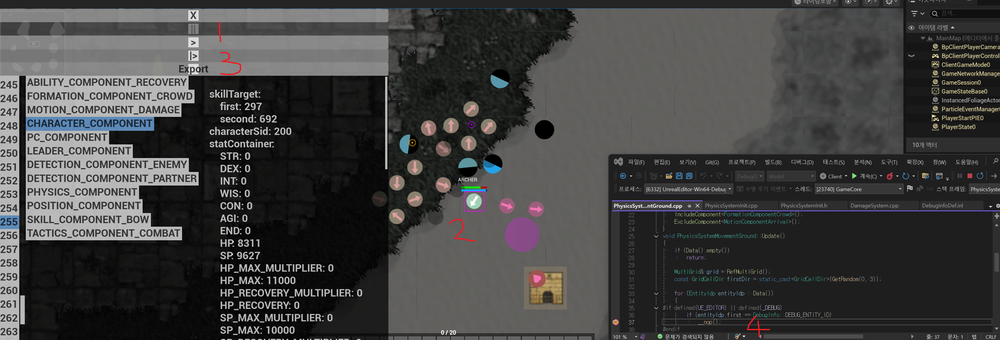

# 42. 인게임 실시간 디버깅 시스템 - 게임 로직과 IDE 브레이크포인트 연동

작성자: 안명달 (mooondal@gmail.com)

## 개요

게임 개발에서 가장 어려운 문제 중 하나는 "실시간으로 움직이는 수백 개의 엔티티 중 특정 하나를 디버깅하는 것"이다.

일반적인 디버깅 방식의 한계:
- 브레이크포인트: 모든 엔티티에서 멈춤 -> 원하는 엔티티 찾기 어려움
- 로그 출력: 수백 개 엔티티의 로그 -> 필요한 정보 찾기 불가능
- 조건부 브레이크포인트: 매번 ID 하드코딩 필요

이 시스템은 **인게임 UI에서 엔티티를 클릭**하면 **Visual Studio 브레이크포인트가 해당 엔티티에서만 동작**하도록 연동하는 아이디어를 내고 구현했다

## 디버깅 워크플로우



### 1️⃣ 게임 일시정지 (Pause)

화면 좌상단의 디버그 위젯에서 **일시정지 버튼**을 클릭한다.

- 게임 시뮬레이션이 완전히 멈춤
- 모든 엔티티의 현재 상태가 고정
- 네트워크 패킷 수신은 계속되지만 적용되지 않음

```cpp
// 일시정지 상태에서는 Update 루프가 스킵됨
if (DebugInfo::DEBUG_PAUSED)
    return;
```

### 2️⃣ 엔티티 선택 및 데이터 확인

게임 화면에서 **엔티티를 클릭**하면 해당 엔티티의 모든 컴포넌트 데이터가 표시된다.

**표시되는 정보:**

| 컴포넌트 | 데이터 |
|----------|--------|
| `CHARACTER_COMPONENT` | characterSid, statContainer (STR, DEX, HP, SP 등) |
| `POSITION_COMPONENT` | x, y, angle, velocity |
| `PHYSICS_COMPONENT` | mass, friction, acceleration |
| `SKILL_COMPONENT_BOW` | cooldown, range, damage |
| `TACTICS_COMPONENT_COMBAT` | target, state, aggro |
| `FORMATION_COMPONENT_CROWD` | leaderEntity, formationIndex |
| `DETECTION_COMPONENT_ENEMY` | detectedEntities, range |

> **핵심**: 이 데이터는 **서버에서 전송된 실제 동기화 값**이다.  
> 클라이언트 예측값이 아닌 서버 권위(authoritative) 데이터를 직접 확인할 수 있다.

### 3️⃣ 스텝 실행 (Step)

**1프레임씩 진행**하며 상태 변화를 추적한다.

```cpp
// DEBUG_STEP_BNT_COUNT 만큼만 진행 후 다시 일시정지
if (DebugInfo::DEBUG_STEP_MODE)
{
    mRemainingSteps = DebugInfo::DEBUG_STEP_BNT_COUNT;
    // N 프레임 실행 후 자동 일시정지
}
```

- 물리 시뮬레이션 1틱 진행
- AI 의사결정 1회 실행
- 애니메이션 1프레임 진행
- 각 단계별 상태 변화 확인 가능

### 4. Visual Studio 브레이크포인트 연동

**핵심 기능**: 선택한 엔티티의 ID가 `DebugInfo::DEBUG_ENTITY_ID`에 자동 설정된다.

```cpp
// 엔티티 클릭 시
void OnEntityClicked(EntityId entityId)
{
    gDebugInfo.LoadDebugInfoVar(L"DEBUG_ENTITY_ID", entityId);
}
```

**Visual Studio 코드에서 조건부 브레이크포인트 설정:**

```cpp
void PhysicsSystemMovementGround::Update()
{
    for (EntityId entityId : Data())
    {
        // 이 위치에 조건부 브레이크포인트 설정
        // 조건: entityId.first == DebugInfo::DEBUG_ENTITY_ID
        
        #if defined(UE_EDITOR) || defined(_DEBUG)
        if (entityId.first == DebugInfo::DEBUG_ENTITY_ID)
        {
            _DEBUG_BREAK;  // 선택된 엔티티에서만 멈춤!
        }
        #endif
        
        // 물리 업데이트 로직...
    }
}
```

**워크플로우:**

```
인게임에서 엔티티 클릭 
    -> DEBUG_ENTITY_ID 자동 설정 
    -> 게임 재개 
    -> 해당 엔티티 처리 시 VS 브레이크포인트 동작
    -> 콜스택, 로컬 변수, 메모리 검사 가능
```

## 구현 상세

### 디버그 위젯 UI

```cpp
// 디버그 위젯 버튼 핸들러
void UDebugWidget::OnPauseClicked()
{
    DebugInfo::DEBUG_PAUSED = !DebugInfo::DEBUG_PAUSED;
}

void UDebugWidget::OnStepClicked()
{
    DebugInfo::DEBUG_STEP_MODE = true;
    DebugInfo::DEBUG_PAUSED = false;  // 일시적으로 해제
}

void UDebugWidget::OnExportClicked()
{
    // 현재 상태를 파일로 덤프
    ExportGameState();
}
```

### 엔티티 피킹 시스템

```cpp
void FGameRenderer::OnMouseClick(const FVector2D& screenPos)
{
    // 화면 좌표 -> 월드 좌표 변환
    FVector worldPos = ScreenToWorld(screenPos);
    
    // 가장 가까운 엔티티 찾기
    EntityId pickedEntity = mEngine.FindNearestEntity(worldPos);
    
    if (pickedEntity != INVALID_ENTITY)
    {
        // 디버그 대상 엔티티 설정
        gDebugInfo.LoadDebugInfoVar(L"DEBUG_ENTITY_ID", pickedEntity);
        
        // 엔티티 정보 패널 표시
        ShowEntityInfoPanel(pickedEntity);
    }
}
```

### 컴포넌트 데이터 시각화

```cpp
void UEntityInfoPanel::DisplayEntityData(EntityId entityId)
{
    // 모든 컴포넌트 조회
    if (auto* charComp = mEngine.GetComponent<CharacterComponent>(entityId))
    {
        AddSection("CHARACTER_COMPONENT");
        AddField("characterSid", charComp->characterSid);
        AddField("HP", charComp->statContainer.HP);
        AddField("SP", charComp->statContainer.SP);
        // ... 기타 스탯
    }
    
    if (auto* posComp = mEngine.GetComponent<PositionComponent>(entityId))
    {
        AddSection("POSITION_COMPONENT");
        AddField("x", posComp->x);
        AddField("y", posComp->y);
        AddField("angle", posComp->angle);
    }
    
    // 모든 컴포넌트 타입에 대해 반복...
}
```

## DEBUG_VAR_DEF 연동

이 시스템은 [tech_41: DEBUG_VAR_DEF 시스템](tech_41.md)과 통합된다.

```cpp
// DebugInfoDef.inl
DEBUG_VAR_DEF(DEBUG_ENTITY_ID, EntityId, -1)      // 브레이크포인트 대상 (-1이면 무시)
DEBUG_VAR_DEF(DEBUG_STEP_BNT_COUNT, int, 1)       // 스텝 버튼 클릭 시 진행할 프레임 수
DEBUG_VAR_DEF(DEBUG_PAUSED, int, 0)               // 일시정지 상태
DEBUG_VAR_DEF(DEBUG_PICK_ENTITY_MODE, int, 1)     // 엔티티 선택 모드
```

## 장점

### 1. 수백 개 엔티티 중 정확한 타겟팅

```
기존: for 루프에서 모든 엔티티마다 브레이크포인트 동작
개선: 클릭한 엔티티에서만 브레이크포인트 동작
```

### 2. 서버 동기화 데이터 실시간 확인

```
기존: 패킷 로그 파싱 -> 값 확인 (수 분 소요)
개선: 인게임 클릭 -> 즉시 확인 (수 초)
```

### 3. 프레임 단위 상태 추적

```
기존: 로그에서 시간 역추적 (불확실)
개선: 1프레임씩 진행하며 정확한 상태 변화 확인
```

### 4. IDE 없이도 디버깅 가능

```
기존: 반드시 Visual Studio 연결 필요
개선: 인게임 UI만으로 대부분의 문제 진단 가능
```

## 실제 활용 사례

### 케이스 1: 몬스터가 움직이지 않는 경우

1. 게임 일시정지
2. 해당 몬스터 클릭
3. `TACTICS_COMPONENT_COMBAT` 확인 -> `state: IDLE`
4. `DETECTION_COMPONENT_ENEMY` 확인 -> `detectedEntities: []` (비어있음)
5. **원인 발견**: 탐지 범위에 적이 없어서 IDLE 상태 유지

### 케이스 2: HP가 갑자기 0이 되는 경우

1. 의심되는 엔티티 클릭 -> `DEBUG_ENTITY_ID` 설정
2. 게임 재개
3. 데미지 처리 코드에서 브레이크포인트 동작
4. 콜스택 확인 -> 어떤 스킬/엔티티가 데미지를 줬는지 확인
5. **원인 발견**: 크리티컬 배율 계산 버그

### 케이스 3: "물리 시뮬레이션이 이상해"

1. 게임 일시정지
2. 문제 엔티티 클릭
3. 스텝 버튼으로 1프레임씩 진행
4. `PHYSICS_COMPONENT`의 velocity, acceleration 변화 추적
5. **원인 발견**: 마찰 계수가 음수로 설정됨

## 빌드 구성

```cpp
// 디버그 기능은 에디터/디버그 빌드에서만 활성화
#if defined(UE_EDITOR) || defined(_DEBUG)
    #define DEBUG_FEATURES_ENABLED 1
#else
    #define DEBUG_FEATURES_ENABLED 0
#endif
```

| 빌드 | 디버그 UI | 브레이크포인트 | 엔티티 피킹 |
|------|-----------|----------------|-------------|
| Editor | O | O | O |
| Debug | O | O | O |
| Development | O | X | O |
| Shipping | X | X | X |

## 정리

| 기능 | 설명 |
|------|------|
| **인게임 Pause** | 게임 시뮬레이션 완전 정지 |
| **엔티티 피킹** | 클릭으로 디버그 대상 선택 |
| **컴포넌트 뷰어** | 서버 동기화된 실제 데이터 확인 |
| **스텝 실행** | 1프레임씩 상태 변화 추적 |
| **IDE 연동** | 선택한 엔티티에서만 브레이크포인트 동작 |

> **핵심 가치**: 게임 내에서 문제를 발견하고, 그 자리에서 IDE 브레이크포인트까지 연결되는 **End-to-End 디버깅 파이프라인**

---
