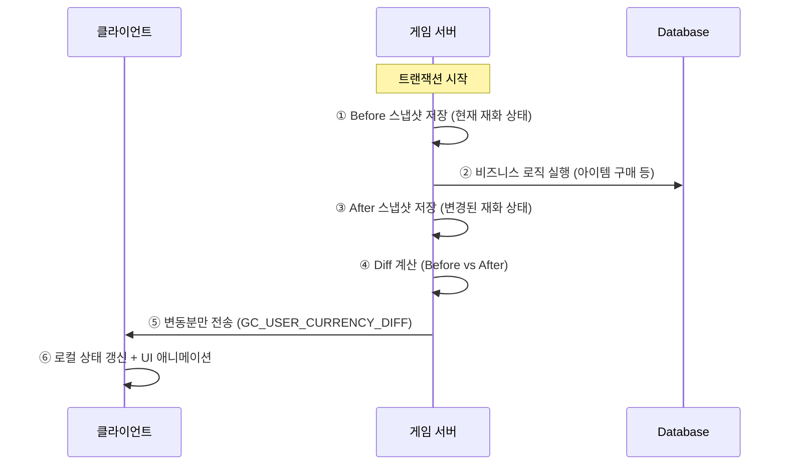
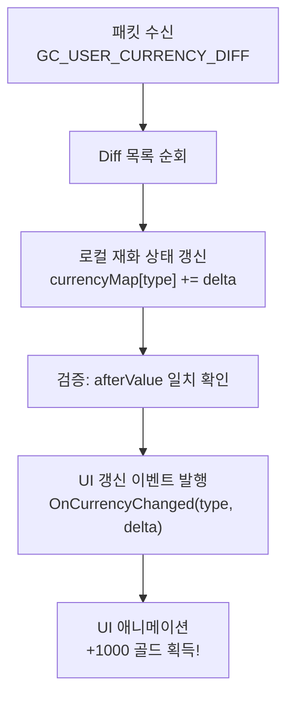
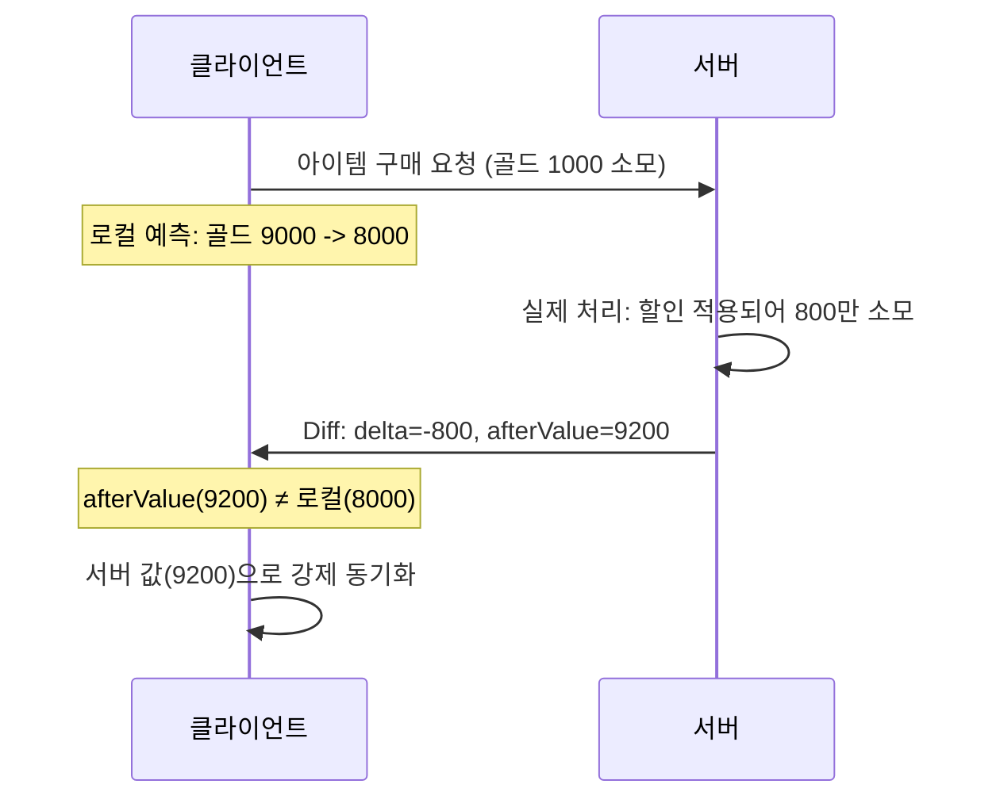

# 43. User 재화 Diff 처리 - 패킷에 재화 변동분을 클라에 손쉽게 동기화

작성자: 안명달 (mooondal@gmail.com)

## 1. 개요

재화 변동에 관한 코딩을 콘텐츠별로 따로 하게 되면 공수도 많이 들고 버그를 발생시킬 가능성이 높아 매우 위험하다.

유저의 재화(골드, 다이아, 스태미나 등)가 변경될 때마다 **전체 재화 목록을 전송하지 않고, 변동분(Diff)만 전송**하는 최적화 시스템이다.

---

## 2. 핵심 아이디어: Before/After 스냅샷 비교



---

## 3. Diff 계산 알고리즘

### 3.1 재화 상태 구조

```cpp
struct UserCurrency
{
    int64_t gold = 0;
    int64_t diamond = 0;
    int64_t stamina = 0;
    int64_t guildPoint = 0;
    // ... 기타 재화
};
```

### 3.2 Diff 계산 로직

```cpp
struct CurrencyDiff
{
    CurrencyType type;      // 재화 종류
    int64_t delta;          // 변동량 (+/-)
    int64_t afterValue;     // 변경 후 값 (검증용)
};

std::vector<CurrencyDiff> CalculateDiff(
    const UserCurrency& before,
    const UserCurrency& after)
{
    std::vector<CurrencyDiff> diffList;
    
    // 골드 비교
    if (before.gold != after.gold)
    {
        diffList.push_back({
            CurrencyType::GOLD,
            after.gold - before.gold,  // delta
            after.gold                  // afterValue
        });
    }
    
    // 다이아 비교
    if (before.diamond != after.diamond)
    {
        diffList.push_back({
            CurrencyType::DIAMOND,
            after.diamond - before.diamond,
            after.diamond
        });
    }
    
    // ... 기타 재화도 동일하게 처리
    
    return diffList;
}
```

---

## 4. 패킷 구조 및 최적화

### 4.1 기존 방식 vs Diff 방식 비교

| 방식 | 패킷 구조 | 전송 크기 (10개 재화) |
|------|----------|---------------------|
| **기존 (전체 전송)** | 모든 재화 값 | 80 bytes (8 bytes × 10) |
| **Diff (변동분만)** | 변동된 재화만 | 12~24 bytes (보통 1~2개 변동) |

### 4.2 Diff 패킷 구조

```cpp
// GC_USER_CURRENCY_DIFF 패킷
struct GC_USER_CURRENCY_DIFF
{
    PacketHeader header;
    
    // 변동된 재화 목록 (가변 길이)
    uint8_t diffCount;
    struct DiffEntry
    {
        uint8_t currencyType;   // 재화 종류
        int64_t delta;          // 변동량
        int64_t afterValue;     // 변경 후 값
    } diffList[diffCount];
};
```

### 4.3 대역폭 절감 효과

```
상점 구매 시나리오:
- 골드 -1000, 다이아 +5 (2개 재화 변동)

기존 방식: 80 bytes (10개 재화 전체)
Diff 방식: 34 bytes (헤더 + 2개 DiffEntry)

절감률: 57.5%
```

---

## 5. 클라이언트 적용 흐름



### 5.1 클라이언트 처리 코드

```cpp
HandleResult FGameCore::OnPacket(GC_USER_CURRENCY_DIFF& rp)
{
    for (const auto& diff : rp.GetDiffList())
    {
        // 1. 로컬 상태 갱신
        mCurrencyMap[diff.type] += diff.delta;
        
        // 2. 검증 (서버 값과 일치하는지)
        if (mCurrencyMap[diff.type] != diff.afterValue)
        {
            // 불일치 시 서버 값으로 강제 동기화
            mCurrencyMap[diff.type] = diff.afterValue;
            _DEBUG_LOG(RED, "Currency desync detected: type=%d", diff.type);
        }
        
        // 3. UI 이벤트 발행 (애니메이션 트리거)
        BroadcastEvent<OnCurrencyChanged>(diff.type, diff.delta);
    }
    
    return HandleResult::OK;
}
```

### 5.2 UI 애니메이션 연동

```cpp
void UCurrencyWidget::OnCurrencyChanged(CurrencyType type, int64_t delta)
{
    if (delta > 0)
    {
        // 획득 애니메이션: "+1000" 녹색 텍스트 팝업
        PlayAcquireAnimation(type, delta);
    }
    else
    {
        // 소모 애니메이션: "-1000" 빨간색 텍스트
        PlayConsumeAnimation(type, -delta);
    }
    
    // 최종 값 갱신 (카운팅 애니메이션)
    PlayCountingAnimation(type, GetCurrencyValue(type));
}
```

---

## 6. 서버 측 구현: Transactor 패턴 연동

### 6.1 Before/After 자동 캡처

```cpp
class UserCurrencyDiffCapture
{
private:
    UserCurrency mBefore;
    UserCurrency* mUserCurrency;
    SocketBase* mSocket;
    
public:
    // 생성 시 Before 스냅샷 저장
    UserCurrencyDiffCapture(UserCurrency* currency, SocketBase* socket)
        : mBefore(*currency)
        , mUserCurrency(currency)
        , mSocket(socket)
    {}
    
    // 소멸 시 Diff 계산 및 전송
    ~UserCurrencyDiffCapture()
    {
        auto diffList = CalculateDiff(mBefore, *mUserCurrency);
        
        if (!diffList.empty())
        {
            SendCurrencyDiff(mSocket, diffList);
        }
    }
};
```

### 6.2 Transactor에서 사용

```cpp
HandleResult ItemBuyTransactor::Execute()
{
    // RAII로 재화 변동 자동 추적
    UserCurrencyDiffCapture capture(&mUser->currency, mSocket);
    
    // 비즈니스 로직
    mUser->currency.gold -= itemPrice;
    mUser->currency.diamond += bonusDiamond;
    
    // 소멸자에서 자동으로 Diff 전송
    return HandleResult::OK;
}
```

---

## 7. 충돌 해결: 서버 권위 원칙

### 7.1 동기화 불일치 시나리오



### 7.2 롤백 처리

```cpp
// 클라이언트 측 롤백
if (localValue != serverAfterValue)
{
    // 로그 기록 (디버깅용)
    LogDesync(type, localValue, serverAfterValue);
    
    // 서버 권위로 강제 동기화
    mCurrencyMap[type] = serverAfterValue;
    
    // UI 즉시 갱신 (애니메이션 없이)
    ForceUpdateUI(type);
}
```

---

## 8. 장점

| 장점 | 설명 |
|------|------|
| **네트워크 효율** | 변동된 재화만 전송하여 대역폭 50~80% 절감 |
| **실시간 반영** | 변동 즉시 클라이언트에 전달, 지연 없음 |
| **애니메이션 연동** | delta 값으로 획득/소모 방향 UI 애니메이션 자연스럽게 처리 |
| **검증 내장** | afterValue로 클라-서버 동기화 상태 자동 검증 |
| **RAII 패턴** | Transactor 시작/종료 시 자동으로 Diff 계산 및 전송 |

---

## 9. 실전 시나리오

### 9.1 상점 구매

```
Before: 골드 10000, 다이아 500
Action: 아이템 구매 (골드 -2000)
After:  골드 8000, 다이아 500

Diff 전송: [{GOLD, -2000, 8000}]
```

### 9.2 퀘스트 보상

```
Before: 골드 8000, 다이아 500, 스태미나 50
Action: 퀘스트 완료 보상 수령
After:  골드 8500, 다이아 510, 스태미나 50

Diff 전송: [{GOLD, +500, 8500}, {DIAMOND, +10, 510}]
```

### 9.3 거래 (복합 변동)

```
Before: 골드 5000, 아이템A 1개
Action: 아이템A 판매 (골드 +1500, 아이템A -1)
After:  골드 6500, 아이템A 0개

Diff 전송: [{GOLD, +1500, 6500}]
(아이템은 별도 인벤토리 Diff로 처리)
```


