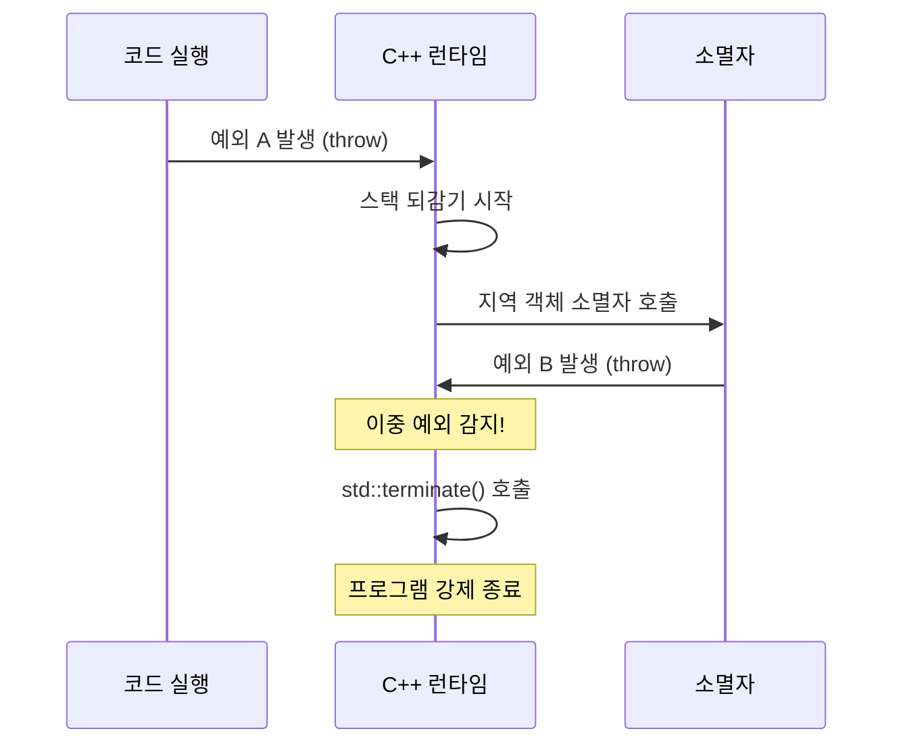

# 45. 예외(Exception) 사용 정책

작성자: 안명달 (mooondal@gmail.com)

## 1. 개요

게임 서버와 같은 프로젝트에서는 C++ 예외(try-catch)를 기본적으로 사용하지 않는것이 좋다고 생각한다
언리얼 엔진에서도 이런 정책을 사용하며 그런데에는 이유가 있을 것이다
그 명분이 될 만한 내용들을 모아 보았다.
---

## 2. 예외를 사용하지 않는 이유

### 2.1 성능

| 항목 | 설명 |
|------|------|
| **스택 되감기(Stack Unwinding) 비용** | 예외 발생 시 호출 스택을 역순으로 탐색하며 소멸자 호출 -> 오버헤드 큼 |
| **예외 테이블 오버헤드** | 예외 처리를 위한 메타데이터가 바이너리에 추가됨 |
| **분기 예측 실패** | 예외 경로는 CPU 분기 예측기가 학습하지 못함 -> 파이프라인 스톨 |
| **최적화 제한** | 컴파일러가 예외 안전성을 고려해야 하므로 공격적 최적화 불가 |

### 2.2 예측 가능성

```cpp
// [BAD] 예외: 어디서든 점프 가능 -> 제어 흐름 추적 어려움
void Process()
{
    Step1();  // 예외 발생 가능?
    Step2();  // 예외 발생 가능?
    Step3();  // 예외 발생 가능?
}

// [GOOD] 에러 코드: 명시적 검사 -> 흐름이 명확
HandleResult Process()
{
    if (Step1() != OK) return STEP1_FAILED;
    if (Step2() != OK) return STEP2_FAILED;
    if (Step3() != OK) return STEP3_FAILED;
    return OK;
}
```

### 2.3 리소스 관리 복잡성

```cpp
void RiskyFunction()
{
    Lock lock(mutex);           // RAII로 보호됨
    auto* resource = Allocate(); // 수동 관리 필요
    
    DoSomething();  // 여기서 예외 발생하면?
    
    Free(resource); // 이 줄 실행 안 됨 -> 누수!
}
```

RAII로 해결 가능하지만, 모든 리소스를 RAII로 감싸야 하는 부담이 있다.

### 2.4 게임 서버 특화 이유

| 이유 | 설명 |
|------|------|
| **실시간 보장** | 초당 수천~수만 패킷 처리 시 예외 오버헤드 누적 |
| **Lock 안전성** | 예외 발생 시 Lock이 해제되지 않는 버그 위험 |
| **트랜잭션 롤백** | 명시적 에러 코드가 DB 롤백 로직과 자연스럽게 연동 |
| **부하 테스트** | 수천 동시 접속 시 예외 처리 비용이 병목 가능 |

---

## 3. 언리얼 엔진 사례

언리얼 엔진은 **예외를 완전히 비활성화**한다.

### 3.1 빌드 설정

```cpp
// UnrealBuildTool 기본 설정
bEnableExceptions = false;  // /EHsc 플래그 없음
```

### 3.2 대신 사용하는 매크로

```cpp
// 조건 실패 시 크래시 (디버그 빌드)
check(Condition);
checkf(Condition, TEXT("Error message: %s"), *ErrorInfo);

// 조건 실패 시 로그 + 계속 진행
ensure(Condition);
ensureMsgf(Condition, TEXT("Warning: %s"), *WarningInfo);

// 절대 실패해서는 안 되는 조건
verify(Condition);

// 조기 반환
if (!IsValid(Actor))
    return;
```

### 3.3 언리얼이 예외를 피하는 이유

| 이유 | 설명 |
|------|------|
| **콘솔 플랫폼** | PS5, Xbox, Switch 등에서 예외 지원이 제한적이거나 비용이 큼 |
| **바이너리 크기** | 예외 테이블 제거로 실행 파일 크기 감소 |
| **프레임 일관성** | 게임은 16.6ms(60fps) 내에 프레임을 완료해야 함 |
| **크래시 리포팅** | 예외보다 크래시 덤프가 디버깅에 더 유용 |

---

## 4. 예외를 사용하는 경우

### 4.1 외부 API / 라이브러리

일부 외부 API는 예외를 던지므로 반드시 처리해야 한다:

```cpp
// 파일 I/O
try
{
    std::ifstream file(path);
    file.exceptions(std::ifstream::failbit | std::ifstream::badbit);
    // ...
}
catch (const std::ios_base::failure& e)
{
    LogError("File read failed: %s", e.what());
    return HandleResult::FILE_ERROR;
}

// JSON 파싱 (nlohmann/json)
try
{
    auto json = nlohmann::json::parse(jsonString);
}
catch (const nlohmann::json::parse_error& e)
{
    LogError("JSON parse failed: %s", e.what());
    return HandleResult::PARSE_ERROR;
}
```

### 4.2 장치 드라이버 / 하드웨어 접근

```cpp
// 네트워크 소켓, 시리얼 포트, GPU 등
try
{
    device.Open(portName);
    device.Write(data);
}
catch (const DeviceException& e)
{
    // 장치 오류는 복구 불가능한 경우가 많음
    LogCritical("Device error: %s", e.what());
    return HandleResult::DEVICE_ERROR;
}
```

### 4.3 생성자에서의 실패

생성자는 반환값이 없으므로, 실패를 알리는 유일한 방법이 예외이다:

```cpp
class DatabaseConnection
{
public:
    DatabaseConnection(const std::string& connectionString)
    {
        if (!Connect(connectionString))
        {
            throw DatabaseConnectionException("Failed to connect");
        }
    }
};

// 대안: 팩토리 함수 사용
static std::optional<DatabaseConnection> Create(const std::string& connStr);
```

---

## 5. 이중 예외(Double Exception) 위험

### 5.1 스택 되감기(Stack Unwinding)란?

예외가 발생하면 C++ 런타임은 **호출 스택을 역순으로 탐색**하며 각 스코프의 지역 객체 소멸자를 호출한다.

```cpp
void Function()
{
    ObjectA a;  // 3. a 소멸자 호출
    ObjectB b;  // 2. b 소멸자 호출
    ObjectC c;  // 1. c 소멸자 호출
    
    throw std::runtime_error("Error!");  // 예외 발생
}
```

### 5.2 이중 예외 발생 시나리오

**스택 되감기 중에 소멸자에서 또 다른 예외가 발생하면?**

```cpp
class Dangerous
{
public:
    ~Dangerous()
    {
        // [BAD] 위험: 소멸자에서 예외 발생
        if (cleanupFailed)
            throw std::runtime_error("Cleanup failed!");
    }
};

void Function()
{
    Dangerous d;
    throw std::runtime_error("Original error");  // 예외 A 발생
    
    // 스택 되감기 시작
    // -> d의 소멸자 호출
    // -> 소멸자에서 예외 B 발생
    // -> 이중 예외!
}
```

### 5.3 이중 예외의 결과: `std::terminate()`

C++ 표준에 따르면, **동시에 두 개의 예외가 활성화되면 프로그램은 즉시 종료**된다.

```cpp
// C++ 런타임 동작
if (예외_A_처리_중 && 예외_B_발생)
{
    std::terminate();  // 프로그램 강제 종료, 복구 불가
}
```

### 5.4 이중 예외 시각화



---

## 6. 소멸자에서 예외 금지 규칙

### 6.1 C++11 이후 기본 규칙

C++11부터 **소멸자는 암묵적으로 `noexcept`**이다:

```cpp
class MyClass
{
public:
    ~MyClass()  // 암묵적으로 noexcept
    {
        // 여기서 예외가 발생하면 std::terminate() 호출
    }
};
```

### 6.2 명시적 noexcept 선언

```cpp
class SafeClass
{
public:
    ~SafeClass() noexcept  // 명시적 선언 (권장)
    {
        try
        {
            Cleanup();
        }
        catch (...)
        {
            // 예외 삼키기 (로그만 남김)
            LogError("Cleanup failed, but continuing...");
        }
    }
};
```

### 6.3 소멸자에서 예외 처리 패턴

```cpp
class ResourceHolder
{
private:
    bool mCleanupFailed = false;
    
public:
    ~ResourceHolder() noexcept
    {
        try
        {
            ReleaseResource();
        }
        catch (const std::exception& e)
        {
            // 방법 1: 로그만 남기고 무시
            LogError("Resource cleanup failed: %s", e.what());
            
            // 방법 2: 플래그 설정 (나중에 확인)
            mCleanupFailed = true;
            
            // [BAD] 절대 금지: 다시 throw
            // throw;
        }
    }
    
    // 방법 3: 명시적 정리 함수 제공
    bool TryCleanup()
    {
        try
        {
            ReleaseResource();
            return true;
        }
        catch (...)
        {
            return false;
        }
    }
};
```

---

## 7. 대안 패턴

### 7.1 에러 코드 반환

```cpp
enum class HandleResult
{
    OK,
    INVALID_PARAMETER,
    NOT_FOUND,
    DB_ERROR,
    // ...
};

HandleResult ProcessRequest(const Request& req)
{
    if (!req.IsValid())
        return HandleResult::INVALID_PARAMETER;
    
    auto* user = FindUser(req.userId);
    if (!user)
        return HandleResult::NOT_FOUND;
    
    return HandleResult::OK;
}
```

### 7.2 std::optional (값이 없을 수 있음)

```cpp
std::optional<User> FindUser(UserId id)
{
    auto it = userMap.find(id);
    if (it == userMap.end())
        return std::nullopt;
    
    return it->second;
}

// 사용
if (auto user = FindUser(id))
{
    user->DoSomething();
}
```

### 7.3 std::expected (C++23, 값 또는 에러)

```cpp
std::expected<User, Error> FindUser(UserId id)
{
    auto it = userMap.find(id);
    if (it == userMap.end())
        return std::unexpected(Error::NOT_FOUND);
    
    return it->second;
}

// 사용
auto result = FindUser(id);
if (result)
{
    result->DoSomething();
}
else
{
    LogError("Error: %d", result.error());
}
```

### 7.4 조기 반환 (Early Return)

```cpp
HandleResult ComplexOperation()
{
    // 가드 절: 실패 조건을 먼저 처리
    if (!precondition1) return HandleResult::PRECONDITION_FAILED;
    if (!precondition2) return HandleResult::INVALID_STATE;
    if (!precondition3) return HandleResult::NOT_READY;
    
    // 성공 경로: 들여쓰기 없이 깔끔하게
    DoStep1();
    DoStep2();
    DoStep3();
    
    return HandleResult::OK;
}
```


